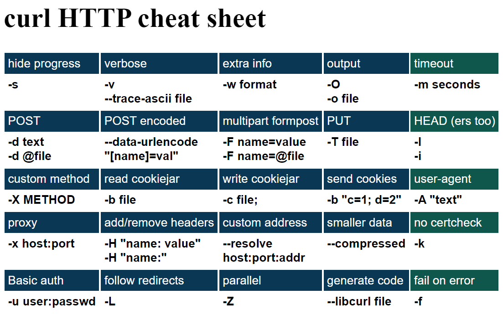

# CURL Tutorial

## Install curl

Ubuntu and Debian

```
apt install curl
```

## Command line options

Like you can ask curl to switch on verbose mode(详情模式) with the -v option:

```
curl -v http://example.com
```

To ask for both verbose mode and that curl follows HTTP redirects:

```
curl -vL http://example.com
```

Arguments to options

if you want to send an arbitrary string of data in an HTTP POST to a server:

```
curl -d arbitrary http://example.com
```

Arguments with spaces(参数包含空格)

The exact quotes to use varies depending on your shell/command prompt, but generally it will work with double quotes in most places:

```
curl -A "I am your father" http://example.com
```

To make the string itself contain double quotes, which is common when you for example want to send a string of JSON to the server, you may need to use single quotes. Send the JSON string `{ "name": "Darth" }`: (参数包含引号)

```
curl -d '{ "name": "Darth" }' http://example.com
```

## URL `globbing` (通配符)

At times you want to get a range of URLs that are mostly the same, with only a small portion of it changing between the requests.

### Numerical ranges

You can ask for a numerical range with [N-M] syntax, where N is the start index and it goes up to and including M.

```
curl -O "http://example.com/[1-100].png"
```

and it can even do the ranges with zero prefixes, like if number is three digits all the time:

```
curl -O "http://example.com/[001-100].png"
```

Or maybe you only want even-numbered images so you tell curl a step counter too. This example range goes from 0 to 100 with an increment of 2:

```
curl -O "http://example.com/[0-100:2].png"
```

### Alphabetical ranges

curl can also do alphabetical ranges, like when a site has sections named a to z:

```
curl -O "http://example.com/section[a-z].html"
```

### List

Sometimes the parts do not follow such an easy pattern, and then you can instead give the full list yourself but then within the curly braces instead of the brackets used for the ranges:

```
curl -O "http://example.com/{one,two,three,alpha,beta}.html"
```

### Combinations

You can use several globs in the same URL which then will make curl iterate over those, too. To download the images of Ben, Alice and Frank, in both the resolutions 100 x 100 and 1000 x 1000, a command line could look like:

```
curl -O "http://example.com/{Ben,Alice,Frank}-{100x100,1000x1000}.jpg"
```

Or download all the images of a chess board, indexed by two coordinates ranged 0 to 7:

```
curl -O "http://example.com/chess-[0-7]x[0-7].jpg"
```

And you can, of course, mix ranges and series. Get a week's worth of logs for both the web server and the mail server:

```
curl -O "http://example.com/{web,mail}-log[0-6].txt"
```

### Passwords

The most basic curl authentication option is `-u / --user` . It accepts an argument that is the user name and password, colon separated.

```
curl -u alice:12345 http://example.com/
```

## HTTP with curl

### HTTP POST

When the data is sent by a browser after data have been filled in a form, it will send it URL encoded, as a serialized name=value pairs separated with ampersand symbols (&). You send such data with curl's `-d` or `--data` option like this:

```
curl -d 'name=admin&shoesize=12' http://example.com/
```

### Content-Type

If you POST JSON to a server and want to more accurately tell the server about what the content is:

```
curl -d '{json}' -H 'Content-Type: application/json' https://example.com
```

### Multipart `formposts`

A multipart `formpost` is what an HTTP client sends when an HTML form is submitted with *`enctype`* set to "multipart/form-data". It is an HTTP POST request sent with the request body specially formatted as a series of "parts", separated with MIME boundaries.

An example piece of HTML would look like this:

```
<form action="submit.cgi" method="post" enctype="multipart/form-data">
  Name: <input type="text" name="person"><br>
  File: <input type="file" name="secret"><br>
  <input type="submit" value="Submit">
</form>
```

### Sending such a form with curl

With curl, you add each separate multipart with one `-F` (or `--form`) flag and you then continue add one `-F` for every input field in the form that you want to send.

```
curl -F person=anonymous -F secret@file.txt http://example.com/submit.cgi
```

### From `<form>` to `-F` 

In a `<form>` that uses `<enctype="multipart/form-data"` , the first step is to find the `<action=` property as that tells the target for the POST.

```
<form action="submit.cgi" method="post" enctype="multipart/form-data">
```

#### text input

A regular tag using type "text" in the style like

```
<input type="text" name="person">
```

should then set the field name with content like this:

```
curl -F "person=Mr Smith" https://example.com/
```

#### file input

When the input type is set to a "file", like in:

```
<input type="file" name="image">
```

You provide a file for this part by specifying the file name and use `@` and the path to the file to include:

```
curl -F image=@funnycat.gif https://example.com/
```

#### All fields at once

If we toy with the idea that all the three different `<input>` tags showed in the examples above were used in the same `<form>` , then a complete curl command line to send, including the correct URL as extracted above, would look like:

```
curl -F "person=Mr Smith" -F image=@funnycat.gif -F "username=bob123" \
https://example.com/user/submit.cgi
```



