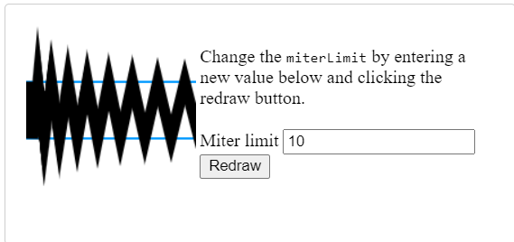

# Canvas

## 1 Basic usage

### 1)Basic usage of canvas

At the end of this page, you will know how to set up canvas 2D context and have drawn a first example in your browser.

The `<canvas>` element

```
<canvas id="tutorial" width="150" height="150"></canvas>
```

### 2)The rendering context

The `<canvas>` element creates a fixed-size drawing surface that exposes one or more rendering contexts, which are used to create and manipulate the content shown. In this tutorial, we focus on the 2D rendering context. ==Other contexts may provide different types of rendering; for example, WebGL uses a 3D context based on OpenGL ES.==

The canvas is initially blank. To display something, a script first needs to access the rendering context and draw on it. The `<canvas>` element has a method called `<getContext()`, used to obtain the rendering context and its drawing functions. `getContext()` takes one parameter, the type of context. For 2D graphics, such as those covered by this tutorial, you specify `“2d”` to get a `CanvasRenderingContext2D`.

```
const canvas = document.getElementById('tutorial');
const ctx = canvas.getContext('2d');
```

###  3) Checking for support

```
const canvas = document.getElementById('tutorial');

if (canvas.getContext) {
	const ctx = canvas.getContext('2d');
	// drawing code here
} else {
	// canvas-unsupported code here
}
```

### 4) A simple example

```
const canvas = document.getElementById("canvas");
if (canvas.getContext) {
	const ctx = canvas.getContext("2d");
	
	ctx.fillStyle = "rgb(200, 0, 0)";
    ctx.fillRect(10, 10, 50, 50);
    
    ctx.fillStyle = "rgba(0, 0, 200, 0.5)";
    ctx.fillRect(30, 30, 50, 50);
}
```

## 2 Drawing shapes with canvas

By the end of this article, you will have learned how to draw rectangles, triangles, lines, arcs and curves, providing familiarity with some of the basic shapes.

### Drawing rectangles

Unlike SVG, `<canvas>` only supports two primitive shapes: rectangles and paths (lists of points connected by lines). 

First let’s look at the rectangle. There are three functions that draw rectangles on the canvas:

```
fillRect(x, y, width, height)
// Draws a filled rectangle
strokeRect(x, y, width, height)
// Draws rectangular outline
clearRect(x, y, width, height)
// Clears the specified rectangular area, making it fully transparent
```

Each of these three functions takes the same parameters. `x` and `y` specify the position on the canvas (relative to the origin) of the top-left corner of the rectangle. `width` and `height` provide the rectangle’s size.

Rectangular shape example

```
function draw() {
	const canvas = document.getElementById('canvas');
	if (canvas.getContext) {
		const ctx = canvas.getContext('2d');
		
		ctx.fillRect(25, 25, 100, 100);
		ctx.clearRect(45, 45, 60, 60);
		ctx.strokeRect(50, 50, 50, 50);
	}
}
```

![img](data:image/png;base64,iVBORw0KGgoAAAANSUhEUgAAAJYAAACWCAYAAAA8AXHiAAAAAXNSR0IArs4c6QAABK9JREFUeF7tncFuE1AMBNMvR3w5XOBSEWkXZ1K7Gs55tjs7XVUVUj8e/pMAQOADmOlICTwUSwkQAoqFYHWoYukAQkCxEKwOVSwdQAgoFoLVoYqlAwgBxUKwOlSxdAAhoFgIVocqlg4gBBQLwepQxdIBhIBiIVgdqlg6gBBQLASrQxVLBxACioVgdahi6QBCQLEQrA5VLB1ACCgWgtWhiqUDCIF3ifULud6h/0sAzx1f8OcrV6z/VYB5h+eOL1AsxozhVDx3fIFiDRVgnuO54wsUizFjOBXPHV+gWEMFmOd47vgCxWLMGE7Fc8cXKNZQAeY5nju+QLEYM4ZT8dzxBYo1VIB5jueOL1AsxozhVDx3fIFiDRVgnuO54wsUizFjOBXPHV+gWEMFmOd47vgCxWLMGE7Fc8cXKNZQAeY5nju+QLEYM4ZT8dzxBYo1VIB5jueOL1AsxozhVDx3fIFiDRVgnuO54wsgsd51NxNrP/XV/7Ub54cvUKzeon+8UKwnGM+BeYkOrxtyjp+N9brwyUmK9UWN9YNM9Qtm//y0U7EU6yUaKlaIkf6O+9tYnwMJz1vzsWdfB83v5QC+y89YitWpgeeOL3jTrxsUS7E6Ak8+/fkbQrE6rHih4AtsrCpxf8aqcD0e9A+fNlYXCF4o+AIbq0rcxqpw2VgpLsVKSdlYFSnFqnDZWCkuxUpJ2VgVKcWqcNlYKS7FSknZWBUpxapw2VgpLsVKSdlYFSnFqnDZWCkuxUpJ2VgVKcWqcNlYKS7FSknZWBUpxapw2VgpLsVKSdlYFSnFqnDZWCkuxUpJ2VgVKcWqcNlYKS7FSknZWBUpxapw2VgpLsVKSdlYFSnFqnDZWCkuxUpJ2VgVKcWqcNlYKS7FSknZWBUpxapw2VgpLsVKSdlYFSnFqnDZWCkuxUpJ2VgVKcWqcNlYKS7FSknZWBUpxapw2VgpLsVKSdlYFSnFqnDZWCkuxUpJ2VgVKcWqcNlYKS7FSknZWBUpxapw2VgpLsVKSdlYFSnFqnDZWCkuxUpJ2VgVKcWqcNlYKS7FSkm9ubHKs9Z+3D+EGUbzrr+lE56z/mOKFUZEixWecfZj5/h9lz/SdNaY8HDFegLqHJgw8Hd97Bw/G+tdasz2KNabGmsWk6/xQsEXQL9uUI0ZATx3fIFizQyAXuO54wsUC1JjNhbPHV+gWDMDoNd47vgCxYLUmI3Fc8cXKNbMAOg1nju+QLEgNWZj8dzxBYo1MwB6jeeOL1AsSI3ZWDx3fIFizQyAXuO54wsUC1JjNhbPHV+gWDMDoNd47vgCxYLUmI3Fc8cXKNbMAOg1nju+QLEgNWZj8dzxBYo1MwB6jeeOL1AsSI3ZWDx3fIFizQyAXuO54wsUC1JjNhbPHV8w+/p9fZWAYl1NbvndirU8oKvnKdbV5JbfrVjLA7p6nmJdTW753Yq1PKCr5ynW1eSW361YywO6ep5iXU1u+d2KtTygq+cp1tXklt+tWMsDunqeYl1NbvndirU8oKvnKdbV5JbfrVjLA7p6nmJdTW753Yq1PKCr5ynW1eSW361YywO6ep5iXU1u+d2KtTygq+cp1tXklt+tWMsDunrebxL2BKZs33jeAAAAAElFTkSuQmCC)

### Drawing paths

we take some extra steps:

1. First, you create the path.
2. Then you use drawing commands to draw into the path.
3. Once the path has been created, you can stroke or fill the path to render it.

```
beginPath()
// Creates a new path. Once created, future drawing commands are directed into the path and used to build the path up.

Path methods
// Methods to set different paths for objects.

closePath()
// Adds a straight line to the path, going to the start of the current sub-path.

stroke()
// Draws the shape by stroking its outline.

fill()
// Draws a solid shape by filling the path's content area.
```

The first step to create a path is to call the `beginPath()`. Internally, paths are stored as a list of sub-paths (lines, arcs, etc.) which together form a shape. Every time this method is called, the list is reset and we can start drawing new shapes.

> Note: When the current path is empty, such as immediately after calling `beginPath()`, or on a newly created canvas, the first path construction command is always treated as a `moveTo()`, regardless of what it actually is. For that reason, you will almost always want to specifically set your starting position after resetting a path.

The second step is calling the methods that actually specify the paths to be drawn. We’ll see these shortly.

The third, and an optional step, is to call `closePath()`. This method tries to close the shape by drawing a straight line from the current point to the start. If the shape has already been closed or there’s only one point in the list, this function does nothing.

> Note: when you call `fill()`, any open shapes are closed automatically, so you don’t have to call `closePath()`. This is not the case when you call stroke().

### Drawing a triangle

```
function draw() {
	const canvas = document.getElementById('canvas');
	if (canvas.getContext) {
		const ctx = canvas.getContext('2d');
		
		ctx.beginPath();
		ctx.moveTo(75, 50);
		ctx.lineTo(100, 75);
		ctx.lineTo(100, 25);
		ctx.fill();
	}
}
```


### Moving the pen

One very useful function, which doesn’t actually draw anything but becomes part of the path list described above, is the `moveTo()` function. You can probably best think of this as lifting a pen or pencil from one spot on a piece of paper and placing it on the next.

```
moveTo(x, y)
// Moves the pen to the coordinates specified by x and y
```

Example:

```
function draw() {
	const canvas = document.getElementById("canvas");
	if (canvas.getContext) {
		const ctx = canvas.getContext("2d");
		
		ctx.beginPath();
		// Outer circle
		ctx.arc(75, 75, 50, 0, Math.PI * 2, true);
		
		ctx.moveTo(110, 75);
		// Mouth (clockwise)
		ctx.arc(75, 75, 35, 0, Math.PI, false);
		
		ctx.moveTo(65, 65);
		// Left eye
		ctx.arc(60, 65, 5, 0, Math.PI * 2, true);
		
		ctx.moveTo(95, 65);
		// Right eye
		ctx.arc(90, 65, 5, 0, Math.PI * 2, true);
		
		ctx.stroke();
	}
}
```

![img](data:image/png;base64,iVBORw0KGgoAAAANSUhEUgAAAJYAAACWCAYAAAA8AXHiAAAAAXNSR0IArs4c6QAADddJREFUeF7tnXnQd+UYxz81FWISQjWWjDEYlBITWVNRirErZCn7EoksNZiyRMpOFBVClkYSKkuIJmllZIyRZRJZ0iQpE/Px3L95H2/v83vO75xz32e7rpln3j/ec+5z7u/5/u7lur/Xda1HWCCQAYH1MrQZTQYCBLGCBFkQCGJlgTUaDWIFB7IgEMTKAms0GsQKDmRBIIiVBdZoNIgVHMiCQBArC6zRaBArOJAFgSBWFlij0SBWcCALAkGsLLBGo0Gs4EAWBIJYWWCNRoNYwYEsCASxssAajQaxggNZEAhiZYE1Gg1iBQeyIBDEygJrNBrECg5kQSCIlQXWaDSIdVMO3BG4C7AFsBmwCbAxsGG69AbgWuBq4M/AH4DfAn8MOq1BYOrEuj/wIGA7YGvgXsCNwG+AyxNxrkpEuj7BtlEi2qaJeFsCdwXWBy4FLgbOB84FLpwq2aZGLEej3YFdgZ2AvwLnAOcBFwE/A/5Wkwy3Ae4DbANsD+wA3Bb4NnA6cNqURrUpEOvmwF7A04BHAF8Fvg6cCfy+Jomq3nYnYGdgN2BP4CzgJOCzwHVVGxnidWMmltPcvsBzgTOAzwFfAP7T0YcS66cCzwB2AY4Djh3rdDlGYjkqvQLYETgaOKbAyLQoVx3J9gNeBJwNfCCNZou209vrx0SsBwIHAdsCRwIf6i3q//9iLwMOAC4ADgd+PJD3nvuaYyCWC+S3pnXUYcB7B/phXgUcnNZfb04bi4F2hcFnm3ke8E7gROAQ4JrBfomlF78VcCiwN/B64JND7c9QRyzdBu8DtgIOBH4w1A+wwns/FDgCuAzYf4huiiES6/HAh4HjgTeNjFBrd+dtwHOAlwKnDKmvQyOWRHp52lF9bUhAN3jXx6Wd7QcBiTYIGxKxPpGmvn166D7I/bF1T5yQpsbn535YG+0PgVgeAn8euAJwsT5lczG/OfD0dAjeWyz6TiwX6Senxfnreoti2Rd7F+Di/ol9XtT3mViS6tT0p58qbA0C+rn2SH+9lOv0lVhOf98Avpmcn0GqmyIguR4DPLaP02JfiaX64BIgpr/5Pymnxfsl9USvfnx9JJa7P99r6gv1qkRxQa9io1e7xb4RSz/Vo5MIryqwcd2SmPBbffJz9YlYetSVuahSyC3AGxsZ9XOpilCG0wsPfV+I5Q7wJwmYqXjU2ya3Hnp/mA/ogxuiL8RS3fmrCZz9tU2mtdvzyOfuSaWa+1lz2+8DsVykO4QbfBDWHAGDQxy5OpXcdE0sRXo/B548QulLc4rUa0Gv/JeAe3cpFuyaWGq9/w28uh6GcdcKCBwFbJC0/52A1CWx3P3pCFWsN3TlZycfb85DVaIqEjTsrBMNfZfE+mKa/oaqUe8bmdZ+HzX0TotP6eJFuyKWIVp62N3BhOVDwJ22HnkDZYtaV8RytPrOgEK0in6UFh9maNmjuhi1uiCWEcqurczmEpYfAbPhuNYqmqCkC2K5E/wL8Jb8mMYTEs63K71DLE0sE3RcmXwscR5YhveeI+orvH3JRCSliaWX3awrTyqDaTwlIfDllGWnmDe+NLFcW9k5U/mElUPAFE7+qF1rFbGSxFLB8Gvglh2lEjKyxYx9mpn3jPwpYV09d3nf/M7/AO5WSvlQklj+YtRnC3RJMx/Vu1P6x1+kB0sw84y+NuXNyvE+XT13pb74QzKOoMh0WJJYZrEzOMKEY6XMj6ty4lPJIbv8uToOn52UAMp22rSunjuvDyagM/jC7IbZrSSxDFNShFZyN/g7wGgWvfzrMsllaNmdW0a6q+fO64a7Q8WULkmyWyli6RR1xFLKUcqccl+ZMvvNe6aZavSttbXm6uq5VXDV7eCIld1ZWopYLwQeXDjyxpHKdZR5SOeZeUDN095WUGxXz61CLNdXPwI+VuXiJteUItZHU5xgyfSNXX3grp5bhQeeHRqH+OIqFze5phSxfpiCT0smSHNKMsmt0pF5ZnLZ97c8FXbx3Co8EAuDXB9S5eIm15Qilon6lcjUTc5ft49dLaK7eu5qOFnkQCmNkvCsVoJY7kKs+GBdmtLW1ba/q+dWwdf6P1bQyJpMpASxlCC7xtLV0IXNHJUu0PW4a/dM9W9KOEhLP3c1jHU5uMbKKlkuQSwjnF+QDp9X63TO/+/qaKWr566EpSVfPp47YroEsXRCPqywqyEnQYfeti6H789xGrfSvxLEUtRv2bUI8WrlkzVuxNAwy+ZlDWIpQaw3JkXD2FNnN/7ihRowDF+lw9tzPq8EsXQYam15tnPiMYW2i3yPvhOrCAgDZFMTXJrcWxmqEsRqMhVaT+bWwBsq92gaF74D+HuqI7Roj0czFTZZvFvq476p5MeiAI75eku+/DSVflm0n6NZvDdxN1iRVD9QJ2Hii36xgtcb8KvMx4qxi9po3A1NHKRKbazyZaX5sDUInJuqgimBWdRG4yBtcqRzB0CduoenYWsQ8DDfY6k/1QBlNEc6TQ+hlTI7cqkYCFuSUTtSKTWuY6M5hLbzTWQzX0m1CQ26DFsK9rWG4RNqgDEq2Yz9byL00+XgqBdHQktMclen5MWSxYva6IR+TaTJToPev82iKI70+ouS7KXOwn100uSmwRSur3YCfjlSslTt1j1YqkJRN1xtdMEUTcO/LFvrIr7O8F/1ow3hOpcFLtotX1zHRhf+JQhNAlYfmQIetq6D5ojuuTjFSn63Rp9GGbAqDk1D7M9PuRYsRjRFs3iVOSi2q9n50YbYN00K4rmh4FpsYIpmUQB/VJ4T1rHRJgVpmsZIJYaBCdZCPq8OsgO+Z/tUG9vIbmsTLmqjTmMkGE0Tr+nL2nGCh9KOVgb76sOqY6NOvCYgbaSKNEbRkr5TKT9nuTijl40FrGujTxXZRnJbpTQHT8hhqkP0sJoSGYk4ieS2drSNdNwmUtOvNXZlqUpRiWGCuLpm2vPRp+MWnDYKCCin0f1gtr6xTomziqm6F+rIY2ZEnEwBATvcRsmTWQ1pRYBjk9R4ZKOYr2mN50mVPJFYbRVpcio0xfTD684TPb3ve2kH7VTYxCZXpGk2armFbhqRazI3fWRj0cU7mnv85WjTxCZZVk7A2iyE6WJeJ+CzmnyJHtz76eQAbbJYtxuTLoQ52yG2VbpXct1iwCOXI9U/G+4AZ7+NSZfuFYS2i407LZpj85kDWtC7UP9MytHadPoT0yg2nn5eeuPd/ezQ0lTkgt403PsNwBWhS+GYJAlqulCfwXdOKopQpALFSt+sRIh9Fb5YGcIdTFsZaXRFqAJweuyrE1UiuZZStXFKFZAqXGP4vLlezWLYqfWFWO7qjHdr0+GpE/U9gOJA80f0xZHqKGUKIUV7r2no/FxOnplD1ZScWfOLVmFsX4jlu84cnu4W2yyL4tmixxrKcpU2dyW5Ufri6GmBKN+nTnj8St/UYx9zijZ1qFbhTKVr+kQsX9ipUDGfgRNtm5KbA5JH22mylBLV/jjdeUJwZAPpyzw8DLCwP06FvbC+EUtQLKjke7mob9ts9yVpYb8BcCKg1qnt6B+jaVS67g3oTnGB/pGaIr3VMHCRrvjP5Cu9sT4SS3AUBF6SdFe5wDJAQ2+9EcVGavurN+mrU8qiZ4+6DJzCTeLraKsbxQhufVN1Ah+q9lmdlu6VYpVTq75YX4m1SSraaH3DEikmDYr1/NJ/XfxaBdZRTCm0ygKTnF2XQFVTZjI4NwdKhR2dzOnp5sMg0rPSv1W/Qd3rzMxn/UGLi15dt5Fc9/WVWPbXneKp6a8EuZZjLGnctrsotvq7RL9ZuuBf6UNemTYZukmayFrqfFtJtUf663wHuK4O9JlYM3KdnPTeypHDlmTKetcNKuklqfxIfSeW7+hoYejSFZkW9EMiqwv1zVOWw95Nf8uBHAKxZu/rbnErYJ+W/VxDIJZT8gnAZX3b/a0E3pCIZR/0c5m3YAjngG0RdnaeaP6K3vipVuvc0Ihlf2bngMe3eLa4Gk5d/b9EMslam+eJRfoyRGLNFvUmvXVqPDAt7osAVughLs6PSFPf/n1epI9lKly7H3rnPf/Tg34IcE2hD5/rMSo/D00ee1MWdSp9adLJoY5Yy/usl1s/114psLOphr4Jnk3uVaNuIK5ZefRTeRowWBsDsWbge6RyELBtOuxVTToEUzXq4fgFwOG5K5+WAmRMxJph5tGMVeRNHnJ0OgBuU4bTxrfRfeDOVpnL2Sk63KOg0dgYiTX7OEZc7wuYcOwMQJWqGqg6aYDa+OBirTZMdecuwHHAscCFbTTetzbGTKwZ1h4au/4ylY+jmSU/VE+cWcDR6si0c1If7JkOqE9K66jZoXbfONHK+0yBWMuB8mB7d2DXJG9xgWzwgapSs7qYIslyInXM5PymGjJtuGpRg0PcWCjHOR04bYhugzpAeM/UiLU2Tk6XKjtNvKE2Xtnwjalm8uWA5UGuAq4Frk83bwRsDGwKbAZsmWperw9cmrTsJiwx98Iop7kqZJs6sdaFkaOaOqstEnE8BJdIG6aLb0hE8xBY4pnNRd1Wb5UGVYjQ9jVBrLYRjfb+h0AQK4iQBYEgVhZYo9EgVnAgCwJBrCywRqNBrOBAFgSCWFlgjUaDWMGBLAgEsbLAGo0GsYIDWRAIYmWBNRoNYgUHsiAQxMoCazQaxAoOZEEgiJUF1mg0iBUcyIJAECsLrNFoECs4kAWBIFYWWKPRIFZwIAsCQawssEajQazgQBYEglhZYI1Gg1jBgSwI/BcxVXC1nNfa5wAAAABJRU5ErkJggg==)

### Line

For drawing straight lines, use the `lineTo()` method.

```
lineTo(x, y)
// Draws a line from the current drawing position to the position specified by x and y
```

Example:

```
function draw() {
	const canvas = document.getElementById('canvas');
	if (canvas.getContext) {
		const ctx = canvas.getContext('2d');
		
		// Filled triangle
		ctx.beginPath();
		ctx.moveTo(25, 25);
		ctx.lineTo(105, 25);
		ctx.lineTo(25, 105);
		ctx.fill();
		
		// Stroked triangle
		ctx.beginPath();
		ctx.moveTo(125, 125);
		ctx.lineTo(125, 45);
		ctx.lineTo(45, 125);
		ctx.closePath();
		ctx.stroke();
	}
}
```

![img](data:image/png;base64,iVBORw0KGgoAAAANSUhEUgAAAJYAAACWCAYAAAA8AXHiAAAAAXNSR0IArs4c6QAABJFJREFUeF7t29FRWzEQheGlpxSQd+ggxSQUEyog76mDZpIxmAED9l1Je2xL58+ztBf9+uY6GeKb4A8FBAVuBDMZSYEAFggkBYAlycpQYGFAUgBYkqwMBRYGJAWAJcnKUGBhQFIAWJKsDAUWBiQFgCXJylBgYUBSAFiSrAwFFgYkBYAlycpQYGFAUgBYkqwMBRYGJAWAJcnKUGBhQFIAWJKsDAUWBiQFgCXJylBgYUBS4Fyw/kl+eo+hvyLifrajAuu6b2xKVLukwLpeWNOiAhaoZAV4Y8nSdg+e+k31empgdd+/ZOMSqPgolNjoHroMKmB1GyjfuBQqYJX76Bq4HCpgdTko3bQkKmCVGmketiwqYDVbKNuwNCpglTlpGrQ8KmA1eShZbIEKWCVW0kNsUAErbWJ4oRUqYA17SQ2wQwWslIuhRZaogDVkZnOzLSpgbdroXnDNqG4j4k/3yZIb+W8zyVANy64d1WNEPETEj4YzNS8FVnOykxtmQfWk/oIGsOpgzYDqLiK+7Y8s/eYPsGpgzYJq93ern8CquXT1lJlQ7VoASy2iYP5sqIBVcOnqETOiApZaxeD8WVEBa/DildtnRgUspYyB2bOjAtbA5au2roAKWCodnXNXQQWsTgCKbSuhApZCSMfM1VABqwNB9ZYVUQGrWknjvFVRAasRQuXylVEBq1JKw6zVUQGrAUPVUgdUwKrSkpzjggpYSRAVy5xQAatCTGKGGypgJVCMLnFEBaxRNRv7XVEBSwjLGRWwRLDcUQFLAAtUL1H5lk4hLlC9xQRWESxQHYYEVgEsUH2OCKxBWKD6OiCwBmCB6ng8YHXCAtXpcMDqgAWq7WjA2m50sAJUuWDAynV6XgWqfCxgJVuBKhlqvwxYiV6gSkT6sARYG81A1Y6K3xWCqk9NYhdvrCOReFMl9JxYAqwv4oBqDBUfhaAaF3RkAm+sd2F4U9U5A9a+JajqUPFRCKpaTe+m2b+xeFNpbFnDApUGlfVHIah0qGxhgUqLyhIWqPSo7GCB6jyorGCB6nyobGCB6ryoLGCB6vyolocFqsugWhoWqC6HallYoLosqiVhgeryqJaDtfvF5/11dP30U9xGxGNE3EXEnyv9GSt/rKV+CV0ZpnKWG6rl3liVGKpmOaICVpWeI3NcUQFLCMsZFbBEsNxRAUsAC1QvUflXYSEuUL3FBFYRLFAdhgRWASxQfY4IrEFYoPo6ILAGYIHqeDxgdcIC1elwwOqABartaMDabnSwAlS5YMDKdXpeBap8LGAlW4EqGWq/DFiJXqBKRPqwBFgbzUDVjorfFYKqT01iF2+sI5Fe31QPEfGUCMmSwwLfI+Kv+jsIN5NW/w2qoZuTf7FlVlhDVdmsLwAsfWPLJwDL8tr1hwaWvrHlE4Blee36QwNL39jyCcCyvHb9oYGlb2z5BGBZXrv+0MDSN7Z8ArAsr11/aGDpG1s+AViW164/NLD0jS2fACzLa9cfGlj6xpZPAJbltesPDSx9Y8snAMvy2vWHBpa+seUTgGV57fpDA0vf2PIJwLK8dv2hgaVvbPmE/6m8kaYzLmKxAAAAAElFTkSuQmCC)

### Arcs

To draw arcs or circles, we use the `arc()` or `arcTo()` methods.

```
arc(x, y, radius, startAngle, endAngle, counterclockwise)
// Draws an arc which is centered at (x, y) position with radius r starting at startAngle and ending at endAngle going in the given direction indicated by counterclockwise (defaulting to clockwise)

arcTo(x1, y1, x2, y2, radius)
// Draws an arc with the given control points and radius, connected to the previous point by a straight line.
```

Let’s have a more detailed look at the `arc` method, which takes six parameters: `x` and `y` are the coordinates of the center of the circle on which the arc should be drawn. `radius` is self-explanatory. The `startAngle` and `endAngle` parameters define the start and end points of the arc in radians, along the curve of the circle. These are measured from the x axis. The `counterclockwise` parameter is a Boolean value which, when `true`, draws the arc counterclockwise; otherwise, the arc is drawn clockwise.

> Note: Angles in the `arc` function are measured in radians, not degrees. To convert degrees to radians you can use the following JavaScript expression: radians = (Math.PI /180) * degrees.

Example:

```
function draw() {
	const canvas = document.getElementById('canvas');
	if (canvas.getContext) {
		const ctx = canvas.getContext('2d');
		
		for (let i = 0; i < 4; i++) {
			for (let j = 0; j < 3; j++) {
				ctx.beginPath();
				const x = 25 + j * 50; // x coordinate
				const y = 25 + i * 50; // y coordiante
				const radius = 20; // Arc radius
				const startAngle = 20; // Starting point on circle
				const endAngle = Math.PI + (Math.PI * j) / 2 // End point on circle
				const counterclockwiwse = i % 2 !== 0; // clockwise or counterclockwise
				
				ctx.arc(x, y, radius, startAngle, endAngle, counterclockwise);
				if (i > 1) {
                  	ctx.fill();
                } else {
                  	ctx.stroke();
                }
			}
		}
	}
}
```

![img](data:image/png;base64,iVBORw0KGgoAAAANSUhEUgAAAJYAAADICAYAAAAKhRhlAAAAAXNSR0IArs4c6QAADBlJREFUeF7tnU3ot9kYxz9TFuStFA1ZKERJ4lmw4VGyIMxIFmJBXkdYoJnVGI9ZzYQFMl5jQRaSGcRCasZsWAxJilAWYjKlvMVC0cnvN37/3/+c+7yf+1zXuZ7l8zvn3Of7vT7/c5/73Odc93XYP3OggwPXdWjTmjQHMLAMgi4OGFhdbLVGDawwA48Cngc8HbgeeAxwTSAyPh1Oxt+BB4HfAj8D/tlSm4F10c2nAa8DXglcBX4O/BL4A/BXQWDFdDjVjwOeAjwbeC5wH/Bd4BvA72ohM7D+5+CLgPcArwW+CnwT+D7w71qDB9cv1fEI4OUH/W886P8U8KPS/q8O1hOB24EbgTuBTwiEycW+pQ4H2fuAm4G7gVuBh3IBWxmsG4BPAl8HbhEKlIt3Lx0OsDuA1wPvBe7JgWtVsD5w+It8M/C9HMMmKztCxyuALx9G9I+l6l8RrNsOtz43n6qepKYa3aHcSB3uYcDNO92tMenJeDWw3F/4m4CXAX/uEOxRTe6h4wnAD4CvANGRayWw3Fzkc8ALhY9Ue+pwI9ePgXfE5lyrgOWemh4A3il8TjWDDjfn+ixwZetpcRWwPgP8A3C3EMn/ZtHhboWPBt4VMnMFsNyioZt0PlXwksJxEXcWHW4p4veHhyDvIuoKYLnJ5k+Aj0seqg6T5pl0vB94weFh6JK12sFyk81fAI8XPlrNqMONWn8BnuN7GNIOlptTPevwFCN5wJpVh3vK/pVv+UE7WG7d5aPCnwTdH8SsOtwT4gcP64IX/nA1g+X2If0NeKTw2+DMOtzt8F/AY8/3c2kGyz0N3gU8X/I98LClZ2YdPwVuOt9ioxkst6/oVcAbhIM1u46vAd857GN72GrNYLkJr9shKX1RdHYdbrHU7bC98P5QM1ju7b/7l/Q2fuJRbXYd3v75wBIpxAOG6Rjz15IMlsih1+Oh6RgDVvKtUORk0eOh6RgDVvLkffbHdO/jrcdD0zEGrOTlBpELch4PTUd/sLIXSMW9Qgh4aDr6wpX9SkfcS8+Af6ajL1jZL6HFbdMI+Gc6+oFVvG1mtg1ymxvLNvwzHX3gKt7oN9OW3uhW2A3vTEd7sKLxiL3SEbN5P+Kd6WgLV/VhCjHHjSK+mY52YDU7/iXigGSCb6YjwaRIkeYHVqc/0p3omelINMpTrNsR+6mTUGT4ZToyzDoU7Z4UZNq0OZlemY50w4alMZoy0Ve6Tw+XNB3bpu2SeG261IQFYLkqpuOycVOkipwmmWohWMdqpmPS5La7p3+uBOtY3XRMnI57l4T1jcA6bcZ0VJgae6VT0bRVXdkBA2vl6HfUbmB1NHflpg2slaPfUbuB1dHclZs2sFaOfkftBlZHc1du2sBaOfodtfcAS8vCos92t+Wm65dJO8R6l3i0AkvLq5BYXB1YXb9MGutA4u+7x6MWLC0vbxPjdalY8y+TlnbkUG+aeJSCpWW7SWUcL1Rvst2ksEPTxaMELC0b5ApjGK1WtUEu2vrlAlPGIxcsLVt6C+KXXaVoS2/mVaaNRw5YWg4hZMauqnj2IYSMq00dj1SwtBybyohbs6JZx6YSrzp9PFLA0nLQMzFmXYolH/RMuLqIeMTA0nI0PSFe3YskHU2P9EJMPGJgaUmm0Z2axAtEk2lE2hETjy2wtKT/SYz5kGLR9D8bvRAVjy2wtCQsG0JMxkWWSCAXAktLisWMeA8rupliMdALcfEIgaUlKewwWjIvFEwKG2hHXDxCYGlJY50Z72HFg2msAz0QFw8fWFoS7w+jpOBCwcT7nrZExsMHlpZPhRTEe2gV1Z9u8YGl5eNGQykpuJj340aedkTGwweWls+xFcR6aBXv59g8PRAZD80fwhxKScHFUj/UmVquoAtNqiR/CLPJ1ayRZg4YWM2stIZOHVBzK7SwzuWAmsn7XLZab0Qu/8S2zVhY93dAzQLp/lZaD84dUPFKx8I6nwNqXkLPZ+3aPVKzbWbtMM6pXtTGS5u8zwmRr1dqtibLsXydnqo4TLFOuOQoVXP8S47l6/RUxYHVdcIlS6mKI/ayLF+ntyqSgqwTLllKVaQxkmX5Or1VkXhtnXDJUqoiVaQsy9fqrfjktmuFS55a8em45Vm+Xo9Ff0BgvXCZ4k0H7CW0AdLFAQOri63WqIFlDHRxwMDqYqs1amAZA10cMLC62GqNGljGQBcHDKwutlqjBpafgZcAV4ErgNs9cPz3YeCaIGxCOk4l3AM8ANwL3N9Km4H1fyefAbwdeAvgdguE/s0OV6oOn76HgC8Bnwd+UwOZgQXXAx8Cbsowcka4SnRsSb4L+AjwYIYvDxddHay3Al8oMQ6YCa4aHTH5bwO+GCt0/vvKYH06c5TyeTsDXC10xLhxo9e7Y4VOf18VrG8Br84xatI5V0sdMTu+DbwmVuj4+4pg9QjGHiNXDx0xbpLhWg2snreNkXD11BGDK+m2uBJYPSe4I9e5RuiIwRWd0K8ClnsU/2PMrUa/9xy5RuqI2fHkraWIVcAafevoBddoHbF1ruCT4gpguZXoX8f+/Dr83hquvXRsWfPM0Ar9CmDdAdzcAZyUJlvCtaeOkNY7gVt8P64A1p8i7/5SAKkp0wquvXX4PHDvFp+0IlgvBn5YQ0WjurVwzaLDZ4fbBXLJY+0j1q2HF6mN+KhqpgaumXScm+Be4N9+/p/awbr7bD9VFRkNKpfCNZuOUyvcfq4bVwPrPw1gaN1ECVwz6jj15dIApX3EmjUguXDNquMIl4HVevipaC8HLjVgiRMSCLDpqCA/o2ryiGUByXC1omjqVERcPELCxAmxEasC7/qqySOWuMfbgDemox6aWAtZyw3iFuQC6k1HDIv637MWSN1Bx/vqr9mlBde31IOVpqNLCC406o3H1uRR1EvPDf9MRz+4il5Ci9qmseGd6egHVtG2GVEbyza8Mx39wCre6CdmK2zEO9PRHq7N0zqxBToxm/cjvpmO9mBVH6YQcdwowTfTkWBSYpFmx7/2vJUkHZBMNMR0JBq1USwpHrFb4Wn7Ux/pzvDLdGSYdVa02xH7kUFJFlHgk+nINy0rHjkj1rErI24nScNtvjcXapiOdAOz41EClutOz4lwdGKY7ke0pOmIWkRRPErBct2ZKjVh3J9gCdPht2b3VJFTJFOtAOtY1XTAtMlt3cHKl3rSWJ/G/Zj+2e2emOEwqY9J01H5l1pzK6y8tFXX7ICBpTm6O2ozsHY0X/OlDSzN0d1Rm4G1o/maL21gaY7ujtoMrB3N13xpA0tzdHfUZmDtaL7mSxtYmqO7o7bWYGl5FRIKyW2Hz8m53+3V1Aa4LcDS8vI29e/7FK5jnWYvb1M7sVFuinjUgKVlu0lJLH1wHdup2m5S0plDnaniUQqWlg1yFXFkCy7XbtEGucIOTRePErC0bOktjOGFajG4srf0FnRqynjkgqXlEEJB/IJVYnBlHULI7Ni08cgBa6SIo789g5IZw83ie8A1dTxSwRox3IYiN+J20gKyGFwtdUwfjxSwek4MUwM6ciKc2idfuRhcLXSIiEcMLC3JNGpgya0bg2szmUbkYmLiEQNrzyH33OOWt5JcWHLLx9a5gl8mjVxITDy2wNKSsCwXilblt+AKJiyLrKjv8aXYLT+KEq9pSbHYCpSSdkJwBVMsblxEVDxWSG5bAkTLOqF3i94vk25cWFSS3hBYWtJYtwSkpi0fXKrTiofA0pJ4vwaG1nXP4fIm3g9cVFw8QmBp+VRIazhq2zvfz3Xpy6SBC4iLRwgsLR9pqgWhR/1TuGLLPcfri4uHgdUDnXibR7gMrLhXQ0ukBmRopzIv5uC6llhHzYiVqNeKDXLAwBpk9GqXMbBWi/ggvQbWIKNXu4ya5YbVAje7XjULpLMbvVr/3EHgWfO1XvX1TcNj+yqQqXgJvUqwJOlUs21Gkukr9FXUxku7FcpCUsXWZFmWr9FbNYcp1giXLJUqjn/Jsnyd3u55S0w6LWVzLLkwqjhiL9d+3T0fCVdWHg0bseSDN+K2mHT7O7XSwJIPllPQc0JflG/CwNIBllOhIlWknnDoUyI+ua2+kOhT5A7Fut0HV4AbAvKOacXvBe5vZYHdCls5ae1ccMDAMiC6OGBgdbHVGjWwjIEuDhhYXWy1Rv8LphorBTVpyzUAAAAASUVORK5CYII=)

### Bezier and quadratic curves

```
quadraticCurveTo(cp1x, cp1y, x, y)
// Draws a quadratic Bezier curve from the current pen position to the end point specified by x and y, using the control point specified by cp1x and cp1y

bezierCurveTo(cp1x, cp1y, cp2x, cp2y, x, y)
// Draws a cubic Bezier curve from the current pen position to the end point specified by x and y, using the control points specified by (cp1x, cp1y) and (cp2x, cp2y)
```

The difference between these is that a quadratic Bezier curve has a start and an end point (blue dots) and just one control point (indicated by the red dot) while a cubic Bezier curve uses two control points.


Quadratic Bezier curves

```
function draw() {
	const canvas = document.getElementById('canvas');
	if (canvas.getContext) {
		const ctx = canvas.getContext('2d');
		
		// Quadratic curves example
		ctx.beginPath();
		ctx.moveTo(75, 25);
		ctx.quadraticCurveTo(25, 25, 25, 62.5);
		ctx.quadraticCurveTo(25, 100, 50, 100);
		ctx.quadraticCurveTo(50, 120, 30, 125);
		ctx.quadraticCurveTo(60, 120, 65, 100);
		ctx.quadraticCurveTo(125, 100, 125, 62.5);
		ctx.quadraticCurveTo(125, 25, 75, 25);
		ctx.stroke();
	}
}
```

![img](data:image/png;base64,iVBORw0KGgoAAAANSUhEUgAAAJYAAACWCAYAAAA8AXHiAAAAAXNSR0IArs4c6QAADEJJREFUeF7tnQnQffUYxz+RJURItmgZe1lTjX3fskfZKkuNrZDsIlv2xBjrkEhEiZQsWcqSJSJ7hIpki1CWSMyneV7zzvR/573nvff5nXPufZ6Z/9yZ93/v7/x+3/O5557ze7b1KCsFEhRYL2HMGrIUoMAqCFIUKLBSZK1BC6xiIEWBAitF1hq0wCoGUhQosFJkrUELrGIgRYECK0XWGrTAKgZSFCiwUmStQQusYiBFgQIrRdYatMAqBlIUKLBSZK1BC6xiIEWBAitF1hq0wCoGUhQosFJkrUELrGIgRYECK0XWGrTAKgZSFCiwUmStQQssuBKwCXB14KrAVYANgSsAlwcuC6wPXCpwuQi4EPgX8E/g78B5wF+Ac4E/Ar8Hzl9kvBYFrE2BrYAbAzcEtgA2A/z75YDfAecEGAIiKALzjwBIkARKEzBBE7gNAkBBFEjB3Bi4JnABcBZwJnA6cBrwE+CH8fe55m4ewfIqcyfg9sB2wG3g4vzJHwCnAj8FfgGcESf4z0lneKMAd3NgS+BGwE2ArYH/At8GTgK+Cnw5rn5JU2k/7LyA5dVoB+A+wN3jRJ0IfAM4eYBXCK+U2wDbA3eIL8IXgM8An4yrWnsaZnjEMYPlT9mjgJ3i5+cY4NPA50b47fcqe0/gvsAD42f5COCw+Cmd4SlvM9QYwVL8PYB7A4cChwMntJGr2VHuCuwM7AIcB7w7vjTNJjDtgcYE1sOBveNm+Z3AQfF0Nq0GQ/68Dwm7A0+Kh4k3AR8Z8oSX5jYGsO4GvDiAOmAswiacfL9Yzw7AXgEcn3CMmQ05ZLDcX3od8ADgJcDBM1v1uAd6PPAy4BPAc4e6XzZUsO4PvAU4GnjeCG/Gs9H1Zv+1wIOAvYBjsw/YdfwhgvUi4KnAU4CPd13Qgr3/wcDbgbcB+w9p7UMD6z3A9YDHAb8eklADnst1gfcCvwKeMJR5DgmsjwF/BR47FHFGNo/3AVcGHjqEeQ8FLKHSX/fkIYgy4jm8I/yUvcM1BLB82nMe/vyVTa+AP4v6In167M36Bsv9KR3G7qKXzU4Bd+t1bLvf1Yv1CZZOY10V29aN+szPvTf03wzXl07t5tYXWMYyGZf0HOCo5qtejAM+BHh9xKEZlNjU+gLrwHDR1M167un2Zt6AxX1yD3PJ0fsA61bh57pBhPG2XvMiHc9w658B+ltPabnwPsD6IPCduEy3XOuiHsvbjVsDj24pQGuwbhlxRdeJR+KWa13UY3mOz44gwu+2EqE1WPq0fgu8vNUC6zgXK7AfcK3wwTaRpCVYZsP8KZIKyg/Y5PT+/yBuP5hEcrXIHko/ekuwdgUeBvgYXNZeAbd1jgTe3+LQLcFyUYbBHNJiYXWMSyiwG2CYjV/udGsJlvsphsSYKVzWXgG3HgytMcM73VqB5T7KKyOJNH1RdYAVFTA5dt8W8fKtwHIxpqAbo13WnwLmEFhCwC95qrUC66ORfGkSZll/Cpjca5LvjtlTaAWWbgWjGXzkLetPAetHGO2gOy3VWoBlRokhx0Y0lPWvgJEOhjBbginNWoB10wiNsYRQWf8KWErJvcQfZ06lBVgWu3gBcI/MhdTYEyvweeDVUTxl4g91fWMLsPSqm83c1LveVYgFer/RJWZR+5pmLcDaE7gZ4GtZ/wq8FfgR4GuatQDLFHmdn76W9a+AqfkGA/iaZi3AMmTj0lHYI20hNfDEClhQ5D/ZoUstwHppBPW5oLL+FbByj+fd85JmLcBqspA0heZvYIMs/52dc9gCLKvHuEnqa1n/CpgSZh16X9OsBVg6nq19Xg7otNPYaWDLbFoK3Nc0awHW06Jo/9PTVlEDd1HAgIAPRDRpl891em8LsKzZdMch1W7qpND8vdna988Avp65tBZgWZT1kYCvZf0r4P3VLSJbKm02LcAqX2Ha6es8sD1+bP1yjc6f7PiBFmCZUm+1OZNVy/pVwOYLlvT2y55qLcAy69mnEBMmy/pVwD1F8ztfmD2NFmC5Bjfk3MvSlVDWnwI2gnL/6lPZU2gF1s+Be0U7t+w11fjrVsBeipY3sDGDX/RUawXWZ6PLhK9l/ShgTVIbMzR5Om8FlsVAjAGy20RZPwrYC9E6+h9ucfhWYLn7buy7HSfK2itw82iy6YNUE2sFlv33TJK0m2hZewVsi2Id/dRQmeXLagWW6Ubu+PpkWNZWAZurW3Ctad2MVmAppXtZNl7SV1XWTgE3p22u3jTQsiVYb45qJ6lxQO3O1yiO5FOgXVm9ajW1lmDZ38Xy23aaL8tXwB12fwLdZTdUpqm1BOuKkWpv1Znzm65yMQ/m1sLfAJ/Im1tLsFycXb789jQpV9hczeEc0BLcdl+1T1Ev1hqsx0QZHTOjy3IUsN+jzZnuApyec4jVR20N1qWAPwDbR8eE1WdY7+iigLWv3LPyPrbXp+/WYCmST4X206vkii7IrP7ePSK72UoytpTr1foAa8vo/GXtcVO9y6ZXwDirXYBHxH7h9CNOOUIfYDllndFWUa6r1nQn0FAYO3xtFL20DYsZhPUFls5Qy0d6r/X9QSgxvklYr/2NUY7o+UObfl9gqcMz4ybTOOyyyRXQ57d/dKY1fr2XDqqrTbdPsJzbscDXQqjV5rro/68D31JQlip4DWA/7cFa32D57ROsZ7UKQBvsmVh5Ynoq3D3fO1rGCNVpQ19H32Cpjxt51sV0p3iQl/WeTqLNK80if2J4KnTif6+nuXQ+7BDActJ64W3g5CPzhzqvYn4+YELpUub4ppGPeVBEhYxqlUMBa+nKpQ9RIZvGDvV8xixT7gOMbq7bhS/18ChA2/PU1n74IYHlKtyGsOiqnaq8Sf3S2pc22E9uESHaOohtXmV4i4kO5vodA1w42Jl3mNjQwFqa+u7x1HNS+L6O77CmIb3Vq9FWUV7Ae6ZtgIvigeUrwBcjZmpIc57JXIYK1tLifBrSB6bz+ugoem9rtAtmsvrpBtkA8J7o2oDuKZ9wNwO8Itmrxr41Z4T7yk3gU4CT42/THXkEnx46WEsSeu/hPYjZPu7W27bD7OrfAOdGX5hpMlD0tQmv/9aPvj/+RAmPjSPNHjYhxEd/3Sj+VPteM190o9jj+izgzAhVMcbchlSp/WqGzNdYwFquoaW9bUigM9tCI/rJvPk9YY03/YcGNN+KnynvcWxk5FVRMIzC9N950etPkHWe23iqbAUFxgjWupZibxhPtK9dzbS07RblJ6qrOGt9/7yAZbSE3ay6tvHwSqdrpBJp10rQnF+x3Pc5cg1uoUMAfwLd1S6boQLzcsXS36in/8QO2vgkZ0y4ZRPtk1w2QwXmBaxzgK07FmzVmWvEgM7dshkrMA9gXT82HL0CTWp+xj0m95zcIiibsQLzAJZx3pb7NtN6Ujs49p6qDcukinV83zyAZesOnwitUTCJ7Qi8Kup1mS1UlqDAPIDljrflpU+dQB83VH0KNMapYr8mEGytbxk7WDsA+3bYhzIUWrB04ZQlKjB2sNy7Om7CTlamSenvq6bniUAtDT1msLYFjorIgtWkOjDCV6qE0mpKzej/xwyWUOl4Xu2mXTePhceMqV/YaIMZ8TLxMGMFa7fIXPGqtZJtGDHjdsPYOepFTCxMvXE6BcYIlkF03oB7BVopdPnOkXruzbq1osoaKzA2sAzCM5zXAm4HrKDVfsA+wF6AsVZlPSgwNrAMT9YVs642wPeLgmNGb+qQ/mUPetYhQ4GxgGWUqPmGQmWB3OV220g91wlt2tgi5yUOBuwxgGUQ3rtia2F5nz3vo/aMftNvANxSKBuIAkMHSyexhTAEyKC8ywC7Anay2jhSw4weNaWqbEAKDBWsnSJh1UwXi7OZm2c9KLcNTO4UMvexygaqwNDAcn/KDmE+/RkNugmgP9B2KYJ0BHD2QLWsaS1TYAhgea9kUqpFWU2tck5Gdtpm1saZpp4XTCPDtk+wTDrdPK5OAmWGsyB5pfIKVTZiBfoE67CoqOIVqaonjxiidU29T7DmTMpaznIFCqziIUWBAitF1hq0wCoGUhQosFJkrUELrGIgRYECK0XWGrTAKgZSFCiwUmStQQusYiBFgQIrRdYatMAqBlIUKLBSZK1BC6xiIEWBAitF1hq0wCoGUhQosFJkrUELrGIgRYECK0XWGrTAKgZSFCiwUmStQQusYiBFgQIrRdYatMAqBlIU+B87er2mJRMH8gAAAABJRU5ErkJggg==)

Cubic Bezier curves

```
function draw() {
	const canvas = document.getElementById('canvas');
	if (canvas.getContext) {
		const ctx = canvas.getContext('2d');
		
		// cubic curves example
		ctx.beginPath();
		ctx.moveTo(75, 40);
		ctx.bezierCurveTo(75, 37, 70, 25, 50, 25);
		ctx.bezierCurveTo(20, 25, 20, 62.5, 20, 62.5);
		ctx.bezierCurveTo(20, 80, 40, 102, 75, 120);
		ctx.bezierCurveTo(110, 102, 130, 80, 130, 62.5);
		ctx.bezierCurveTo(130, 62.5, 130, 25, 100, 25);
		ctx.bezierCurveTo(85, 25, 75, 37, 75, 40);
		ctx.fill();
	}
}
```

![img](data:image/png;base64,iVBORw0KGgoAAAANSUhEUgAAAJYAAACWCAYAAAA8AXHiAAAAAXNSR0IArs4c6QAACdlJREFUeF7tnWvIdUUVx3+SUGSBH6QMyywsumgXMC0LM42y0tI0tYtSRn2pTNKy0swyw8ygm33IKMW0tKtpN0jUbnaDsrLCQrOrlkGhpYZY/GGeetT3ec7ZZ89/9qxz1sDheeHds2bNf/3O7Dl7z6zZiiypgEGBrQw202QqQIKVEFgUSLAssqbRBCsZsCiQYFlkTaMJVjJgUSDBssiaRhOsZMCiQIJlkTWNJljJgEWBBMsiaxpNsJIBiwIJlkXWNJpgJQMWBRIsi6xpNMFKBiwKJFgWWdNogpUMWBRIsCyyptEEKxmwKJBgWWRNowlWMmBRIMGyyJpGE6xkwKJAJLDuBzwO2AN4GLB9+Tyo/L0X8LcNPt8BrgD+ZVFxuNFdgIOL3w8E1n9k7Qbgz+Wv/n0d8H3gp8Atw5trX6N3sPYHngc8HnhKBXm+ClwOCDR9WpZ9gH2BFwCPHdHwlcBVwJeBS0bYsVbtFSwB9WrgAGPv9e0/t3xuNLWjUfYV5fNEQxsXAx/tEbDewNoLOM4M1N3jK6jWABNsNYpu0wLqKGDnGgZn2BBgZwDfbNDWXE30BNabgVOArefy3HPR24B3jTR9GPBu4OEj7Qytfgcg/08bWtFxfQ9gaSKrQDhve0O00zzsuUMqlGvvXfrxhgXq1qyi0eutwM9rGh1qa2qwHg18qdHtYog2/wC2HVBhT+A9wNMG1HFe+hvg+cAvnY1sZntKsLYDrgYeMFXnZ7Qr3zSazipHAmcCmqj3VP5Sfn3eNIVTU4J1G6DbR8/lM8ChmzioHxrv7bgDtwP3mcK/qcD6dYe3v430/xBw9Bb+85XAx6YI2sA2dVt8xMA6oy+fAqwPAq8b7XlbAy8Fzl/X5IuAC9u6MKq1jb4co4z2NMfS44QTbb3xGdYrld0BzVf05PyLvqZslvUYRY8jmpSWI9bewGVNeuVpRG8CzgK+V95XelrxWn1GeaXlbQWa5iC9qPwEtnfK1MBXgAuAc0z2W5jVox2NuPbSasR6WXltYu+QsYHrgT9VehludHOm6SOAT868auQFrcD6AfCkkb5m9ToK/LDMF+tY28BKC7BeCHzO2os0PlQBrQX7/NBKQ65vAdZny6K2IX7ltV4F9EU/xNmEG6zdAA29WfpTQFOTH7nccoP1duBkl/Npd5QCiss7RlnYpLIbrMjPfFya92JXa+if7HLGCZY2PmhtdpZ+FdBeglqrZu/SSydYen3wzn41Tc+Ak8qq3epiOMHK22D1cFU3aLsdusB6CPC76jKkQYcCOwK/r23YBdZrAS3VyNK/AlrC9OHabrrA+gTw8trOpj2LAmeXrWpVjbvAyneDVcNkNWZ5d+gCS/kFtrHKkcZrKfBPx0YQB1g7lSQWtTqedvwKKMnKb2s24wBLmz2VsCJLHAWUeEULGasVB1hvBE6v5mEaaqHAm2pvY3OA9X7g9S3UyDaqKfAB4Jhq1kxr3rVN6sU1nUxbdgU+BbykZiuOEesbJcFYTT/TlleBS4Fn1mzCAdbP5sx5ULMfaWucAspMs+s4E3et7QBLicx6TfRRU7tlsqUEIsqDWq04wPpPNe/SUEsFqrJQ1VhRIVLCj5aB67mt6olDHGDpQdtzelYxfbuHAotmMdxQSgdYEbPJrDpr1bPROMDS+h7BlSWOAsr/VXX9nAMs3QarvneKE5+wnur9rm6H1YoDLOU11wQ+SxwFlPFPE/hqxQGWnFNi2MdU8zINORX4xcgjWLbomwss7bDV1qIs/SugLXrasV61uMDKzapVw2Q1Ztm06gJLSnwBONAqSRofq4ByqR401siW6jvBUqZhe+Y4hygrZFOZFs9z9NcJlhLXaxLf+rAih07LaPPaMmnXQQ7VixMsOavzZbTsNUt/Cmj5+PEut9xg6fDHbwP3dXUg7S6kgI4w1oFSP16o9hyV3GDJhUy+NkcgGl9iTbqmvrQAS6OVRi3H0bWN47EUzWmU0mhlPXi9BViKxuGAFuxnmV4BbXT5tNuNVmCpHwJLgGWZTgEB1WQHVUuwciI/HVBq2T5hX9+9lmDlRH5asOwT9inByon8NHA1mbBPCZbaVuL6S3KLWDPClFLqWcCVzVps9LhhS/15NvC1lh1d4bZ0lpEWBDQtredY6zunXAGWF6BNFey7sdcAH5nCxSnBUn8zCa4v6qcBb/GZ39zy1GDJO+0OEWBZ6inwLWCveuaGW+oBLHktIfSaIct4Be4EtgYmTXXQC1iS82ZHktXxcQpn4cHAH6f2uiewpMWtgBYIZllMAd3+NPpPXnoDS4L8FdhucmXiObB7T4eO9giWQqrU0A+NF9tJPP43oJNslfCum9IrWBIoN73OxkQJ055aexfz7GZnX9EzWPI+j07ZOIbXlFyvf5gd5vZX9A6WFLkM2Lu9NF23qHMG9wdu6tXLCGBJu4uLkL3q2NKvrwOHAHq53G2JApYE1OZXbYJd5aJ3qzqu747eRYgElrRc5XOmbec3OyCNBpY0OAzQsSrbOwTp0OYN5TiSCzr0bUOXIoKlzjyhwPX0SGIv4OsVBaqfLFB30ipRwZJoWuasketVkyroa/ysApV1/5/L/chgrWlyLHCGS6CJ7B4HvG+itqs0uwxgSYgDyugVPbONMsDoeDc9XgldlgUsBeGRgM7d2y9oRLQHQOc86ol6+LJMYK0FQ48k9NNci90iFD2TUh7QUyI4O6+PywiW+r5neebV++ilUUpAfXfegEW5blnBWtNfk2CNXvfvLCBaLatRatl+dPxP5mUHSx1VzgjdHi1JXBcAVnv8NErZkp4t4FP1KqsA1ppo2mOn0WuqQzq1dkqj1JnVo9ihwVUCS/I/qoxeVQ/WniOuOoBdo9Sv5rh2KS5ZNbDWgnZUGb3cy5+vL6PUx5eClgGdWFWwJNEOgI5Tc2V1VlZiHa83+VasATxUu3SVwVoTUUd+CDCNYjWKRicBdVUNY1FtJFj/j9y+gN47LnrssM770/u9S6PCUNPvBOueah4KnAro3MV5is75OwG4cJ6LV+WaBGvjSM9zBHH1I2+XBbwEa/NIblt+1Qmy9UUZcvRM7O/LAkLtfiRY8ymq2+LaAeoapaoeczufC7GuSrBixSuMtwlWmFDFcjTBihWvMN4mWGFCFcvRBCtWvMJ4m2CFCVUsRxOsWPEK422CFSZUsRxNsGLFK4y3CVaYUMVyNMGKFa8w3iZYYUIVy9EEK1a8wnibYIUJVSxHE6xY8QrjbYIVJlSxHE2wYsUrjLcJVphQxXI0wYoVrzDeJlhhQhXL0QQrVrzCeJtghQlVLEcTrFjxCuNtghUmVLEcTbBixSuMtwlWmFDFcjTBihWvMN4mWGFCFcvRBCtWvMJ4m2CFCVUsR/8Lo/IVpiKpcJAAAAAASUVORK5CYII=)

Rectangles

```
rect(x, y, width, height)
// Draws a rectangle whose top-left corner is specified by (x, y) with the specified width and height
```

Making combinations

```
function draw() {
	const canvas = document.getElementById('canvas');
	if (canvas.getContext) {
		const ctx = canvas.getContext('2d');
		
		roundedRect(ctx, 12, 12, 150, 150, 15);
		roundedRect(ctx, 19, 19, 150, 150, 9);
		roundedRect(ctx, 53, 53, 49, 33, 10);
		roundedRect(ctx, 53, 119, 49, 16, 6);
		roundedRect(ctx, 135, 53, 49, 33, 10);
		roundedRect(ctx, 135, 119, 25, 49, 10);
		
		ctx.beginPath();
		ctx.arc(37, 37, 13, Math.PI / 7, -Math.PI / 7, false);
		ctx.lineTo(31, 37);
		ctx.fill();
		
		for (let i = 0; i < 8; i++) {
			ctx.fillRect(51 + i * 16, 35, 4, 4);
		}
		
		for (let i = 0; i < 6; i++) {
			ctx.fillRect(115, 51 + i * 16, 4, 4);
		}
		
		for (let i = 0; i < 8; i++) {
			ctx.fillRect(51 + i * 16, 99, 4, 4);
		}
		
		ctx.beginPath();
		ctx.moveTo(83, 116);
		ctx.lineTo(83, 102);
		ctx.bezierCurveTo(83, 94, 89, 97, 88);
		ctx.bezierCurveTo(105, 88, 111, 94, 111, 102);
		ctx.lineTo(111, 116);
		ctx.lineTo(106.333, 111.333);
		ctx.lineTo(101.666, 116);
		ctx.lineTo(97, 111.333);
		ctx.lineTo(92.333, 116);
		ctx.lineTo(87.666, 111.333);
		ctx.lineTo(83, 116);
		ctx.fill();
		
		ctx.fillStyle = 'white';
		ctx.beginPath();
		ctx.moveTo(91, 96);
		ctx.bezierCurveTo(88, 96, 87, 99, 87, 101);
		ctx.bezierCurveTo(87, 103, 88, 106, 91, 106);
		ctx.bezierCurveTo(94, 106, 95, 103, 95, 101);
		ctx.bezierCurveTo(95, 99, 94, 96, 91, 96);
		ctx.moveTo(103, 96);
		ctx.bezierCurverTo(100, 96, 99, 99, 99, 101);
		ctx.bezierCurverTo(99, 103, 100, 106, 103, 106);
		ctx.bezierCurverTo(106, 106, 107, 103, 107, 101);
		ctx.bezierCurverTo(107, 99, 106, 96, 103, 96);
		ctx.fill();
		
		ctx.fillStyle = 'black';
		ctx.beginPath();
		ctx.arc(101, 102, 2, 0, Math.PI * 2, true);
		ctx.fill();
		
		ctx.beginPath();
		ctx.arc(89, 102, 2, 0, Math.PI * 2, true);
		ctx.fill();
	}
}

// A utility function to draw a rectangle with rounded corners.

function roundedRect(ctx, x, y, width, height, radius) {
	ctx.beginPath();
	ctx.moveTo(x, y + radius);
	ctx.arcTo(x, y + height, x + radius, y + height, radius);
	ctx.arcTo(x + width, y + height, x + width, y + height - radius, radius);
	ctx.arcTo(x, y, x, y + radius, radius);
	ctx.stroke();
}
```

![img](data:image/png;base64,iVBORw0KGgoAAAANSUhEUgAAAJYAAACWCAYAAAA8AXHiAAAAAXNSR0IArs4c6QAADC9JREFUeF7tnXnIXUcZh58iGK2K2tRIWyuxxQ1cqnGJGyQusTZVq2Jao0Wl1p1aTSFELUlQRGKDBhR3K9RIba1LG62RksbdqCluCRWsVtyJfLV/VFMIKL8wN7n35Nz7nVnO3DnnvAMfhWbmnXd+73PnzDnnnTknYcUUaEGBk1qwaSZNAQwsg6AVBQysVmQ1owaWMdCKAgZWK7KaUQPLGGhFAQOrFVnNqIFlDLSigIHViqxm1MAyBlpRoG2wzgKeBCwHHgL8r5VRmNFSFBBP/wbubAMswXQx8ErgNODnwB3AgoFVSvxb80M8nQKcnRKspcD7gXcCnwSucVC1NgozXK4CqcC6ANgBfBO4Eri73CGbZzkUSAHWu4D3Aa8Hbs7htPVRvgKxYAmqtwPnuXVU+SM2D7MoEAOWLn+fAZ5lUGWJVac6CQVLC/XbgLc2vPw9AzgHON3uDDvFR7CzoWB9FLgPcNkiPb/Zwfcg4IfAnwys4Fh1qmEIWHpO9Tvg1Bl3f48EPgE8ANgKfK9Tqpiz0QqEgLUZ0KVw2mwlqL4B3AhsifbQDHRSgRCwfgW8acbDz5uA/QZVJ3lI5rQvWLoM/hRYNsUDrakuAp6fzEMz1EkFfMHSI4ZLgbVTRqs7xXd7rqmeBjzF3TXqv3q/qLvHO93Mp0X/d4Hfd1LhgTrtC9blgGatuvWVHinsBB7dUEvBqZfVFzasr5nyKuCGhvWt2hwV8AVrtBivW5TrMqiHpW9cZDxKn9ENgCANKZ92jzBC2lqbTAr4giUgVPQIoVpmQTeqe6a7W9TD0pjyB6VmxBiwtu0qkBKsWdBpFCc7qF6QaEi689T6zEqBCuQE6wsNLpO+Er0H0FsAK4UpkAusVwPXtTT2ZwM/acm2mQ1UIBdYuqN7ZqCP05odcXeIXwX0Z6UgBXKA9XjgYKIx3zMGk57wWylUgRxg6ZmX0pZDy11uRtKspAelVjqgQA6wvgy8xlOLfziYrge+79nWqhegQA6wlGLzmAZjVa6WQNLfzxrUr6tS3bfoOz5rP6lqsH6+DWc9q5r2b/cC950CiqAbwfTrQJjGmxkYicBwZnz5OKa/b8MQsP7odkLXcWNgTarSmx9GDrB+7N4hLjYhKZthNHtp93RI6U1gYmeMebfPAZZSlLVFzKf83UGmO8Ef+DS0umUokAMs5W9pm1ho0ZkPmskE2S2hRqxdXgVygKUXxaGXtqoaekA6etK+K69U1puPAjnAkj/XeiT0NfVfr3QEmRL/7JVOU9Uy1csFlrJF25phXu7ScTJJZt00USAXWPJF6S2hWaPTxqJUnEuaDNTq5FUgJ1hKSb7VbZpIMcq9blPHf1IYMxtpFcgJljxXavLVQGwW6S8B7RjSayArBSqQGyxJoBTlj0dkk37M5dzrrEsrhSowD7BGUiirdINHAuBX3PGT3ypUS3NrTIF5gjVyQ4mALwJWAivce8W/AXr6rgRBXfaUgfoLi1x3FCgBrO6oZZ42VsDAaixVJyrGvoRPNsghgvVc4InAw+d0CJw0/yfwG3cYXbJg1ozHN74+vszU0bfjkHwsH2fbqvtQQAfxvsEdFqd3l3+ZI1hnADrr4sHAF92eAOX2x5a2Z6zGOg4BLH0hY7vLjNChIkouLKU8FrgCeKG7Q/5apGNtguWlY9/B0uG7HwTWF77DZw2gTSf6ssenIuFqo7m3jn0GS78w5YFpLXB7G2ontvk4t+bSqT2xM1dK14J07CtYWgvoELi3FD5TVQHQzKVjmp4KpFhzxQIWrGNfwdKRSlogK3u1a+WzwF8LOcM1WMe+gqWNGS8ubKHeFHAt6HfP2NnU1E6KetLx3JClRB/B0ppKGzienELZOdnQydTvaOE5l89wonTsI1hvc+8cdWR4V8vn3MG++u7jvEqUjn0Eq8mRlfMKVtN+SxhDlA99BGuxIyubBnee9UoYQ5QPBtY88Zned1RQEw0pygcDK1EUEpuJCmoiX6J8MLASRSGxmaigJvIlygcDK1EUEpsJDWrKl9ChPhyVwsBKTEQic6FBNbASBaDOTGhQWnTJ23ToGAwsb6mbNwgNSvMe2q8ZOgYDq8XYhAalRZe8TZcwhigfbI3lHfMsDaKCmsjDKB8MrERRSGwmKqiJfInywcBKFIXEZqKCmsiXKB8MrERRSGwmKqiJfInyoY9gRb2VTxSUWDMljCHKhz6CFZVHFEtEoval5GMp9z4ovbuPYEVlPiYCI9aMZZCOKRh1TY6NRKV9l3PetQ3sO5bzfjyiJYEVvLskMeAh5myXTkW1ksAK3g8XQkLCNravsEbMksCSe0E7eBNC4mvKdkK7M0CrwpUGlvzzPnPAl4ZE9UdnN1wJxOzMSfkSenxo3jr28a6wGmuvU1ISgdLUjGYpncNqp804xbZ24FI47mL1XCd9wVXb2Ku/8KZAxNTTj/kRwNN7cD7WVB2HMGNVIbAT/WJ+Fsfb2ol+aXQ0Kz4KDHHG8tEndV0dDfk84CXuUvgwQH8qh9yfjrG82X0A9O7UDuSyZ2DlUfo0QAeq6e/0hl3qrHsdHKc/nXnfqWJgtR8u3arrMUJToKoeCbAPFHqE5FT1DKx2wdKzvVH6SWxPslN3Nx5rt5X2BlYrsh41+lrgS4nNvw7YmdhmK+YMrFZkRR+guq4d06xzH19vyXwaswZWGh3HrWihrg9Kha6pFvNIay59wL3oBb2BtVgY/f895bpqWu/Fr7cMLH9wZrXQq6Pfjs9Wy5cvZ/PmzaxatYojR46wZ88eduzYwcGD+mLeiaVhfc1aTyjkyO7acRhYacG6ELh23OTu3btZs0bJC8fLgQMHWLduXS1cHvUvAvRx0CKLgZU2LNoEccnI5Pr169m5s/4mbsuWLWzdOvn0wLP+54FiD/DtG1ix+UhJ2+/atYu1a9fWort3715Wr1498W+e9fXqR18QGy9J/Q845upY/wZWi4HZsGED27dvZ8mSJWzatOnoWmtUDh06xLJlyyZ696yvDSOPMrDSXnKmWSvmF1t1UHAdPnz42P9eWFhg6dKlU1VpUP8e4IEGloE1Ada+fftYuVLfV68vVbCm1K9ecYr5YfXtUpgH3+m9TAR2xYoV7N+/v/ZSuG3bNjZu3Dhhybd+wBoomz4GVlqpT0h19nh8cNQTz/q+8Us72hnWfB2btROnxF062YR0HZ0AVsMHnsf89KzvG79sevg6ZmDNDk3uzRm+8TOwsimQtiMDy+npS7zNWDZjNfopGliNZGpcyWYsm7Eaw+JT0cAysHx4aVy3Cpbypi4Gzp5h4Xr3b8o6nVbuAK6pyZ/3veI0HkhsRV/HbI3VfI01SsbTcYs3TckoFVRKNVZRKnMdXMq9eilwG1BNIvSNXywvjdv7OmZgNQOrmuH5HAeXEgFHZRyq0f+rwnWXg+pHY+3G4fKNX2MwYiv6OmZgLQ7WtLRhnSizC1jiNkOMZqqqxRFc9wLnA7fUdDmCyzd+sbw0bu/rmIE1W1rpM2vv38sAbeGaBtX4zKWtYzfO6K6ur9iX0I3BWayigbWYQt36dwOrW/HqjLcGVsZQnQpcAfw3Y5++Xd0fuAr4l2/DSv2cYA36fKyvA2cAC+52XQvi0ooW83okcYo7ZfAVpTk45k/jkxH7vMa6FVAusI4O+nPBwRq5dqY7suh+wOQuizKcHz/LdTtw+yy3+gqWZioFSAecda3o0DX9IEqauezUZEBrqm8Dr+rITFUFXzPXDcB5CdZcKX5UQefl93HG+jBwDnBuClXnZEPf0tGHmiaT4vM7E/yFjz6CpQeHWhC/N38ckvX4IUA3GvM+aC34m0R9BUsRnndQYigrZf+ANsVq5p+5UK8bqIEVE/722pYAVtR3Hw2s9uCIsVwCWFFfqjWwYsLfXtsSwLJvQlfia4v3NMBHwd3HGcseNxhYaRSoWBnyA9KUL6FtxqrBc6ivdAysVuaqSaNDfAltYGUAS10MLW3GwMoElrrpQqLfycBHCnnpPAqNrbEyQjqkrgysIUU741gNrIxiD6krA2tI0c44VgMro9hD6srAGlK0M47VwMoo9pC6MrCGFO2MYzWwMoo9pK4MrCFFO+NYDayMYg+pq6xgzUpXjXJkSBHryFij4umbQXo5cBZwWY04UY50ROwhuRkVT1+wLgAuBeo+GxrlyJAi1pGxRsXz/x6ow7nYrlT+AAAAAElFTkSuQmCC)

Path2D objects

```
Path2D()
// The Path2D() constructor returns a newly instantiated Path2D object, optionally with another path as an argument (creates a copy), or optionally with a string consisting of SVG path data. 
```

Path2D example

```
function draw() {
	const canvas = document.getElementById('canvas');
	if (canvas.getContext) {
		const ctx = canvas.getContext('2d');
		
		const rectangle = new Path2D();
		rectangle.rect(10, 10, 50, 50);
		
		const circle = new Path2D();
		circle.arc(100, 35, 25, 0, 2 * Math.PI);
		
		ctx.stroke(rectangle);
		crx.fill(circle);
	}
}
```

![img](data:image/png;base64,iVBORw0KGgoAAAANSUhEUgAAAIIAAABkCAYAAABKHuhiAAAAAXNSR0IArs4c6QAABMJJREFUeF7tnTu3TE0Qhh+ZRUxG6pIKXVOEiCwk+Ij4AS7L5QcQuSZYIoRIXT6hGKkv+8QsGavmzHCc2Xv27u7qmV3HO+l01a5+65ment21a9aglxQA1kgFKWAKCARxMFJAIAgEgSAGfiugFUE0aEUQA1oRxMAKBfTVICSSvhourzK9rqyy+RRPp++KIBCKpf7DwVZgF7AD2AbsbXH/BvgAvAfeAh99w0jfI0xAiP5JWuQ8tgBHgTPAhsyEfgFuA4+BT5k+Gs1SVwSBkK6+ffLPAYfTTWdaPAVuAO88/AoEDxWbfWwGrgPH6l1i5PkhcAH4r+Q6AqFEvXbbU+NP67o67qe8fgXOA/dzrycQcpVrt7s13gf4e+72aPuHs93DpkcIhBzVmm3WAs+AA34uszy9AA4B31OsBUKKWu1jDYKXwD4fd8VeXgH7U2AQCMWajxw8H8BKsHImtjIc7Ds9gdBXqWHuCbqi771nEAhdUs5+/yRwr8xFdevTfWIUCPl52DS+/bs+38VcLO2n5Xbg86yrCYT8XDwAjuebz9XyUVesAiEvHzuBf/NMF2Zlt7pbb0cLhLy8PKlwdpAXSX8rO5s40jZcIPQXcjLSThGrHQenh5NkYcffjaeWAiFJx9Hgq8DFdLNBWFwDLjVFIhDS8/N/QT1B+tV8LayeYaNAgNLCFFtarWIo8ssqoqa+2rQipKXUjpfvppkMbrTNYeq4WiCk5clu2f6TZjK40Y23nQVCWp5eA3vSTAY32uYwdUoqENLy9CNt+GBHT+VdIKTlSiCM9frbq5gFgkAYKSAQBIJAMAVKb8SkfRPXG106D60IWhFGClhRaNtzivXw9fVsz1NOzUG/GtJEXuQzC2mRto++0/TchUBIkzdCjWLXjBprGAVCl2x/vq9DJ+0RfhGhY2jgb7+hZDSoMEUgjFYFlaoJhF9fDypeTdtbDW506Q2lyYSsNNx6GkV6qZx9Wba8QDCX1qmkdjcUL9As1hOznOnnY77U1hrH6hfn1RUlN1J75M3qFGe21hEIufIu2UWoYWysUVw5bYFQBoJZD/m2sx6Lb8mv5x5h+SXUKKP8AzVXD7VAUOucuaax/GK1QLDI1EyrPD9z81AThMkkFrln6L0n0GZxSYHaZyZ2XG3tcefVTeXbuOFmdhsf/WqotxhZax1rwVu7q4p1Q7EWvDNb43RNUyB0KVT+vnVXsfa4NZpy3/Tq3CIQyhPd18OqatPfd9JDH1d7j9A1f6t02r3sjzvanqe05xQnf9xhPZuqdWpJXRG6Jhjl/UWDMDid+oIwuMAVkK8CAsFXz7DeBELY1PkGLhB89QzrTSCETZ1v4ALBV8+w3gRC2NT5Bi4QfPUM600ghE2db+ACwVfPsN4EQtjU+QYuEHz1DOtNIIRNnW/gAsFXz7DeBELY1PkGLhB89QzrTSCETZ1v4ALBV8+w3gRC2NT5Bi4QfPUM600ghE2db+ACwVfPsN4EQtjU+QYuEHz1DOtNIIRNnW/gAsFXz7DeBELY1PkGLhB89QzrTSCETZ1v4ALBV8+w3gRC2NT5Bi4QfPUM600ghE2db+ACwVfPsN4EQtjU+QYuEHz1DOtNIIRNnW/gAsFXz7DeBELY1PkG/hPR/9hlvxRJcwAAAABJRU5ErkJggg==)

Using SVG paths

Another powerful feature of the new canvas `Path2D` API is using SVG path data to initialize paths on your canvas. This might allow you to pass around path data and re-use them in both, SVG and canvas.

The path will move to point (M10 10) and then horizontally 80 points to the right (h 80), then 80 points down (v 80), then 80 points to the left (h -80), and then back to the start (z). You can see this example on the Path2D constructor page.

```
const p = new Path2D('M10 10 h 80 v 80 h -80 z')
```

##  3）Applying styles and colors

### Colors

Up until now we have only seen methods of the drawing context. If we want to apply colors to a shape, there are two important properties we can use: `fillStyle` and `strokeStyle`.

```
fillStyle = color
// Sets the style used when filling shapes.

strokeStyle = color
// Sets the style for shapes' outlines
```

The valid strings you can enter should , according to the specification, be CSS  `<color>` values. Each of the following examples describe the same color.

```
// these all set the fillStyle to 'orange'
ctx.fillStyle = 'orange';
ctx.fillStyle = '#FFA500';
ctx.fillStyle = 'rgb(255, 165, 0)';
ctx.fillStyle = 'rgba(255, 165, 0, 1)';
```

### A `fillStyle` example

```
function draw() {
	const ctx = document.getElementById('canvas').getContext('2d');
	for (let i = 0; i < 6; i++) {
		for (let j = 0; j < 6; j++) {
			ctx.fillStyle = `rgb(${Math.floor(255 - 42.5 * i)}, ${Math.floor(255 - 42.5 * j)}, 0)`;
			ctx.fillRect(j * 25, i * 25, 25, 25);
		}
	}
}
```

![img](data:image/png;base64,iVBORw0KGgoAAAANSUhEUgAAAJYAAACWCAYAAAA8AXHiAAAAAXNSR0IArs4c6QAABARJREFUeF7t3EFRBEEURMFuO/hBD37Qw2JnsPDqsJxyDUxsxou6/b7Pc57z7t/r3R845/z+wzf8j4x8hZWtzhFWxhJWpjrCGqyENWBZrI4lrG5lsQYrYQ1YFqtjCatbWazBSlgDlsXqWMLqVhZrsBLWgGWxOpawupXFGqyENWBZrI4lrG5lsQYrYQ1YFqtjCatbWazBSlgDlsXqWMLqVhZrsBLWgGWxOpawupXFGqyENWBZrI4lrG5lsQYrYQ1YFqtjCatbWazBSlgDlsXqWMLqVhZrsLo/DlY7l7vCbCWsTOWucKES1qJlsbKWsDKVxVqohLVoWaysJaxMZbEWKmEtWhYrawkrU1mshUpYi5bFylrCylQWa6ES1qJlsbKWsDKVxVqohLVoWaysJaxMZbEWKmEtWhYrawkrU1mshUpYi5bFylrCylQWa6ES1qJlsbKWsDKVxVqohLVoWaysJaxMZbEWKmEtWhYrawkrU1mshUpYi5bFylr328FqxnJi36mE1a2c2A9WwhqwLFbHEla3sliDlbAGLIvVsYTVrSzWYCWsActidSxhdSuLNVgJa8CyWB1LWN3KYg1WwhqwLFbHEla3sliDlbAGLIvVsYTVrSzWYCWsActidSxhdSuLNVgJa8CyWB1LWN3KYg1WwhqwLFbHEla3sliDlbAGLIvVsYTVrSzWYCWsActidSxhdSuLNVgJa8CyWB3rfjlY7VouobOVsDKVtxsWKmEtWhYrawkrU1mshUpYi5bFylrCylQWa6ES1qJlsbKWsDKVxVqohLVoWaysJaxMZbEWKmEtWhYrawkrU1mshUpYi5bFylrCylQWa6ES1qJlsbKWsDKVxVqohLVoWaysJaxMZbEWKmEtWhYrawkrU1mshUpYi5bFylrCylQWa6ES1qJlsbKWsDKVxVqohLVoWaysdT8drGYsl9CdSljdytsNg5WwBiyL1bGE1a0s1mAlrAHLYnUsYXUrizVYCWvAslgdS1jdymINVsIasCxWxxJWt7JYg5WwBiyL1bGE1a0s1mAlrAHLYnUsYXUrizVYCWvAslgdS1jdymINVsIasCxWxxJWt7JYg5WwBiyL1bGE1a0s1mAlrAHLYnUsYXUrizVYCWvAslgdS1jdymINVsIasCxWx7ofDla7lkvobCWsTOXthoVKWIuWxcpawspUFmuhEtaiZbGylrAylcVaqIS1aFmsrCWsTGWxFiphLVoWK2sJK1NZrIVKWIuWxcpawspUFmuhEtaiZbGylrAylcVaqIS1aFmsrCWsTGWxFiphLVoWK2sJK1NZrIVKWIuWxcpawspUFmuhEtaiZbGylrAylcVaqIS1aFmsrCWsTGWxFiphLVoWK2v9AeHM8814YQyUAAAAAElFTkSuQmCC)

### A `strokeStyle` example

```
function draw() {
	const ctx = document.getElementById('canvas').getContext('2d');
	for (let i = 0; i < 6; i++) {
		for (let j = 0; j < 6; j++) {
			ctx.strokeStyle = `rgb(0, ${Math.floor(255 - 42.5 * i)}, ${Math.floor(255 - 42.5 * j)})`;
			ctx.beginPath();
			ctx.arc(12.5 + j * 25, 12.5 + i * 25, 10, 0, 2 * Math.PI, true);
			ctx.stroke();
		}
	}
}
```

![img](data:image/png;base64,iVBORw0KGgoAAAANSUhEUgAAAJYAAACWCAYAAAA8AXHiAAAAAXNSR0IArs4c6QAAIABJREFUeF7tnTFsHEe2rv9qMuPuW6eKjQUuuznDNR5gKdhImZaBYZs1hDOD64gKXqqEMz1U8lIFz9F9hDKD3bQEBdzJXuTAvgDhKw+7ZcBwrFQDYTOyz0NVHw6LxSlNtadG2pWb4Zqqf0/1YZ2uqvP1L9D+tDOwhBkQSxizHbKdAcxPLKK7AD4B8FcAfwbwRwCvAfwC4DsAzyDE/1toLqlgjeqvgDA06BcgYo1kQY3sLiA+AWhGHOI7gJ5B9BbUSO8CxHOl4qA/AuI1oOJQcyWeQaQLakjWEDPiINbIF9RIjDhmPXMVR/FGDXdiEX0MYADgQwCPAYwA/AQhCETq33UB3APwJYBfAQwhxH81SjAqPgYq1ogeAzQCEkOj6ALiHlCxRjSESBpqZB8DNAAEx7E6Aj41NJ52gXOOg34FxBCi11AjZQ36EBCPgZURsG9oPOwCF/cA+hIQrJE21JDW84hGwNFPECCQWiB2ukBlPI/qAOLbH5o9j5g1LuMQI6AwNJIuQEYc6pmXM+OYnVhEfwfwnwDuQ4iv5/6fI9oD8H8AfAUh/u/c31e/QOO/A4I1Njw0zliDvoLoeGpkHIe4DyE9NPI9gDiOnqdGn+NQGqmHRsoaKo4DTw3JcdB9iGMPje09QHAcuafGOsehNF54aKyzhorjxQ2Nm4lVJ9UBgC0I8d9eSaIThf4C4ARAf25y6aSKWCNpoFGwRtWfm1ykk4o1eg00MiOOOclFOqkOALEFkTbQSP8C0AlA/bnJRTqpOI68gYY04piTXKSTijXKBhoxa6g4rifX9cSqy59aPj9qlFSX2Vcn148AbjvLoi5/9AMgPoJokFRTDZVc9CMgbjvLIqnydxlHg6Saaujk+hG4uAPxxexyQrr8cRwNkmqqoZOL43CURdLlj59Hg6Saaujk+hGo7jjLIsW3AXxfP/MGSTXV0MnFz/yqLNqJpVacE6/y51rK6rKoVrutmb9C4xNAnEB4lD+nhiqLtAXRcWgcnQDRiVf5c2qoslhtQew4NAYch0f5c2rosrgFMXRoSLWqnXiVP6eGLotbELlDI2YNj/Ln1NBlcQuinGpcJVa9+/saQvyHd/lzJ9fPAPZu7Bb17q/6GqITQGP8MxDtQVi7RVK7PxVHL4BGxnFYu0VSuz8Vx0EAjT7HYe0WSe3+VBx5AA3JcVi7RVK7PxXHiwAa6xxHvVs0E+sRgJcQ4n8HSKwHAG5BiP91bSwqWCMJoFGwRmJp5I8AegnRC6CRPQDELQhpaQw4jmEAjQHHMbQ0th8B4iVEHkBDPgDoFsSxpRFzHGUAjZjjKLWGmVinAHYhxPMAibUJ4BBC/M/riTU+BcQuxEYAjbNNgA4hOpZGdgqs7kJ8FkDjySZwfgjRszQGp8DKLkQ/gMbBJnBxCDG0NOQpEO1CHAXQ2NkEqkOI3NKI+XkUATQSfh6l1qgTqz6XmgD4kz6nWvTncjwh/sd0KP2/FRMgCahRTCA2LI18AsiAGvkEomdoqDlLJ8AgoMZwApFaGnIC5H/S51SL/uhzLjmByC2NeAKUoTQiIH4FUWqNy8T6gz5NF2L+SbxvkER0bTwq/gDQa4iNgBpndG08yjiOXkCNjCCM8SjlOIYBNQYEYYxHkuPIA2pIgjDGo5g1yoAaMUHU47Ur1pv+UPQq+96vWB9AoPJdL5y/R5ixYtXlsH3HsmeN2ncs74SjWe9YdWK1u8IbidXuCv0Ty70rbM+xbiZWe47lm1nkOseqV6325P1yIqk9effNKdCbTt7rxGrvCvU8XN4VqjtPRwvNv9VdoYojn92mQ7pVhu8jl3VXWCdX290w7dJouxveuGqRb3fDtAy0/VgQbT/Wm5OqaT/WVXK9Jx2k39wGov71DtKfxhBpBUojoNtZbgep0og6S+ogHeszqJkdpKq701H+XBlTl8UBcK2D1NC40UF6AFHObCuaf+ra9rx7v8NCdz20Pe9XJ+++U1ffAa4B+GeQO8VZulqjXAPiJWvka4Bcooa+U1wD0n8Gue+bOVf6DnANyJesEa8BZSON+SuWb9K1v9fOgDEDbWK16bCUGWgTaynT2g46P7EKBlYr/BXCgBcJvyBiYDVZEFgtGFitqr9CGMAq0S+IGFhNFgRWCwZWK5oRBwOryYLAasEv73quDGBVx8HAarIgsFowsFqJGXEwsJosCKwWDKw6n7l4huS3AqvP6TYi9DWwGuExCCMkBrBaoAuBe6gYWI0wRNIQWC2Kj1ExsBpFj0E0QmIAq0XRhRD3UDGwGkVDJA2B1eff3EbExw06jtUREgZW0zTCdrcDcc5x0K+IxBBJQ2D1+T5r0IeIxGPQyggJA6taI+pAXNxDxcBqVR1g82EzmPT556xx+TyiEY6PxkhRIUWE7Z0ORGU9j4bHDUX8MSo+btBxiBGOi1pDHWkUSReCjDhwgM0mxw1j+jsEA6sbHsDqGQOrhK/Q8QRWx+O/QzCwuuFB7JwxsEr0FTqewOo44zjEfWx4AKtnDKzqODwPSMd9jkNpeBA7Zwys6jg8gdWx5DjoPjY8gNUzBlZ1HJ7A6nid41AaHsTOGR+Q6jh8gFWVVBEDkkkDYLVgYLVCf25yqaSKGFhNGrCFBQOrVdWfm1wqqaZxNGALCwZWdRxzkkslVcTAatKALSwYWK2oPze5VFJN42jAFhYMrOo45iSXSiodB7aQNLgvLPhKR8fxJmC1oI9B+AECH6FJUl2+q6rkIvwIgdvOsqjKH9EPEOIjNEmqqUbxFxD9iIuLO9jcnF1OisyIo0FSTTUyIw5HWSxSI44GSTXVSOs4hLiNxAGsqvK3En1fP48GSTXVkEYcjrL4PL6NFbBGg6SaasS1xgXumGXx+sv7WMGROIFP+XNtfFRZJGyh4wBWx2MFxJ7Ap/w5Nc72QLSFjgNYHR+dQEQnXuXPqZHvgaotdBzA6njAcXiUP6dGynE4gNWxPIGgE6/y59TY3gOJLXQcwOo4Zg2P8ufUWGeNWcCq2v1V+BqdAMDqmH5GhD3Yu0W1+6uqr9EJAKyOxz8jivZg7xbV7k/HEQBYHWcch7VbVLs/HUcAYHXc5zis3aLa/ek4AgCrY8lxWLtFtfvTcQQAVsfrHIcNrBbcmpwEAFYLquHFxAJWCwZWkwDAasHAamIBqwUDq0kAYLXg1uTEAlYLBlaTAMBqwcBqYgGrBQOrSQBgtWBgNbGA1YKB1SQAsFpwa3JiA6tjOoXALjYCAKtntAnCIToWsDoen0KIXWwEAFbPzjZBdIiOBayOs1OI1V1sBABWz55sgs4P0bGA1fHgFGJlFxsBgNWzg03QxSE6FrA6lqcQ0S42AgCrZzuboOoQHQtYHcf8PAIAq2cJPw8bWC0wQRIQWFXjbVjAalFMkAQEVtV4GxawWuQTJAGBVTXehgWsFukESSBgVZ9z4RU2LGC1kBMc5x/oM6RFf/Q5l3yFDQtYLeIJkmDAqoAab8MEVgv6AwivsREQWD0jujZeUfwBRK+xERBYPTuja+MVGccREFg9ywgbxnhFynEEBFbPBoQNY7xCchwBgdUzSdgwxiti1ggIrJ7FhA0bWG1XrJvrgl5N4ldLXbFUm1AxnCx1xdKn5nLy9lcsNaXtO9bNxHqf3rFEdYjkbb9jqSltd4U3E6vdFfq/3Tl3he051s1JbM+x/BPLeY5Vl8P25P1yKtWFdHvy7pdY6kJan+7POnmvy2F7V6jn4S3eFV5Ud5wtNO/NXWG9arXdDQpYbbsb5q9WqruB8A8Q7b+5u+FyqLYfq+3HmpdWjfuxrlpguJtwiR2kz58bXZHcQXp8PEaqYFJ1vmN1kOrOS0erjGsiVAtNxZYndgep1njavdZBqjUc33Z3aqSsYXSQHldGHA+7C3eQFtJ6HkvoIFUtNLpr+DIOMULClif69D7pXOsg1V3DTSxPzAlse97n/e1e/fe25306F/NhCnNa1V94iTXESwZWy3IN8ZKB1TJfQ7xkYLVM1xAvGVgt5RriJQOrZbyGuAVW/VeY9jeXNgPNVqyl/d9oB37fZqBNrPftif6LxDM/sTK6C4FPQDMcVgW+A+EZegsCq1nBGjMcVkXEGgsCq1l2F0J8AprhsCrEdyB6ht6CwGqW3oUgnivLYVXPlXiG3oLAaiZZY4bDqiDWWBBYzRIjDsthdRrHbwVWM30KP4Bgh9VVjPCpAaw+RRfn7LBK+BUCQ/QaAquZInYq1ogeY5VG+NQAVp8WXZyzw6rWiIboNQRWv2FgVbDD6urqCJ8aDqtPn3Zxzg6rRL9CHTd80fC44RsGVgV/V2p1ZYRPDYfVpw+7OGeHVRKs0RBY/YaB1enziEb41HBYfbrTxTk7rE6fR0NgNYv5mV/GIUb4iYFVddzQTTo4Z4dVHQcO8EUTYDXjL/oJ3If0AFZzTebUjp49T2A1Y4dVreEBrOaKzFEa9BV6nsBqxg6rQtyH9ABWc3U/yA6rPU9gNWOHVa3hQezkmszhODyB1YwdVgXdh/QAVnNN5vDz8ARWM3ZY1RoexE6u7wc5Dh9gtU6qGl7sNQBWM8NhdV5y6aRiYLXXAFjNDIfVeclVJxXH0YAtzAyH1XnJVSdV7bDaa8AWZobDam9OctVJxXE0YAszw2G1Nye56qRijQZsYWZ8g7T3JmBVlb/LL+g2SarLF8Y6uWp48QsxGyb95vltrKx8rx1WmyTVVMNwWHWVRVX+tAY+Qq9BUk01+KvJCop1lcXMcFhtklRTDcNhtecAVlX5U8CqjqNBUk01Lh1WcRs9R1n8hoFVrdEgqaYahsNqz+WwekQniHDiVf5cuw9VFitsYccBrB6NTxCJE6/y59Q420NFW9hxAKtHRyeIohOv8ufUyPdQVVvYcQCrRwOOw6P8OTVSjsMBrB7JE0R04lX+nBrbe6jEFnYcwOpRzBoe5c+psc4as9pm1O5POXr2AgCrGdWODvZuUe3+lKNnLwCwmrHDas/aLardn44jALCascOqvVtUuz8dRwBgNWOHVXu3qHZ/Oo4AwGrGDqs9a7eodn86jgDAasbOFD0bWM3pEQgv0QsArGb0AAK3IC1gNS9YIwCwmhWsYQGref4IRC/RCwCsZtkDCHEL0gJW8wHHEQBYzQYchwWs5tuPQOIlegGA1Uw+gKBbkBawmsccRwBgNYs5DhtYzegUq9jFZwGA1Se0iXMcomcBq9n4FKtiF58FAFafnG3inA7Rs4DVLDvF6uouPgsArD55sonz80P0LGA1G5xidWUXnwUAVp8cbOL84hA9C1jN5ClWo118FgBYfbKzifPqED0Lpshifh4BgNUnCT8PG1jNMYEMBKymFCHGK/QsYDUvJpABgVU1Xs8CVvN8AhkIWFX4Vxy/Qs8CVvN0ghIf6PaeRX+0hporC1jN5QQyoMOqGq9nAat5PIEMBKyqcy49VyawmlHtttkLCKxmRNfGy9hhtRcQWM3OCOZ4GTus9gICq1lGMMfL2GG1FxBYzQYEc7yMHVZ7AYHVTBLM8TJ2WO0FBFazmMDjXTmsvq0VqzwO+Je+/WqpK5ZqE1IroL1iHacTbAdC7LXGcPLOVqyyDIPxKyj2WK+Ahie0Ws7bd6ybRa19x/Iv9DPfsdQ/b3eFNyex3RX6J9YbdoXtOZY9je05VpPE+hkQe7hxjqWGaE/eryZSXUi3J+9+iaUupPXpvgtYDXVXCHU35WihUa0yoB8WvivU93gOYifUXaGOw/Fx21B3hQpY/cLRQpNJ4+52gbtCrfHt7Ltb1SozvR9e4K5Q3w9ftdDcbPRruxvURfo/AOzj99Xd8BDA3xpdRHt3N1x1KahWjf9E2481vxS0/VhfwWqZUZPmbk3+hi1PltlBqlpolB2J1niLHaQ//XQFk9odpEIMneXPlWZv6iBVJ+vdqPNWO0iBX3GhOmEd5c8Vx9I7SE3htud9/qp11WP1bnreBV5DmWb9W/S8z5pOfUqMNcglA6t5uQa5ZGA1z9cglwys5uka5JKB1VyuQS4ZWM3jNcgWWPVfYdrfXNoMzMe/libdDvw+z0CbWO/z032Hsc1PrJTugvAJwA6rhD/i8mUR+A4Cz5AuCKymBWuww+pUg34BItZYEFhNs7sg8QnADqtaQ7yGcj+F+A6CniFdEFhN07sg4rkSfwaRoaHmSjxDuiCwmkrWYIfVa8+DWGNBYDVNjDjwZ9x45iqO3wqspgysEj6EwGOsYIR9A1h9iC4ucA+ELyEYWE0bAqspA6taI3qMFRph3wBWHxZdXIh7oIo1oiHShsBqqizmaAASHMfqCJVx3PDwaRcX5xwH/Qp13JA2dFhNtcXcAEQfQojHWFkZYd8AVh8+7OLi4h6IvoQQrOEgc1yrzD4Dq9PnEY1QGQ6r0U4HF5X1PBoCq/v8faxpHGKEynBYfZh0cUFXcShg9WETYLXPDqvqgDT1AFZTBlaVo+eBJ7DaZ4dVreEBrKYMrCpHzwNPYLXPDqsKJk09gNWUgVUdhyew2meHVa3hQeykDKzqODyB1T47rCqYNPUAVlMGVnUcnsBqnx1WtYYHsZMysKrj8AFW66Q6gMAW0gbAaqpNME9A6M9NLp1UEWs0AFZTZYKpNKr+3ORSSQU8RIS/IW3AFqb6w7Ycx5zkqpPqAEJsIW0ArKbaBPMERP25yaWSahpHg/vCVJtgchxzkkslFQTPVYP7wlR/g5TjeBOwWpe/2mG1SVJdLt91ctUOq66yuK9O21e+1w6raYOkmmqww6pyJnWVxX31vQaloeJokFRTDf5qcnVxBw8d33Goy1/tFNskqaYa7LBaVXfw0HEJXZc/jqNBUk012GFVazhO4VP9vQZ+5g2SaqrBDqsV7phl8frL+4C/8+5T/lzvAnVZ3MLQAawO2GHVp/w5NdhhdegAVgfssOpT/pwa/J33oQNYHbDDqk/5c2qww+rQAawO2GHVp/w5NdhhdegAVgfssOpT/pwa/J334ay2GbX7U46eBwGA1T47rNq7RbX7U46eBwGA1T47rKbWblHt/nQcAYDVPjus2rtFtfvTcQQAVvvssGrvFtXuT8cRAFjts8Nqau0W1e6voq9xUP7HwicTfXZY5d3i1Yo1YIfVYQBgdcAOq0MLWB2ww+owALA6YIfVoQWsDthhdRgAWB2ww+rQAlYH7LA6DACsDthhdWgBqwN2WB0GAFYH7LA6tIDVATusDgMAqwN2WB3awOqATrGCXfQDAKsHtIkLHGJoAauD8SlWxC76AYDVg7NNXNAhhhawOshOsbK6i34AYPXgySYuzg8xtIDVweAUKyu76AcAVg8ONnFxcYihBawO5ClWol30AwCrBzubuKgOMbSA1UHMzyMAsHqQ8PMwgVWQQIoJBoGAVXVZPcQEqQGsao1igkFAYHVYTJAawKrWyCcYBAJWdRz5BKkBrKpWozSdYBAQ/xoOJ0gNYFVryAkQ0GEV8hVSA1jVGvEECIR/KWAV8SukJv6VssPqMCCwOiCCOV7KDqvDgMDq4Ixgjpeyw+owILA6yAjmeCk7rA4DAquDAcEcL2WH1WFAYHUgCeZ4KTusDgMCq4OYwOPxO1bgFUsh9sCrmSsWAgGrejVZ8oqlmvT0X+E7WrEGgRB7vZq8ixVLbQnad6ybG6P2Hct/szj7HUsn1iMAL9HuCq8ms90V+ieWc1fYnmPdnMTfxTmWOo8L8OE15zlWXQ5rh9X25B3QF9LVFtqT9/mrVn0hvYWZJ+/qn+9rMofvphpcQL+Lu0J9j+cAVv+d7gr1naejhSaVxj3eku4K61YZfubLuitUCfI+dTdMuzQaXET/XrsbdJeG6mhpkFze3Q2XK0/bj9X2Y80rgI37sa7KWm1/4dtBqrsJHd92d96Kz+ggrQyHVbuDVNmRuMqfs/OSLU98O0i1RkPLk322PFlmB2ldFo3nEY2wz5Yn6pzK7iDVcTQEVusWGkNDjLBvOKxGSWexDlLzIb3XPe8MerY979f/LJfa8z5zBdAn9GtI8U9A0LzV8rf9d6VRriGNl6yRryGVS9TQd4prSNN/AljSXOk7xTWk+ZI14jWkZSON+ZTOb8uO9l/9zmegTazfeQIsK/w2sZY1s7/zcecnlmRgVcxwWCUGVvMFgVXJwKqY4bBKDKzmCwKrkoFVMcNhlRhYzRcEViUDq3quLIdVPVfiGfIFgVXJwKqY4bBKDKzmCwKrkoFV5zNXcfxWYFVqi7kBwA6rEUY4wk/1SzsJ7KCLih1W1feYgCHyhsCqVJ+NrFgjeoyIRjhKWCONsLPdQcUOq0pDbaG/dZy2u1aIz/m4AeywGq2OcPSpEcfTLip2WAX9Cogh8obA6ud83AB2Jo1WRjiqxoByrlBz9bCLih1WIVijIbAq9WcjjecRjXB09BNvDAR2drqo2GF1OlcNjxuk/mzkANM4xAhHxRiAcuCIsJN0ULHDqo5DPfMrKznzEcxesSQ7rBLu49gDWN2mPQh2WM09gVXJDqtawwNY3T5jDfoKuSewKtlhlcR9HHsAq9v5HgQ7rOaewKpkh1Wt4QGsbqesoeLwBFYlO6wS3cexB7C6vb0HwQ6ruSewKtlhVWt4AKvb66yh4vABVuukqt028wb3hdJwWJ2XXDqp2GE1b8AWSsNhdV5y1UnFcTS40pGGw+q85KqTqnZYzRsAq1KZYFb1d07nJVedVPX3QfMG94XScFidl1x1UrFGgysdaTisWsl1fcWqy5/6uu5HjZLqcg2sk+tHqK8Nu8ri5wysKofVJkk11TAcVnPHdxx0+WOH1bxBUk012GFVXXR/6ziFr8tf7RTbJKmmGobDau4oi3X54+fRIKmmGobDau74jsPnfAmtn3mDpJpqGA6rRlm0E0sh2Sde5c/1TlOXRbXabc38FTk+AYkTr/Ln1FBlkbaQO4BVeXQCik68yp9TQ5XFagu5A1iVA47Do/w5NXRZ3ELuAFalVPj6iVf5c2rosriF3AGsypg1PMqfU0OXxS3ks4BVtftTjp55AGBVssOqvVtUuz/l6JkHAFYlO6zau0W1+9NxBABWJTus2rtFtfvTcQQAViU7rNq7RbX703EEAFYlO6zau0W1+9NxBGj0k3HtTMG7xasVa5seQeAl8gDAqqQHINzCsQWsbhesEQBYlQVrWMDqdv4Igl4iDwCsyuwBSNzCsQWsbg84jgDAqhxwHBawur39CEK8RB4AWJXyAYhu4dgCVrdjjiMAsCpjjsMGViWdIsIujgIAqzu0iQqHyC1gVY5PEYldHAUAVnfONlHRIXILWJXZKaLVXRwFAFZ3nmyiOj9EbgGrcnCKaGUXRwGA1Z2DTVQXh8gtYFXKU0TRLo4CAKs7O5uoqkPkFrAqY34eAYDVnYSfhw2sSkyQ409hLpcpgsQr5BawKosJ8uMP6vOdRX9IQI9nAasynyCXoeIQ0ONZ+JdM1VwFjGM4QW4Bq1JOkOd/CnSBHUHKV8gtYFXGE+TlB3xOtegDEajHM/wKJTus5gGBVUkEczzJDqt5QGBVnhHM8SQ7rOYBgVWZEczxJDus5gGBVTkgmONJdljNAwKrUhLM8SQ7rOYBgVUZE3i8K2A17IoloMdb5oqVRpDbr5a/Yh2rFVD/FfKPQNAVS8WhVvf3ccVSM9a+Y90sBe07ln95nP2OBaDdFd6cxHZX6J9Yb9gVtudY9jS251hNEstxjlWXw/bk/XIq6wvpLeQ9xw1Ce/I+zbr6Qtpx8l4n1vLvCnWrDDusLuuuUGZGHEu6K5SpEUeDC2j7rlB9ePZbx8dtP+eP2+p7vAXuCrWGo4XmrdwV1snVdjcAJwrdxVK7G+gEoL5ndwN3aTRIrn+p7obpX1PbjzU3qaZz1fZj+fVjXSXXrA7SMSC4K3JZHaTHRudl0b3WQYpoCFerjOs18210kNZl0ei8NDtIVSds1LnWQao7YR3lzxXH7A5So7tzp7NwB2ldFvtWB6nRpZp06w5SfIlp13CTDlIzuHfa8y5+wbSvvu1514/l377nfeZfjrqfwxryJQOrslxDvmRgVeZryJcMrMp0DfmSgVUp15AvGViV8RryFlj1P3tpf3NpMzAf/1qadDvw+zwDbWK9z0/3HcY2P7ESw2EV+DOAPwJ4DeAXXDqsFgsCq8mlw6oCPcnQMBxWiwVf3hPDYfVGHAysFgsCq4nhsGoDq3quxDMUCwKrieGweiMOBlaLBYHVxHBYnfnMVRy/FViN6bY+JLz8PpbACAUujxsiJOiADIdVBS+WDYHV+PltIGKN6DEEjVBcAqskkBRdkOGwiuoAZUNgNf6GNdhhVayOUFwCq2mEpNsBGQ6rClgtGwKrsXXcIFZGKC6BVaURdUCGw6qOo+FxQ/y5MVd4DBGNUBxdHTckOx2Q4bCqNRoCqzEDq5ff+RJihKK4Om5Iki7IcFjVz7zJccM6O6wqmPSFB7C6zsCqcvR84QmsrrPDqtbwAFbXGVhVjp4vPIHVdXZYVTDpCw9gdZ2BVR2HJ7C6zg6rWsOD2FlnYFXH4QmsrrPDqoJJX3gAq+sMrOo4PIHVdXZY1RoexM46A6s6Dh9gtU6q+gqhbACsxgysKofVecmlk4qB1bIBsBozsKocVuclV51UHEeD+8JYM4X/AGF/bnLppFIwafQ3lA3uC2PNFNbOpPOSq04qjqPBlU6smUKOY05y1UlVA6tlA7YwZmBVx/Emh9XYuIRuklSXL4l1ctXAqqssxsYldJOkmmpcAqsXd5xlMTYuocsGSTXVYGBVx+Eoi/G+Kk01sNokqaYaBrBaOoDV2ABWywZJNdW4BFarO86yWJe/GoptklRTDQNYNcri9Zf3mNtmfMqfa8dRl0W12s1uN4kZWPUpf04NBlZLB7AaM7DqU/6cGgyslg5gNea2GZ/y59RgYLV0AKsxA6s+5c+pwcBq6QBWYwZWfcqfU4PbZspZwKra/SlHzxcBgNV1dli1d4tq96ecSV8EAFbX2WHV3i2q3Z+OIwCwus4Oq/ZRRo3TAAADRElEQVRuUe3+dBwBgNW4/zNEtHdjt6h2fzqOAMDqOjus2rtFtfvTcQQAVtfZYZV3i1crVsxeOmUAYDVmh9XSAlZjdlgtAwCrMTuslhawGrPDahkAWI3ZYbW0gNWYHVbLAMBqzA6rpQWsxuywWgYAVmN2WC0tYDVmh9UyALAas8NqaQOrMZ1CYBdFAGA1oU0QDlFawGo8PoUQuygCAKvJ2SaIDlFawGqcnUKs7qIIAKwmTzZB54coLWA1HpxCrOyiCACsJgeboItDlBawGstTiGgXRQBgNdnZBFWHKC1gNY75eQQAVpOEn4cNrMaYoAwIrMZ4hdLCv+JigjIgsKrHs4DVOJ+gVBBmCCg2jRDHr1BawGqcqrkKpEEC8XCC0sK/YjlBmYeDSevxrmNscazmKhQUK1CPZwCrMQOrZUBgNSaCOV7MwGoZEFiNzwjmeDEDq2VAYDXOCOZ4MQOrZUBgNR4QzPFiBlbLgMBqLAnmeDEDq2VAYDWOCTzeFbAadsUS0OPNWrGSQPi7Wk22X81esUIh9m9asQYB41Cr+8wVK+BqsvQVi1d3c8VS28j2HevmZrp9x/K/xp79jqUTq3ZYbXeFV5PZ7gr9E8u5K2zPsW5O4ts4x1rv/4xoyedYsfwZAnt4J+dYdTmsgdX25B3QF9LVFtqT9/mrVn0hvYWZJ+91Yhn3Rg0uoG/eFd5B6bCY060y6sOz6o6twQX0jbtCcRul4+O2ulWGP2670F2huo90fNy2bpX5YfG7QnWP52ihqVtlvq/v8Ra5K1R3no6P24a7K7yDslR3jvrnZqPfv3x3A/0DRPtL7m5QK3ffr7uBP8fd5CL67XU3cBxe3Q3cQbGM7obLdGv7sdp+rHkFsHE/1lVZq4HVpXaQsuWJ1lhWB6lqoaEBLh1WdQfpT1dQbPK0qztINYSpLE9U52VDh9W6haaPaeel6iDdv7JuCdJBalme1B2kRnfnTld3kJowqav8uZLmzR2kEZKkY3WQHpjlzxz2X6znfYZJE9ikaSk97+I1oPrq2573a7m21J73mVmt7rWwhnLJwGpcrqFcMrAa52solwysxukayiUDq7FcQ7lkYDWO11C2wOq8t4P2v7+FGfj/O6MlSnyMPgcAAAAASUVORK5CYII=)

### Transparency（透明度）

In addition to drawing opaque shapes to the canvas, we can also draw semi-transparent (or translucent) shapes. This is done by either setting the `globalAlpha` property or by assigning a semi-transparent color to the stroke  and / or fill style.

```
globalAlpha = transparencyValue
// Applies the specified transparency value to all future shapes drawn on the canvas. The value must be between 0.0 (fully transparent) to 1.0 (fully opaque). This value is 1.0 (fully opaque) by default.
```

The `globalAlpha` property can be useful if you want to draw a lot of shapes on the canvas with similar transparency, but otherwise it’s generally more useful to set the transparency on individual shapes when setting their colors.

Because the `strokeStyle` and `fillStyle` properties accept CSS `rgba` color values, we can use the following notation to assign a transparent color to them.

```
// Assigning transparent colors to stroke and fill style

ctx.strokeStyle = 'rgba(255, 0, 0, 0.5)';
ctx.fillStyle = 'rgba(255, 0, 0, 0.5)';
```

The `rgba()` function is similar to the `rgb()` function but it has one extra parameter. The last parameter sets the transparency value of this particular color. The valid range is again between 0.0 (fully transparent) and 1.0 (fully opaque).

### A `globalAlpha` example

```
function draw() {
	const ctx = document.getElementById('canvas').getContext('2d');
	// draw background
	ctx.fillStyle = '#FD0'
	ctx.fillRect(0, 0, 75, 75);
	ctx.fillStyle = '#6C0';
	ctx.fillRect(75, 0, 75, 75);
	ctx.fillStyle = '#09F';
	ctx.fillRect(0, 75, 75, 75);
	ctx.fillStyle = '#F30';
	ctx.fillRect(75, 75, 75, 75);
	ctx.fillStyle = '#FFF';
	
	// set transparency value
	ctx.globalAlpha = 0.2;
	
	// Draw semi transparent circles
	for (let i = 0; i < 7; i++) {
		ctx.beginPath();
		ctx.arc(75, 75, 10 + 10 * i, 0, Math.PI * 2, true);
		ctx.fill();
	}
}
```

![img](data:image/png;base64,iVBORw0KGgoAAAANSUhEUgAAAJYAAACWCAYAAAA8AXHiAAAAAXNSR0IArs4c6QAAHYlJREFUeF7tndtyHcd1hheADZDg+aCzqKMlS3bZZbucvEBeIde5Tp4iF7nIMyS5yE2uU6nKA6RSvnUc2xWXZUmWRIqkBJIgAII47XPq640Whxsze/7V07MBUOgqlEpET5/mx1qr/3WYhfEXNrazJp3A325K3c46mdnCGbB0HJwBSz+rM2DpZ2VnwNIP6wxY+lmdActxVmfAchzWmcTSD+t7Dqwls4XzZgvnDn+WzRZWzKxjtnjxyCn+4/bRg+2Odm00Hthg3LPhuG+DcdcGo671xwc2Gg/1N/GC9fweAWvRbPGS2cJFs8ULZgv8ACK9lQFr1tOArTfaCz8AsDvcsbGN9AlPcc8XG1gBSFfMFi9PQNWweYFVNt3BaMe6w6e2P9y27min4YpO7uMvHrAWr5otXjNbein7qecA1vSidgbrtjfcsv3hk+zrPc4BXwxgod6WbpgtvdLqWbYBrOKCtwcPbW+wEdTmaW+nG1hLN80WX8qi5pQX2Taw4hpQl0iy3cFjZVknss8pBNbSRDLxs9CZ66HOC1hxU8PxwJ4OHoaf03bDPEXAAlCvmnVenyuYipPNG1jFuZ/0v7XtwYNTA7DTAayl18w6bx4boOLExwmsuIbN/n3b7q8d+1nULeBkA2vxhtnye3V7mNvvTwKw4mbXe1/Z7mBjbnv3TnQygbWwOpFQUAdtt2CnrTxj3mHd+bfw70sTFv6w/WvhsgbbPrKhjWwwYd5H/LdvA4N574V/a7tBUSDB+qP9tqdyj3/ygNW22guM+6rZ4urEnWPL8qEVgVX3EO4d3Dq89N5o3/qjvbpHkn9/EtXjyQFWkFJvTVjynC1In0vP3Dm2mDy6B1jTk+DKiW4dGPfcEu1g9NQ2endPjPQ6GcCCJe+8k/zCjz6IXxBXzpWJbzBTawKs6SUAsoPhdnDtWEb/4ePencCBHXc7fmB13jZbejnPOaDmoksnz4jPjZITWMWB94dbtjd8kk1dPh08so3e1y2cgD7k8QGLUJXOu3lYcxzNS9eySqeyI2wLWHGu3njX9gZbQZI1bbD3j7u3QxjPcbTjARYqavnD5vsNgLp5aIQ3H65uhLaBFecfjA9sZ/A4C8AedD/PMk7d2Uz/fv7AAghIqiYNYzwA6kKTUdzPzgtYzyTYXvAXEsfVpK33bs/d7zhfYOHf4+aX2gjMC07nOfBbJWucN7DiEg5GT+xpf92G417qyYUbIz7HebX5AaspPwULH8JiFuZ1NkfmOS5gTRYyDsBowrbPk++aD7CWXjfrvJEGCIx8nM8ZaYMjC1mAYYd9J+adn8i6P8+8/+fBsyeJPBjDvI/5GUzi3a1vw8C6txfrjoG/3X8Q4upT2lb/G8Oh3XZrH1hNJNXi9QmockupAB7Y93NmBvuuhd8UgTXrxQA6DPD+qGuD8b4NRv3M73EcwLU3TEvNnofkahdYTWwqpBwhxrkaki8mUSCdEpoKrOmhQ1LFcM96471kSVO2XPivVOnTts3VHrBSb38Y6IAqx41vYfHQnYObKA1MxReaCqziGICMZAp4pvG4ecYOYH3S+zbJsG/zttgOsFJ5KsAU4q401VQpdFB1wZ1zJUEuVT+SA1jF0SFCD0bbjVUlNt7W4H6Qit7WFs+VH1ionJWfePc3AUHTYL4AKBj45qleZRvIDaw4B05p1FpTW2yrfz+JDL2//4fsDH1+YC1/5HfTwEstJd4aeTuoPAz9zBJqGlxtASvOgwTbHW42UpHc+g6cqWSo5QcHn/qFwYwn8gIrxaEccgAbxLGHKAaMfKiBdlvbwGL1UBi7Df2FGPRIQE/L7bjOB6yU0Jcmkgq1xwXBVj3n16jvPIAVF0hw4N7wcbJ6TJFcOUNu8gALTmjlx76X1sSmCinzgGq+LPw8gTU5zPGhM/qp72wPe6fYXN8c/DFLsGAeYC3/0Bf5GW5/iYF9SMaFzFGm0U4jTDky74GNJ9r0Wejyrwpk92AM6TmyYWTeA+veb6Xox8HwaXLw3kb/juu2SCTqg4PPkoBcfKg5sLzMOjxVAJWTUsDNEgICYcozNWLeFyljBHjqY9+LwKpaAYCblDOCeS/4gBoumfj5nf4jg9X3NKgIVJzHgZ2DmW8GrBQVCKi85GfwF+KAdoKx7A0EBp5ECn/IjQKs6SkhMLGXUn17xfFiZrR3LNaw0b3jwaM1VYnNgLX8gS+EJcVNA3iRik0bhdRw6QiSqWqqFGDFsZBkZOrkKPjxZLBm/aEv5cvr/iG17GH3z8mnng4sbzJpcCg7AZIDVNTFCrWx0rNz4uk2AVYcYzQmW2encW2s7cGa9ZzgIoPa47hukhSbDqxzv9TRHOLbyWh23OKaggp1B8eVkd/KAax4aBj9uHOaJJv6JdfYAItHld7Z+43+ngs904DlNdghTj3xVMGmSmTig5EPoDIa+YcHlhNY8R1glMO4e43y+Dx8lQcoxHNtdPUMnlRDPgFYS2bnfq6jOER+ElMltgAMmPgEQx0bKoQtOySjuCy6tQGsyfTjkP5FrVJvA5DbfaIb9Nvi08EDVyTq3f3fuYMX/cBCkqilhAK18L7vRYexE6RNSP/y3/Q8L7I9YE1W0R3tuV0xPIfUI3RGb2N71P1SpiBwESEZPc0JLKe0AoSexIcU8hMH9NJ1MyMatN3WNrBYPXmAu4NNN9HqJVFJ0Njq6WDxSi0fsDyx64SueDJygpvGWZA2qE1AVU9u6pAj9p067zDv/Dwb+38LSTKQoDHmfWiDEOueq0FN7A83XeqNuUmtB2Bq2+zflVPLvLHyPmCt/Ewvz+ghQoNDmQA/h20UQIW/sGlUA1GmkKZIvNkALQKr7OUVPyDQtJ47CRm7w8dOcI0N/6Aa1+UhTrHh7u3/XsWs4+tfnlBjr4O5A7/liFLIAipCoLHldBVaB6ziqaPSsH2aSLIUcMHyeyr+eRzVnlBmXWJ5AvjgrELtKaGFeCokj9iCTUX/VPUHoNIYeA+w4m6QYkiGVIChFsmG9khAT3o+Ps317lfS4XsCAjVgwUGtfCxN7goxDiC55VNnHUClS5lni6Y4LoASAV+y2xRgxWF4gd3hXrDLvA3pB1jUxhwbvXtyJKpHaq0d/ElyS2nAwghXi/N7yNBQf8GR8JBKKYQoBupkNXPrNAHWBBQjOxjt2iAh6sFLRUC6qmD0kKZ85GCzd7cW4xqwVPeNJ84qGOxIK7EF8jMhzzB8T8dhv81YTnNgTQbvj/fl21hxOXwaxUOibvXvyYY8oTVqOUvFzVMPLHgoohiU5oleILZKzab5LhbLcWtkvUuw8M3zCePWcwGL8cgv9CY9TOo36DFZB0O+cPFIeXOBmFWTX4l6qPv2Tz2woA2kDx4tmmHgK80rrTo3nLYRthsqNtXAL99ETmAxA4a9t1QkN01PYRCP1FoLmTr1SbTwZUi4Wa0eWKoa9GTbeGyrEKUACepo2GKZQcXsuYH1DFy+jBpSxNSoCI+t5cnuqVOHs4GFfaJKIdVoDzdBR7x7Bwe2gwTNov5irffDKjSHmP5TobbH0CZVZSAOm1ZA9qpFQm5wJKsN6aKk8xOEuCnWLkW6zfre4mxgqQ5nbKCOWPrRw1uFID3HrbGRoQ4Df/ghgYrbYxFYxZcKxzT5ZG/PxTcVx/Aa9J4PacKDTVRufXvY/Vz6Q6lzTM8GlkqKetRgSKMXDerAyIsUQaAUUrJ3Fg6/C13Pb1UBq/i6BnZgvSFJFOP6tzjVgwwZlYogEpUoUqUhEbd695WuwYBXkl3ryNIZwFo0O/cLaTHWuaWlZHkC+EKMuloSEvITu0oEYdxVkFB6HXgFWHFouCEkmK+NQha0SqJyM1Nj6NWAQMC91bsnLfvrvd9WSuhqYHkqxgQ7THipRCIsiFxUh1Qv8Va3hKSqlzjPnRbclup2KrGxlJOfSC9f0gMMvRqhgLtHpRMo863Eu6PW1ToOsyrVVANLDZHxkKKqGgySTfUf4vtTJdshHAILL6rjAoI8Eis+hpHfHfo+xbs/eiL7FndCGn592UiPOlTJ0lmhNNXAWv6BxnTjQFbcPR7uyuO68VILiaACKCnACpSCE1wTfkujIHBwI42UpnJakyK69b5JPAGPul+UTl0NrJWfTm5JdU21rzy3QbkQrlNaJai/4vZTgcUYXrXokVpq2LAa9aDaWUjB+/v/5wGWIwQ5uHsEWyjYTEJBNOwevkivtMCui5EOTkO9bPomwGI8j0EPfaF++mR3uCGl88M7Pe3Xu3iQmI/EZNWqkOVyiaWGyXj4qxCmLGTeyGowxmUpCFzQ1HrNUE2BxfCoD5WKUOOw1MgHyFwlMoF1qnxWVRhNObDULGfVcKdyy9LbCgLM1NtgKKctSEBmTVWBz31pddFuD4DEKNABvKThSE+5ipv3qEQkjOK68dwO+SqYUoderVJTlS1dDiz1RqimzatZzcHdI6bhy0Y7ZSSdt8YAKFTs8xQKwCq2yLh7AQb/pESEeoz4J/01aUw1e1pNx6+6GZYDSy35yG1QCStWDXcPzaB+4xCbzROPxRoqLi3TwHomhXo2GNZf+WN/3DdqiSOVp1JpB9W9g6G/I3x7p6rEZDmw1Coyat6gGs0g+wYdt8EgrQTyNqjMalDx6ypgTW59OriQVnXxTBGE6u1Q9R2q0Q5q3mFVVZoKYH18GMpbYxapEQ0hQkHIUlYN9/AlVcUVQ36g6D8M6m92pOksYHFSSCJVLXKlV6IieqNdKWpUNeCJQOVzKXVNDVfGpYQBP93KgaXGYC2TPi9c9wMvpfQTEyVUF45HDQox8XXACh8UF1l2VR2qLh414YJ+SgY0/da7X9bhL/y+LDarIbAIlREoBJVqUG+EquGusuyCtKpThUX7SZFaKhuvGvDqzVClHJCmUA5KawFYP1LmPayNJXRVGXfVcFcjT6lDKpC8dRKLHY6sfxg2U79fxSnMKKoBrzLwah7h2sEn9ZtoR2K9KMDSUsMUYHnU4RmwqnC7/KIASzPwFWBxVGrYywsNLPvn8ZFQx1+KRV9+JIZWvae9N3tDueiZ2cti6NV14b4AEC4Lrk76/eX6ryXVYLtixZen4ocsN+v9e2Fhj8SyRN9oKfX2laYK7ZOj5SQXzoBldpGPhgmQkYA1Gpnti/FXZ8AqP/UXRWKd75gtC7mwErAGfbOu+OGAM2CVA+vDq2Yd4YW8RQ02od/LF7QXfO2c1g9JtCKIos6S2arQTwLWwb7ZUHBO93tmB4JkA6hPhUA++ikqk7U9qK+9YIOB2V2NbsiuCt+/YnZOeCHYTkq/m+fNzgkphJdXzM4L8yKJVoXx+LNR1GEtsDxqsLtv1hMkG9JvT7DZel2zJ/VRn0a/dcEWo999jSCVgfXxNbOLAu/59iWt36sXzC4ILxhJdEGYlz7K+jqLumGuSK1aYKnSCiQDFkWyYa8dCNWU6aNINvpt1Lt0gp24JpTtpt/tEpdOmfH+wRWzq0JUMpLoqnCjQhJdEfpdWtH6od6U9fH+rlIFUjDM6YK0nKU6ZwIL1cZfudL4yPjOE6XnpB9j17XdbbO9nbpeZvRTJBvzKrdM+t09+mmU0lshkki50r+yanZTuNJfOWd2UwAqLxYQKk1ZH+N41GEduCqB5QEVk6hqkL6K3UQ/wKIAm36Aq65tPTbbfFjXa7K+EslWCqzXL5i9IQQjwBO9JpSeWu1o/RYXtX7sVjXgGVORqsUTRC1iE05LuiPAwqbiZSoqrTgBf+VIrbqmGu6M83jNjPXUNfoB7Lq2vmam3FqRautHa8yXAuvGOTOF1MTWeUeIDl5aNHtbJT/FmyFgvSTYY5wffc8LNt70WQMwbrNLhMxHgpSXNxpauDV5AcUEGOzKi6Uvqk3pq94IGRPpwvrr2rd3NNvu/ldm2xtHRisFFoYxBnxdwzj+UKzZoVIOqgG/uKCpYfawsGB2TVDFdfv9q2/+q65L/e+DgS3WdUAdKZJNNdxVqoFdfP259oeD4V5CCJcCi7/Qn4uJyB9Q8E/kqC4JUgPJckO0s66saDQG57TCTVKYfxYyGgOLFzAQDPEg2bqaLUTfJxsadYEE3BLcQ0jAEoO89Gw+/V2pBCwFFgP89IZGLt66ZHZZUEmqAc/cqs/QcztsohLjgTYClkcFMqF6G6SvcnsLABQNd3ydD4XCIFxa/lyRsFpGN7CGH1zR1Ae3uFcECbO8ZHZLuBAwt6oOY19FYkZwqGx82V9nMrBUlj1O6jHaVTXI2ICFsevaxkONkkCt36tIsa8ClnozVA149vLmJbMVQW16aAev1GIdqeBKApYXVF5ppdIMrOORViPLVMO94kYY7NoqYGG/qIb5R9c0EvL6ebNrAlHKwlS/IX1VF0/xDzXlpugGllf9sUDVhUNfz20Q6aLQB9x671DkVmgY+BWcWCWwuHX9QjTgVTvrXMfsDYH3ClJlReefoDO49akMezwyr0HvApbHUI8L4qUCAIUOiJJNDdFBuvQFz4BqXzH/p7+t5M4qgcVzSCKFK8Imel0EjKoOmf81ivoJfzh0gWFXLhHTw0FFcBNVeC4JWEFKpZWKDAGCimOaTQBCyE6ledQgZKfic+SGOUOyzQQW7Du2Vl3z8Fme26HqO4zru7SsRzNM7wmGHnsN+64KzJXAgmuCHuAFKrxT2YHiwN4XfH3xWdU3SH/1Nkhflb8CgDNuozOBxYv6SCx7oEY68ALfEVl49klkBLya2nBOKzFYs8bjD4Uf5i2O9RywABEqC9IxhYEvLoCxVKc0zw2HWoRCnANjXAG8GtHAuEirGU7vmcDieTX+3aMO1WgH5l9dNrvuZM1VP6IK1tjvr2//u/eR+v4eaiGOtr2puXror0Yz0FdVg/QtiXMvbrYWWPgCXxJ4Kox9Vbotd8xuiTYZi4WJV2yguDHWwq3Ww2/VI8AsO7AA1c62Jk3iArHfSnxzletXuSsGuP2ptpatdQuUxIxWCyxUC/FZSsMeU31yL69qFwPmxRlMmIxDI4bl5lCLxX1nBZZX/bEQEqoIU1FVr+rCYWwM9pIohdL3jrunRnXXAsujDj1kqVdqXVjWQVs8jCYG/fShZgOW11CPC+HlK9Gksb9HWqmkqKAG6SIBi8gExW3DgKoRT1+PrUV/j6unCAqoCCI2VOqiSjo3BlaMiVcpheJCPK4bnvPYVh6jHXePkIwhAUsNo2E/2DZvChQFfbkh3rro+gRTAKOScDENDkhUJKqShNEKsLCNAIdKfhYXoSZKxGeY48E9zV7imYf39UiKijCZ6TOTgMVDKllKX4IEVWPbw2tFMAKuVMMc+gC1mvJ8ksTCQAdQStx6GaJ5Hh5KiQ6Nz3t4KwCvZkbXkKLF5cvA4mW+K0SLeqUW/V+74CM2MeaJtffwW9PvDIChIpW0tPisC1hIGVReKqCYFL4KkKjGOs8Qcaoy8l5p9c1tLepBtbHiwf7sppZ4Sv93LmspX/QlpAb16bn15QBXkIALE9XKT50UqwUW0iUAqquroSq9mwIqbo1EMCihMcyLJK2hDb5bHuD+7PdVqz3y77LE4kk1lIa+3MbecjDsRCi8JGT8FHcAuEjoqAOEfBpEmkbW/ZB5L479HLB4ebz8yL43kUzTC2RsSFCPpGIM+CUluTXOt3ZXdyPNCJEpO18XsDwhy0ym5h3GhUHEqpVf4jNcAGDmUwx6D+Do+3ef/JP3EX9/pB3hLR6bilkAFMBSm5o3GMerCEGums4FrAAW0TFN35Uls/cv+1Tc6xfTbm6pVIT6HuYCLC+lEBePLaeSmzyDyiR9XpWyNQ7nxhKLAbxSC3fMq4JLKC4O5y8qVykiMr0hbnuw7R5b7UQAixeNBPGQn3HhqEtevEdtPn7gcws5pRVLc0ssHuIWp3JV9PeQpvT3BAROAwO7i3R+le44dmBx3YfM9ACjuGg1gC8+4yFDeQaOy3PLPJwnCVg8q0Y9RKC8d8knSdTs6SpgEBUBwJpQEtNjZ7WxMPwBlJKQWrVJNas5Ph9U4FdaJGl8piaKIZuNFQdSs6VjfzUdv7jQpuBiLIIFuaE2dedks7GCW2dHK+AxS5x6QcVYatp8nLciy1mR8skSi8HVqjRxIZ7oh/hMDnAxFjH0uHSaUBONJFZk4NUY9dyg8kQvMHdFFRkFVPRpBCxe+o+FVPziYjzEaXwOmwsneIpBP30Q0BKsW6nDlUUVYpCH6jJCIkPdW8MOwwmsJEUUx/IQofG5L//YSE03AhZr8BryUBAED3pBwm2RGK4mTuTp9xaSKJBiAusuq0IkU6xDmhLFUAUuxvLEYsVxKF6ydkenFngu0WAvLr0xsBjsh1d9xKYnbmv6nFNI1DpBwO8hWlGTgOy7CjOH/xaff04VAp5YeQZJEgHlJTaVxXnJz+KYnjgrniNT6OvPlFXN7JMFWCkq0RNeM70D3D84odviq6pO7B9+8/eND9w1ALc4nNAeN01xAk84TCYVGIfJAiwGQ5IotbKK+6aMo5rAOv1CkCyASy1e63qhFZ3nCizsMkClOpSn1wy/5cn84Xmkm8ctNONQswGLOdQSk8X1eLJ7yvZBPBdx9g0rFEm4mwuwcGpzg1PKOVat2pNtE8eoKPkoHUxJp6zAYnxPQGBcTxPJFe0jHNFKAd3Ug+K51oEFmIhqUHIAqzaSIqkcAXzq+WUHFtf5n1xXp3/Wr4nNFUchQYOiI0pZAP8KWwQWL3ZnK13txc2k2FQ8+8Uf8tAhhUPNDizG9lSqKb5gbotvXvRTEUfsr47ZFX7EyjYqyLJLLCQUP6l2VFw4lAIBfilO7BkVY9RzKevXCrCYyBPKXFwYPBcMvfLBgbqNQyHgziHGS6nLVTdeFmARqsItDynVROXFxQImbCo1BKa4SUeocd3ZTP++NWAxEXXgPVGkxcWluH9mbR72HonITyrIkoEViq/tHSZVZGDg40a9bpriAZHCBYvfUmsVWKzZy8wX94nj+tXV/HwVVAXcG/YgTL7qBZCBBWFKOAyuF2iDpqpu+uXDbxFTpRRSKwNOBma9Do+tA4sFeGLlpxeMpCFQUPl2Tt1mq35PziGx7tG1EyvNEHJTBN1zwApVZgox75F5j1VoUhdT9xxObEDl9RfGcZ2x63XLqfr9XIDVVHLxPJGoOKLnzbYXD+7f/vtvUs+5+XNIKVSXpyDI9KxzkFRxyrkBq6nNxfMY9jD83k+YNH+rkxGODVgw6DDiKQZ63HzLNtX0Gc8VWEyeelssLpybHuPkuDl6QDd3YGHw83UKT6W/sg21ePs7dlVYXEAqzzW9CcbBX9hGfHvZgc0NWBj+njT5WX8dLfFUdX+Qc5dYcUHcyN69nIclB2D4C9s08OeiCjHMm/oJ4wHDk317OzujXgeoY7GxyhaV4riu2hwcFelfavE39ZBiv9YkFmBKTf8q20Rmh7L3nOh/bBKruNiUkJtZm42lInHp5JRiWYGFdMKd4y0VWfeWM4a+1E016/cnAlgsEMISlt6bYl+3eTgpjH1+mhZfawSsWHQtZuik5hFWbZjIT25+TdLJ6g7T8fsTA6y45iZMvbJv1CUgjp888WTtuIAV49550fykOIiVDdFnjvyUuqQTB6wovci0Vj8orm62rB8SLX44YPmw0gxse2Tfi8z7c8AioqBY553/B0ww4vBNuSVS2eKxywDVCZFSxSWeSGDFBXqTYpsATHn2f/7jL5Ru8+nTIJl0Hgs80cCal3pUD/pEAOsEqr2y8zsVwGLhOISJdFC+7aMCxdvvWIFFzBXO55TiuN6NZuh/aoAV9wrAiPPiRw13yXBOYYi5AytmPuN8PiWAimd96oBVBAn+QjiwtmLcpwE5N2CFL0qsy4Vkc/3h5BznVAMrHgT8VAyryXk4cwdWDIvJUTikzYMQxn4hgFXcZ3TpKB+WEs7nuS6tSCwkU3TpeBd0gvu/cMAqnjVsO24dUvJzqMsswELNkUzh+ZDlCQZQ1dJeaGAVN43/MLp1vkuqcFZjcwOrmESBesOd00bRkBMIvO8NsMrOnhsmsVzffUDgkIWHdS9zXpcCC8BwewNE8QMCIYni4NTd5HLi83sNLO9Bjv/lOCPuvas93v5nwHKc/xmw9MM6A5Z+VnYGLP2wzoCln9UZsBxndQYsx2GdSSz9sP4fMqHDHxbkPqEAAAAASUVORK5CYII=)

### An example using `rgba()`

```
function draw() {
	const ctx = document.getElementById('canvas').getContext('2d');
	
	// Draw background
	ctx.fillStyle = 'rgb(255, 221, 0)';
	ctx.fillRect(0, 0, 150, 37.5);
	ctx.fillStyle = 'rgb(102, 204, 0)';
	ctx.fillRect(0, 37.5, 150, 37.5);
	ctx.fillStyle = 'rgb(0, 153, 255)';
	ctx.fillRect(0, 75, 150, 37.5);
	ctx.fillStyle = 'rgb(255, 51, 0)';
	ctx.fillRect(0, 112.5, 150, 37.5);
	
	// Draw semi transparent rectangles
	for (let i = 0; i < 10; i++) {
		ctx.fillStyle = `rgba(255, 255, 255, ${(i + 1) / 10})`;	
		for (let j = 0; j < 4; j++) {
			ctx.fillRect(5 + i * 14, 5 + j * 37.5, 14, 27.5);
		}
	}
}
```

![img](data:image/png;base64,iVBORw0KGgoAAAANSUhEUgAAAJYAAACWCAYAAAA8AXHiAAAAAXNSR0IArs4c6QAABPtJREFUeF7t3E1SFTEUxfFuvouPggEOYBu6FN2CroNlyBIcO2cDMnGuU4cu4Vnig6J4oQmXvpF+/XNodRJy8s85N6HpfvGjW3T+UWBkBXpgjayo7m4UABYQUhQAVoqsOgUWBlIUKIO1eR4bbOss1m4q420G57cV1HMq4/3sV9YdWM/ZClNZ6NYgA2tJUdQhgVXehsAC1qBBRzcOsIAFrJrap/VhIbqjW9c8rcfjWByLY3GsrpuKQ3IsjsWxOBbHumOgdTHderypRJPi/YXRBKyyrwMLWCk1D7CABazXWEyLQlE4vDODr5UAC1jAqrH8B89M5RTqgvSFNd1UFlrx/sKFFoWiUBSKwq6LvmHZ2kFajycKvUGa4pDAAhawGkavU+ELDwsci2NxLI41ncMCx+JYHOs1OtbGUeCn+vvtmsNYu+h4rdtNZX59cP02guv3+2Jl3X0UJLYVtHpCAWBBJEUBYKXIqlNgYSBFgf7ye3eV0rNOZ61A//GbrybPmoCkyQMrSdi5dwusuROQNH9gJQk7926LYO1txm5ud4M3t9Hx9oI377vB+e0F5xcfL7YOUT2j6/f1V+HmvVS8n2zH/hzreDv2VeHjxuOd7Kz5/Brr+em68NVkYNWH1mQ2DrD+LSrHKsMdBbl14nCs5fqJwnFBBhawBnM/6pDAAhawakrq6A4ThaIwZYcBC1jAqrHuB884FS4Fcd0wroMAC1g5juyC1AXpEFnhwwmwgAWsiiIyusPUWGqslJoAWMACVoVzP3yk+cZRY6mx1FgVO1WN9ViktX2x0D2We6yU0gJYwAJWRRJ2olAU3ipQ/Cud1lba/NTkjymKOyBqDF70W8rptZlx782ABayUmg5YwAJW5mFBFIrClB0GrP8EVo1beIYCQwr42gw+UhQAVoqsOgUWBlIUAFaKrDrtu8+LBRkoMLYCwBpbUf3dKAAsIKQoAKwUWXUKLAykKFAE63w/NtZZsN35QePxgj+n+ZXXqb9c/X9gPYNpYAFrEBeOXJYnunE41lJPYAFr0HmiOwxYwALWM2rA20dbbxxRKApTNiqwgAWsmgRQY5VVEoW3DuKCtEjIVDaOKBSFolAUdh3HWlIQFkIUisIhJwHWI8X0mm8cNZYaS42lxlJj3TEgCkXhrQLex6qxRoeTQZXUWGosNVaNkYSj16vJo15vcCyOxbE4llOhU+ETu2Dd/wpJFIpCUSgKRaEoFIUrCrggrbFGF6TjXJAebT9D7XuPHgbbRccLt9sJzm8r1u4oOF54fsF1iK7fxfWqLj4KEmNFqycUABZEUhQAVoqsOgUWBlIU6L+8/3CV0rNOZ61Av3jb+WryrBHImTywcnSdfa/Amj0COQIAK0fX2fdaBmv/KCbM/mGwXXC8g2A78yuvU3T9Li9Wf1dYLN7fnMcAOT2LtWs93umaz6+1nu96YN0oAKyyAUSNAVhLPYEFrMFsje4wYAELWIGyVY21FK21EByLY3EsjtV10ZqHY43rIK31dCp0KkxJAGABC1g1pUU0ehXv40Yvx+JYHItjTecwxLE4FsfiWBzrjoFoMd363kXxrnhPsW5gAQtYNTXBg2daJ4DiXfGeslGBBSxg1SRA9LCgxlJjpewwYAELWDXWrXgvq9T6FMOxOBbH4ljT+RUEx+JYHGudHCswF00ocF8BX5vBQ4oCwEqRVafAwkCKAsBKkVWnfwCBf2yWPPVBcgAAAABJRU5ErkJggg==)

### Line Styles

There are several properties which allow us to style lines.

```
lineWidth = value
// Sets the width of lines drawn in the future.

lineGap = type
// Sets the appearance of the ends of lines.

lineJoin = type
// Sets the appearance of the "corners" where lines meet.

miterLimit = value
// Establishes a limit on the miter when two lines join at a sharp angle, to let you control how thick the junction becomes.

getLineDash()
// Returns the current line dash pattern array containing an even number of non-negative numbers.

setLineDash(segments)
// Sets the current line dash pattern.

lineDashOffset = value
// Specifies where to start a dash array on a line.
```

A `lineWidth` example

```
function draw() {
	const ctx = document.getElementById('canvas').getContext('2d');
	for (let i = 0; i < 10; i++) {
		ctx.lineWidth = 1 + i;
		ctx.beginPath();
		ctx.moveTo(5 + i * 14, 5);
		ctx.lineTo(5 + i * 14, 140);
		ctx.stroke();
	}
}
```

![img](data:image/png;base64,iVBORw0KGgoAAAANSUhEUgAAAJYAAACWCAYAAAA8AXHiAAAAAXNSR0IArs4c6QAABUJJREFUeF7t3cGSmzAQhGHvkyd58qRsIy8LknqUKk58ueRgGSVdP61Rj8BfD38ocIECXxdc0yUp8AAWCC5RAFiXyOqiwMLAJQr0wPq1zfRncca/2/gVWJ9z/d6+9/y7Omebq/0TK3Pu52rfq8x5nKsyZ2+uypyjuWZzzuaazZnmqvw/h4gAK8MMrEWHeQ4HFrASNpXV4HQNYAELWDsF1FjfYqixOreG4v2nKKmgHq0wbQM0cp/eJiXNpXgf1IpHke0K1yAGFrA+kQ3H2hSwFK65iKUwbTWA1VUo1T3AAtZweZql/cDqgKOlU4sAgFV0nTYMWMD6KCB5l7wn/9DSCQrJsdZ2oHIsOZYca5aGV85GHeu5lbuKY3GstOw/NKFrG4U2Sq8wIvUeACxgTVHR0llbniTvRecBFrAiKgLS2vIkeY8o9e+2lUCNY3GsiBnH4lhaOpsClezM41/RU84D9Ar1ChM2K6UNx+JYpyxwBBiwwq2npbO2UVhpl52ktxRaCi2FOwW0dGo7UL3C7a0z3jYz9w8tneSv2+cC0rW6B1jA8pTOkQEvXqu5yGwb7sVrHWcBFrD2Csix5FhDBZwgLdZm4gZxwxQVu8LasjtLwb14bVDPeWvytzDe3dCBxHms2vLkBGmx3mnDgAWsjwKa0JrQyT/EDeIGcUNTwK7QrjA55udE4op1AgtYwDoooFc4QULxrnhPjrGyAtkVbgp4/Cth1f8hr/gtjsWxEiQcS9wgbhA39BnQK9Qr7P6IaO+GOUqlV5gW38PneoV6hXaFdoUese8ZpxOkNXdsoxxNLi6/wALWFBW9Qr3C6CWK95qL2BVGlPp320pSy7E4VsSMY3EscYO4QdwgbvhWwNtm4sL5HqDGUmNFVNRYaiw1lhpLjaXGUmO9FJBj/awdjzeGgDRWVQLSkUTe6NdRxhv9ajs1j39NnMfDFB6mSAvTSmljV2hXaFdoV2hXaFe4MaB4V7w/0s+s+CHMVIV1Ple8K94TNor3oJDfK6zFKEcZgQWsoQKe0km+vH3uKZ3aSYo2CljAmirgoF8REAf91uoeYAHL7xUeGdCErrmIJrQm9EsBcUPthhE37BSoZC3AAlas0MQN4oYpJHaFay5iVxg95z0AWMCKqHiusLY8eZgiotS/2yqFdPsmx+JYETOOxbE+CjiP5TxWcoyVFQhYmwJ+SydhtfYAMrCA5Smd3j0lIK3Vc22U81jZmV8jgAUsyftBATlW0T3aMHFDzUWABazusttkcR5rAogcS46V/EOOFRRyHmutfVRx5qHkHItjcaydAuKG2kZBjvV4vJ5qSS/oOO5AV+zaUmgpTO4sIN0pNHtlEsfiWNNoY+bMwOr4kIN+a8uTM+9xMXsPABawIipaOrWdmpZORKl/t60ktRyLY0XMOBbH+iggec/ZmZfbRk85DwAWsBI2K6UNx9oUqKT9HCuh1/mcY3GshA3HCgrpFa7tQFf6sCfpORbH4lg7BRybqUUbbZTHv9Lts30OLGBNUZG8r9U9mtBF5wEWsCIqWjq15UkTOqKkCT2SyA9hdpTxAwK15ckDqxPnkWPJsdLCJHmXvA8VkGOl20eOdVLIwxSDeu55Nz3/VE4atEsISGs7UMk7sF4MjI7oNEAEpMUlTUBa24EC67H2ll1gASt6kOS9VvdI3iNKknfJ+0ABAamANPmHgFRAKiBtCijeb1S8J2v0OQWiAv+1fsarGnB7BYB1ewSuEQBY1+h6+6sC6/YIXCMAsK7R9fZXBdbtEbhGAGBdo+vtrwqs2yNwjQDAukbX21/1H+1KYwBwbF4JAAAAAElFTkSuQmCC)

A `lineCap` example

The `lineCap` property determines how the end points of every line are drawn. There are three possible values for this property and those are: `butt`, `round` and `square`. By default this property is set to `butt`:

```
butt
// The ends of lines are squared off at the endpoints.

round
// The ends of lines are rounded.

square
// The ends of lines are squared off by adding a box with an equal width and half the height of the line's thickness.
```

```
function draw() {
	const ctx = document.getElementById('canvas').getContext('2d');
	
	// Draw guides
	ctx.strokeStyle = '#09f';
	ctx.beginPath();
	ctx.moveTo(10, 10);
	ctx.lineTo(140, 10);
	ctx.moveTo(10, 140);
	ctx.lineTo(140, 140);
	ctx.stroke();
	
	// Draw lines
	ctx.strokeStyle = 'black';
	['butt', 'round', 'square'].forEach((lineCap, i) => {
	ctx.lineWidth = 15;
	ctx.lineCap = lineCap;
	ctx.beginPath();
	ctx.moveTo(25 + i * 50, 10);
	ctx.lineTo(25 + i * 50, 140);
	ctx.stroke();
	});
}
```

![img](data:image/png;base64,iVBORw0KGgoAAAANSUhEUgAAAJYAAACWCAYAAAA8AXHiAAAAAXNSR0IArs4c6QAABZFJREFUeF7tmEGODVEYhU/vghhZAwYm0rGHluieISzCAAOLINpMS7r30OmYGGANRsIuyA2dILrq9n2n/lP43rC7blWdW+f/6ntvS3zYgQV2YGuBc3JKdkAUa74EFyTdlHT5x6EfJR1L+jK/NHbEow2v/GTD9RRrYgNboZ5KunPGMS8lPVxpwVqxHg+Wo62jWIObN7fsuqQjSZdmDvwkaUfS27kTFv+fYhVveM/lGqned5Tq9FytXFdXRi6K1fOki4/Zn3j9nXUr7bV4t/g+py5HsVb0MNqtNFp9HryniyuiFsUafIhLLduV9Grw5HuSDgbXupf9RcV69nXTr7DuzfOf78XuDb173X5aOP/n2u1j3Tt4c/6FC6x4fmtbH462h858ZedE9w9Pzlz7YKvrG2P/71hTxVoyyNDuDC4ih1RerOlnFUfvYJV+X0aO779/dVFpas/7iUWx5rpreSBzF+n8f3xAKNavTyr+QDqLM3dYPAfFoli/l9RCXopFsSjWHP8N/4+/QgwZ2iniOSAWxIJYpmmeOk180k0Z4zkgFsSCWKZphljTG8m3wgWKFn+FmDLFc/Aq5FXIq9A0zbwKeRUWVAliQayCmsXdxJQxngPHglgQyzTNOBaOVVAliAWxCmoWdxNTxngOHAtiQSzTNONYOFZBlSAWxCqoWdxNTBnjOXAsiAWxTNOMY+FYBVWCWBCroGZxNzFljOfAsSAWxDJNM46FYxVUCWJBrIKaxd3ElDGeA8eCWBDLNM04Fo5VUCWIBbEKahZ3E1PGeA4cC2JBLNM041g4VkGVIBbEKqhZ3E1MGeM5cCyIBbFM04xj4VgFVYJYEKugZnE3MWWM58CxIBbEMk0zjoVjFVQJYkGsgprF3cSUMZ4Dx4JYEMs0zTgWjlVQJYgFsQpqFncTU8Z4DhwLYkEs0zTjWDhWQZUgFsQqqFncTUwZ4zlwLIgFsUzTjGPhWAVVglgQq6BmcTcxZYznwLEgFsQyTTOOhWMVVAliQayCmsXdxJQxngPHglgQyzTNOBaOVVAliAWxCmoWdxNTxngOHAtiQSzTNONYOFZBlSAWxCqoWdxNTBnjOXAsiAWxTNOMY+FYBVWCWBCroGZxNzFljOfAsSAWxDJNM46FYxVUCWJBrIKaxd3ElDGeA8eCWBDLNM04Fo5VUCWIBbEKahZ3E1PGeA4cC2JBLNM041g4VkGVIBbEKqhZ3E1MGeM5cCyIBbFM04xj4VgFVYJYEKugZnE3MWWM58CxIBbEMk0zjoVjFVQJYkGsgprF3cSUMZ4Dx4JYEMs0zTgWjlVQJYgFsQpqFncTU8Z4DhwLYkEs0zTjWDhWQZUgFsQqqFncTUwZ4zlwLIgFsUzTjGPhWAVVglgQq6BmcTcxZYznwLEgFsQyTTOOhWMVVAliQayCmsXdxJQxngPHglgQyzTNOBaOVVAliAWxCmoWdxNTxngOHAtiQSzTNONYOFZBlSAWxCqoWdxNTBnjOXAsiAWxTNOMY+FYBVWCWBCroGZxNzFljOfAsSAWxDJNM46FYxVUCWJBrIKaxd3ElDGeA8eCWGFiPfvapuDPn+e3tvXhaHto2q7snOj+4cnQWvcickhzz+PB1pOebe8n1lSxeq70NxzzYveG3r2+OXSr124f697Bm6G17kVLDoi9WO7w6zzfrqRXg7e2J+lgcK172T/jWO6NSZ3vgqTPgxe/KOnL4Fr3Morl3lHD+fYl3TnneV5KunvONUseTrGW3N3BczdqvZd0qXP9J0lXV0SrdtsUq/PhVR92XdJRR7laqXYkva2+wZnrUayVPZCfb6eR6+nEa7G9/h6ujFSn90+xVlys01trBWs/QVz+8YePko5XWqifi7XJ1nb9VjV1gf7fsTa5Tdb+dztAsf67R14T+BtE8YbEPUb5PgAAAABJRU5ErkJggg==)

A `lineJoin` example

The `lineJoin` property determines how two connecting segments (of lines, arcs or curves) with non-zero lengths in a shape are joined together (degenerate segments with zero lengths, whose specified endpoints and control points are exactly at the same position, are skipped).

There are three possible values for this property: `round`, `bevel` and `miter`. By default this property is set to `miter`. Note that the `lineJoin` setting has no effect if the two connected segments have the same direction, because no joining area will be added in this case:

```
round
// Rounds off the corners of a shape by filling an additional sector of disc centered at the common endpoint of connected segments. The radius for these rounded corners is equal to half the line width.

bevel
// Fills an additional triangular area between the common endpoint of connected segments, and the separate outside rectangular corners of each segment.

miter
// Connected segments are joined by extending their outside edges to connect at a single point, with the effect of filling an additional lozenge-shaped area. This setting is effected by the miterLimit property which is explained below.
```

```
function draw() {
	const ctx = document.getElementById('canvas').getContext('2d');
	ctx.lineWidth = 10;
	['round', 'bevel', 'miter'].forEach((lineJoin, i) => {
	ctx.lineJoin = lineJoin;
	ctx.beginPath();
	ctx.moveTo(-5, 5 + i * 40);
	ctx.lineTo(35, 45 + i * 40);
	ctx.lineTo(75, 5 + i * 40);
	ctx.lineTo(115, 45 + i * 40);
	ctx.lineTo(155, 5 + i * 40);
	ctx.stroke();
	})
}
```

![img](data:image/png;base64,iVBORw0KGgoAAAANSUhEUgAAAJYAAACWCAYAAAA8AXHiAAAAAXNSR0IArs4c6QAACVFJREFUeF7tnVuS3DYMReWdZSdZipPVeBepLCxVTqndnJE1EgmAuBcQyflxVYbE4/A01d1DKd+29dMi8Me2bX9u27b/+9+2bf9s2/Zj27Z/WxNn/v23mZsX9P5927a/bsbt//1vQYwphyyx7pe9JlWZteS64beLtQNcr7zfAUmkWnJVXpS7WD/f2/2S6xcojVRLrq9yvfgVsfZfr23dJtWS61OujxflUazZ5bLsVOfX68wvzt/4ncWaVS4PqWbeub7wuxJrNrk8pZpRrkt+d2LNIhdCqpnkuuVXE2t0uZBSzSBXlV9LrFHlYkg1slxNfhKxRpOrCaXyJ5zCQvtnmpE+LYr4ScUaRS4RlAtrjmJ4xNCKmWW8uHeNWE+XSwzltIpXu41nrCzStOpQ9awV66lyqaAcCNcuYYiYrcWN+r26V4tYT5NLDeW9epL3RcjYURKd85p6LKcb7s4c1ZqTgI+GY4Ki/LspI0cUR3Nv5TyWOUDiIzfMnpi5WJJ19XQ86NcViNWtME9ELxE5hTjUw7p7OZ8g7Q6obsF/QmQPkbm9SLr0cHU02SWwV5fKOBlqz1CDEtvHcLfa7868uyWwdmiYl6nmTLVIUbrWXLuZwjWRtDvjuIy1ZqzpDq97ra27dNwTGsWpTctcY+baClNIjS2x9uSQxE6CZa4NunDZ+UnEyirXE6TKLBeUn1SsbHJBoTjtBucwmWqG16IRK4tccCggsabipxUrGs6TpcpwWaTxs4gVJRcNCnDHipSLys8qFlsuKhSCWMPz6xGLBWdEqZg7Vwi/XrHQcoVAIe1YDLnC+HmIhZIrDApZrCH5eYnlDWcmqRA7Vzg/T7G85AqHErBjecqVgp+3WL1y7fNHPX8v9bVHjDT8EGL1yCWFfxz3hJs6tH1Z5dLmKSK6P80RJRZLrhGl6r0sauSC8UOKhZYLBkWzMuCxyJ0Lyg8tFkouKJSDLPvC1n7cLyEXyRBywfkxxPKWCw7lvbiSBc1Ui3TzpNRc7oR+yiuPAkV5ajZjTXeS0Wotz26gJTR+nQD79OJ06Vn8PkG+dvrjQ0Eyw8lcW0GauUZ6beenzdALELwxyFhT+KVGsfOH8Lt6jFFIITcrlakWwWvgNSRTzWG13D0fK6ygw+plqEEq03lchtpDa7gTi/nKi/wfTUq+UsguV0p+NbGYclkXr2ceUir2G/oeDta5VX4tsUaViyHVyHI1+UnEGk2uJpTKB4nCQvsqZ73f0dZlGS/iJxVrFLlEUC5oH8XwiGFZ0AxzxL1rxHq6XGIopxW82m08Y2UQRlKDqmetWE+VSwVF+JUHIqZkgSPGqHu1iPU0udRQ3isneV+EjB0h0FVOU4/ldMMOUfsjAa+N6T3eBEX57TkjhzcXaTxzb+U8ljnAes77a40Wv09VXxvO8aDfSHAieonIKd15tOO6ezmfIO0OqO0AMD6yh8jcXihderg6muwS2KtLZZwMtWeoQYntY7hb7Xdn3t0SWDs0zMtUc6ZapChda67dTOGaSNqdcVzGWjPWdIfXvdbWXTruCY3i1KZlrjFzbYUppMaWWNk/SkOgOMufuUZYbRKxssoFg+Is1pT8pGJlg/MkqaCXHOOLAM5PI1YWueBQjIslmZahdkoNWrGi5aJAkRjSMSayB1pui1hRctGgdEgjnRrRCzWnVSy2XFQoUjs6xzF7YuZ6YekRiyUXHUqnMJrpjN4YOb703CsWWq4QKBozHMYie0TGrrbuIRZKrjAoDrJoQyB6RcQU9+UllrdcoVDE9HwHevbsGcvUpadYXnKFQzGR9Jnk0btHjO5uvMXqlWufP+r5e+li9YiRhh9CrB65pPCP41g3dewLvv885bGaUpYQfiixWHJBoFysyHEXicgplUQ7DtYLUiy0XDAop9W5ujRF5tbKczce2gNaLJRcUCiHlai938lQg1UyeO0MsbzlgkN5r5bkTXSmWqSSUWoud0I/5Q0pBYryBtSMNYVc/o47fXl2wxPgZK4xc21lvak1Hh8KQk0s3bff4zLXFrJw2fmdnzaTcQEz1hR+qVF8kRzC7+oxRiGF3KxUplqkm0SmmsNquXs+FrOg2oI95UPFuYfp+d2JtYNiwZHuBIhxkq8UrHmn5lcTa3S5kFKx39Bb5e+ZV+XXEmtUuRhSjSxXk59ErNHkakKpfJAoLLSv9JEuiyJ+UrFGkUsE5cKaoxgeMbRiZhkv7l0j1tPlEkM5reLVbuMZK4s0rTpUPWvFeqpcKigHwrVLGCJma3Gjfq/u1SLW0+RSQ3mvnuR9ETJ2lETnvKYey+mGHaL2RwJeG9N7vAmK8js8Rg5vLtJ45t7KeSxzANIZcCmI4zhmT8xcFhaWOV09HQ/6dQWyVA6cE9FLRE4Uwu5ezidIuwOiOlXEjewhMrcCUXWoSw9XR5NdAnt1qYyTofYMNSixfQx3q/3uzLtbAmuHhnmZas5UixSla821mylcE0m7M47LWGvGmu7wutfaukvHPaFRnNq0zDVmrq0whdTYEmtPDknsJFjm2qALl52fRKyscj1BqsxyQflJxcomFxSK025wDpOpZngtGrGyyAWHAhJrKn5asaLhPFmqDJdFGj+LWFFy0aAAd6xIuaj8rGKx5aJCIYg1PL8esVhwRpSKuXOF8OsVCy1XCBTSjsWQK4yfh1goucKgkMUakp+XWN5wZpIKsXOF8/MUy0uucCgBO5anXCn4eYvVK9c+f9Tz91Jfe8RIww8hVo9cUvjHcU+4qUPbl1UubZ4iovtTfVBiseQaUarey6JGLhg/pFhouWBQNCsDHovcuaD80GKh5IJCAcuiDY+QC86PIZa3XHAo2pUnjPeUi8KPJZaXXBQoBFEsKTzkovFjitUrFw2KZdVJc3rkovJji2WViwqFJIk1jUUuOr8IsbRy0aFYV5w4TyNXCL8osaRyhUAhCtKTSiJXGL9IsVpyhUHpWW3y3JpcofyixbqTKxQKWY7edFdyhfPLINZZrnAovSsdMP8oVwp+WcQqcu3/uv9BNGChI1LucqXhl0msiMVYOUEEllggsLOHXWLNbgCo/yUWCOzsYZdYsxsA6n+JBQI7e9gl1uwGgPpfYoHAzh52iTW7AaD+l1ggsLOHXWLNbgCo/yUWCOzsYZdYsxsA6n+JBQI7e9gl1uwGgPpfYoHAzh52iTW7AaD+l1ggsLOH/R8e/IGXqlywvgAAAABJRU5ErkJggg==)

A demo of the `miterLimit` property

```
function draw() {
	const ctx = document.getElementById('canvas').getContext('2d');
	
	// Clear canvas
	ctx.clearRect(0, 0, 150, 150);
	
	// Draw guides
	ctx.strokeStyle = '#09f';
	ctx.lineWidth = 2;
	ctx.strokeRect(-5, 50, 160, 50);
	
	// Set line Styles
	ctx.strokeStyle = '#000';
	ctx.lineWidth = 10;
	
	// check input
	if (document.getElementById('miterLimit').value.match(/\d+(\.\d+)?/)) {
		ctx.miterLimit = parseFloat(document.getElementById('miterLimit').value);
	} else {
		alert('Value must be a positive number');
	}
	
	// Draw lines
	ctx.beginPath();
	ctx.moveTo(0, 100);
	for (let i = 0; i < 24; i++) {
		const dy = i % 2 === 0 ? 25 : -25;
		ctx.lineTo(Math.pow(i, 1.5) * 2.75 + dy);
	}
	ctx.stroke();
	return false;
}
```



Gradients

Just like any normal drawing program, we can fill and stroke shapes using linear, radial and conic gradients. We create a `CanvasGradient` object by using one of the following methods. We can then assign this object to the `fillStyle` or `strokeStyle` properties.

```
createLinearGradient(x1, y1, x2, y2)
// Creates a linear gradient object with a starting point of (x1, y1) and an end point of (x2, y2).

createRadialGradient(x1, y1, r1, x2, y2, r2)
// Creates a radial gradient. The parameters represent two circle, one with its center at (x1, y1) and a radius of r1, and the other with its center at (x2, y2) with a radius of r2.

createConicGradient(angle, x, y)
// Creates a conic gradient object with a starting angle of angle in radians, at the position (x, y)
```

A `createLinearGradient` example

```
function draw() {
	const ctx = document.getElementById('canvas').getContext('2d');
	
	// Create gradients
	const lingrad = ctx.createLinearGradient(0, 0, 0, 150);
	lingrad.addColorStop(0, '#00ABEB');
	lingrad.addColorStop(0.5, '#fff');
	lingrad.addColorStop(0.5, '#26C000');
	lingrad.addColorStop(1, '#fff');
	
	const lingrad2 = ctx.createLinearGradient(0, 50, 0, 95);
	lingrad2.addColorStop(0.5, '#000');
	lingrad2.addColorStop(1, 'rgba(0, 0, 0, 0)');
	
	// assign gradients to fill and stroke styles
	ctx.fillStyle = lingrad;
	ctx.strokeStyle = lingrad2;
	
	// draw shapes
	ctx.fillRect(10, 10, 130, 130);
	ctx.strokeRect(50, 50, 50, 50);
}
```


A `createRadialGradient` example

```
function draw() {
	const ctx = document.getElementById('canvas').getContext('2d');
	
	// Create gradients
	const radgrad = ctx.createRadialGradient(45, 45, 10, 52, 50, 30);
	radgrad.addColorStop(0, '#A7D30C');
	radgrad.addColorStop(0.9, '#019F62');
	radgrad.addColorStop(1, 'rgba(1, 159, 98, 0)');
	
	const radgrad2 = ctx.createRadialGradient(105, 105, 20, 112, 120, 50);
	radgrad2.addColorStop(0, '#FF5F98');
	radgrad2.addColorStop(0.75, '#FF0188');
	radgrad2.addColorStop(1, 'rgba(255, 1, 136, 0)');
	
	const radgrad3 = ctx.createRadialGradient(95, 15, 15, 102, 20, 40);
	radgrad3.addColorStop(0, '#00C9FF');
	radgrad3.addColorStop(0.8, '#00B5E2');
	radgrad3.addColorStop(1, 'rgba(0, 201, 255, 0)');
	
	const radgrad4 = ctx.createRadialGradient(0, 150, 50, 0, 140, 90);
	radgrad4.addColorStop(0, '#F4F201');
	radgrad4.addColorStop(0.8, '#E4C700');
	radgrad4.addColorStop(1, 'rgba(228, 199, 0, 0)');
	
	// draw shapes
	ctx.fillStyle = radgrad4;
	ctx.fillRect(0, 0, 150, 150);
	ctx.fillStyle = radgrad3;
	ctx.fillRect(0, 0, 150, 150);
	ctx.fillStyle = radgrad2;
	ctx.fillRect(0, 0, 150, 150);
	ctx.fillStyle = radgrad;
	ctx.fillRect(0, 0, 150, 150);
}
```


A `createConicGradient` example

```
function draw() {
	const ctx = document.getElementById('canvas').getContext('2d');
	
	// Create gradients
	const conicGrad1 = ctx.createConicGradient(2, 62, 75);
	conicGrad1.addColorStop(0, '#A7D30C');
	conicGrad1.addColorStop(1, '#fff');
	
	const conicGrad2 = ctx.createConicGradient(0, 187, 75);
	// we multiply our values by Math.PI/180 to convert degrees to radians
	conicGrad2.addColorStop(0, 'black');
	conicGrad2.addColorStop(0.25, 'black');
	conicGrad2.addColorStop(0.25, 'white');
	conicGrad2.addColorStop(0.5, 'white');
	conicGrad2.addColorStop(0.5, 'black');
	conicGrad2.addColorStop(0.75, 'black');
	conicGrad2.addColorStop(0.75, 'white');
	conicGrad2.addColorStop(1, 'white');
	
	// draw shapes
	ctx.fillStyle = conicGrad1;
	ctx.fillRect(12, 25, 100, 100);
	ctx.fillStyle = conicGrad2;
	ctx.fillRect(137, 25, 100, 100);
}
```


### Patterns

```
createPattern(image, type)
// Creates and returns a new canvas pattern object. image is a the source of the image (that is, an HTMLImageElement, a SVGImageElement, another HTMLCanvasElement or a OffscreenCanvas, an HTMLVideoElement or a VideoFrame, or an ImageBitmap). type is a string indicating how to use the image

repeat
// Tiles the image in both vertical and horizontal directions

repeat-x
// Tiles the image horizontally but not vertically

repeat-y
// Tiles the image vertically but not horizontally

no-repeat
// Doesn't tile the image. It's used only once.
```

A `createPattern` example

```
function draw() {
	const ctx = document.getElementById('canvas').getContext('2d');
	
	// create new image object to use as pattern
	const img = new Image();
	img.src = 'canvas_createpattern.png';
	img.onload = () => {
		// create pattern
		const ptrn = ctx.createPattern(img, 'repeat');
		ctx.fillStyle = ptrn;
		ctx.fillRect(0, 0, 150, 150);
	}
}
```


### Shadows

Using shadows involves just four properties:

```
shadowOffsetX = float
// Indicates the horizontal distance the shadow should extend from the object. This value isn't affected by the transformation matrix. The default is 0.

shadowOffsetY = float
// Indicates the vertical distance the shadow should extend from the object. This value isn't affected by the transformation matrix. The default is 0.

shadowBlur = float
// Indicates the size of the blurring effect; this value doesn't correspond to a number of pixels and is not affected by the current transformation matrix. The default value is 0.

shadowColor = color
// A standard CSS color value indicating the color of the shadow effect; by default, it is fully-transparent black.
```

A shadowed text example

```
function draw() {
	const ctx = document.getElementById('canvas').getContext('2d');
	
	ctx.shadowOffsetX = 2;
	ctx.shadowOffsetY = 2;
	ctx.shadowBlur = 2;
	ctx.shadowColor = 'rgba(0, 0, 0, 0.5)';
	
	ctx.font = '20px Times New Roman';
	ctx.fillStyle = 'Black';
	ctx.fillText('Sample String', 5, 30);
}
```


### Canvas fill rules

```
nonzero
// The non-zero winding rule, which is the default rule.

evenodd
// The even-odd winding rule
```

```
function draw() {
	const ctx = document.getElementById('canvas').getContext('2d');
	ctx.beginPath();
	ctx.arc(50, 50, 30, 0, Math.PI * 2, true);
	ctx.arc(50, 50, 15, 0, Math.PI * 2, true);
	ctx.fill('evenodd');
}
```


## 4) Drawing text

Drawing text

```
fillText(text, x, y [, maxWidth])
// Fills a given text at the given (x, y) position. Optionally with a maximum width to draw.

strokeText(text, x, y [, maxWidth])
// Strokes a given text at the given (x, y) position. Optionally with a maximum width to draw.
```

A `fillText` example

```
function draw() {
	const ctx = document.getElementById('canvas').getContext('2d');
	ctx.font = "48px serif";
	ctx.fillText("Hello world", 10, 50);
}
```

![img](data:image/png;base64,iVBORw0KGgoAAAANSUhEUgAAASwAAABkCAYAAAA8AQ3AAAAAAXNSR0IArs4c6QAAEHNJREFUeF7tnXWsNUkRxc8uDsHdloUgyxIsuLu7u7O4uzss7hDc3SW4u4VgAYIkWJDgvjjkl3ST3qZnpmfeffPeLU4n+8d+r2em61T36erqqroHyM0IGAEjsCUIHLAl4/QwjYARMAIyYXkSGAEjsDUImLC2RlUeqBEwAiYszwEjYAS2BgET1taoygM1AkbAhOU5YASMwNYgYMLaGlV5oEbACJiwPAeMgBHYGgRMWFujKg/UCBgBE5bngBEwAluDgAlra1TlgRoBI2DC8hwwAkZgaxAwYW2NqjxQI2AETFieA0bACGwNAiasrVGVB2oEjIAJa3wOHEvSJSXdSdKPJd1T0hET0+ZASYdKuq2kC0u6maRveaqFRWAtfR8k6RaSbiPpJpI+FRbREcFMWG1wTinpVpJuJ+l0qcvzJwgLcruqpLtKulh65iuSbmDCCrm01tA3ZHguSXeXdC1Jx01IXtSENT2nziLp9ZLOOd31SD1uKunV1TMo+2mSbj/zXQ+T9OiZz8zpflZJD6gmR35+iLBOIOkO6b9MbvkZE9Yc9Lej7xr6Pqqky0l6YLH5leiYsGbMFcBkYQPmjRrPvV/SYyV9VtLfJt6LhXeqZJVw7Mo7SH6Mo9QTJL1N0m9mjHFp15OkMfxR0mFJjinCOoakM0j6uaTzSHpBYZWZsJZqYv8+t4a++cZlJP0grbUnF3MKZExYC+bHCSW9OFkj+fHvpCPQl2a+DxJ8pKQHVc9dR9JbZr5rU90PkfQGSWfvPBLS7diSnpH8V/y/CWtT2tif71lD30eX9PjkjsgomLAWzIejpOMZllZu70sOwV8teB+OxFcVz0F+15X01QXv2sQjJ5X0GkmXnUFYWIwPT/+ZsDahhf39jrX0zWXPUwsoTFgL58VDJT2qePZFyUH45wXvu4ikTxbP7bV1cuLke7vCDMKia4nJXsuwQA1+ZCYCa+i73sxNWDOVlLvXhDV1kzb2GRPWQiX4sT1FwIS1Ivw7DWswYf2vstaYwCtOEX9qAoE19G0LKynBhDU8G30kNFf1IGDC6kFpQ31MWCasDU2l/9vXmLBWVL0Jy4S14nQL+SkT1opqjUhYp5Z0dUlXTrl8J5L0a0mflvROSW+W1BN2sVdHQrIASO0hKPdCksgwoBGI+3lJb5X0GUl/3dA86ck6KG87e/rnobVus2q/Z+47FRLDXCWT4PqSLi/p/CnIl+BKxvdeSe9IOZ+90BD/d4GUgnW2FJJDsDLfOnfKeriipC9LeoSkj0j6d/XynRJWS99/SKk3r5T0dknXrEJ+fEvYq+ERZfGnvbwlhJjulxKVvyHpg5IIrzhfihrOUfRMcAJUCQr9x4jcaxMWi+d6KYYLkvpcIQP5ZEQ+IyPtC0mGD0v610LdlY8dR9KlU1xdmXrFwiE38rVV1kLOULiHpPtU33+XpIdIQgdDmQ5gS4rVHSXxjSdJevZINsNpJT1G0s3T5sM3vi6J9xAnB7nQeNdzJT1F0i9GcDlZIj5yRXNgcCblb6fg5+cUePMq5k0r6XgpYYHhpVJQKHP0Ewnnb6bodjYsNi6SnNmgSpxNWAsn/X65JWTnZYKdUdK9Jb2nWsikzpDeQAJpbuQMMrGHSGtNwoIwSGciyZWFc19JH6pkOI2kx6XqD3lxsujJyRwj3jmqvYSkl89ILTqepGclIsnfaeWOtsaQb76YQ0RyD8lw8ZTuBImjwydWZATRXzv9e87lZJFT1aCuksHfiRssE4nz2DJhnaLCoBw7G93hG7CwGDOVF9AdjcBQgqZLq5n0HLCkT52yZsKaM6uLvvuBsE6eLDusECbBxwZkYSIS2HqVYjdmh33dQP+1CIsjAUSEtcIuPiYDxMaCJe8yN6xKoqD/uVCH5WMsEogT0qf9NB1HOIoONZJ0yR/N7V7FQhx6JmdJYNVhSXxvoCOxeaR/QVZYTsj6p4G+NdlioVLah4yJ3MCPxf/blFwM2WaSg7CQm2+Q5I9Vw6aGVZdbK1VsroWFZYXMz0tjGds4ITbGBKGXzYS1cLLvNWGVOYgolt2o9jGUotXxLBwbmZAszLqtRVg3TBYECwniIrVnzGI6OO3GLGbaFMnNVS3vxULNu/oUrpTieUWRwoSPDetmLFk9P/O1RAqtoyOpUbgYsIY4JoHTWJoWRHA3SU8vBB4jOeTDKofUaBAbx1hcBRyBmUcQOCWD+DaYUHWk9h3OJazzSnpTIso3poolY1jhk8WXxfExNxPW3Fmd+teExeJB8Uv8KhwvLliMoyetJSufCd+Td0g1BRzvLJjccOB+YI8Iq5yM+F+u1FHniIVJcUCqQuTWM/F7VVwntY+ROu9kPBxpOF7TkAOS4Ug71DjCvWykXy1jr2+0XtyMBULCcV231uXBC5MsQ1ZcS545hFUfoXuS+1s5uyas3tlc9Ru68Vn4uiM9NkVYTOoHJ+ft1A1TfnGrplfLL0H/NSwsLBGOqbSPJqfuTzrAO32yArjh6iWJjtf+t0s5rh4Cws9UHsWfmY5WrZvMTBQ4vocssdpqo94YpDXVavKkP8R4l8ZRsiasnuPvTgmLixMsUKy7qfldfsuR7gmNbQ5rOH5a7FhWO2kcI/Ej1MeS3SasevyY/XdOFsqUPK2SI0NyTL2r9Xeu+LHaqHtGGyOg2u9Ff45w3Hhyk1e3/G4sMvxTrUZYSmkVDVnBrWdrKxoiupqkL1adawznEEj5ql4LC5zwP3JspXEsxFL+XYeCTFgBCKu0lnCw4izGGpjbcMDiS6md1rtNWOdIk/ZMacC9x54sH9VacdzmxlU/x59NFDqsFxf4DjnHMwFBCNcofF8tqyhbQCzUIULb6RGIgpD4mqjFnxs+KBzpdeslm7E51fsOnPuUK6LOP22Ovk1YAQirrO7QeyScQ2a7TVj17dqcCYwc9TEMwmBhfneOkCN9y+ML3SCZ2iKCXLgkIMAV5zzVYQm0pLWc71R0xZIk1onbuNaRsXaG8645Ppu6qB7PDx37e8lmE4RV64uClfw3dkmUv2vCCkZYc/w/vet5twmrnoRzCas++iw90gzhUfuRWkfWbOVy2waZEZox5nyHBLEybjzilK9xn0tYrePy0G8BrElYtb7n/D6BCSsYYe1GddK1CWuOTwP11RcImyas2oFdO6Xz30mVycfFMd9XPmaeOR1dfznAlC3C4qhJ2k1vqy+D9iNhEXKBVfqXDqFMWMEIa+jI0jEXBrusTVhzrcSasHbjWFz72SACfIUcY3I8GDX3c/xb7fsqne/5ZpM4p7F4uRZh9d4SZmXWhDUUfb+XFtacSxYTVgDCqhcTwYvkvf1+Bkux6Ii2Jh1lbac7MWdEiOcAzaHbrCFxasKas2P3QkRkODl+t0wPlDFZhCRgIdTO8/qGL0e+D/Wvx3LMdKwso/nn3oCWRMRFDLeMJI/XbS8Ji2R8jsbELk41E1YAwqpvg8aCBFsTIkdGY5K3Ynx228Jq3WbNsSRqwuvN4ZtaHPXfCfKkwkVuHM9IvmaDIGWnjsxvRb6TG0mC849GnO3ld+sb0DnWZ014VHHg9rR1BF2TsGp9IW9vuIYJKwBhtZyrXL/zi80cRaYaMUYvSUGFdYwOz+42YeUbNhZNbkNBji1ZSktmLOxgCoepv9fX8cRkkSJD4jVlT+o8w1bkOz99hoVFAGfPz7bVvrCe4NUsRx3fNpZatCZhtTaosfi2Ui8mrACEhQj11Tv/xuIlALNFQnkS5ITpn438/PxuExZjKfPK+H+OhYQmfHyCRcoof7pybU9Q4iYSoOtP18QKeRyRksaHQhNqwuGdUyk+5Xdbwai9t6jlUXnqImJNwmptUGBJ4HOZPN5SfU1Yu2VNT21ee/73bY50B7yhYnIU7CPDHd8Uv8icG8nSJJHiOCY1pFXfKPddg7Ba2fg9vjjGTt4bVhalVJjA39/F2USxPH59O+dgTlk8te+LoU0lUdfDxwJ+aSqwx9+WLG7CLLBiWrFOm/pNwTmk10oNg1SpC0Z1iFZjjpCJgUWb2xzXwS5Oi/VfvRPCah3JdnJTtfSHVOuJXaPIr1BTzO1okihOl4vgTZVlqU34HtmWRGlnaw/fUG5jJUcOlHRYinLfdKWGoRlYH7N6SLX0fc29UGAcdRkW/m3qyH9Qyh1kU5oqR1NvdktCY+bquyUTcqFHih6SDlUG01KxgnnaKpLIKYIsDTZWyvP0BKCuzzAb/uJOCKt2rjK0njIgQ7sIVg/KKVtPNjv9CaIkeDEnA0/BhE+FxOmxrHyqWJLOkVNnevxELGzGAfnm1iMDVQa4CePGjZarcFLnqhwjRyVqeIEVViQ7M07lNSZrmRDdI1M5P+b45krdQc4ckalblTcaLEosJ478pdyHSEKvOLKxPiF9MBpqdVUK+oEtyei9eC7RNxYTFhKlhOrCfBQcJN6MEt4cq6ndRsoVPkMuLepGShkWJCeJv09N+gh/X0JYTCLCAe6fFFzjwHmcBcU18lCJ3PIZJg6LgeC+WoHsPFSIJM1jKkeuLKM7pBsmMKV2ycHDD9Nqufwvt19YMmVjIZBOQUWFelJzDOKamkjvUg6IjvIr3KyN1bniGRYZoRllOed3px2YnZQjIMcKLBzGt5vHwBqbHEeF7FP1rni29LP1ENyQzngPqT/UuaKUcG6Ur6FCBH67XAabsTFfuNUcqnnP+7BquQBg0ypbtnQoQTSVlLwTfbOGsECZi7lmfy0/mxZ+SeYTfalISuPfWQ+UF2Jubara7Fbw2RzCap2/e4RsOQjn/JBB+Y2pdAYmwqGpJje1vnN9LciTnYqF/sORQc+RMee3zZFlavwMrfUjGkxSbuPYDFhM7MRLao716GuoTw4KZbcfqrJQP4vvCwK5dSL5nX4f4qLWFrXOcx13sMD/Q6YAddHH4vDm6HfIyb9JfVMfC6saxzu5sWxUuDCYq/jv8lEPix0jANyxpsbm8E4w3vfPziGsfS+MB2gEjEBsBExYsfVr6YxAKARMWKHUaWGMQGwETFix9WvpjEAoBExYodRpYYxAbARMWLH1a+mMQCgETFih1GlhjEBsBExYsfVr6YxAKARMWKHUaWGMQGwETFix9WvpjEAoBExYodRpYYxAbARMWLH1a+mMQCgETFih1GlhjEBsBExYsfVr6YxAKARMWKHUaWGMQGwETFix9WvpjEAoBExYodRpYYxAbARMWLH1a+mMQCgETFih1GlhjEBsBExYsfVr6YxAKARMWKHUaWGMQGwETFix9WvpjEAoBExYodRpYYxAbARMWLH1a+mMQCgETFih1GlhjEBsBExYsfVr6YxAKARMWKHUaWGMQGwETFix9WvpjEAoBExYodRpYYxAbARMWLH1a+mMQCgETFih1GlhjEBsBExYsfVr6YxAKARMWKHUaWGMQGwETFix9WvpjEAoBExYodRpYYxAbARMWLH1a+mMQCgETFih1GlhjEBsBExYsfVr6YxAKARMWKHUaWGMQGwETFix9WvpjEAoBExYodRpYYxAbARMWLH1a+mMQCgETFih1GlhjEBsBExYsfVr6YxAKARMWKHUaWGMQGwETFix9WvpjEAoBExYodRpYYxAbARMWLH1a+mMQCgETFih1GlhjEBsBExYsfVr6YxAKAT+AxYL6aGEXaIFAAAAAElFTkSuQmCC)

A `strokeText` example

```
function draw() {
	const ctx = document.getElementById('canvas').getContext('2d');
	ctx.font = "48px serif";
	ctx.strokeText("Hello world", 10, 50);
}
```

## 5)Using images

Until now we have created our own shapes and applied styles to them. One of the more exciting features of `<canvas>` is the ability to use images. These can be used to do dynamic photo compositing or as backdrops of graphs, for sprites in games, and so forth. External images can be used in any format supported by the browser, such as PNG, GIF, or JPEG. You can even use the image produced by other canvas elements on the same page as the source!

Importing images into a canvas is basically a two step process:

1. Get a reference to an `HTMLImageElement` object or to another canvas element as a source. It is also possible to use images by providing a URL.
2. Draw the image on the canvas using the `drawImage()` function.

### Getting images to draw

The canvas API is able to use any of the following data types as an image source:

```
HTMLImageElement
// These are images created using the Image() constructor, as well as any  element.

SVGImageElement
// These are images embedded using the <images> element

HTMLVideoElement
// Using an HTML <video> element as your image source grabs the current frame from the video and uses it as an image.

HTMLCanvasElement
// You can use another <canvas> element as your image source.

ImageBitmap
// A bitmap image, eventually cropped. Such type are used to extract part of an image, a sprite, from a larger image

OffscreenCanvas
// A special kind of <canvas> that is not displayed and is prepared without being displayed. Using such an image source allows to switch to it without the composition of the content to be visible to the user.

VideoFrame
// An image representing one single frame of a video.
```

### Creating an image from scratch

Another option is to create new `HTMLImageElement` objects in our script. To do this, you can use the convenient `Image()` constructor:

```
const img = new Image(); // Create new img element
img.src = "myImage.png"; // Set source path
```

Example: A simple line graph

```
function draw() {
	const ctx = document.getElementById('canvas').getContext('2d');
	const img = nwe Image();
	img.onload = () => {
		ctx.drawImage(img, 0, 0);
		ctx.beginPath();
		ctx.moveTo(30, 96);
		ctx.lineTo(70, 66);
		ctx.lineTo(103, 76);
		ctx.lineTo(170, 15);
		ctx.stroke();
	};
	img.src = "backdrop.png";
}
```


### Scaling

```
drawImage(image, x, y, width, height)
// This adds the width and height parameters, which indicate the size to which to scale the image when drawing it onto the canvas.
```

Example: Tiling an image

```
function draw() {
	const ctx = document.getElementById('canvas').getContext('2d');
	const img = new Image();
	img.onload = () => {
		for (let i = 0; i < 4; i++) {
			for (let j = 0; j < 3; j++) {
				ctx.drawImage(img, j * 50, i * 38, 50, 38);
			}
		}
	};
	img.src = "rhino.jpg";
}
```


### Slicing

```
drawImage(image, sx, sy, sWidth, sHeight, dx, dy, dWidth, dHeight)
// Given an image, this function takes the area of the source image specified by the rectangle whose top-left corner is (sx, sy) and whose width and height are sWidth and sHeight and draws it into the canvas, placing it on the canvas at (dx, dy) and scaling it to the size specified by dWidth and dHeight.
```


Example: Framing an image

```
<html lang="en">
  <body onload="draw();">
    <canvas id="canvas" width="150" height="150"></canvas>
    <div style="display:none;">
      
      
    </div>
  </body>
</html>
```

```
function draw() {
	const canvas = document.getElementById('canvas');
	const ctx = canvas.getContext('2d');
	
	// Draw slice
	ctx.drawImage(
		document.getElementById('source'),
		33,
		71,
		104,
		124,
		21,
		20,
		87,
		104
	);
	
	// Draw frame
	ctx.drawImage(document.getElementById('frame'), 0, 0);
}
```

## 6)Transformations

A save and restore canvas state example

```
function draw() {
	const ctx = document.getElementById('canvas').getContext('2d');
	
	ctx.fillRect(0, 0, 150, 150); // Draw a rectangle with default settings
	ctx.save(); // Save the default state
	
	ctx.fillStyle = '#09F'; // Make changes to the settings
	ctx.fillRect(15, 15, 120, 120); // Draw a rectangle with new settings
	
	ctx.save(); // Save the current state
	ctx.fillStyle = '#FFF'; // Make changes to the settings
	ctx.globalAlpha = 0.5;
	ctx.fillRect(30, 30, 90, 90); // Draw a rectangle with new settings
	
	ctx.restore(); // Restore previous state
	ctx.fillRect(45, 45, 60, 60); // Draw a rectangle with restored settings
	
	ctx.restore(); // Restore original state
	ctx.fillRect(60, 60, 30, 30); // Draw a rectangle with restored settings
}
```


### Translating

```
translate(x, y)
// Moves the canvas and its origin on the grid. x indicates the horizontal distance to move, and y indicates how far to move the grid vertically
```


```
function draw() {
	const ctx = document.getElementById('canvas').getContext('2d');
	for (let i = 0; i < 3; i++) {
		for (let j = 0; j < 3; j++) {
			ctx.save();
			ctx.fillStyle = `rgb(${51 * i}, ${255 - 51 * i}, 255)`;
			ctx.translate(10 + j * 50, 10 + i * 50);
			ctx.fillRect(0, 0, 25, 25);
			ctx.restore();
		}
	}
}
```


### Rotating

The second transformation method is `ratate()`. We use it to rotate the canvas around the current origin.

```
rotate(angle).
// Rotates the canvas clockwise around the current origin by the angle number of radians.
```


A rotate example

```
function draw() {
	const ctx = document.getElementById('canvas').getContext('2d');
	
	// left rectangles, rotate from canvas origin
	ctx.save()
	// blue rect
	ctx.fillStyle = "#0095DD";
	ctx.fillRect(30, 30, 100, 100);
	ctx.rotate((Math.PI / 180) * 25);
	// grey rect
	ctx.fillRect(30, 30, 100, 100);
	ctx.restore();
	
	// right rectangles, rotate from rectangle center
	// draw blue rect
	ctx.fillStyle = "#0095DD";
	ctx.fillRect(30, 30, 100, 100);
	ctx.rotate((Math.PI / 180) * 25);
	// grey rect
	ctx.fillStyle = "#4D4E53";
	ctx.fillRect(30, 30, 100, 100);
	ctx.restore();
	
	// right rectangles, rotate from rectangle center
	// draw blue rect
	ctx.fillStyle = "#0095DD";
	ctx.fillRect(150, 30, 100, 100);
	
	ctx.translate(200, 80); // translate to rectangle center
	// x = x + 0.5 * width
	// y = y + 0.5 * height
	ctx.rotate((Math.PI / 180) * 25); // rotate
	ctx.translate(-200, -80); // translate back
	
	// draw grey rect
	ctx.fillStyle = "#4D4E53";
	ctx.fillRect(150, 30, 100, 100);
}
```


Example for `transform` and `setTransform`

```
function draw() {
	const ctx = document.getElementById('canvas').getContext('2d');
	
	const sin = Math.sin(Math.PI / 6);
	const cos = Math.cos(Math.PI / 6);
	ctx.translate(100, 100);
	let c = 0;
	for (let i = 0; i <= 12; i++) {
		c = Math.floor((255 / 12) * i);
		ctx.fillStyle = `rgb($(c), ${c}, ${c})`;
		ctx.fillRect(0, 0, 100, 10);
		ctx.transform(cos, sin, -sin, cos, 0, 0);
	}
	
	ctx.setTransform(-1, 0, 0, 1, 100, 100);
	ctx.fillStyle = "rgba(255, 128, 255, 0.5)";
	ctx.fillRect(0, 50, 100, 100);
}
```


## 7)Compositing and clipping

`globalCompositeOperation`

We can not only draw new shapes behind existing shapes but we can also use it to mask off certain areas, clear sections from the canvas (not limited to rectangles like the `clearRect()`. method does) and more.

```
globalCompositeOperation = type
// This sets the type of compositing operation to apply when drawing new shapes, where type is a string identifying which of the twelve compositing operations to use.
```

## 8)Basic animations

These are the steps you need to take to draw a frame:

1. **Clear the canvas** Unless the shapes you will be drawing fill the complete canvas (for instance a backdrop image), you need to clear any shapes that have been drawn previously. The easiest way to do this is using the `clearRect()`. method.
2. **Save the canvas state** If you’re changing any setting (such as styles, transformations, etc.) which affect the canvas state and you want to make sure the original state is used each time a frame is drawn, you need to save that original state.
3. **Draw animated shapes** The step where you do the actual frame rendering.
4. **Restore the canvas state** If you’ve saved the state, restore it before drawing a new frame.

### Controlling an animation


