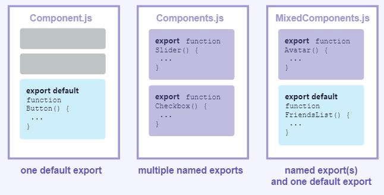
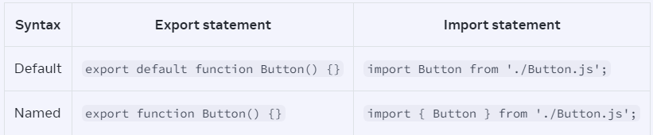
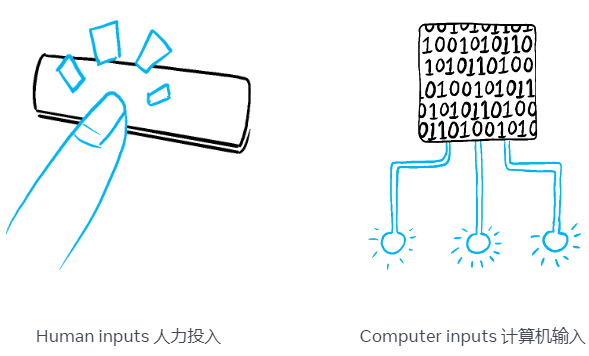
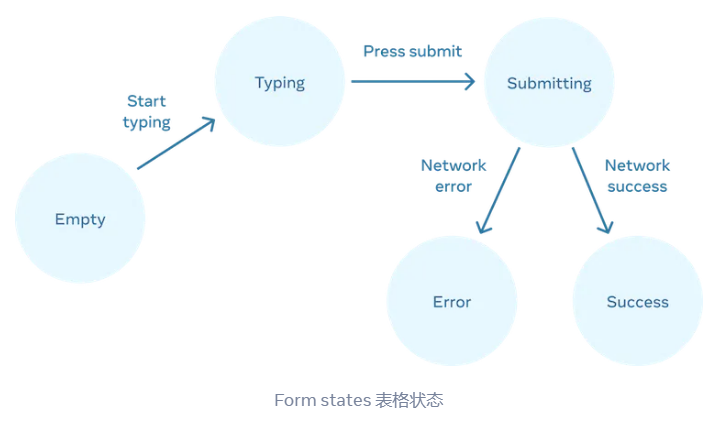
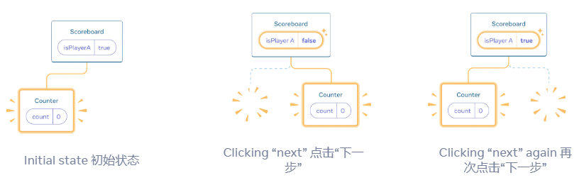
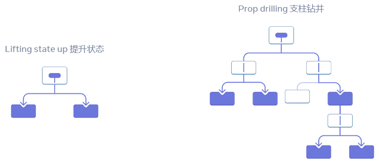
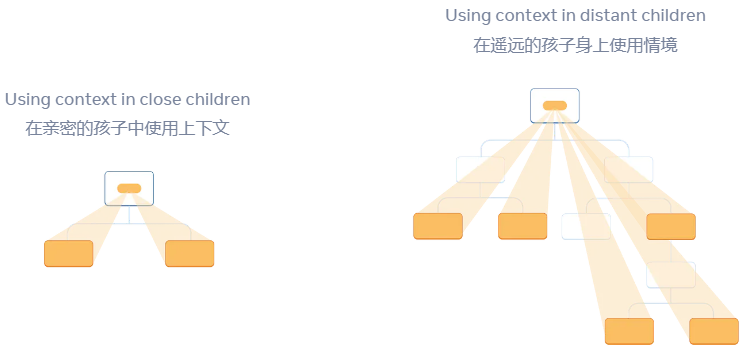
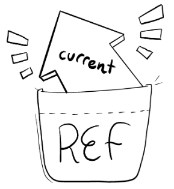
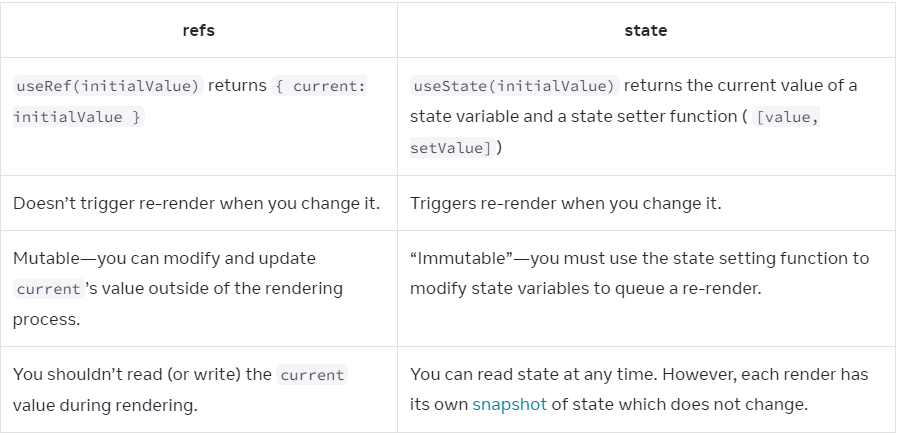

# React Dev Tutorial

## Describing the UI

### Your First Component

**Defining a component**

**Step 1: Export the component**

The `export default` prefix is a [standard JavaScript syntax](https://developer.mozilla.org/docs/web/javascript/reference/statements/export) (not specific to React). It lets you mark the main function in a file so that you can later import it from other files.

**Step 2: Define the function**

With `function Profile() { }` you define a JavaScript function with the name `Profile`.

**Step 3: Add markup**

The component returns an `` tag with `src` and `alt` attributes. `` is written like HTML, but it is actually JavaScript under the hood! This syntax is called [JSX](https://react.dev/learn/writing-markup-with-jsx), and it lets you embed markup inside JavaScript.

```
return ;
```

But if your markup isn’t all on the same line as the `return` keyword, you must wrap it in a pair of parentheses:

```
return (
  <div>
    
  </div>
);
```

**What the browser sees**

Notice the difference in casing:

- `<section>` is lowercase, so React knows we refer to an HTML tag.
- `<Profile />` starts with a capital `P`, so React knows that we want to use our component called `Profile`.

**Nesting and organizing components**

Components can render other components, but **you must never nest their definitions:**

### Importing and Exporting Components

**Exporting and importing a component**

1. **Make** a new JS file to put the components in.
2. **Export** your function component from that file (using either [default](https://developer.mozilla.org/docs/Web/JavaScript/Reference/Statements/export#using_the_default_export) or [named](https://developer.mozilla.org/docs/Web/JavaScript/Reference/Statements/export#using_named_exports) exports).
3. **Import** it in the file where you’ll use the component (using the corresponding technique for importing [default](https://developer.mozilla.org/docs/Web/JavaScript/Reference/Statements/import#importing_defaults) or [named](https://developer.mozilla.org/docs/Web/JavaScript/Reference/Statements/import#import_a_single_export_from_a_module) exports).

You may encounter files that leave off the `.js` file extension like so:

```
import Gallery from './Gallery';
```

**Default vs named exports**

**A file can have no more than one \*default\* export, but it can have as many \*named\* exports as you like.**



How you export your component dictates how you must import it. You will get an error if you try to import a default export the same way you would a named export! This chart can help you keep track:



When you write a *default* import, you can put any name you want after `import`.In contrast, with named imports, the name has to match on both sides. That’s why they are called *named* imports!

### Writing Markup with JSX

*JSX* is a syntax extension for JavaScript that lets you write HTML-like markup inside a JavaScript file.

Each React component is a JavaScript function that may contain some markup that React renders into the browser. React components use a syntax extension called JSX to represent that markup. JSX looks a lot like HTML, but it is a bit stricter and can display dynamic information. The best way to understand this is to convert some HTML markup to JSX markup.

JSX and React are two separate things. They’re often used together, but you *can* [use them independently](https://reactjs.org/blog/2020/09/22/introducing-the-new-jsx-transform.html#whats-a-jsx-transform) of each other. JSX is a syntax extension, while React is a JavaScript library.

**The Rules of JSX**

1. **Return a single root element**
   - To return multiple elements from a component, **wrap them with a single parent tag.**
   - If you don’t want to add an extra `<div>` to your markup, you can write `<>` and `</>` instead:
   - This empty tag is called a *[Fragment.](https://react.dev/reference/react/Fragment)* Fragments let you group things without leaving any trace in the browser HTML tree.
2. **Close all the tags**
   - JSX requires tags to be explicitly closed: self-closing tags like `` must become ``, and wrapping tags like `<li>oranges` must be written as `<li>oranges</li>`.
3. **camelCase all most of the things!**
   - JSX turns into JavaScript and attributes written in JSX become keys of JavaScript objects. In your own components, you will often want to read those attributes into variables. But JavaScript has limitations on variable names. For example, their names can’t contain dashes or be reserved words like `class`.

### JavaScript in JSX with Curly Braces

**Passing strings with quotes**

When you want to pass a string attribute to JSX, you put it in single or double quotes:

**Using curly braces: A window into the JavaScript world**

Any JavaScript expression will work between curly braces, including function calls like `formatDate()`:

**Where to use curly braces**

You can only use curly braces in two ways inside JSX:

1. **As text** directly inside a JSX tag: `<h1>{name}'s To Do List</h1>` works, but `<{tag}>Gregorio Y. Zara's To Do List</{tag}>` will not.
2. **As attributes** immediately following the `=` sign: `src={avatar}` will read the `avatar` variable, but `src="{avatar}"` will pass the string `"{avatar}"`.

### Passing Props to a Component

**Step 1: Pass props to the child component**

First, pass some props to `Avatar`. For example, let’s pass two props: `person` (an object), and `size` (a number):

```
export default function Profile() {
  return (
    <Avatar
      person={{ name: 'Lin Lanying', imageId: '1bX5QH6' }}
      size={100}
    />
  );
}
```

**Step 2: Read props inside the child component**

You can read these props by listing their names `person, size` separated by the commas inside `({` and `})` directly after `function Avatar`. This lets you use them inside the `Avatar` code, like you would with a variable.

```
function Avatar({ person, size }) {
  // person and size are available here
}
```

**Don’t miss the pair of `{` and `}` curlies** inside of `(` and `)` when declaring props:

```
function Avatar({ person, size }) {
  // ...
}
```

This syntax is called [“destructuring”](https://developer.mozilla.org/docs/Web/JavaScript/Reference/Operators/Destructuring_assignment#Unpacking_fields_from_objects_passed_as_a_function_parameter) and is equivalent to reading properties from a function parameter:

```
function Avatar(props) {
  let person = props.person;
  let size = props.size;
  // ...
}
```

**Specifying a default value for a prop**

If you want to give a prop a default value to fall back on when no value is specified, you can do it with the destructuring by putting `=` and the default value right after the parameter:

```
function Avatar({ person, size = 100 }) {
  // ...
}
```

**Forwarding props with the JSX spread syntax**

Sometimes, passing props gets very repetitive:

```
function Profile({ person, size, isSepia, thickBorder }) {
  return (
    <div className="card">
      <Avatar
        person={person}
        size={size}
        isSepia={isSepia}
        thickBorder={thickBorder}
      />
    </div>
  );
}
```

There’s nothing wrong with repetitive code—it can be more legible. But at times you may value conciseness. Some components forward all of their props to their children, like how this `Profile` does with `Avatar`. Because they don’t use any of their props directly, it can make sense to use a more concise “spread” syntax:

```
function Profile(props) {
  return (
    <div className="card">
      <Avatar {...props} />
    </div>
  );
}
```

**Passing JSX as children**

It is common to nest built-in browser tags:

```
<div>
  
</div>
```

Sometimes you’ll want to nest your own components the same way:

```
<Card>
  <Avatar />
</Card>
```

```
import Avatar from './Avatar.js';

function Card({ children }) {
  return (
    <div className="card">
      {children}
    </div>
  );
}

export default function Profile() {
  return (
    <Card>
      <Avatar
        size={100}
        person={{ 
          name: 'Katsuko Saruhashi',
          imageId: 'YfeOqp2'
        }}
      />
    </Card>
  );
}
```

### Conditional Rendering

Your components will often need to display different things depending on different conditions. In React, you can conditionally render JSX using JavaScript syntax like `if` statements, `&&`, and `? :` operators.

**Logical AND operator (`&&`) 逻辑与运算符 ( `&&` )**

Another common shortcut you’ll encounter is the [JavaScript logical AND (`&&`) operator.](https://developer.mozilla.org/en-US/docs/Web/JavaScript/Reference/Operators/Logical_AND#:~:text=The logical AND ( %26%26 ) operator,it returns a Boolean value.) Inside React components, it often comes up when you want to render some JSX when the condition is true, **or render nothing otherwise.** With `&&`, you could conditionally render the checkmark only if `isPacked` is `true`:

```
return (
  <li className="item">
    {name} {isPacked && '✔'}
  </li>
);
```

### Rendering Lists

You will often want to display multiple similar components from a collection of data. You can use the [JavaScript array methods](https://developer.mozilla.org/docs/Web/JavaScript/Reference/Global_Objects/Array#) to manipulate an array of data. On this page, you’ll use [`filter()`](https://developer.mozilla.org/docs/Web/JavaScript/Reference/Global_Objects/Array/filter) and [`map()`](https://developer.mozilla.org/docs/Web/JavaScript/Reference/Global_Objects/Array/map) with React to filter and transform your array of data into an array of components.

Arrow functions implicitly return the expression right after `=>`, so you didn’t need a `return` statement:

```
const listItems = chemists.map(person =>
  <li>...</li> // Implicit return!
);
```

However, **you must write `return` explicitly if your `=>` is followed by a `{` curly brace!**

```
const listItems = chemists.map(person => { // Curly brace
  return <li>...</li>;
});
```

**Keeping list items in order with `key`**

You need to give each array item a `key` — a string or a number that uniquely identifies it among other items in that array:

```
<li key={person.id}>...</li>
```

Keys tell React which array item each component corresponds to, so that it can match them up later. This becomes important if your array items can move (e.g. due to sorting), get inserted, or get deleted. A well-chosen `key` helps React infer what exactly has happened, and make the correct updates to the DOM tree.

**Rules of keys**

- **Keys must be unique among siblings.** However, it’s okay to use the same keys for JSX nodes in *different* arrays.
- **Keys must not change** or that defeats their purpose! Don’t generate them while rendering.

### Keeping Components Pure

**Purity: Components as formulas**

In computer science (and especially the world of functional programming), [a pure function](https://wikipedia.org/wiki/Pure_function) is a function with the following characteristics:

- **It minds its own business.** It does not change any objects or variables that existed before it was called.
- **Same inputs, same output.** Given the same inputs, a pure function should always return the same result.

**Side Effects: (un)intended consequences**

React’s rendering process must always be pure. Components should only *return* their JSX, and not *change* any objects or variables that existed before rendering—that would make them impure!

**Detecting impure calculations with StrictMode**

Although you might not have used them all yet, in React there are three kinds of inputs that you can read while rendering: [props](https://react.dev/learn/passing-props-to-a-component), [state](https://react.dev/learn/state-a-components-memory), and [context.](https://react.dev/learn/passing-data-deeply-with-context) You should always treat these inputs as read-only.

When you want to *change* something in response to user input, you should [set state](https://react.dev/learn/state-a-components-memory) instead of writing to a variable. You should never change preexisting variables or objects while your component is rendering.

React offers a “Strict Mode” in which it calls each component’s function twice during development. **By calling the component functions twice, Strict Mode helps find components that break these rules.**

**Where you *can* cause side effects**

While functional programming relies heavily on purity, at some point, somewhere, *something* has to change. That’s kind of the point of programming! These changes—updating the screen, starting an animation, changing the data—are called **side effects.** They’re things that happen *“on the side”*, not during rendering.

In React, **side effects usually belong inside [event handlers.](https://react.dev/learn/responding-to-events)** Event handlers are functions that React runs when you perform some action—for example, when you click a button. Even though event handlers are defined *inside* your component, they don’t run *during* rendering! **So event handlers don’t need to be pure.**

## Adding Interactivity

### Responding to Events

React lets you add *event handlers* to your JSX. Event handlers are your own functions that will be triggered in response to interactions like clicking, hovering, focusing form inputs, and so on.

**Adding event handlers**

Or, more concisely, using an arrow function:

```
<button onClick={() => {
  alert('You clicked me!');
}}>
```

**Passing event handlers as props**

```
function Button({ onClick, children }) {
  return (
    <button onClick={onClick}>
      {children}
    </button>
  );
}

function PlayButton({ movieName }) {
  function handlePlayClick() {
    alert(`Playing ${movieName}!`);
  }

  return (
    <Button onClick={handlePlayClick}>
      Play "{movieName}"
    </Button>
  );
}

function UploadButton() {
  return (
    <Button onClick={() => alert('Uploading!')}>
      Upload Image
    </Button>
  );
}

export default function Toolbar() {
  return (
    <div>
      <PlayButton movieName="Kiki's Delivery Service" />
      <UploadButton />
    </div>
  );
}
```

**Event propagation**

Event handlers will also catch events from any children your component might have. We say that an event “bubbles” or “propagates” up the tree: it starts with where the event happened, and then goes up the tree.

**Stopping propagation**

That event object also lets you stop the propagation. If you want to prevent an event from reaching parent components, you need to call `e.stopPropagation()` like this `Button` component does:

**Passing handlers as alternative to propagation**

**Preventing default behavior**

- [`e.stopPropagation()`](https://developer.mozilla.org/docs/Web/API/Event/stopPropagation) stops the event handlers attached to the tags above from firing.
- [`e.preventDefault()` ](https://developer.mozilla.org/docs/Web/API/Event/preventDefault)prevents the default browser behavior for the few events that have it.

### State: A Component's Memory

Components often need to change what’s on the screen as a result of an interaction. Typing into the form should update the input field, clicking “next” on an image carousel should change which image is displayed, clicking “buy” should put a product in the shopping cart. Components need to “remember” things: the current input value, the current image, the shopping cart. In React, this kind of component-specific memory is called *state*.

**Adding a state variable**

To add a state variable, import `useState` from React at the top of the file:

```
import { useState } from 'react';
```

with 

```
const [index, setIndex] = useState(0);
```

`index` is a state variable and `setIndex` is the setter function.

**Meet your first Hook**

In React, `useState`, as well as any other function starting with ”`use`”, is called a Hook.

**Anatomy of `useState`**

When you call [`useState`](https://react.dev/reference/react/useState), you are telling React that you want this component to remember something:

```
const [index, setIndex] = useState(0);
```

Every time your component renders, `useState` gives you an array containing two values:

1. The **state variable** (`index`) with the value you stored.
2. The **state setter function** (`setIndex`) which can update the state variable and trigger React to render the component again.

Here’s how that happens in action:

```
const [index, setIndex] = useState(0);
```

1. **Your component renders the first time.** Because you passed `0` to `useState` as the initial value for `index`, it will return `[0, setIndex]`. React remembers `0` is the latest state value.
2. **You update the state.** When a user clicks the button, it calls `setIndex(index + 1)`. `index` is `0`, so it’s `setIndex(1)`. This tells React to remember `index` is `1` now and triggers another render.
3. **Your component’s second render.** React still sees `useState(0)`, but because React *remembers* that you set `index` to `1`, it returns `[1, setIndex]` instead.

### Render and Commit

**Step 1: Trigger a render**

1. It’s the component’s **initial render.**
2. The component’s (or one of its ancestors’) **state has been updated.**

**Step 2: React renders your components**

- **On initial render,** React will call the root component.
- **For subsequent renders,** React will call the function component whose state update triggered the render.

**Step 3: React commits changes to the DOM**

After rendering (calling) your components, React will modify the DOM.

- **For the initial render,** React will use the [`appendChild()`](https://developer.mozilla.org/docs/Web/API/Node/appendChild) DOM API to put all the DOM nodes it has created on screen.
- **For re-renders,** React will apply the minimal necessary operations (calculated while rendering!) to make the DOM match the latest rendering output.

### State as a Snapshot

State variables might look like regular JavaScript variables that you can read and write to. However, state behaves more like a snapshot. Setting it does not change the state variable you already have, but instead triggers a re-render.

**Rendering takes a snapshot in time**

[“Rendering”](https://react.dev/learn/render-and-commit#step-2-react-renders-your-components) means that React is calling your component, which is a function. The JSX you return from that function is like a snapshot of the UI in time. Its props, event handlers, and local variables were all calculated **using its state at the time of the render.**

When React re-renders a component:

1. React calls your function again.
2. Your function returns a new JSX snapshot.
3. React then updates the screen to match the snapshot you’ve returned.

### Queueing a Series of State Updates

**React waits until \*all\* code in the event handlers has run before processing your state updates.**

This lets you update multiple state variables—even from multiple components—without triggering too many [re-renders.](https://react.dev/learn/render-and-commit#re-renders-when-state-updates) But this also means that the UI won’t be updated until *after* your event handler, and any code in it, completes. This behavior, also known as **batching,** makes your React app run much faster. It also avoids dealing with confusing “half-finished” renders where only some of the variables have been updated.

**React does not batch across \*multiple\* intentional events like clicks**—each click is handled separately. Rest assured that React only does batching when it’s generally safe to do. This ensures that, for example, if the first button click disables a form, the second click would not submit it again.

**Updating the same state multiple times before the next render**

It is an uncommon use case, but if you would like to update the same state variable multiple times before the next render, instead of passing the *next state value* like `setNumber(number + 1)`, you can pass a *function* that calculates the next state based on the previous one in the queue, like `setNumber(n => n + 1)`. It is a way to tell React to “do something with the state value” instead of just replacing it.

Here, `n => n + 1` is called an **updater function.** When you pass it to a state setter:

1. React queues this function to be processed after all the other code in the event handler has run.
2. During the next render, React goes through the queue and gives you the final updated state.

### Updating Objects in State

State can hold any kind of JavaScript value, including objects. But you shouldn’t change objects that you hold in the React state directly. Instead, when you want to update an object, you need to create a new one (or make a copy of an existing one), and then set the state to use that copy.

**Treat state as read-only**

In other words, you should **treat any JavaScript object that you put into state as read-only.**

**Copying objects with the spread syntax**

You can use the `...` [object spread](https://developer.mozilla.org/en-US/docs/Web/JavaScript/Reference/Operators/Spread_syntax#spread_in_object_literals) syntax so that you don’t need to copy every property separately.

```
setPerson({
  ...person, // Copy the old fields
  firstName: e.target.value // But override this one
});
```

Note that the `...` spread syntax is “shallow”—it only copies things one level deep. This makes it fast, but it also means that if you want to update a nested property, you’ll have to use it more than once.

**Updating a nested object**

```
setPerson({
  ...person, // Copy other fields
  artwork: { // but replace the artwork
    ...person.artwork, // with the same one
    city: 'New Delhi' // but in New Delhi!
  }
});
```

**Write concise update logic with Immer**

```
updatePerson(draft => {
  draft.artwork.city = 'Lagos';
});
```

To try Immer:

1. Run `npm install use-immer` to add Immer as a dependency
2. Then replace `import { useState } from 'react'` with `import { useImmer } from 'use-immer'`

```
import { useImmer } from 'use-immer';

export default function Form() {
  const [person, updatePerson] = useImmer({
    name: 'Niki de Saint Phalle',
    artwork: {
      title: 'Blue Nana',
      city: 'Hamburg',
      image: 'https://i.imgur.com/Sd1AgUOm.jpg',
    }
  });

  function handleNameChange(e) {
    updatePerson(draft => {
      draft.name = e.target.value;
    });
  }

  function handleTitleChange(e) {
    updatePerson(draft => {
      draft.artwork.title = e.target.value;
    });
  }

  function handleCityChange(e) {
    updatePerson(draft => {
      draft.artwork.city = e.target.value;
    });
  }

  function handleImageChange(e) {
    updatePerson(draft => {
      draft.artwork.image = e.target.value;
    });
  }

  return (
    <>
      <label>
        Name:
        <input
          value={person.name}
          onChange={handleNameChange}
        />
      </label>
      <label>
        Title:
        <input
          value={person.artwork.title}
          onChange={handleTitleChange}
        />
      </label>
      <label>
        City:
        <input
          value={person.artwork.city}
          onChange={handleCityChange}
        />
      </label>
      <label>
        Image:
        <input
          value={person.artwork.image}
          onChange={handleImageChange}
        />
      </label>
      <p>
        <i>{person.artwork.title}</i>
        {' by '}
        {person.name}
        <br />
        (located in {person.artwork.city})
      </p>
      
    </>
  );
}
```

### Updating Arrays in State

pass

## Managing State

### Reacting to Input with State

**How declarative UI compares to imperative**

When you design UI interactions, you probably think about how the UI *changes* in response to user actions. Consider a form that lets the user submit an answer:

- When you type something into the form, the “Submit” button **becomes enabled.**
- When you press “Submit”, both the form and the button **become disabled,** and a spinner **appears.**
- If the network request succeeds, the form **gets hidden,** and the “Thank you” message **appears.**
- If the network request fails, an error message **appears,** and the form **becomes enabled** again.

**Thinking about UI declaratively**

You’ve seen how to implement a form imperatively above. To better understand how to think in React, you’ll walk through reimplementing this UI in React below:

1. **Identify** your component’s different visual states
2. **Determine** what triggers those state changes
3. **Represent** the state in memory using `useState`
4. **Remove** any non-essential state variables
5. **Connect** the event handlers to set the state

**Step 1: Identify your component’s different visual states**

In computer science, you may hear about a [“state machine”](https://en.wikipedia.org/wiki/Finite-state_machine) being in one of several “states”. If you work with a designer, you may have seen mockups for different “visual states”. React stands at the intersection of design and computer science, so both of these ideas are sources of inspiration.

First, you need to visualize all the different “states” of the UI the user might see:

- **Empty**: Form has a disabled “Submit” button.
- **Typing**: Form has an enabled “Submit” button.
- **Submitting**: Form is completely disabled. Spinner is shown.
- **Success**: “Thank you” message is shown instead of a form.
- **Error**: Same as Typing state, but with an extra error message.

Just like a designer, you’ll want to “mock up” or create “mocks” for the different states before you add logic. 

**Step 2: Determine what triggers those state changes**

You can trigger state updates in response to two kinds of inputs:

- **Human inputs,** like clicking a button, typing in a field, navigating a link.
- **Computer inputs,** like a network response arriving, a timeout completing, an image loading.



In both cases, **you must set [state variables](https://react.dev/learn/state-a-components-memory#anatomy-of-usestate) to update the UI.** For the form you’re developing, you will need to change state in response to a few different inputs:

- **Changing the text input** (human) should switch it from the *Empty* state to the *Typing* state or back, depending on whether the text box is empty or not.
- **Clicking the Submit button** (human) should switch it to the *Submitting* state.
- **Successful network response** (computer) should switch it to the *Success* state.
- **Failed network response** (computer) should switch it to the *Error* state with the matching error message.

To help visualize this flow, try drawing each state on paper as a labeled circle, and each change between two states as an arrow. You can sketch out many flows this way and sort out bugs long before implementation.



**Step 3: Represent the state in memory with `useState`**

Then, you’ll need a state variable representing which one of the visual states that you want to display. There’s usually more than a single way to represent that in memory, so you’ll need to experiment with it.

If you struggle to think of the best way immediately, start by adding enough state that you’re *definitely* sure that all the possible visual states are covered:

```
const [isEmpty, setIsEmpty] = useState(true);
const [isTyping, setIsTyping] = useState(false);
const [isSubmitting, setIsSubmitting] = useState(false);
const [isSuccess, setIsSuccess] = useState(false);
const [isError, setIsError] = useState(false);
```

Your first idea likely won’t be the best, but that’s ok—refactoring state is a part of the process!

**Step 4: Remove any non-essential state variables**

You want to avoid duplication in the state content so you’re only tracking what is essential. Spending a little time on refactoring your state structure will make your components easier to understand, reduce duplication, and avoid unintended meanings. Your goal is to **prevent the cases where the state in memory doesn’t represent any valid UI that you’d want a user to see.** (For example, you never want to show an error message and disable the input at the same time, or the user won’t be able to correct the error!)

Here are some questions you can ask about your state variables:

- **Does this state cause a paradox?** For example, `isTyping` and `isSubmitting` can’t both be `true`. A paradox usually means that the state is not constrained enough. There are four possible combinations of two booleans, but only three correspond to valid states. To remove the “impossible” state, you can combine these into a `status` that must be one of three values: `'typing'`, `'submitting'`, or `'success'`.
- **Is the same information available in another state variable already?** Another paradox: `isEmpty` and `isTyping` can’t be `true` at the same time. By making them separate state variables, you risk them going out of sync and causing bugs. Fortunately, you can remove `isEmpty` and instead check `answer.length === 0`.
- **Can you get the same information from the inverse of another state variable?** `isError` is not needed because you can check `error !== null` instead.

After this clean-up, you’re left with 3 (down from 7!) *essential* state variables:

```
const [answer, setAnswer] = useState('');
const [error, setError] = useState(null);
const [status, setStatus] = useState('typing'); // 'typing', 'submitting', or 'success'
```

**Step 5: Connect the event handlers to set state**

### Choosing the State Structure

Structuring state well can make a difference between a component that is pleasant to modify and debug, and one that is a constant source of bugs. Here are some tips you should consider when structuring state.

**Principles for structuring state**

When you write a component that holds some state, you’ll have to make choices about how many state variables to use and what the shape of their data should be. While it’s possible to write correct programs even with a suboptimal state structure, there are a few principles that can guide you to make better choices:

1. **Group related state.** If you always update two or more state variables at the same time, consider merging them into a single state variable.
2. **Avoid contradictions in state.** When the state is structured in a way that several pieces of state may contradict and “disagree” with each other, you leave room for mistakes. Try to avoid this.
3. **Avoid redundant state.** If you can calculate some information from the component’s props or its existing state variables during rendering, you should not put that information into that component’s state.
4. **Avoid duplication in state.** When the same data is duplicated between multiple state variables, or within nested objects, it is difficult to keep them in sync. Reduce duplication when you can.
5. **Avoid deeply nested state.** Deeply hierarchical state is not very convenient to update. When possible, prefer to structure state in a flat way.

**Group related state**

Or this?

```
const [position, setPosition] = useState({ x: 0, y: 0 });
```

**Avoid contradictions in state**

**Since `isSending` and `isSent` should never be `true` at the same time, it is better to replace them with one `status` state variable that may take one of \*three\* valid states:** `'typing'` (initial), `'sending'`, and `'sent'`:

```
import { useState } from 'react';

export default function FeedbackForm() {
  const [text, setText] = useState('');
  const [status, setStatus] = useState('typing');

  async function handleSubmit(e) {
    e.preventDefault();
    setStatus('sending');
    await sendMessage(text);
    setStatus('sent');
  }

  const isSending = status === 'sending';
  const isSent = status === 'sent';

  if (isSent) {
    return <h1>Thanks for feedback!</h1>
  }

  return (
    <form onSubmit={handleSubmit}>
      <p>How was your stay at The Prancing Pony?</p>
      <textarea
        disabled={isSending}
        value={text}
        onChange={e => setText(e.target.value)}
      />
      <br />
      <button
        disabled={isSending}
        type="submit"
      >
        Send
      </button>
      {isSending && <p>Sending...</p>}
    </form>
  );
}

// Pretend to send a message.
function sendMessage(text) {
  return new Promise(resolve => {
    setTimeout(resolve, 2000);
  });
}
```

**Avoid redundant state**

If you can calculate some information from the component’s props or its existing state variables during rendering, you **should not** put that information into that component’s state.

This form has three state variables: `firstName`, `lastName`, and `fullName`. However, `fullName` is redundant. **You can always calculate `fullName` from `firstName` and `lastName` during render, so remove it from state.**

```
import { useState } from 'react';

export default function Form() {
  const [firstName, setFirstName] = useState('');
  const [lastName, setLastName] = useState('');

  const fullName = firstName + ' ' + lastName;

  function handleFirstNameChange(e) {
    setFirstName(e.target.value);
  }

  function handleLastNameChange(e) {
    setLastName(e.target.value);
  }

  return (
    <>
      <h2>Let’s check you in</h2>
      <label>
        First name:{' '}
        <input
          value={firstName}
          onChange={handleFirstNameChange}
        />
      </label>
      <label>
        Last name:{' '}
        <input
          value={lastName}
          onChange={handleLastNameChange}
        />
      </label>
      <p>
        Your ticket will be issued to: <b>{fullName}</b>
      </p>
    </>
  );
}
```

### Sharing State Between Components

**Lifting state up by example**

**But now let’s say you want to change it so that only one panel is expanded at any given time.** With that design, expanding the second panel should collapse the first one. How would you do that?

To coordinate these two panels, you need to “lift their state up” to a parent component in three steps:

1. **Remove** state from the child components.
2. **Pass** hardcoded data from the common parent.
3. **Add** state to the common parent and pass it down together with the event handlers.

**Step 1: Remove state from the child components**

And instead, add `isActive` to the `Panel`’s list of props:

```
function Panel({ title, children, isActive }) {
```

**Step 2: Pass hardcoded data from the common parent**

To lift state up, you must locate the closest common parent component of *both* of the child components that you want to coordinate:

**Step 3: Add state to the common parent**

```
import { useState } from 'react';

export default function Accordion() {
  const [activeIndex, setActiveIndex] = useState(0);
  return (
    <>
      <h2>Almaty, Kazakhstan</h2>
      <Panel
        title="About"
        isActive={activeIndex === 0}
        onShow={() => setActiveIndex(0)}
      >
        With a population of about 2 million, Almaty is Kazakhstan's largest city. From 1929 to 1997, it was its capital city.
      </Panel>
      <Panel
        title="Etymology"
        isActive={activeIndex === 1}
        onShow={() => setActiveIndex(1)}
      >
        The name comes from <span lang="kk-KZ">алма</span>, the Kazakh word for "apple" and is often translated as "full of apples". In fact, the region surrounding Almaty is thought to be the ancestral home of the apple, and the wild <i lang="la">Malus sieversii</i> is considered a likely candidate for the ancestor of the modern domestic apple.
      </Panel>
    </>
  );
}

function Panel({
  title,
  children,
  isActive,
  onShow
}) {
  return (
    <section className="panel">
      <h3>{title}</h3>
      {isActive ? (
        <p>{children}</p>
      ) : (
        <button onClick={onShow}>
          Show
        </button>
      )}
    </section>
  );
}
```

### Preserving and Resetting State

State is isolated between components. React keeps track of which state belongs to which component based on their place in the UI tree. You can control when to preserve state and when to reset it between re-renders.

**The UI tree **

React also uses tree structures to manage and model the UI you make. React makes **UI trees** from your JSX. Then React DOM updates the browser DOM elements to match that UI tree. (React Native translates these trees into elements specific to mobile platforms.)

![Diagram with three sections arranged horizontally. In the first section, there are three rectangles stacked vertically, with labels 'Component A', 'Component B', and 'Component C'. Transitioning to the next pane is an arrow with the React logo on top labeled 'React'. The middle section contains a tree of components, with the root labeled 'A' and two children labeled 'B' and 'C'. The next section is again transitioned using an arrow with the React logo on top labeled 'React'. The third and final section is a wireframe of a browser, containing a tree of 8 nodes, which has only a subset highlighted (indicating the subtree from the middle section).](./assets/imageurl=%2Fimages%2Fdocs%2Fdiagrams%2Fpreserving_state_dom_tree.png)

**State is tied to a position in the tree**

```
import { useState } from 'react';

export default function App() {
  const [showB, setShowB] = useState(true);
  return (
    <div>
      <Counter />
      {showB && <Counter />} 
      <label>
        <input
          type="checkbox"
          checked={showB}
          onChange={e => {
            setShowB(e.target.checked)
          }}
        />
        Render the second counter
      </label>
    </div>
  );
}

function Counter() {
  const [score, setScore] = useState(0);
  const [hover, setHover] = useState(false);

  let className = 'counter';
  if (hover) {
    className += ' hover';
  }

  return (
    <div
      className={className}
      onPointerEnter={() => setHover(true)}
      onPointerLeave={() => setHover(false)}
    >
      <h1>{score}</h1>
      <button onClick={() => setScore(score + 1)}>
        Add one
      </button>
    </div>
  );
}
```

React will keep the state around for as long as you render the same component at the same position. To see this, increment both counters, then remove the second component by unchecking “Render the second counter” checkbox, and then add it back by ticking it again:


Notice how the moment you stop rendering the second counter, its state disappears completely. That’s because when React removes a component, it destroys its state.


When you tick “Render the second counter”, a second `Counter` and its state are initialized from scratch (`score = 0`) and added to the DOM.


**React preserves a component’s state for as long as it’s being rendered at its position in the UI tree.** If it gets removed, or a different component gets rendered at the same position, React discards its state.

**Same component at the same position preserves state**

```
import { useState } from 'react';

export default function App() {
  const [isFancy, setIsFancy] = useState(false);
  return (
    <div>
      {isFancy ? (
        <Counter isFancy={true} /> 
      ) : (
        <Counter isFancy={false} /> 
      )}
      <label>
        <input
          type="checkbox"
          checked={isFancy}
          onChange={e => {
            setIsFancy(e.target.checked)
          }}
        />
        Use fancy styling
      </label>
    </div>
  );
}

function Counter({ isFancy }) {
  const [score, setScore] = useState(0);
  const [hover, setHover] = useState(false);

  let className = 'counter';
  if (hover) {
    className += ' hover';
  }
  if (isFancy) {
    className += ' fancy';
  }

  return (
    <div
      className={className}
      onPointerEnter={() => setHover(true)}
      onPointerLeave={() => setHover(false)}
    >
      <h1>{score}</h1>
      <button onClick={() => setScore(score + 1)}>
        Add one
      </button>
    </div>
  );
}
```

When you tick or clear the checkbox, the counter state does not get reset. Whether `isFancy` is `true` or `false`, you always have a `<Counter />` as the first child of the `div` returned from the root `App` component:

![Diagram with two sections separated by an arrow transitioning between them. Each section contains a layout of components with a parent labeled 'App' containing a state bubble labeled isFancy. This component has one child labeled 'div', which leads to a prop bubble containing isFancy (highlighted in purple) passed down to the only child. The last child is labeled 'Counter' and contains a state bubble with label 'count' and value 3 in both diagrams. In the left section of the diagram, nothing is highlighted and the isFancy parent state value is false. In the right section of the diagram, the isFancy parent state value has changed to true and it is highlighted in yellow, and so is the props bubble below, which has also changed its isFancy value to true.](./assets/imageurl=%2Fimages%2Fdocs%2Fdiagrams%2Fpreserving_state_same_component.png)

Remember that **it’s the position in the UI tree—not in the JSX markup—that matters to React!** This component has two `return` clauses with different `<Counter />` JSX tags inside and outside the `if`:

You might expect the state to reset when you tick checkbox, but it doesn’t! This is because **both of these `<Counter />` tags are rendered at the same position.** React doesn’t know where you place the conditions in your function. All it “sees” is the tree you return.

In both cases, the `App` component returns a `<div>` with `<Counter />` as a first child. To React, these two counters have the same “address”: the first child of the first child of the root. This is how React matches them up between the previous and next renders, regardless of how you structure your logic.

**Different components at the same position reset state**

```
import { useState } from 'react';

export default function App() {
  const [isPaused, setIsPaused] = useState(false);
  return (
    <div>
      {isPaused ? (
        <p>See you later!</p> 
      ) : (
        <Counter /> 
      )}
      <label>
        <input
          type="checkbox"
          checked={isPaused}
          onChange={e => {
            setIsPaused(e.target.checked)
          }}
        />
        Take a break
      </label>
    </div>
  );
}

function Counter() {
  const [score, setScore] = useState(0);
  const [hover, setHover] = useState(false);

  let className = 'counter';
  if (hover) {
    className += ' hover';
  }

  return (
    <div
      className={className}
      onPointerEnter={() => setHover(true)}
      onPointerLeave={() => setHover(false)}
    >
      <h1>{score}</h1>
      <button onClick={() => setScore(score + 1)}>
        Add one
      </button>
    </div>
  );
}
```

Here, you switch between *different* component types at the same position. Initially, the first child of the `<div>` contained a `Counter`. But when you swapped in a `p`, React removed the `Counter` from the UI tree and destroyed its state.


Also, **when you render a different component in the same position, it resets the state of its entire subtree.** 

```
import { useState } from 'react';

export default function App() {
  const [isFancy, setIsFancy] = useState(false);
  return (
    <div>
      {isFancy ? (
        <div>
          <Counter isFancy={true} /> 
        </div>
      ) : (
        <div>
          <Counter isFancy={false} />
        </div>
      )}
      <label>
        <input
          type="checkbox"
          checked={isFancy}
          onChange={e => {
            setIsFancy(e.target.checked)
          }}
        />
        Use fancy styling
      </label>
    </div>
  );
}

function Counter({ isFancy }) {
  const [score, setScore] = useState(0);
  const [hover, setHover] = useState(false);

  let className = 'counter';
  if (hover) {
    className += ' hover';
  }
  if (isFancy) {
    className += ' fancy';
  }

  return (
    <div
      className={className}
      onPointerEnter={() => setHover(true)}
      onPointerLeave={() => setHover(false)}
    >
      <h1>{score}</h1>
      <button onClick={() => setScore(score + 1)}>
        Add one
      </button>
    </div>
  );
}
```

The counter state gets reset when you click the checkbox. Although you render a `Counter`, the first child of the `div` changes from a `div` to a `section`. When the child `div` was removed from the DOM, the whole tree below it (including the `Counter` and its state) was destroyed as well.

![Diagram with three sections, with an arrow transitioning each section in between. The first section contains a React component labeled 'div' with a single child labeled 'section', which has a single child labeled 'Counter' containing a state bubble labeled 'count' with value 3. The middle section has the same 'div' parent, but the child components have now been deleted, indicated by a yellow 'proof' image. The third section has the same 'div' parent again, now with a new child labeled 'div', highlighted in yellow, also with a new child labeled 'Counter' containing a state bubble labeled 'count' with value 0, all highlighted in yellow.](./assets/imageurl=%2Fimages%2Fdocs%2Fdiagrams%2Fpreserving_state_diff_same_pt1.png)

![Diagram with three sections, with an arrow transitioning each section in between. The first section contains a React component labeled 'div' with a single child labeled 'div', which has a single child labeled 'Counter' containing a state bubble labeled 'count' with value 0. The middle section has the same 'div' parent, but the child components have now been deleted, indicated by a yellow 'proof' image. The third section has the same 'div' parent again, now with a new child labeled 'section', highlighted in yellow, also with a new child labeled 'Counter' containing a state bubble labeled 'count' with value 0, all highlighted in yellow.](./assets/imageurl=%2Fimages%2Fdocs%2Fdiagrams%2Fpreserving_state_diff_same_pt2.png)

As a rule of thumb, **if you want to preserve the state between re-renders, the structure of your tree needs to “match up”** from one render to another. If the structure is different, the state gets destroyed because React destroys state when it removes a component from the tree.

**Resetting state at the same position**

By default, React preserves state of a component while it stays at the same position. Usually, this is exactly what you want, so it makes sense as the default behavior. But sometimes, you may want to reset a component’s state. Consider this app that lets two players keep track of their scores during each turn:

```
import { useState } from 'react';

export default function Scoreboard() {
  const [isPlayerA, setIsPlayerA] = useState(true);
  return (
    <div>
      {isPlayerA ? (
        <Counter key="one" person="Taylor" />
      ) : (
        <Counter key="two" person="Sarah" />
      )}
      <button onClick={() => {
        setIsPlayerA(!isPlayerA);
      }}>
        Next player!
      </button>
    </div>
  );
}

function Counter({ person }) {
  const [score, setScore] = useState(0);
  const [hover, setHover] = useState(false);

  let className = 'counter';
  if (hover) {
    className += ' hover';
  }

  return (
    <div
      className={className}
      onPointerEnter={() => setHover(true)}
      onPointerLeave={() => setHover(false)}
    >
      <h1>{person}'s score: {score}</h1>
      <button onClick={() => setScore(score + 1)}>
        Add one
      </button>
    </div>
  );
}
```

Currently, when you change the player, the score is preserved. The two `Counter`s appear in the same position, so React sees them as *the same* `Counter` whose `person` prop has changed.

There are two ways to reset state when switching between them:

1. Render components in different positions
2. Give each component an explicit identity with `key`

**Option 1: Rendering a component in different positions**

If you want these two `Counter`s to be independent, you can render them in two different positions:

```
import { useState } from 'react';

export default function Scoreboard() {
  const [isPlayerA, setIsPlayerA] = useState(true);
  return (
    <div>
      {isPlayerA &&
        <Counter person="Taylor" />
      }
      {!isPlayerA &&
        <Counter person="Sarah" />
      }
      <button onClick={() => {
        setIsPlayerA(!isPlayerA);
      }}>
        Next player!
      </button>
    </div>
  );
}

function Counter({ person }) {
  const [score, setScore] = useState(0);
  const [hover, setHover] = useState(false);

  let className = 'counter';
  if (hover) {
    className += ' hover';
  }

  return (
    <div
      className={className}
      onPointerEnter={() => setHover(true)}
      onPointerLeave={() => setHover(false)}
    >
      <h1>{person}'s score: {score}</h1>
      <button onClick={() => setScore(score + 1)}>
        Add one
      </button>
    </div>
  );
}
```

- Initially, `isPlayerA` is `true`. So the first position contains `Counter` state, and the second one is empty.
- When you click the “Next player” button the first position clears but the second one now contains a `Counter`.



Each `Counter`’s state gets destroyed each time its removed from the DOM. This is why they reset every time you click the button.

**Option 2: Resetting state with a key**

You might have seen `key`s when [rendering lists.](https://react.dev/learn/rendering-lists#keeping-list-items-in-order-with-key) Keys aren’t just for lists! You can use keys to make React distinguish between any components. By default, React uses order within the parent (“first counter”, “second counter”) to discern between components. But keys let you tell React that this is not just a *first* counter, or a *second* counter, but a specific counter—for example, *Taylor’s* counter. This way, React will know *Taylor’s* counter wherever it appears in the tree!

### Extracting State Logic into a Reducer

Components with many state updates spread across many event handlers can get overwhelming. For these cases, you can consolidate all the state update logic outside your component in a single function, called a *reducer.*

**Consolidate state logic with a reducer**

As your components grow in complexity, it can get harder to see at a glance all the different ways in which a component’s state gets updated. For example, the `TaskApp` component below holds an array of `tasks` in state and uses three different event handlers to add, remove, and edit tasks:

```
import { useState } from 'react';
import AddTask from './AddTask.js';
import TaskList from './TaskList.js';

export default function TaskApp() {
  const [tasks, setTasks] = useState(initialTasks);

  function handleAddTask(text) {
    setTasks([
      ...tasks,
      {
        id: nextId++,
        text: text,
        done: false,
      },
    ]);
  }

  function handleChangeTask(task) {
    setTasks(
      tasks.map((t) => {
        if (t.id === task.id) {
          return task;
        } else {
          return t;
        }
      })
    );
  }

  function handleDeleteTask(taskId) {
    setTasks(tasks.filter((t) => t.id !== taskId));
  }

  return (
    <>
      <h1>Prague itinerary</h1>
      <AddTask onAddTask={handleAddTask} />
      <TaskList
        tasks={tasks}
        onChangeTask={handleChangeTask}
        onDeleteTask={handleDeleteTask}
      />
    </>
  );
}

let nextId = 3;
const initialTasks = [
  {id: 0, text: 'Visit Kafka Museum', done: true},
  {id: 1, text: 'Watch a puppet show', done: false},
  {id: 2, text: 'Lennon Wall pic', done: false},
];
```

Each of its event handlers calls `setTasks` in order to update the state. As this component grows, so does the amount of state logic sprinkled throughout it. To reduce this complexity and keep all your logic in one easy-to-access place, you can move that state logic into a single function outside your component, **called a “reducer”.**

Reducers are a different way to handle state. You can migrate from `useState` to `useReducer` in three steps:

1. **Move** from setting state to dispatching actions.
2. **Write** a reducer function.
3. **Use** the reducer from your component.

**Step 1: Move from setting state to dispatching actions**

```
function handleAddTask(text) {
  setTasks([
    ...tasks,
    {
      id: nextId++,
      text: text,
      done: false,
    },
  ]);
}

function handleChangeTask(task) {
  setTasks(
    tasks.map((t) => {
      if (t.id === task.id) {
        return task;
      } else {
        return t;
      }
    })
  );
}

function handleDeleteTask(taskId) {
  setTasks(tasks.filter((t) => t.id !== taskId));
}
```

Remove all the state setting logic. What you are left with are three event handlers:

- `handleAddTask(text)` is called when the user presses “Add”.
- `handleChangeTask(task)` is called when the user toggles a task or presses “Save”.
- `handleDeleteTask(taskId)` is called when the user presses “Delete”.

Managing state with reducers is slightly different from directly setting state. Instead of telling React “what to do” by setting state, you specify “what the user just did” by dispatching “actions” from your event handlers. (The state update logic will live elsewhere!) So instead of “setting `tasks`” via an event handler, you’re dispatching an “added/changed/deleted a task” action. This is more descriptive of the user’s intent.

```
function handleAddTask(text) {
  dispatch({
    type: 'added',
    id: nextId++,
    text: text,
  });
}

function handleChangeTask(task) {
  dispatch({
    type: 'changed',
    task: task,
  });
}

function handleDeleteTask(taskId) {
  dispatch({
    type: 'deleted',
    id: taskId,
  });
}
```

The object you pass to `dispatch` is called an “action”:

```
function handleDeleteTask(taskId) {
  dispatch(
    // "action" object:
    {
      type: 'deleted',
      id: taskId,
    }
  );
}
```

By convention, it is common to give it a string `type` that describes what happened, and pass any additional information in other fields. The `type` is specific to a component, so in this example either `'added'` or `'added_task'` would be fine. Choose a name that says what happened!

```
dispatch({
  // specific to component
  type: 'what_happened',
  // other fields go here
});
```

**Step 2: Write a reducer function**

A reducer function is where you will put your state logic. It takes two arguments, the current state and the action object, and it returns the next state:

```
function yourReducer(state, action) {
  // return next state for React to set
}
```

React will set the state to what you return from the reducer.

To move your state setting logic from your event handlers to a reducer function in this example, you will:

1. Declare the current state (`tasks`) as the first argument.
2. Declare the `action` object as the second argument.
3. Return the *next* state from the reducer (which React will set the state to).

```
function tasksReducer(tasks, action) {
  if (action.type === 'added') {
    return [
      ...tasks,
      {
        id: action.id,
        text: action.text,
        done: false,
      },
    ];
  } else if (action.type === 'changed') {
    return tasks.map((t) => {
      if (t.id === action.task.id) {
        return action.task;
      } else {
        return t;
      }
    });
  } else if (action.type === 'deleted') {
    return tasks.filter((t) => t.id !== action.id);
  } else {
    throw Error('Unknown action: ' + action.type);
  }
}
```

The code above uses if/else statements, but it’s a convention to use [switch statements](https://developer.mozilla.org/docs/Web/JavaScript/Reference/Statements/switch) inside reducers. The result is the same, but it can be easier to read switch statements at a glance.

```
function tasksReducer(tasks, action) {
  switch (action.type) {
    case 'added': {
      return [
        ...tasks,
        {
          id: action.id,
          text: action.text,
          done: false,
        },
      ];
    }
    case 'changed': {
      return tasks.map((t) => {
        if (t.id === action.task.id) {
          return action.task;
        } else {
          return t;
        }
      });
    }
    case 'deleted': {
      return tasks.filter((t) => t.id !== action.id);
    }
    default: {
      throw Error('Unknown action: ' + action.type);
    }
  }
}
```

**Step 3: Use the reducer from your component**

Finally, you need to hook up the `tasksReducer` to your component. Import the `useReducer` Hook from React:

```
import { useReducer } from 'react';
```

Then you can replace `useState`:

```
const [tasks, setTasks] = useState(initialTasks);
```

with `useReducer` like so:

```
const [tasks, dispatch] = useReducer(tasksReducer, initialTasks);
```

The `useReducer` Hook is similar to `useState`—you must pass it an initial state and it returns a stateful value and a way to set state (in this case, the dispatch function). But it’s a little different.

The `useReducer` Hook takes two arguments:

1. A reducer function
2. An initial state 

And it returns: 

1. A stateful value 
2. A dispatch function (to “dispatch” user actions to the reducer)

Now it’s fully wired up! Here, the reducer is declared at the bottom of the component file:

```
import { useReducer } from 'react';
import AddTask from './AddTask.js';
import TaskList from './TaskList.js';

export default function TaskApp() {
  const [tasks, dispatch] = useReducer(tasksReducer, initialTasks);

  function handleAddTask(text) {
    dispatch({
      type: 'added',
      id: nextId++,
      text: text,
    });
  }

  function handleChangeTask(task) {
    dispatch({
      type: 'changed',
      task: task,
    });
  }

  function handleDeleteTask(taskId) {
    dispatch({
      type: 'deleted',
      id: taskId,
    });
  }

  return (
    <>
      <h1>Prague itinerary</h1>
      <AddTask onAddTask={handleAddTask} />
      <TaskList
        tasks={tasks}
        onChangeTask={handleChangeTask}
        onDeleteTask={handleDeleteTask}
      />
    </>
  );
}

function tasksReducer(tasks, action) {
  switch (action.type) {
    case 'added': {
      return [
        ...tasks,
        {
          id: action.id,
          text: action.text,
          done: false,
        },
      ];
    }
    case 'changed': {
      return tasks.map((t) => {
        if (t.id === action.task.id) {
          return action.task;
        } else {
          return t;
        }
      });
    }
    case 'deleted': {
      return tasks.filter((t) => t.id !== action.id);
    }
    default: {
      throw Error('Unknown action: ' + action.type);
    }
  }
}

let nextId = 3;
const initialTasks = [
  {id: 0, text: 'Visit Kafka Museum', done: true},
  {id: 1, text: 'Watch a puppet show', done: false},
  {id: 2, text: 'Lennon Wall pic', done: false},
];
```

**Comparing `useState` and `useReducer`**

Reducers are not without downsides! Here’s a few ways you can compare them:

- **Code size:** Generally, with `useState` you have to write less code upfront. With `useReducer`, you have to write both a reducer function *and* dispatch actions. However, `useReducer` can help cut down on the code if many event handlers modify state in a similar way.
- **Readability:** `useState` is very easy to read when the state updates are simple. When they get more complex, they can bloat your component’s code and make it difficult to scan. In this case, `useReducer` lets you cleanly separate the *how* of update logic from the *what happened* of event handlers.
- **Debugging:** When you have a bug with `useState`, it can be difficult to tell *where* the state was set incorrectly, and *why*. With `useReducer`, you can add a console log into your reducer to see every state update, and *why* it happened (due to which `action`). If each `action` is correct, you’ll know that the mistake is in the reducer logic itself. However, you have to step through more code than with `useState`.
- **Testing:** A reducer is a pure function that doesn’t depend on your component. This means that you can export and test it separately in isolation. While generally it’s best to test components in a more realistic environment, for complex state update logic it can be useful to assert that your reducer returns a particular state for a particular initial state and action.
- **Personal preference:** Some people like reducers, others don’t. That’s okay. It’s a matter of preference. You can always convert between `useState` and `useReducer` back and forth: they are equivalent!

**Writing reducers well**

Keep these two tips in mind when writing reducers:

- **Reducers must be pure.** Similar to [state updater functions](https://react.dev/learn/queueing-a-series-of-state-updates), reducers run during rendering! (Actions are queued until the next render.) This means that reducers [must be pure](https://react.dev/learn/keeping-components-pure)—same inputs always result in the same output. They should not send requests, schedule timeouts, or perform any side effects (operations that impact things outside the component). They should update [objects](https://react.dev/learn/updating-objects-in-state) and [arrays](https://react.dev/learn/updating-arrays-in-state) without mutations.
- **Each action describes a single user interaction, even if that leads to multiple changes in the data.** For example, if a user presses “Reset” on a form with five fields managed by a reducer, it makes more sense to dispatch one `reset_form` action rather than five separate `set_field` actions. If you log every action in a reducer, that log should be clear enough for you to reconstruct what interactions or responses happened in what order. This helps with debugging!

**Writing concise reducers with Immer**

```
import { useImmerReducer } from 'use-immer';
import AddTask from './AddTask.js';
import TaskList from './TaskList.js';

function tasksReducer(draft, action) {
  switch (action.type) {
    case 'added': {
      draft.push({
        id: action.id,
        text: action.text,
        done: false,
      });
      break;
    }
    case 'changed': {
      const index = draft.findIndex((t) => t.id === action.task.id);
      draft[index] = action.task;
      break;
    }
    case 'deleted': {
      return draft.filter((t) => t.id !== action.id);
    }
    default: {
      throw Error('Unknown action: ' + action.type);
    }
  }
}

export default function TaskApp() {
  const [tasks, dispatch] = useImmerReducer(tasksReducer, initialTasks);

  function handleAddTask(text) {
    dispatch({
      type: 'added',
      id: nextId++,
      text: text,
    });
  }

  function handleChangeTask(task) {
    dispatch({
      type: 'changed',
      task: task,
    });
  }

  function handleDeleteTask(taskId) {
    dispatch({
      type: 'deleted',
      id: taskId,
    });
  }

  return (
    <>
      <h1>Prague itinerary</h1>
      <AddTask onAddTask={handleAddTask} />
      <TaskList
        tasks={tasks}
        onChangeTask={handleChangeTask}
        onDeleteTask={handleDeleteTask}
      />
    </>
  );
}

let nextId = 3;
const initialTasks = [
  {id: 0, text: 'Visit Kafka Museum', done: true},
  {id: 1, text: 'Watch a puppet show', done: false},
  {id: 2, text: 'Lennon Wall pic', done: false},
];
```

Reducers must be pure, so they shouldn’t mutate state. But Immer provides you with a special `draft` object which is safe to mutate. Under the hood, Immer will create a copy of your state with the changes you made to the `draft`. This is why reducers managed by `useImmerReducer` can mutate their first argument and don’t need to return state.

### Passing Data Deeply with Context

Usually, you will pass information from a parent component to a child component via props. But passing props can become verbose and inconvenient if you have to pass them through many components in the middle, or if many components in your app need the same information. *Context* lets the parent component make some information available to any component in the tree below it—no matter how deep—without passing it explicitly through props.

**The problem with passing props**

[Passing props](https://react.dev/learn/passing-props-to-a-component) is a great way to explicitly pipe data through your UI tree to the components that use it.

But passing props can become verbose and inconvenient when you need to pass some prop deeply through the tree, or if many components need the same prop. The nearest common ancestor could be far removed from the components that need data, and [lifting state up](https://react.dev/learn/sharing-state-between-components) that high can lead to a situation called “prop drilling”.



**Context: an alternative to passing props**

You can’t do it with props alone. This is where context comes into play. You will do it in three steps:

1. **Create** a context. (You can call it `LevelContext`, since it’s for the heading level.)
2. **Use** that context from the component that needs the data. (`Heading` will use `LevelContext`.)
3. **Provide** that context from the component that specifies the data. (`Section` will provide `LevelContext`.)

Context lets a parent—even a distant one!—provide some data to the entire tree inside of it.



**Step 1: Create the context**

```
import { createContext } from 'react';

export const LevelContext = createContext(1);
```

**Step 2: Use the context**

Import the `useContext` Hook from React and your context:

```
import { useContext } from 'react';
import { LevelContext } from './LevelContext.js';
```

Instead, remove the `level` prop and read the value from the context you just imported, `LevelContext`:

```
export default function Heading({ children }) {
  const level = useContext(LevelContext);
  // ...
}
```

`useContext` is a Hook. Just like `useState` and `useReducer`, you can only call a Hook immediately inside a React component (not inside loops or conditions). **`useContext` tells React that the `Heading` component wants to read the `LevelContext`.**

**Step 3: Provide the context**

**Wrap them with a context provider** to provide the `LevelContext` to them:

```
import { LevelContext } from './LevelContext.js';

export default function Section({ level, children }) {
  return (
    <section className="section">
      <LevelContext.Provider value={level}>
        {children}
      </LevelContext.Provider>
    </section>
  );
}
```

This tells React: “if any component inside this `<Section>` asks for `LevelContext`, give them this `level`.” The component will use the value of the nearest `<LevelContext.Provider>` in the UI tree above it.

**Using and providing context from the same component**

Since context lets you read information from a component above, each `Section` could read the `level` from the `Section` above, and pass `level + 1` down automatically. Here is how you could do it:

```
import { useContext } from 'react';
import { LevelContext } from './LevelContext.js';

export default function Section({ children }) {
  const level = useContext(LevelContext);
  return (
    <section className="section">
      <LevelContext.Provider value={level + 1}>
        {children}
      </LevelContext.Provider>
    </section>
  );
}
```

**Context passes through intermediate components**

You can insert as many components as you like between the component that provides context and the one that uses it. This includes both built-in components like `<div>` and components you might build yourself.

**Context lets you write components that “adapt to their surroundings” and display themselves differently depending on \*where\* (or, in other words, \*in which context\*) they are being rendered.**

**Before you use context**

Context is very tempting to use! However, this also means it’s too easy to overuse it. **Just because you need to pass some props several levels deep doesn’t mean you should put that information into context.**

Here’s a few alternatives you should consider before using context:

1. **Start by [passing props.](https://react.dev/learn/passing-props-to-a-component)** If your components are not trivial, it’s not unusual to pass a dozen props down through a dozen components. It may feel like a slog, but it makes it very clear which components use which data! The person maintaining your code will be glad you’ve made the data flow explicit with props.
2. **Extract components and [pass JSX as `children`](https://react.dev/learn/passing-props-to-a-component#passing-jsx-as-children) to them.** If you pass some data through many layers of intermediate components that don’t use that data (and only pass it further down), this often means that you forgot to extract some components along the way. For example, maybe you pass data props like `posts` to visual components that don’t use them directly, like `<Layout posts={posts} />`. Instead, make `Layout` take `children` as a prop, and render `<Layout><Posts posts={posts} /></Layout>`. This reduces the number of layers between the component specifying the data and the one that needs it.

**Use cases for context**

- **Theming:** If your app lets the user change its appearance (e.g. dark mode), you can put a context provider at the top of your app, and use that context in components that need to adjust their visual look.
- **Current account:** Many components might need to know the currently logged in user. Putting it in context makes it convenient to read it anywhere in the tree. Some apps also let you operate multiple accounts at the same time (e.g. to leave a comment as a different user). In those cases, it can be convenient to wrap a part of the UI into a nested provider with a different current account value.
- **Routing:** Most routing solutions use context internally to hold the current route. This is how every link “knows” whether it’s active or not. If you build your own router, you might want to do it too.
- **Managing state:** As your app grows, you might end up with a lot of state closer to the top of your app. Many distant components below may want to change it. It is common to [use a reducer together with context](https://react.dev/learn/scaling-up-with-reducer-and-context) to manage complex state and pass it down to distant components without too much hassle.

Context is not limited to static values. If you pass a different value on the next render, React will update all the components reading it below! This is why context is often used in combination with state.

### Scaling Up with Reducer and Context

Reducers let you consolidate a component’s state update logic. Context lets you pass information deep down to other components. You can combine reducers and context together to manage state of a complex screen.

## Escape Hatches

Some of your components may need to control and synchronize with systems outside of React. For example, you might need to focus an input using the browser API, play and pause a video player implemented without React, or connect and listen to messages from a remote server. In this chapter, you’ll learn the escape hatches that let you “step outside” React and connect to external systems. Most of your application logic and data flow should not rely on these features.

### Referencing Values with Refs

**Adding a ref to your component**

You can add a ref to your component by importing the `useRef` Hook from React:

```
import { useRef } from 'react';
```

Inside your component, call the `useRef` Hook and pass the initial value that you want to reference as the only argument. For example, here is a ref to the value `0`:

```
const ref = useRef(0);
```

`useRef` returns an object like this:

```
{ 
  current: 0 // The value you passed to useRef
}
```



You can access the current value of that ref through the `ref.current` property. This value is intentionally mutable, meaning you can both read and write to it. It’s like a secret pocket of your component that React doesn’t track. (This is what makes it an “escape hatch” from React’s one-way data flow—more on that below!)

The ref points to a number, but, like [state](https://react.dev/learn/state-a-components-memory), you could point to anything: a string, an object, or even a function. Unlike state, ref is a plain JavaScript object with the `current` property that you can read and modify.

Note that **the component doesn’t re-render with every increment.** Like state, refs are retained by React between re-renders. However, setting state re-renders a component. Changing a ref does not!

**Differences between refs and state**

Perhaps you’re thinking refs seem less “strict” than state—you can mutate them instead of always having to use a state setting function, for instance. But in most cases, you’ll want to use state. Refs are an “escape hatch” you won’t need often. Here’s how state and refs compare:



**When to use refs**

Typically, you will use a ref when your component needs to “step outside” React and communicate with external APIs—often a browser API that won’t impact the appearance of the component. Here are a few of these rare situations:

- Storing [timeout IDs](https://developer.mozilla.org/docs/Web/API/setTimeout)
- Storing and manipulating [DOM elements](https://developer.mozilla.org/docs/Web/API/Element), which we cover on [the next page](https://react.dev/learn/manipulating-the-dom-with-refs)
- Storing other objects that aren’t necessary to calculate the JSX.

If your component needs to store some value, but it doesn’t impact the rendering logic, choose refs.

**Best practices for refs**

Following these principles will make your components more predictable:

- **Treat refs as an escape hatch.** Refs are useful when you work with external systems or browser APIs. If much of your application logic and data flow relies on refs, you might want to rethink your approach.
- **Don’t read or write `ref.current` during rendering.** If some information is needed during rendering, use [state](https://react.dev/learn/state-a-components-memory) instead. Since React doesn’t know when `ref.current` changes, even reading it while rendering makes your component’s behavior difficult to predict. (The only exception to this is code like `if (!ref.current) ref.current = new Thing()` which only sets the ref once during the first render.)

Limitations of React state don’t apply to refs. For example, state acts like a [snapshot for every render](https://react.dev/learn/state-as-a-snapshot) and [doesn’t update synchronously.](https://react.dev/learn/queueing-a-series-of-state-updates) But when you mutate the current value of a ref, it changes immediately:

**Refs and the DOM**

You can point a ref to any value. However, the most common use case for a ref is to access a DOM element. For example, this is handy if you want to focus an input programmatically. When you pass a ref to a `ref` attribute in JSX, like `<div ref={myRef}>`, React will put the corresponding DOM element into `myRef.current`. You can read more about this in [Manipulating the DOM with Refs.](https://react.dev/learn/manipulating-the-dom-with-refs)

### Manipulating the DOM with Refs

React automatically updates the [DOM](https://developer.mozilla.org/docs/Web/API/Document_Object_Model/Introduction) to match your render output, so your components won’t often need to manipulate it. However, sometimes you might need access to the DOM elements managed by React—for example, to focus a node, scroll to it, or measure its size and position. There is no built-in way to do those things in React, so you will need a *ref* to the DOM node.

**Getting a ref to the node**

To access a DOM node managed by React, first, import the `useRef` Hook:

```
import { useRef } from 'react';
```

Then, use it to declare a ref inside your component:

```
const myRef = useRef(null);
```

Finally, pass your ref as the `ref` attribute to the JSX tag for which you want to get the DOM node:

```
<div ref={myRef}>
```

**Accessing another component’s DOM nodes**

This happens because by default React does not let a component access the DOM nodes of other components. Not even for its own children! This is intentional. Refs are an escape hatch that should be used sparingly. Manually manipulating *another* component’s DOM nodes makes your code even more fragile.

Instead, components that *want* to expose their DOM nodes have to **opt in** to that behavior. A component can specify that it “forwards” its ref to one of its children. Here’s how `MyInput` can use the `forwardRef` API:

```
const MyInput = forwardRef((props, ref) => {
  return <input {...props} ref={ref} />;
});
```

This is how it works:

1. `<MyInput ref={inputRef} />` tells React to put the corresponding DOM node into `inputRef.current`. However, it’s up to the `MyInput` component to opt into that—by default, it doesn’t.
2. The `MyInput` component is declared using `forwardRef`. **This opts it into receiving the `inputRef` from above as the second `ref` argument** which is declared after `props`.
3. `MyInput` itself passes the `ref` it received to the `<input>` inside of it.

**When React attaches the refs**

In React, every update is split in [two phases](https://react.dev/learn/render-and-commit#step-3-react-commits-changes-to-the-dom):

- During **render,** React calls your components to figure out what should be on the screen.
- During **commit,** React applies changes to the DOM.

In general, you [don’t want](https://react.dev/learn/referencing-values-with-refs#best-practices-for-refs) to access refs during rendering. That goes for refs holding DOM nodes as well. During the first render, the DOM nodes have not yet been created, so `ref.current` will be `null`. And during the rendering of updates, the DOM nodes haven’t been updated yet. So it’s too early to read them.

React sets `ref.current` during the commit. Before updating the DOM, React sets the affected `ref.current` values to `null`. After updating the DOM, React immediately sets them to the corresponding DOM nodes.

**Usually, you will access refs from event handlers.** If you want to do something with a ref, but there is no particular event to do it in, you might need an Effect. We will discuss effects on the next pages.

**Flushing state updates synchronously with flushSync**

In React, [state updates are queued.](https://react.dev/learn/queueing-a-series-of-state-updates) Usually, this is what you want. However, here it causes a problem because `setTodos` does not immediately update the DOM. So the time you scroll the list to its last element, the todo has not yet been added. This is why scrolling always “lags behind” by one item.

To fix this issue, you can force React to update (“flush”) the DOM synchronously. To do this, import `flushSync` from `react-dom` and **wrap the state update** into a `flushSync` call:

```
flushSync(() => {
  setTodos([ ...todos, newTodo]);
});
listRef.current.lastChild.scrollIntoView();
```

**Best practices for DOM manipulation with refs**

Refs are an escape hatch. You should only use them when you have to “step outside React”. Common examples of this include managing focus, scroll position, or calling browser APIs that React does not expose.

If you stick to non-destructive actions like focusing and scrolling, you shouldn’t encounter any problems. However, if you try to **modify** the DOM manually, you can risk conflicting with the changes React is making.

```
import { useState, useRef } from 'react';

export default function Counter() {
  const [show, setShow] = useState(true);
  const ref = useRef(null);

  return (
    <div>
      <button
        onClick={() => {
          setShow(!show);
        }}>
        Toggle with setState
      </button>
      <button
        onClick={() => {
          ref.current.remove();
        }}>
        Remove from the DOM
      </button>
      {show && <p ref={ref}>Hello world</p>}
    </div>
  );
}
```

After you’ve manually removed the DOM element, trying to use `setState` to show it again will lead to a crash. This is because you’ve changed the DOM, and React doesn’t know how to continue managing it correctly.

**Avoid changing DOM nodes managed by React.** Modifying, adding children to, or removing children from elements that are managed by React can lead to inconsistent visual results or crashes like above.

### Synchronizing with Effects

Some components need to synchronize with external systems. For example, you might want to control a non-React component based on the React state, set up a server connection, or send an analytics log when a component appears on the screen. *Effects* let you run some code after rendering so that you can synchronize your component with some system outside of React.

**What are Effects and how are they different from events?**

Before getting to Effects, you need to be familiar with two types of logic inside React components:

- **Rendering code** (introduced in [Describing the UI](https://react.dev/learn/describing-the-ui)) lives at the top level of your component. This is where you take the props and state, transform them, and return the JSX you want to see on the screen. [Rendering code must be pure.](https://react.dev/learn/keeping-components-pure) Like a math formula, it should only *calculate* the result, but not do anything else.
- **Event handlers** (introduced in [Adding Interactivity](https://react.dev/learn/adding-interactivity)) are nested functions inside your components that *do* things rather than just calculate them. An event handler might update an input field, submit an HTTP POST request to buy a product, or navigate the user to another screen. Event handlers contain [“side effects”](https://en.wikipedia.org/wiki/Side_effect_(computer_science)) (they change the program’s state) caused by a specific user action (for example, a button click or typing).

***Effects* let you specify side effects that are caused by rendering itself, rather than by a particular event.** 

**You might not need an Effect**

**Don’t rush to add Effects to your components.** Keep in mind that Effects are typically used to “step out” of your React code and synchronize with some *external* system. This includes browser APIs, third-party widgets, network, and so on. If your Effect only adjusts some state based on other state, [you might not need an Effect.](https://react.dev/learn/you-might-not-need-an-effect)

**How to write an Effect**

To write an Effect, follow these three steps:

1. **Declare an Effect.** By default, your Effect will run after every render.
2. **Specify the Effect dependencies.** Most Effects should only re-run *when needed* rather than after every render. For example, a fade-in animation should only trigger when a component appears. Connecting and disconnecting to a chat room should only happen when the component appears and disappears, or when the chat room changes. You will learn how to control this by specifying *dependencies.*
3. **Add cleanup if needed.** Some Effects need to specify how to stop, undo, or clean up whatever they were doing. For example, “connect” needs “disconnect”, “subscribe” needs “unsubscribe”, and “fetch” needs either “cancel” or “ignore”. You will learn how to do this by returning a *cleanup function*.

**Step 1: Declare an Effect**

To declare an Effect in your component, import the [`useEffect` Hook](https://react.dev/reference/react/useEffect) from React:

```
import { useEffect } from 'react';
```

Then, call it at the top level of your component and put some code inside your Effect:

```
function MyComponent() {
  useEffect(() => {
    // Code here will run after *every* render
  });
  return <div />;
}
```

Every time your component renders, React will update the screen *and then* run the code inside `useEffect`. In other words, **`useEffect` “delays” a piece of code from running until that render is reflected on the screen.**

Let’s see how you can use an Effect to synchronize with an external system. Consider a `<VideoPlayer>` React component. It would be nice to control whether it’s playing or paused by passing an `isPlaying` prop to it:

```
<VideoPlayer isPlaying={isPlaying} />;
```

Your custom `VideoPlayer` component renders the built-in browser [`<video>`](https://developer.mozilla.org/en-US/docs/Web/HTML/Element/video) tag:

```
function VideoPlayer({ src, isPlaying }) {
  // TODO: do something with isPlaying
  return <video src={src} />;
}
```

However, the browser `<video>` tag does not have an `isPlaying` prop. The only way to control it is to manually call the [`play()`](https://developer.mozilla.org/en-US/docs/Web/API/HTMLMediaElement/play) and [`pause()`](https://developer.mozilla.org/en-US/docs/Web/API/HTMLMediaElement/pause) methods on the DOM element. **You need to synchronize the value of `isPlaying` prop, which tells whether the video \*should\* currently be playing, with calls like `play()` and `pause()`.**

We’ll need to first [get a ref](https://react.dev/learn/manipulating-the-dom-with-refs) to the `<video>` DOM node.

You might be tempted to try to call `play()` or `pause()` during rendering, but that isn’t correct:

```
import { useState, useRef, useEffect } from 'react';

function VideoPlayer({ src, isPlaying }) {
  const ref = useRef(null);

  if (isPlaying) {
    ref.current.play();  // Calling these while rendering isn't allowed.
  } else {
    ref.current.pause(); // Also, this crashes.
  }

  return <video ref={ref} src={src} loop playsInline />;
}

export default function App() {
  const [isPlaying, setIsPlaying] = useState(false);
  return (
    <>
      <button onClick={() => setIsPlaying(!isPlaying)}>
        {isPlaying ? 'Pause' : 'Play'}
      </button>
      <VideoPlayer
        isPlaying={isPlaying}
        src="https://interactive-examples.mdn.mozilla.net/media/cc0-videos/flower.mp4"
      />
    </>
  );
}
```

The reason this code isn’t correct is that it tries to do something with the DOM node during rendering. In React, [rendering should be a pure calculation](https://react.dev/learn/keeping-components-pure) of JSX and should not contain side effects like modifying the DOM.

Moreover, when `VideoPlayer` is called for the first time, its DOM does not exist yet! There isn’t a DOM node yet to call `play()` or `pause()` on, because React doesn’t know what DOM to create until you return the JSX.

The solution here is to **wrap the side effect with `useEffect` to move it out of the rendering calculation:**

```
import { useEffect, useRef } from 'react';

function VideoPlayer({ src, isPlaying }) {
  const ref = useRef(null);

  useEffect(() => {
    if (isPlaying) {
      ref.current.play();
    } else {
      ref.current.pause();
    }
  });

  return <video ref={ref} src={src} loop playsInline />;
}
```

By wrapping the DOM update in an Effect, you let React update the screen first. Then your Effect runs.

**Step 2: Specify the Effect dependencies**

By default, Effects run after *every* render. Often, this is **not what you want:**

- Sometimes, it’s slow. Synchronizing with an external system is not always instant, so you might want to skip doing it unless it’s necessary. For example, you don’t want to reconnect to the chat server on every keystroke.
- Sometimes, it’s wrong. For example, you don’t want to trigger a component fade-in animation on every keystroke. The animation should only play once when the component appears for the first time.

You can tell React to **skip unnecessarily re-running the Effect** by specifying an array of *dependencies* as the second argument to the `useEffect` call. 

The dependency array can contain multiple dependencies. React will only skip re-running the Effect if *all* of the dependencies you specify have exactly the same values as they had during the previous render. React compares the dependency values using the [`Object.is`](https://developer.mozilla.org/en-US/docs/Web/JavaScript/Reference/Global_Objects/Object/is) comparison. See the [`useEffect` reference](https://react.dev/reference/react/useEffect#reference) for details.

**Notice that you can’t “choose” your dependencies.** You will get a lint error if the dependencies you specified don’t match what React expects based on the code inside your Effect. This helps catch many bugs in your code. If you don’t want some code to re-run, [*edit the Effect code itself* to not “need” that dependency.](https://react.dev/learn/lifecycle-of-reactive-effects#what-to-do-when-you-dont-want-to-re-synchronize)

**Why was the ref omitted from the dependency array?**

This is because the `ref` object has a *stable identity:* React guarantees [you’ll always get the same object](https://react.dev/reference/react/useRef#returns) from the same `useRef` call on every render. It never changes, so it will never by itself cause the Effect to re-run. Therefore, it does not matter whether you include it or not. Including it is fine too:

```
function VideoPlayer({ src, isPlaying }) {
  const ref = useRef(null);
  useEffect(() => {
    if (isPlaying) {
      ref.current.play();
    } else {
      ref.current.pause();
    }
  }, [isPlaying, ref]);
```

Omitting always-stable dependencies only works when the linter can “see” that the object is stable.

**Step 3: Add cleanup if needed**

```
  useEffect(() => {
    const connection = createConnection();
    connection.connect();
    return () => {
      connection.disconnect();
    };
  }, []);
```

**How to handle the Effect firing twice in development?**

Usually, the answer is to implement the cleanup function.  The cleanup function should stop or undo whatever the Effect was doing. The rule of thumb is that the user shouldn’t be able to distinguish between the Effect running once (as in production) and a *setup → cleanup → setup* sequence (as you’d see in development).

**Controlling non-React widgets**

Sometimes you need to add UI widgets that aren’t written to React. For example, let’s say you’re adding a map component to your page. It has a `setZoomLevel()` method, and you’d like to keep the zoom level in sync with a `zoomLevel` state variable in your React code. Your Effect would look similar to this:

```
useEffect(() => {
  const map = mapRef.current;
  map.setZoomLevel(zoomLevel);
}, [zoomLevel]);
```

**Subscribing to events**

If your Effect subscribes to something, the cleanup function should unsubscribe:

```
useEffect(() => {
  function handleScroll(e) {
    console.log(window.scrollX, window.scrollY);
  }
  window.addEventListener('scroll', handleScroll);
  return () => window.removeEventListener('scroll', handleScroll);
}, []);
```

**Triggering animations**

If your Effect animates something in, the cleanup function should reset the animation to the initial values:

```
useEffect(() => {
  const node = ref.current;
  node.style.opacity = 1; // Trigger the animation
  return () => {
    node.style.opacity = 0; // Reset to the initial value
  };
}, []);
```

**Fetching data**

If your Effect fetches something, the cleanup function should either [abort the fetch](https://developer.mozilla.org/en-US/docs/Web/API/AbortController) or ignore its result:

```
useEffect(() => {
  let ignore = false;

  async function startFetching() {
    const json = await fetchTodos(userId);
    if (!ignore) {
      setTodos(json);
    }
  }

  startFetching();

  return () => {
    ignore = true;
  };
}, [userId]);
```

**Sending analytics**

Consider this code that sends an analytics event on the page visit:

```
useEffect(() => {
  logVisit(url); // Sends a POST request
}, [url]);
```

In development, `logVisit` will be called twice for every URL, so you might be tempted to try to fix that. **We recommend keeping this code as is.** Like with earlier examples, there is no *user-visible* behavior difference between running it once and running it twice. From a practical point of view, `logVisit` should not do anything in development because you don’t want the logs from the development machines to skew the production metrics. Your component remounts every time you save its file, so it logs extra visits in development anyway.

**Not an Effect: Initializing the application**

Some logic should only run once when the application starts. You can put it outside your components:

```
if (typeof window !== 'undefined') { // Check if we're running in the browser.
  checkAuthToken();
  loadDataFromLocalStorage();
}

function App() {
  // ...
}
```

**Not an Effect: Buying a product**

Sometimes, even if you write a cleanup function, there’s no way to prevent user-visible consequences of running the Effect twice. For example, maybe your Effect sends a POST request like buying a product:

```
useEffect(() => {
  // 🔴 Wrong: This Effect fires twice in development, exposing a problem in the code.
  fetch('/api/buy', { method: 'POST' });
}, []);
```

You wouldn’t want to buy the product twice. However, this is also why you shouldn’t put this logic in an Effect. What if the user goes to another page and then presses Back? Your Effect would run again. You don’t want to buy the product when the user *visits* a page; you want to buy it when the user *clicks* the Buy button.

Buying is not caused by rendering; it’s caused by a specific interaction. It should run only when the user presses the button. **Delete the Effect and move your `/api/buy` request into the Buy button event handler:**

```
function handleClick() {
  // ✅ Buying is an event because it is caused by a particular interaction.
  fetch('/api/buy', { method: 'POST' });
}
```

### You Might Not Need an Effect

Effects are an escape hatch from the React paradigm. They let you “step outside” of React and synchronize your components with some external system like a non-React widget, network, or the browser DOM. If there is no external system involved (for example, if you want to update a component’s state when some props or state change), you shouldn’t need an Effect. Removing unnecessary Effects will make your code easier to follow, faster to run, and less error-prone.

**How to remove unnecessary Effects**

There are two common cases in which you don’t need Effects:

- **You don’t need Effects to transform data for rendering.** For example, let’s say you want to filter a list before displaying it. You might feel tempted to write an Effect that updates a state variable when the list changes. However, this is inefficient. When you update the state, React will first call your component functions to calculate what should be on the screen. Then React will [“commit”](https://react.dev/learn/render-and-commit) these changes to the DOM, updating the screen. Then React will run your Effects. If your Effect *also* immediately updates the state, this restarts the whole process from scratch! To avoid the unnecessary render passes, transform all the data at the top level of your components. That code will automatically re-run whenever your props or state change.
- **You don’t need Effects to handle user events.** For example, let’s say you want to send an `/api/buy` POST request and show a notification when the user buys a product. In the Buy button click event handler, you know exactly what happened. By the time an Effect runs, you don’t know *what* the user did (for example, which button was clicked). This is why you’ll usually handle user events in the corresponding event handlers.

**Updating state based on props or state**

```
function Form() {
  const [firstName, setFirstName] = useState('Taylor');
  const [lastName, setLastName] = useState('Swift');
  // ✅ Good: calculated during rendering
  const fullName = firstName + ' ' + lastName;
  // ...
}
```

**When something can be calculated from the existing props or state, [don’t put it in state.](https://react.dev/learn/choosing-the-state-structure#avoid-redundant-state) Instead, calculate it during rendering.** This makes your code faster (you avoid the extra “cascading” updates), simpler (you remove some code), and less error-prone (you avoid bugs caused by different state variables getting out of sync with each other). If this approach feels new to you, [Thinking in React](https://react.dev/learn/thinking-in-react#step-3-find-the-minimal-but-complete-representation-of-ui-state) explains what should go into state.

**Caching expensive calculations**

This component computes `visibleTodos` by taking the `todos` it receives by props and filtering them according to the `filter` prop. You might feel tempted to store the result in state and update it from an Effect:

```
function TodoList({ todos, filter }) {
  const [newTodo, setNewTodo] = useState('');

  // 🔴 Avoid: redundant state and unnecessary Effect
  const [visibleTodos, setVisibleTodos] = useState([]);
  useEffect(() => {
    setVisibleTodos(getFilteredTodos(todos, filter));
  }, [todos, filter]);

  // ...
}
```

Like in the earlier example, this is both unnecessary and inefficient. First, remove the state and the Effect:

```
function TodoList({ todos, filter }) {
  const [newTodo, setNewTodo] = useState('');
  // ✅ This is fine if getFilteredTodos() is not slow.
  const visibleTodos = getFilteredTodos(todos, filter);
  // ...
}
```

You can cache (or [“memoize”](https://en.wikipedia.org/wiki/Memoization)) an expensive calculation by wrapping it in a [`useMemo`](https://react.dev/reference/react/useMemo) Hook:

```
import { useMemo, useState } from 'react';

function TodoList({ todos, filter }) {
  const [newTodo, setNewTodo] = useState('');
  const visibleTodos = useMemo(() => {
    // ✅ Does not re-run unless todos or filter change
    return getFilteredTodos(todos, filter);
  }, [todos, filter]);
  // ...
}
```

**This tells React that you don’t want the inner function to re-run unless either `todos` or `filter` have changed.** React will remember the return value of `getFilteredTodos()` during the initial render. During the next renders, it will check if `todos` or `filter` are different. If they’re the same as last time, `useMemo` will return the last result it has stored. But if they are different, React will call the inner function again (and store its result).

**Resetting all state when a prop changes**

Instead, you can tell React that each user’s profile is conceptually a *different* profile by giving it an explicit key. Split your component in two and pass a `key` attribute from the outer component to the inner one:

```
export default function ProfilePage({ userId }) {
  return (
    <Profile
      userId={userId}
      key={userId}
    />
  );
}

function Profile({ userId }) {
  // ✅ This and any other state below will reset on key change automatically
  const [comment, setComment] = useState('');
  // ...
}
```

Normally, React preserves the state when the same component is rendered in the same spot. **By passing `userId` as a `key` to the `Profile` component, you’re asking React to treat two `Profile` components with different `userId` as two different components that should not share any state.** Whenever the key (which you’ve set to `userId`) changes, React will recreate the DOM and [reset the state](https://react.dev/learn/preserving-and-resetting-state#option-2-resetting-state-with-a-key) of the `Profile` component and all of its children. Now the `comment` field will clear out automatically when navigating between profiles.

**Adjusting some state when a prop changes**

Start by deleting the Effect. Instead, adjust the state directly during rendering:

```
function List({ items }) {
  const [isReverse, setIsReverse] = useState(false);
  const [selection, setSelection] = useState(null);

  // Better: Adjust the state while rendering
  const [prevItems, setPrevItems] = useState(items);
  if (items !== prevItems) {
    setPrevItems(items);
    setSelection(null);
  }
  // ...
}
```

[Storing information from previous renders](https://react.dev/reference/react/useState#storing-information-from-previous-renders) like this can be hard to understand, but it’s better than updating the same state in an Effect. In the above example, `setSelection` is called directly during a render. React will re-render the `List` *immediately* after it exits with a `return` statement. React has not rendered the `List` children or updated the DOM yet, so this lets the `List` children skip rendering the stale `selection` value.

**Although this pattern is more efficient than an Effect, most components shouldn’t need it either.** No matter how you do it, adjusting state based on props or other state makes your data flow more difficult to understand and debug. Always check whether you can [reset all state with a key](https://react.dev/learn/you-might-not-need-an-effect#resetting-all-state-when-a-prop-changes) or [calculate everything during rendering](https://react.dev/learn/you-might-not-need-an-effect#updating-state-based-on-props-or-state) instead. For example, instead of storing (and resetting) the selected *item*, you can store the selected *item ID:*

```
function List({ items }) {
  const [isReverse, setIsReverse] = useState(false);
  const [selectedId, setSelectedId] = useState(null);
  // ✅ Best: Calculate everything during rendering
  const selection = items.find(item => item.id === selectedId) ?? null;
  // ...
}
```

**Sharing logic between event handlers**

Let’s say you have a product page with two buttons (Buy and Checkout) that both let you buy that product. You want to show a notification whenever the user puts the product in the cart.

**When you’re not sure whether some code should be in an Effect or in an event handler, ask yourself \*why\* this code needs to run. Use Effects only for code that should run \*because\* the component was displayed to the user.** In this example, the notification should appear because the user *pressed the button*, not because the page was displayed! Delete the Effect and put the shared logic into a function called from both event handlers:

```
function ProductPage({ product, addToCart }) {
  // ✅ Good: Event-specific logic is called from event handlers
  function buyProduct() {
    addToCart(product);
    showNotification(`Added ${product.name} to the shopping cart!`);
  }

  function handleBuyClick() {
    buyProduct();
  }

  function handleCheckoutClick() {
    buyProduct();
    navigateTo('/checkout');
  }
  // ...
}
```

**Sending a POST request**

This `Form` component sends two kinds of POST requests. It sends an analytics event when it mounts. When you fill in the form and click the Submit button, it will send a POST request to the `/api/register` endpoint:

```
function Form() {
  const [firstName, setFirstName] = useState('');
  const [lastName, setLastName] = useState('');

  // ✅ Good: This logic should run because the component was displayed
  useEffect(() => {
    post('/analytics/event', { eventName: 'visit_form' });
  }, []);

  // 🔴 Avoid: Event-specific logic inside an Effect
  const [jsonToSubmit, setJsonToSubmit] = useState(null);
  useEffect(() => {
    if (jsonToSubmit !== null) {
      post('/api/register', jsonToSubmit);
    }
  }, [jsonToSubmit]);

  function handleSubmit(e) {
    e.preventDefault();
    setJsonToSubmit({ firstName, lastName });
  }
  // ...
}
```

The analytics POST request should remain in an Effect. This is because the *reason* to send the analytics event is that the form was displayed. (It would fire twice in development, but [see here](https://react.dev/learn/synchronizing-with-effects#sending-analytics) for how to deal with that.)

However, the `/api/register` POST request is not caused by the form being *displayed*. You only want to send the request at one specific moment in time: when the user presses the button. It should only ever happen *on that particular interaction*. Delete the second Effect and move that POST request into the event handler:

```
function Form() {
  const [firstName, setFirstName] = useState('');
  const [lastName, setLastName] = useState('');

  // ✅ Good: This logic runs because the component was displayed
  useEffect(() => {
    post('/analytics/event', { eventName: 'visit_form' });
  }, []);

  function handleSubmit(e) {
    e.preventDefault();
    // ✅ Good: Event-specific logic is in the event handler
    post('/api/register', { firstName, lastName });
  }
  // ...
}
```

When you choose whether to put some logic into an event handler or an Effect, the main question you need to answer is *what kind of logic* it is from the user’s perspective. If this logic is caused by a particular interaction, keep it in the event handler. If it’s caused by the user *seeing* the component on the screen, keep it in the Effect.

**Chains of computations**

Sometimes you might feel tempted to chain Effects that each adjust a piece of state based on other state:

In this case, it’s better to calculate what you can during rendering, and adjust the state in the event handler:

```
function Game() {
  const [card, setCard] = useState(null);
  const [goldCardCount, setGoldCardCount] = useState(0);
  const [round, setRound] = useState(1);

  // ✅ Calculate what you can during rendering
  const isGameOver = round > 5;

  function handlePlaceCard(nextCard) {
    if (isGameOver) {
      throw Error('Game already ended.');
    }

    // ✅ Calculate all the next state in the event handler
    setCard(nextCard);
    if (nextCard.gold) {
      if (goldCardCount <= 3) {
        setGoldCardCount(goldCardCount + 1);
      } else {
        setGoldCardCount(0);
        setRound(round + 1);
        if (round === 5) {
          alert('Good game!');
        }
      }
    }
  }

  // ...
```

This is a lot more efficient. Also, if you implement a way to view game history, now you will be able to set each state variable to a move from the past without triggering the Effect chain that adjusts every other value. If you need to reuse logic between several event handlers, you can [extract a function](https://react.dev/learn/you-might-not-need-an-effect#sharing-logic-between-event-handlers) and call it from those handlers.

**Initializing the application**

Although it may not ever get remounted in practice in production, following the same constraints in all components makes it easier to move and reuse code. If some logic must run *once per app load* rather than *once per component mount*, add a top-level variable to track whether it has already executed:

```
let didInit = false;

function App() {
  useEffect(() => {
    if (!didInit) {
      didInit = true;
      // ✅ Only runs once per app load
      loadDataFromLocalStorage();
      checkAuthToken();
    }
  }, []);
  // ...
}
```

You can also run it during module initialization and before the app renders:

```
if (typeof window !== 'undefined') { // Check if we're running in the browser.
   // ✅ Only runs once per app load
  checkAuthToken();
  loadDataFromLocalStorage();
}

function App() {
  // ...
}
```

**Notifying parent components about state changes**

instead update the state of *both* components within the same event handler:

```
function Toggle({ onChange }) {
  const [isOn, setIsOn] = useState(false);

  function updateToggle(nextIsOn) {
    // ✅ Good: Perform all updates during the event that caused them
    setIsOn(nextIsOn);
    onChange(nextIsOn);
  }

  function handleClick() {
    updateToggle(!isOn);
  }

  function handleDragEnd(e) {
    if (isCloserToRightEdge(e)) {
      updateToggle(true);
    } else {
      updateToggle(false);
    }
  }

  // ...
}
```

You might also be able to remove the state altogether, and instead receive `isOn` from the parent component:

```
// ✅ Also good: the component is fully controlled by its parent
function Toggle({ isOn, onChange }) {
  function handleClick() {
    onChange(!isOn);
  }

  function handleDragEnd(e) {
    if (isCloserToRightEdge(e)) {
      onChange(true);
    } else {
      onChange(false);
    }
  }

  // ...
}
```

**Passing data to the parent**

In React, data flows from the parent components to their children. When you see something wrong on the screen, you can trace where the information comes from by going up the component chain until you find which component passes the wrong prop or has the wrong state. When child components update the state of their parent components in Effects, the data flow becomes very difficult to trace. Since both the child and the parent need the same data, let the parent component fetch that data, and *pass it down* to the child instead:

```
function Parent() {
  const data = useSomeAPI();
  // ...
  // ✅ Good: Passing data down to the child
  return <Child data={data} />;
}

function Child({ data }) {
  // ...
}
```

**Subscribing to an external store**

Sometimes, your components may need to subscribe to some data outside of the React state. This data could be from a third-party library or a built-in browser API. Since this data can change without React’s knowledge, you need to manually subscribe your components to it. This is often done with an Effect, for example:

```
function useOnlineStatus() {
  // Not ideal: Manual store subscription in an Effect
  const [isOnline, setIsOnline] = useState(true);
  useEffect(() => {
    function updateState() {
      setIsOnline(navigator.onLine);
    }

    updateState();

    window.addEventListener('online', updateState);
    window.addEventListener('offline', updateState);
    return () => {
      window.removeEventListener('online', updateState);
      window.removeEventListener('offline', updateState);
    };
  }, []);
  return isOnline;
}

function ChatIndicator() {
  const isOnline = useOnlineStatus();
  // ...
}
```

Although it’s common to use Effects for this, React has a purpose-built Hook for subscribing to an external store that is preferred instead. Delete the Effect and replace it with a call to [`useSyncExternalStore`](https://react.dev/reference/react/useSyncExternalStore):

```
function subscribe(callback) {
  window.addEventListener('online', callback);
  window.addEventListener('offline', callback);
  return () => {
    window.removeEventListener('online', callback);
    window.removeEventListener('offline', callback);
  };
}

function useOnlineStatus() {
  // ✅ Good: Subscribing to an external store with a built-in Hook
  return useSyncExternalStore(
    subscribe, // React won't resubscribe for as long as you pass the same function
    () => navigator.onLine, // How to get the value on the client
    () => true // How to get the value on the server
  );
}

function ChatIndicator() {
  const isOnline = useOnlineStatus();
  // ...
}
```

**Fetching data**

Many apps use Effects to kick off data fetching. It is quite common to write a data fetching Effect like this:

```
function SearchResults({ query }) {
  const [results, setResults] = useState([]);
  const [page, setPage] = useState(1);

  useEffect(() => {
    // 🔴 Avoid: Fetching without cleanup logic
    fetchResults(query, page).then(json => {
      setResults(json);
    });
  }, [query, page]);

  function handleNextPageClick() {
    setPage(page + 1);
  }
  // ...
}
```

However, the code above has a bug. Imagine you type `"hello"` fast. Then the `query` will change from `"h"`, to `"he"`, `"hel"`, `"hell"`, and `"hello"`. This will kick off separate fetches, but there is no guarantee about which order the responses will arrive in. For example, the `"hell"` response may arrive *after* the `"hello"` response. Since it will call `setResults()` last, you will be displaying the wrong search results. This is called a [“race condition”](https://en.wikipedia.org/wiki/Race_condition): two different requests “raced” against each other and came in a different order than you expected.

**To fix the race condition, you need to [add a cleanup function](https://react.dev/learn/synchronizing-with-effects#fetching-data) to ignore stale responses:**

```
function SearchResults({ query }) {
  const [results, setResults] = useState([]);
  const [page, setPage] = useState(1);
  useEffect(() => {
    let ignore = false;
    fetchResults(query, page).then(json => {
      if (!ignore) {
        setResults(json);
      }
    });
    return () => {
      ignore = true;
    };
  }, [query, page]);

  function handleNextPageClick() {
    setPage(page + 1);
  }
  // ...
}
```

This ensures that when your Effect fetches data, all responses except the last requested one will be ignored.

**These issues apply to any UI library, not just React. Solving them is not trivial, which is why modern [frameworks](https://react.dev/learn/start-a-new-react-project#production-grade-react-frameworks) provide more efficient built-in data fetching mechanisms than fetching data in Effects.**

If you don’t use a framework (and don’t want to build your own) but would like to make data fetching from Effects more ergonomic, consider extracting your fetching logic into a custom Hook like in this example:

```
function SearchResults({ query }) {
  const [page, setPage] = useState(1);
  const params = new URLSearchParams({ query, page });
  const results = useData(`/api/search?${params}`);

  function handleNextPageClick() {
    setPage(page + 1);
  }
  // ...
}

function useData(url) {
  const [data, setData] = useState(null);
  useEffect(() => {
    let ignore = false;
    fetch(url)
      .then(response => response.json())
      .then(json => {
        if (!ignore) {
          setData(json);
        }
      });
    return () => {
      ignore = true;
    };
  }, [url]);
  return data;
}
```

You’ll likely also want to add some logic for error handling and to track whether the content is loading. You can build a Hook like this yourself or use one of the many solutions already available in the React ecosystem. **Although this alone won’t be as efficient as using a framework’s built-in data fetching mechanism, moving the data fetching logic into a custom Hook will make it easier to adopt an efficient data fetching strategy later.**

### Lifecycle of Reactive Effects

Effects have a different lifecycle from components. Components may mount, update, or unmount. An Effect can only do two things: to start synchronizing something, and later to stop synchronizing it. This cycle can happen multiple times if your Effect depends on props and state that change over time. React provides a linter rule to check that you’ve specified your Effect’s dependencies correctly. This keeps your Effect synchronized to the latest props and state.

**The lifecycle of an Effect**

Every React component goes through the same lifecycle:

- A component *mounts* when it’s added to the screen.
- A component *updates* when it receives new props or state, usually in response to an interaction.
- A component *unmounts* when it’s removed from the screen.

**Why synchronization may need to happen more than once**

