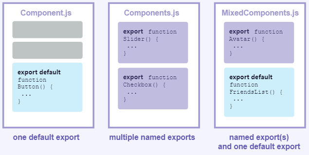

React docs

1. React components are regular JavaScript functions, but **their names must start with a capital letter** or they won't work!

2. If your markup isn't all on the same line as the `return` keyword, you must wrap it in a pair of parentheses:
   Without parentheses, any code on the lines after `return` will be ignored!

3. What the browser sees
   Notice the difference in casing:

   - `<section>` is lowercase, so React knows we refer to an HTML tag.
   - `<Profile />` starts with a capital `P` , so React knows that we want to use our component called `Profile` .

4. Components can render other components, but **you must never their definitions:** 

5. When a child component needs some data from a parent, **pass it by props** instead of nesting definitions.

6. Default vs named exports
   There are two primary ways to export values with JavaScript: default exports and named exports. So far, our examples have only used default exports. But you can use one or both of them in the same file. **A file can have no more than one default export, but it can have as many named exports as you like.**
   
   How you export your component dictates how you must import it. You will get an error if you try to import a default export the same way you would a named export! This chart can help you keep track:

   | Syntax  | Export statement                    | Import statement                    |
   | ------- | ----------------------------------- | ----------------------------------- |
   | Default | export default function Button() {} | import Button from './Button.js';   |
   | named   | export function Button() {}         | import {Button} from './Button.js'; |

   When you write a *default* import, you can put any name you want after `import` . For example, you could write `import Banana from './Button.js'` instead and it would still provide you with the same default export. In contrast, with named imports, the name has to match on both sides. That's why they are called *named* imports!

7. The Rules of JSX

   - Return a single root element
     To return multiple elements from a component, **wrap them with a single parent tag.** 
   - Close all the tags
     JSX requires tags to be explicitly closed: self-closing tags like `` must become `` , and wrapping tags like `<li>oranges` must be written as `<li>oranges</li>` .
   - camelCase ~~all~~ most of the things!
     JSX turns into JavaScript and attributes written in JSX become keys of JavaScript objects. In your own components, you will often want to read those attributes into varriables. But JavaScript has limitations on variable names. For example, their names can't contain dashes or be reserved words like `class` .
     This is why, in React, many HTML and SVG attributes are written in camelCase. For example, instead of `stroke-width` you use `strokeWidth` . Since `class` is a reserved word, in React you write `className` instead, named after the corresponding DOM property:

8. Passing strings with quotes

   - When you want to pass a string attribute to JSX, you put it in single or double quotes:
   - Using curly brances: A window into the JavaScript world
     - JSX is a special way of writing JavaScript. That means it's possible to use JavaScript inside it -- with curly braces `{}` .
   - Where to use curly brances
     - **As text** directly inside a JSX tag: `<h1>{name}'s To Do List</h1>` works, but `<{tag}>Gregorio Y. Zara's To Do List</tag>` will not.
     - **As attributes** immediately following the `=` sign: `src={avatar}` will read the `avatar` variable, but `src="{avatar}"` will pass the string `{avatar}`.

9. Passing props to a component

   - Step 1: Pass props to the child component

     - First, pass some props to `Avatar`. For example, let's pass two props: `person` (an object), and `size` (a number):

       ```
       export default function Profile() {
         return (
           <Avatar
             person={{ name: 'Lin Lanying', imageId: '1bX5QH6' }}
             size={100}
           />
         );
       }
       ```

   - Step 2: Read props inside the child component

     - You can read these props by listing their names `person, size` separated by the commas inside `({`and`})` directly after `function Avatar`. This lets you use them inside the `Avatar` code, like you would with a variable.

       ```
       function Avatar({ person, size }) {
         // person and size are available here
       }
       ```

   - You can think of props like "knobs" that you can adjust. They serve the same role as arguments serve for functions--in fact, props *are* the only argument to your component! React component functions accept a single argument, a `props` object:

     ```
     function Avatar(props) {
       let person = props.person;
       let size = props.size;
       // ...
     }
     ```

     Usually you don't need the whole `props` object itself, so you destructure it into individual props.

   - **Don't miss the pair of { and } curlies** inside of ( and ) when declaring props:

     ```
     function Avatar({ person, size }) {
     }
     ```

     This syntax is called "destructuring" and is equivalent to reading properties from a function parameter:

     ```
     function Avatar(props) {
     	let person = props.person;
     	let size = props.size;
     }
     ```

   - Specifying a default value for a prop

     ```
     function Avatar({ person, size = 100 }) {
     }
     ```

   - Forwarding props with the JSX spread syntax
     Sometimes, passing props get very repetitive:

     ```
     function Profile({ person, size, isSepia, thickBorder }) {
     	return (
     		<div className="card">
     			<Avatar
     				person={person}
     				size={size}
     				isSepia={isSepia}
     				thickBorder={thickBorder}
     		</div>
     	);
     }
     ```

     There's nothing wrong with repetitive code --- it can be more legible. But at times you may value conciseness. Some components forward all of their props to their children, like how this `Profile` does with `Avatar`.

     ```
     function Profile(props) {
     	return (
     		<div className="card">
     			<Avatar {...props} />
     		</div>
     	);
     }
     ```

   - Passing JSX as children
     It is common to nest built-in browser tags:

     ```
     <div>
     	
     </div>
     ```

     Sometimes you'll want to nest your own components the same way:

     ```
     <Card>
     	<Avatar />
     </Card>
     ```

     When you nest content inside a JSX tag, the parent component will receive that content in a prop called `children`.

     ```
     import Avatar from './Avatar.js'
     
     function Card({ children }) {
     	return (
     		<div className="card">
     			{children}
     		</div>
     	);
     }
     
     export default function Profile() {
     	return (
     		<Card>
     			<Avatar
     				size={100}
     				person={{
     					name: 'Katsuko Saruhashi',
     					imageId: 'YfeOqp2'
     				}}
     			/>
     		</Card>
     	);
     }
     ```

   - How props change over time
     **Don't try to "change props".** When you need to respond to the user input (like changing the selected color), you will need to "set state", which you can learn about in [State: A Component’s Memory.](https://react.dev/learn/state-a-components-memory)

10. Conditional Rendering
      Your components will often need to display different things depending on different conditions. In React, you can conditionally render JSX using JavaScript syntax like `if` statements, `&&` , and `? :` operators.

   - Conditionally returning JSX
     You can write this as `if` / `else` statement like so:

     ```
     if (isPacked) {
     	return <li className="item">{name} ✔</li>
     }
     return <li className="item">{name}</li>
     ```

   - Conditionally returning nothing with `null`
     In some situations, you won't want to render anything at all. For example, say you don't want to show packed items at all. A component must return something.

     ```
     if (isPacked) {
     	return null;
     }
     return <li className="item">{name}</li>
     ```

     In practice, returning `null` from a component isn't common because it might surprise a developer trying to render it. More often, you would conditionally include or exclude the component in the parent component's JSX.

   - Conditional (ternary) operator (`? :`)

     ```
     return (
     	<li className="item">
     		{isPacked ? name + ' ✔' : name}
     	</li>
     );
     ```

   - Logical AND operator (&&)

     ```
     return (
     	<li className="item">
     		{name} {isPacked && '✔'}
     	</li>
     );
     ```

     A [JavaScript && expression](https://developer.mozilla.org/en-US/docs/Web/JavaScript/Reference/Operators/Logical_AND) returns the value of its right side (in our case, the checkmark) if the left side (our condition) is `true` . But if the condition is `false` , the whole expression becomes `false` . React considers `false` as "hole" in the JSX tree, just like `null` or `underfined` , and doesn't render anything in its place.

11. Rendering Lists

    - You will often want to display multiple similar components from a collection of data. You can use the [JavaScript array methods](https://developer.mozilla.org/docs/Web/JavaScript/Reference/Global_Objects/Array#) to manipulate an array of data. On this page, you'll use `filter()` and `map()` with React to filter and transform your array of data into an array of components.

    - Rendering data from arrays

      1. **Move** the data into an array:

         ```
         const people = [
           'Creola Katherine Johnson: mathematician',
           'Mario José Molina-Pasquel Henríquez: chemist',
           'Mohammad Abdus Salam: physicist',
           'Percy Lavon Julian: chemist',
           'Subrahmanyan Chandrasekhar: astrophysicist'
         ];
         ```

      2. **Map** the `people` members into a new array of JSX nodes, `listItems`:

         ```
         const listItems = people.map(person => <li>{person}</li>);
         ```

      3. **Return** `listItems` from your component wrapped in a `<ul>`:

         ```
         return <ul>{listItems}</ul>;
         ```

    - Filtering arrays of items

      ```
      const chemists = people.filter(person =>
      	person.profession === 'chemist'
      );
      ```

      Arrow functions implicitly return the expression right after `=>` , so you didn't need a `return` statement:

      ```
      const listItems = chemists.map(person => 
      	<li>...</li> // Implicit return
      );
      ```

      However, **you must write `return` explicitly if your `=>` is followed by a `{` curly brace!**

      ```
      const listItems = chemists.map(person => { // Curly brace
      	return <li>...</li>;
      });
      ```

    - Keeping list items in order with key 

      You need to give each array item a `key` -- a string or a number that uniquely identifies it among other items in that array:

      ```
      <li key={person.id}>...</li>
      ```

      Rules of keys

      - **Keys must be unique among siblings.** However, it's okay to use the same keys for JSX nodes in *different* arrays.
      - **Keys must not change** or that defeats their purpose! Don't generate them while rendering.

    - Keeping Components Pure

      In computer science (and especially the world of functional programming), a pure function is a function with the following characteristics:

      - **It minds its own business.** It does not change any objects or variables that existed before it was called.
      - **Same inputs, same output.** Given the same inputs, a pure function should always return the same result.

    - Side Effects: (un)intended consequences
      React's rendering process must always be pure. Components should only *return* their JSX, and not change any objects or variables that existed before rendering--that would make them impure!
      This component is reading and writing a `guest` variable declared outside of it. This means that **calling this component multiple times will produce different JSX!** And what's more, if other components read `guest`, they will produce different JSX, too, depending on when they were rendered! That's not predictable.

12. Adding Interactivity

    - Responding to events
      React lets you add *event handlers* to your JSX. Event handlers are your own functions that will be triggered in response to user interactions like clicking, hovering, focusing on form inputs, and so on.

    - State: a component's memory
      Components often need to change what's on the screen as a result of an interaction. Typing into the form should update the input field, clicking "next" on an image carousel should change which image is displayed, clicking "buy" puts a product in the shopping cart. Components need to "remember" things: the current input value, the current image, the shopping cart. In React, this kind of component-specific memory is called state.
      You can add state to a component with a `useState` Hook. *Hooks* are special functions that let your components use React features (state is one of those features). The `useState` Hook lets you declare a state variable. It takes the initial state and returns a pair of values: the current state, and a state setter function that lets you update it.

      ```
      const [index, setIndex] = useState(0);
      const [showMore, setShowMore] = useState(false);
      ```

    - Render and commit

      1. **Triggering** a render (delivering the diner's order to the kitchen)
      2. **Rendering** the component (preparing the order in the kitchen)
      3. **Committing** to the DOM (placing the order on the table)

    - State as a snapshot
      Unlike regular JavaScript variables, React state behaves more like a snapshot. Setting it does not change the state variable you already have, but instead triggers a re-render. This can be surprising at first!

      ```
      console.log(count);  // 0
      setCount(count + 1); // Request a re-render with 1
      console.log(count);  // Still 0!
      ```

    - Queueing a series of state updates

      ```
      import { useState } from 'react';
      
      export default function Counter() {
        const [score, setScore] = useState(0);
      
        function increment() {
          setScore(score + 1);
        }
      
        return (
          <>
            <button onClick={() => increment()}>+1</button>
            <button onClick={() => {
              increment();
              increment();
              increment();
            }}>+3</button>
            <h1>Score: {score}</h1>
          </>
        )
      }
      ```

      State as a Snapshot explains why this is happening. Setting state requests a new re-render, but does not change it in the already running code. So `score` continues to be `0` right after you call `setScore(score + 1)`. 

    - Updating objects in state
      State can hold any kind of JavaScript value, including objects. But you shouldn't change objects and arrays that you hold in the React state directly. Instead, when you want to update an object and array , you need to create a new one (or make a copy of an existing one), and then update the state to use that copy.
      Usually, you will use the `...` spread syntax to copy objects and arrays that you want to change.

      ```
      import { useState } from 'react';
      
      export default function Form() {
        const [person, setPerson] = useState({
          name: 'Niki de Saint Phalle',
          artwork: {
            title: 'Blue Nana',
            city: 'Hamburg',
            image: 'https://i.imgur.com/Sd1AgUOm.jpg',
          }
        });
      
        function handleNameChange(e) {
          setPerson({
            ...person,
            name: e.target.value
          });
        }
        // ...省略
      }
      ```

      If copying objects in code gets tedious, you can use a library like  [Immer](https://github.com/immerjs/use-immer) to reduce repetitive code:

      ```
      import { useImmer } from 'use-immer';
      
      export default function Form() {
        const [person, updatePerson] = useImmer({
          name: 'Niki de Saint Phalle',
          artwork: {
            title: 'Blue Nana',
            city: 'Hamburg',
            image: 'https://i.imgur.com/Sd1AgUOm.jpg',
          }
        });
      
        function handleNameChange(e) {
          updatePerson(draft => {
            draft.name = e.target.value;
          });
        }
      // ...省略
      }
      ```

    - Updating arrays in state
      Arrays are another type of mutable JavaScript objects you can store in state and should treat as read-only. Just like with objects, when you want to update an array stored in state, you need to create a new one (or make a copy of an existing one), and then set state to use the new array:

      ```
      import { useState } from 'react';
      
      let nextId = 3;
      const initialList = [
        { id: 0, title: 'Big Bellies', seen: false },
        { id: 1, title: 'Lunar Landscape', seen: false },
        { id: 2, title: 'Terracotta Army', seen: true },
      ];
      
      export default function BucketList() {
        const [list, setList] = useState(
          initialList
        );
      
        function handleToggle(artworkId, nextSeen) {
          setList(list.map(artwork => {
            if (artwork.id === artworkId) {
              return { ...artwork, seen: nextSeen };
            } else {
              return artwork;
            }
          }));
        }
        // 省略
      }
      ```

      If copying arrays in code gets tedious, you can use a library like [Immer](https://github.com/immerjs/use-immer) to reduce repetitive code:

      ```
      import { useState } from 'react';
      import { useImmer } from 'use-immer';
      
      let nextId = 3;
      const initialList = [
        { id: 0, title: 'Big Bellies', seen: false },
        { id: 1, title: 'Lunar Landscape', seen: false },
        { id: 2, title: 'Terracotta Army', seen: true },
      ];
      
      export default function BucketList() {
        const [list, updateList] = useImmer(initialList);
      
        function handleToggle(artworkId, nextSeen) {
          updateList(draft => {
            const artwork = draft.find(a =>
              a.id === artworkId
            );
            artwork.seen = nextSeen;
          });
        }
      // 省略
      }
      ```

    - Preventing default behavior
      Some browser events have default behavior associated with them. For example, a `<form>` submit event, which happens when a button inside of it is clicked, will reload the whole page by default:

      ```
      e.preventDefault();
      ```

    - State: A Component's Memory
    
      When a regular variable isn't enough
    
      1. **Local variables don't persist between renders.** When React renders this component a second time, it renders it from scratch -- it doesn't consider any changes to the local variables.
      2. **Changes to local variables won't trigger renders.** React doesn't realize it needs to render the component again with the new data.
    
      To update a component with new data, two things need to happen:
    
      1. **Retain** the data between renders.
      2. **Trigger** React to render the component with new data (re-rendering).
    
      The `useState` Hook provides those two things:
    
      1. A **state variable** to retain the data between renders.
      2. A **state setter function** to update the variable and trigger React to render the component again.
    
      **Hooks--functions starting with `use` -- can only be called at the top level of your components or your own Hooks.** You can't call Hooks inside conditions, loops, or other nested functions. Hooks are functions, but it's helpful to think of them as unconditional declarations about your component's needs. You "use" React features at the top of your component similar to how you "import" modules at the top of your file.
    
    - State is isolated and private
      State is local to a component instance on the screen. In other words, **if you render the same component twice, each copy will have completely isolated state!** Changing one of them will not affect the other.
    
    - Render and Commit
      Step 1: Trigger a render
    
      1. It's the component's **initial render.**
      2. The component's (or one of its ancestors') **state has been updated**
    
      Initial render
      When your app starts, you need to trigger the initial render. Frameworks and sandboxes somethings hide this code, this it's done by calling `createRoot` with the target DOM node, and then calling its `render` method with your component
    
    - Re-renders when state updates
    
      Once the component has been initially rendered, you can trigger further renders by updating its state with the `set` function. Updating your component's state automatically queues a render.
      Step 2: React renders your components
    
      - **On initial render,** React will call the root component.
      - **For subsequent renders,** React will call the function component whose state update triggered the render.
      - **During the initial render,** React will create the DOM nodes for `<section>` , `<h1>` , and three `` tags.
      - **During a re-render,** React will calculate which of their properties, if any , have changed since the previous render. It won't do anything with that information until the next step, the commit phase.
    
      Rendering must always be a pure calculation
    
      - **Same inputs, same output.** Given the same inputs, a component should always return the same JSX.
      - **It minds its own business.** It should not change any objects or variables that existed before rendering.
    
      Step 3: React commits changes to the DOM
    
      - **For the initial render,** React will use the `appendChild()` DOM API to put all the DOM nodes it has created on screen.
      - **For re-renders,** React will apply the minimal necessary operations (calculated while rendering!) to make the DOM match the latest rendering output.
    
      **React only changes the DOM nodes if there's a difference between renders.**
    
    - State as a Snapshot
      