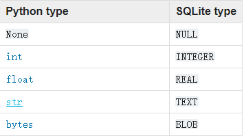

# Sqlite

Call `sqlite3.connet()` to create a connection to the database `tutorial.db` in the current working directory, implicitly creating it if it does not exist:

```
import sqlite3
con = sqlite3.connect("tutorial.db")
```

 The returned `Connection` object `con` represents the connection to the on-disk database.

In order to execute SQL statements and fetch results from SQL queries, we will need to use a database cursor. Call con.cursor() to create the `Cursor`:

```
cur = con.cursor()
```

we've got a database connection and a cursor, we can create a database table `movie` with columns for title, release year, and review score.

```
cur.execute("CREATE TABLE movie(title, year, score)")
```

Execute that query by calling `cur.execute(...)`, assign the result to `res`, and call `res.fetchone()` to fetch the resulting row:

```
res = cur.execute("SELECT name FROM sqlite_master")
res.fetchone()
```

Now, add two rows of data supplied as SQL literals by executing an `INSERT` statement, once again by calling `cur.execute(...)`:

```
cur.execute("""
	INSERT INTO movie VALUES
		('Monty Python and the Holy Grail', 1975, 8.2),
		('And Now for Something Completely Different', 1975, 7.5)
""")
```

The `INSERT` statement implicitly opens a transaction, which needs to be committed before changes are saved in the database. Call `con.commit()` on the connection object to commit the transaction:

```
con.commit()
```

We can verify that the data was inserted correctly by executing a `SELECT` query. Use the now-familiar `cur.execute(...)` to assign the result to `res`, and call `res.fetchall()` to return all resulting rows:

```
res = cur.execute("SELECT score FROM movie")
res.fetchall()
// [(8.2,), (7.5,)]
```

The result is a list of two tuples, one per row, each containing that row's `score` value.

Now, insert three more rows by calling `cur.executemany(...)`

```
data = [
	("Monty Python Live at the Hollywood Bowl", 1982, 7.9),
	("Monty Python's The Meaning of Life", 1983, 7.5),
	("Monty Python's Life of Brian", 1979, 8.0),
]
cur.executemany("INSERT INTO movie VALUES(?, ?, ?)", data)
con.commit() 	# Remember to commit the transaction after executing INSERT.
```

We can verify that the new rows were inserted by executing a `SELECT` query, this time iterating over the results of the query:

```
for row in cur.execute("SELECT year, title FROM movie ORDER BY year"):
	print(row)
// (1971, 'And Now for Something Completely Different')
// (1975, 'Monty Python and the Holy Grail')
// (1979, "Monty Python's Life of Brian")
// (1982, 'Monty Python Live at the Hollywood Bowl')
// (1983, "Monty Python's The Meaning of Life")
```

## SQLite and Python types

SQLite natively supports the following types: `NULL`, `INTEGER`, `REAL`, `TEXT`, `BLOB`.

