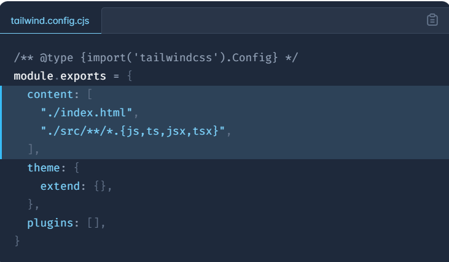
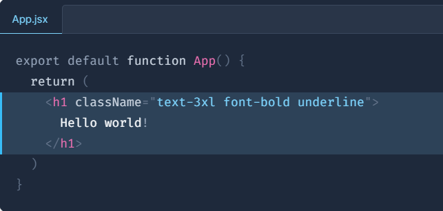

# Tailwind CSS Tutorial

[TOC]

## Install Tailwind CSS

install Tailwind CSS with `Vite`

1. Create your project

   ```
   npm create vite@latest my-project -- --template react
   cd my-project
   ```

2. Install Tailwind CSS
   Install `tailwindcss` and its peer dependencies via `npm`, and then run the `init` command to generate both `tailwind.config.cjs` and `postcss.config.cjs`.

   ```
   npm install -D tailwindcss postcss autoprefixer
   npx tailwindcss init -p
   ```

3. Configure your template paths
   Add the paths to all of your template files in your `tailwind.config.cjs` file.

   

4. Add the Tailwind directives to your CSS

   Add the `@tailwind` directives for each of Tailwind’s layers to your `./src/index.css` file.

   ```
   index.css
   
   @tailwind base;
   @tailwind components;
   @tailwind utilities;
   ```

5. Start your build process

   Run your build process with `npm run dev`

   ```
   npm run dev
   ```

6. Start using Tailwind in your project

   Start using Tailwind's utility classes to style your content.

   

## Editor Setup

`vscode` plugin 

1. Autocomplete; Linting; Hover Previews; Syntax Highlighting [Tailwind CSS IntelliSense](https://marketplace.visualstudio.com/items?itemName=bradlc.vscode-tailwindcss)

2. Automatic class sorting with Prettier 

   - Installation

     To get started, just install `prettier-plugin-tailwindcss` as a dev-dependency:

     ```
     npm install -D prettier prettier-plugin-tailwindcss
     ```

     *Note that plugin autoloading is not supported when using certain package managers, such as `pnpm` or Yarn PnP. In this case you may need to add the plugin to your Prettier config explicitly:* 使用某些包管理器没有作用时，添加配置文件

     ```
     // prettier.config.js
     module.exports = {
       plugins: [require('prettier-plugin-tailwindcss')],
     }
     ```

   - Resolving your Tailwind configuration

     To ensure that the class sorting is taking into consideration any of your project's Tailwind customizations, it needs access to your [Tailwind configuration file](https://tailwindcss.com/docs/configuration) (`tailwind.config.js`).

     ```
     // prettier.config.js
     module.exports = {
       tailwindConfig: './styles/tailwind.config.js',
     }
     ```

## Core Concepts

### Handling Hover, Focus, and Other States

Tailwind includes modifiers for just about everything you'll ever need, including:

- Pseudo-classes(伪类), like `:hover`, `:focus`, `:first-child`, and `:required`
- Pseudo-elements(伪元素), like `::before`, `::after`, `::placeholder`, and `::selection`
- Media queries, like responsive breakpoints, dark mode, and `prefers-reduced-motion`
- Attribute selectors, like `[dir="rtl"]` and `[open]`

### Pseudo-classes

#### Hover, focus, and active (伪类)

Style elements on hover, focus, and active using the `hover` , `focus` , and `active` modifiers:

```
<button class="bg-violet-500 hover:bg-violet-600 active:bg-violet-700 focus:outline-none focus:ring focus:ring-violet-300 ...">
  Save changes
</button>
```

#### First, last, odd, and even

Style an element when it is the first-child or last-child using the `first` and `last` modifiers:

```
<ul role="list" class="p-6 divide-y divide-slate-200">
  {#each people as person}
    <!-- Remove top/bottom padding when first/last child -->
    <li class="flex py-4 first:pt-0 last:pb-0">
      
      <div class="ml-3 overflow-hidden">
        <p class="text-sm font-medium text-slate-900">{person.name}</p>
        <p class="text-sm text-slate-500 truncate">{person.email}</p>
      </div>
    </li>
  {/each}
</ul>
```

You can also style an element when it's on odd or even child using the `odd` and `even` modifiers:

```
<table>
  <!-- ... -->
  <tbody>
    {#each people as person}
      <!-- Use a white background for odd rows, and slate-50 for even rows -->
      <tr class="odd:bg-white even:bg-slate-50">
        <td>{person.name}</td>
        <td>{person.title}</td>
        <td>{person.email}</td>
      </tr>
    {/each}
  </tbody>
</table>
```

#### Form states

Style form elements in different states using modifiers like `required` , `invalid` , and `disabled` :

```
<table>
  <!-- ... -->
  <tbody>
    {#each people as person}
      <!-- Use a white background for odd rows, and slate-50 for even rows -->
      <tr class="odd:bg-white even:bg-slate-50">
        <td>{person.name}</td>
        <td>{person.title}</td>
        <td>{person.email}</td>
      </tr>
    {/each}
  </tbody>
</table>
```

#### Styling based on parent state (group-{modifier})

When you need to style an element based on the state of some parent element, mark the parent with the `group` class, and use `group-*` modifiers like `group-hover` to style the target element:

```
<a href="#" class="group block max-w-xs mx-auto rounded-lg p-6 bg-white ring-1 ring-slate-900/5 shadow-lg space-y-3 hover:bg-sky-500 hover:ring-sky-500">
  <div class="flex items-center space-x-3">
    <svg class="h-6 w-6 stroke-sky-500 group-hover:stroke-white" fill="none" viewBox="0 0 24 24"><!-- ... --></svg>
    <h3 class="text-slate-900 group-hover:text-white text-sm font-semibold">New project</h3>
  </div>
  <p class="text-slate-500 group-hover:text-white text-sm">Create a new project from a variety of starting templates.</p>
</a>
```

#### Differentiating nested groups(区分嵌套组)

When nesting groups, you can style something based on the state of a specific parent group by giving that parent a unique group name using a `group/{name}` class, and including that name in modifiers using classes like `group-hover/{name}` :

```
<ul role="list">
  {#each people as person}
    <li class="group/item hover:bg-slate-100 ...">
      
      <div>
        <a href="{person.url}">{person.name}</a>
        <p>{person.title}</p>
      </div>
      <a class="group/edit invisible hover:bg-slate-200 group-hover/item:visible ..." href="tel:{person.phone}">
        <span class="group-hover/edit:text-gray-700 ...">Call</span>
        <svg class="group-hover/edit:translate-x-0.5 group-hover/edit:text-slate-500 ...">
          <!-- ... -->
        </svg>
      </a>
    </li>
  {/each}
</ul>
```

#### Arbitrary groups(任意组)

You can create one-off `group-*` modifiers on the fly by providing your own selector as an arbitrary value between square brackets:

```
<div class="group is-published">
  <div class="hidden group-[.is-published]:block">
    Published
  </div>
</div>
```

#### Styling based on sibling(兄弟) state (peer-{modifier}) 

When you need to style an element based on the state of a sibling element, mark the sibling with the `peer` class, and use `peer-*` modifiers like `peer-invalid` to style the target element:

```
<form>
  <label class="block">
    <span class="block text-sm font-medium text-slate-700">Email</span>
    <input type="email" class="peer ..."/>
    <p class="mt-2 invisible peer-invalid:visible text-pink-600 text-sm">
      Please provide a valid email address.
    </p>
  </label>
</form>
```

#### Differentiating peers

When using multiple peers, you can style something on the state of a specific peer by giving that peer a unique name using a `peer/{name}` class, and including that name in modifiers using classes like `peer-checked/{name}` :

```
<fieldset>
  <legend>Published status</legend>

  <input id="draft" class="peer/draft" type="radio" name="status" checked />
  <label for="draft" class="peer-checked/draft:text-sky-500">Draft</label>

  <input id="published" class="peer/published" type="radio" name="status" />
  <label for="published" class="peer-checked/published:text-sky-500">Published</label>

  <div class="hidden peer-checked/draft:block">Drafts are only visible to administrators.</div>
  <div class="hidden peer-checked/published:block">Your post will be publicly visible on your site.</div>
</fieldset>
```

#### Arbitrary peers

You can create one-off `peer-*` modifiers on the fly by providing your own selector as an arbitrary value between square brackets:

```
<form>
  <label for="email">Email:</label>
  <input id="email" name="email" type="email" class="is-dirty peer" required />
  <div class="peer-[.is-dirty]:peer-required:block hidden">This field is required.</div>
  <!-- ... -->
</form>
```

### Pseudo-elements

#### Before and after

Style the `::before` and `::after` pseudo-elements using the `before` and `after` modifiers:

```
<label class="block">
  <span class="after:content-['*'] after:ml-0.5 after:text-red-500 block text-sm font-medium text-slate-700">
    Email
  </span>
  <input type="email" name="email" class="mt-1 px-3 py-2 bg-white border shadow-sm border-slate-300 placeholder-slate-400 focus:outline-none focus:border-sky-500 focus:ring-sky-500 block w-full rounded-md sm:text-sm focus:ring-1" placeholder="you@example.com" />
</label>
```

When using these modifiers, Tailwind will automatically add `content: ''` by default so you don't have to specify it unless you want a different value:

```
<blockquote class="text-2xl font-semibold italic text-center text-slate-900">
  When you look
  <span class="before:block before:absolute before:-inset-1 before:-skew-y-3 before:bg-pink-500 relative inline-block">
    <span class="relative text-white">annoyed</span>
  </span>
  all the time, people think that you're busy.
</blockquote>
```

#### Placeholder text

Style the placeholder text of any input or `textarea` using the `placeholder` modifier:

```
<label class="relative block">
  <span class="sr-only">Search</span>
  <span class="absolute inset-y-0 left-0 flex items-center pl-2">
    <svg class="h-5 w-5 fill-slate-300" viewBox="0 0 20 20"><!-- ... --></svg>
  </span>
  <input class="placeholder:italic placeholder:text-slate-400 block bg-white w-full border border-slate-300 rounded-md py-2 pl-9 pr-3 shadow-sm focus:outline-none focus:border-sky-500 focus:ring-sky-500 focus:ring-1 sm:text-sm" placeholder="Search for anything..." type="text" name="search"/>
</label>
```

#### File input buttons

Style the button in file inputs using the `file` modifier:

```
<form class="flex items-center space-x-6">
  <div class="shrink-0">
    
  </div>
  <label class="block">
    <span class="sr-only">Choose profile photo</span>
    <input type="file" class="block w-full text-sm text-slate-500
      file:mr-4 file:py-2 file:px-4
      file:rounded-full file:border-0
      file:text-sm file:font-semibold
      file:bg-violet-50 file:text-violet-700
      hover:file:bg-violet-100
    "/>
  </label>
</form>
```

#### List markers

Style the counters or bullets in lists using the `marker` modifier:

```
<ul role="list" class="marker:text-sky-400 list-disc pl-5 space-y-3 text-slate-500">
  <li>5 cups chopped Porcini mushrooms</li>
  <li>1/2 cup of olive oil</li>
  <li>3lb of celery</li>
</ul>
```

#### Highlighted text

Style the active text selection using the `selection` modifier:

```
<div class="selection:bg-fuchsia-300 selection:text-fuchsia-900">
  <p>
    So I started to walk into the water. I won't lie to you boys, I was
    terrified. But I pressed on, and as I made my way past the breakers
    a strange calm came over me. I don't know if it was divine intervention
    or the kinship of all living things but I tell you Jerry at that moment,
    I <em>was</em> a marine biologist.
  </p>
</div>
```

#### First-line and first-letter

Style the first line in a block of content using the `first-line` modifier, and the first letter using the `first-letter` modifier:

```
<p class="first-line:uppercase first-line:tracking-widest
  first-letter:text-7xl first-letter:font-bold first-letter:text-slate-900
  first-letter:mr-3 first-letter:float-left
">
  Well, let me tell you something, funny boy. Y'know that little stamp, the one
  that says "New York Public Library"? Well that may not mean anything to you,
  but that means a lot to me. One whole hell of a lot.
</p>
```

#### Dialog backdrops

Style the backdrop of a native `<dialog>` element using the `backdrop` modifier:

```
<dialog class="backdrop:bg-gray-50">
  <form method="dialog">
    <!-- ... -->
  </form>
</dialog>
```

### Media and feature queries

#### Responsive breakpoints

To style an element at a specific breakpoint, use responsive modifiers like `md` and `lg` .

For example, this will render a 3-column grid on mobile, a 4-column grid on medium-width screens, and a 6-column grid on large-width screens:

```
<div class="grid grid-cols-3 md:grid-cols-4 lg:grid-cols-6">
  <!-- ... -->
</div>
```

#### Prefers color scheme

The `prefers-color-scheme` media query tells you whether the user prefers a light theme or dark theme, and is usually configured at the operating system level.

Use utilities with no modifier to target light mode, and use the `dark` modifier to provide overrides for dark mode:

```
<div class="bg-white dark:bg-slate-900 rounded-lg px-6 py-8 ring-1 ring-slate-900/5 shadow-xl">
  <div>
    <span class="inline-flex items-center justify-center p-2 bg-indigo-500 rounded-md shadow-lg">
      <svg class="h-6 w-6 text-white" xmlns="http://www.w3.org/2000/svg" fill="none" viewBox="0 0 24 24" stroke="currentColor" aria-hidden="true"><!-- ... --></svg>
    </span>
  </div>
  <h3 class="text-slate-900 dark:text-white mt-5 text-base font-medium tracking-tight">Writes Upside-Down</h3>
  <p class="text-slate-500 dark:text-slate-400 mt-2 text-sm">
    The Zero Gravity Pen can be used to write in any orientation, including upside-down. It even works in outer space.
  </p>
</div>
```

#### Prefers reduced motion

The `prefers-reduced-motion` media query tells you if the user has requested that you minimize non-essential motion.

Use the `motion-reduce` modifier to conditionally add styles when the user has requested reduced motion:

```
<button type="button" class="bg-indigo-500 ..." disabled>
  <svg class="motion-reduce:hidden animate-spin ..." viewBox="0 0 24 24"><!-- ... --></svg>
  Processing...
</button>
```

Tailwind also includes a `motion-safe` modifier that only adds styles when the user has not requested reduced motion. This can be useful when using the `motion-reduce` helper would mean having to "undo" a lot of styles:

```
<!-- Using `motion-reduce` can mean lots of "undoing" styles -->
<button class="hover:-translate-y-0.5 transition motion-reduce:hover:translate-y-0 motion-reduce:transition-none ...">
  Save changes
</button>

<!-- Using `motion-safe` is less code in these situations -->
<button class="motion-safe:hover:-translate-x-0.5 motion-safe:transition ...">
  Save changes
</button>
```

#### Prefers contrast

The `prefers-contrast` media query tells you if the user has requested more or less contrast.

Use the `contrast-more` modifier to conditionally add styles when the user has requested more contrast:

```
<form>
  <label class="block">
    <span class="block text-sm font-medium text-slate-700">Social Security Number</span>
    <input class="border-slate-200 placeholder-slate-400 contrast-more:border-slate-400 contrast-more:placeholder-slate-500"/>
    <p class="mt-2 opacity-10 contrast-more:opacity-100 text-slate-600 text-sm">
      We need this to steal your identity.
    </p>
  </label>
</form>
```

#### Viewport orientation

Use the `portrait` and `landscape` modifiers to conditionally add styles when the viewport is in a specific orientation:

```
<div>
  <div class="portrait:hidden">
    <!-- ... -->
  </div>
  <div class="landscape:hidden">
    <p>
      This experience is designed to be viewed in landscape. Please rotate your
      device to view the site.
    </p>
  </div>
</div>
```

#### Print styles

Use the `print` modifier to conditionally add styles that only apply when the document is being printed:

```
<div>
  <article class="print:hidden">
    <h1>My Secret Pizza Recipe</h1>
    <p>This recipe is a secret, and must not be shared with anyone</p>
    <!-- ... -->
  </article>
  <div class="hidden print:block">
    Are you seriously trying to print this? It's secret!
  </div>
</div>
```

### Attribute selectors

#### ARIA states

Use the `aria-*` modifier to conditionally style things based on ARIA attributes.

For example, to apply the `bg-sky-700` class when the `aria-checked` attribute is set to `true` , use the `aria-checked:bg-sky-700` class:

```
<div aria-checked="true" class="bg-gray-600 aria-checked:bg-sky-700">
  <!-- ... -->
</div>
```

#### Data attributes

Use the `data-*` modifier to conditionally apply styles based on data attributes.

Since there are no standard `data-*` attributes by definition, by default we only support arbitrary values out of the box, for example:

```
<!-- Will apply -->
<div data-size="large" class="data-[size=large]:p-8">
  <!-- ... -->
</div>

<!-- Will not apply -->
<div data-size="medium" class="data-[size=large]:p-8">
  <!-- ... -->
</div>
```

### Pseudo-class reference

#### hover (:hover)

Style an element when the user hovers over it with the mouse cursor using the `hover` modifier:

```
<div class="bg-black hover:bg-white ...">
  <!-- ... -->
</div>
```

#### focus (:focus)

Style an element when it has focus the `focus` modifier:

```
<input class="border-gray-300 focus:border-blue-400 ..." />
```

#### focus-within (:focus-within)

Style an element when it or one of its descendants has focus using the `focus-within` modifier:

```
<div class="focus-within:shadow-lg ...">
  <input type="text" />
</div>
```

#### focus-visible (:focus-visible)

Style an element when it has been focused using the keyboard using the `focus-visible` modifier:

```
<button class="focus:outline-none focus-visible:ring ...">
  Submit
</button>
```

#### active (:active)

Style an element when it is being pressed using the `active` modifier:

```
<button class="bg-blue-500 active:bg-blue-600 ...">
  Submit
</button>
```

#### Visited (:visited)

Style a link when it has already been visited using the `visited` modifier:

```
<a href="https://seinfeldquotes.com" class="text-blue-600 visited:text-purple-600 ...">
  Inspiration
</a>
```

#### target (:target)

Style an element if its ID matches the current URL fragment using the `target` modifier:

```
<div id="about" class="target:shadow-lg ...">
  <!-- ... -->
</div>
```

#### first (:first-child)

Style an element if it's the first child using the `first` modifier:

```
<ul>
  {#each people as person}
    <li class="py-4 first:pt-0 ...">
      <!-- ... -->
    </li>
  {/each}
</ul>
```

#### last (:last-child)

Style an element if it's the last child using the `last` modifier:

```
<ul>
  {#each people as person}
    <li class="py-4 last:pb-0 ...">
      <!-- ... -->
    </li>
  {/each}
</ul>
```

#### only (:only-child)

Style an element if it's the only child using the `only` modifier:

```
<ul>
  {#each people as person}
    <li class="py-4 only:py-0 ...">
      <!-- ... -->
    </li>
  {/each}
</ul>
```

#### odd (:nth-child(odd))

Style an element if it's an oddly numbered child using the `odd` modifier:

```
<table>
  {#each people as person}
    <tr class="bg-white odd:bg-gray-100 ...">
      <!-- ... -->
    </tr>
  {/each}
</table>
```

#### even (:nth-child(even))

Style an element if it's an evenly numbered child using the `even` modifier:

```
<table>
  {#each people as person}
    <tr class="bg-white even:bg-gray-100 ...">
      <!-- ... -->
    </tr>
  {/each}
</table>
```

#### first-of-type (:first-of-type)

Style an element if it's the first child of its type using the `first-of-type` modifier:

```
<nav>
  
  {#each links as link}
    <a href="#" class="ml-2 first-of-type:ml-6 ...">
      <!-- ... -->
    </a>
  {/each}
</table>
```

#### last-of-type (:last-of-type)

Style an element if it's the last child of its type using the `last-of-type` modifier:

```
<nav>
  
  {#each links as link}
    <a href="#" class="mr-2 last-of-type:mr-6 ...">
      <!-- ... -->
    </a>
  {/each}
  <button>More</button>
</table>
```

#### only-of-type (:only-of-type)

Style an element if it's the only child of its type using the `only-of-type` modifier:

```
<nav>
  
  {#each links as link}
    <a href="#" class="mx-2 only-of-type:mx-6 ...">
      <!-- ... -->
    </a>
  {/each}
  <button>More</button>
</table>
```

#### empty (:empty)

Style an element if it has no content using the `empty` modifier:

```
<ul>
  {#each people as person}
    <li class="empty:hidden ...">{person.hobby}</li>
  {/each}
</ul>
```

#### disabled (:disabled)

Style an input when it's disabled using the `disabled` modifier:

```
<input class="disabled:opacity-75 ..." />
```

#### enabled (:enabled)

Style an input when it's enabled using the `enabled` modifier, most helpful when you only want to apply another style when an element is not disabled:

```
<input class="enabled:hover:border-gray-400 disabled:opacity-75 ..." />
```

#### checked (:checked)

Style a checkbox or radio button when it’s checked using the `checked` modifier:

```html
<input type="checkbox" class="appearance-none checked:bg-blue-500 ..." />
```

#### indeterminate (:indeterminate)

Style a checkbox or radio button in an indeterminate state using the `indeterminate` modifier:

```html
<input type="checkbox" class="appearance-none indeterminate:bg-gray-300 ..." />
```

#### default (:default)

Style an option, checkbox or radio button that was the default value when the page initially loaded using the `default` modifier:

```html
<input type="checkbox" class="default:ring-2 ..." />
```

#### required (:required)

Style an input when it’s required using the `required` modifier:

```html
<input class="required:border-red-500 ..." />
```

#### valid (:valid)

Style an input when it’s valid using the `valid` modifier:

```html
<input class="valid:border-green-500 ..." />
```

#### invalid (:invalid)

Style an input when it’s invalid using the `invalid` modifier:

```html
<input class="invalid:border-red-500 ..." />
```

#### in-range (:in-range)

Style an input when it’s value is within a specified range limit using the `in-range` modifier:

```html
<input min="1" max="5" class="in-range:border-green-500 ..." />
```

#### out-of-range (:out-of-range)

Style an input when it’s value is outside of a specified range limit using the `out-of-range` modifier:

```html
<input min="1" max="5" class="out-of-range:border-red-500 ..." />
```

#### placeholder-shown (:placeholder-shown)

Style an input when the placeholder is shown using the `placeholder-shown` modifier:

```html
<input class="placeholder-shown:border-gray-500 ..." placeholder="you@example.com" />
```

#### autofill (:autofill)

Style an input when it has been autofilled by the browser using the `autofill` modifier:

```html
<input class="autofill:bg-yellow-200 ..." />
```

#### read-only (:read-only)

Style an input when it is read-only using the `read-only` modifier:

```html
<input class="read-only:bg-gray-100 ..." />
```


