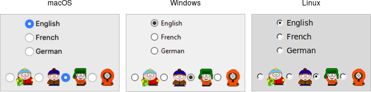

# 1Tkinter

## A First (Real) Example

```
from tkinter import *
from tkinter import ttk

def calculate(*args):
    try:
        value = float(feet.get())
        meters.set(int(0.3048 * value * 10000.0 + 0.5)/10000.0)
    except ValueError:
        pass

root = Tk()
root.title("Feet to Meters")

mainframe = ttk.Frame(root, padding="3 3 12 12")
mainframe.grid(column=0, row=0, sticky=(N, W, E, S))
root.columnconfigure(0, weight=1)
root.rowconfigure(0, weight=1)

feet = StringVar()
feet_entry = ttk.Entry(mainframe, width=7, textvariable=feet)
feet_entry.grid(column=2, row=1, sticky=(W, E))

meters = StringVar()
ttk.Label(mainframe, textvariable=meters).grid(column=2, row=2, sticky=(W, E))

ttk.Button(mainframe, text="Calculate", command=calculate).grid(column=3, row=3, sticky=W)

ttk.Label(mainframe, text="feet").grid(column=3, row=1, sticky=W)
ttk.Label(mainframe, text="is equivalent to").grid(column=1, row=2, sticky=E)
ttk.Label(mainframe, text="meters").grid(column=3, row=2, sticky=W)

for child in mainframe.winfo_children(): 
    child.grid_configure(padx=5, pady=5)

feet_entry.focus()
root.bind("<Return>", calculate)

root.mainloop()
```

## Basic Widgets

This chapter introduces the basic Tk widgets that you'll find in just about any user interface: frames, labels, buttons, checkbuttons, radiobuttons, entries, and comboboxes.

### Frame

A frame is a widget that displays as a simple rectangle. Frames help to organize your user interface, often both visually and at the coding level. Frames often act as master widgets for a geometry manager like grid, which manages the slave widgets contained within the frame.


Frames are created using the ttk.Frame class:

```
frame = ttk.Frame(parent)
```

#### Requested Size

Typically, the size of a frame is determined by the size and layout of any widgets within it. In turn, this is controlled by the geometry manager that manages the contents of the frame itself.

if, for some reason, you want an empty frame that does not contain other widgets, you can instead explicitly set its size using the width and/or height configuration options (otherwise, you'll end up with a very small frame indeed).

#### Padding

The padding configuration option is used to request extra space around the inside  of the widget. If you're putting other widgets inside the frame, there will be a margin all the way around. You can specify the same padding for all sides, different horizontal and vertical padding, or padding for each side separately.

```
f['padding'] = 5
f['padding'] = (5, 10)
f['padding'] = (5, 7, 10, 12)
```

#### Borders

You can display a border around a frame widget to visually separate it from its surroundings. You'll see this often used to make a part of the user interface look sunken or raised. To do this, you need to set the borderwidth configuration option (which defaults to 0, i.e., no border) and the `relief` option, which specifies the visual appearance of the border. This can be one of: flat (default), raised, sunken, solid, ridge, or groove.

```
frame['borderwidth'] = 2
frame['relief'] = 'sunken'
```

#### Changing Styles

Frames have a style configuration option, which is common to all of the themed widgets. This lets you control many other aspects of their appearance or behavior. This is a bit more advanced, so we won't go into it in too much detail right now. But here's a quick example of creating a "Danger" frame with a red background and a raised border.

```
s = ttk.Style()
s.configure("Danger.TFrame", background='red', borderwidth=5, relief='raised')
ttk.Frame(root, width=200, height=200, style='Danger.TFrame').grid()
```

### Lable

A label is a widget that displays text or images, typically that users will just view but not otherwise interact with. Labels are used to identify controls or other parts of the user interface, provide textual feedback or results, etc.


Labels are created using the ttk.Label class. Often, the text or image the label will display are specified via configuration options at the same time:

```
label = ttk.Label(parent, text='Full name')
```

#### Displaying Text

The text configuration option (shown above when creating the label) is the most commonly used, particularly when the label is purely decorative or explanatory. You can change what text is displayed by modifying this configuration option. This can be done at any time, not only when first creating the label.

You can also have the widget monitor a variable in your script. Anytime the variable changes, the label will display the new value of the variable. This is done with the textvariable option:

```
resultsContents = StringVar()
lable['textvariable'] = resultsContents
resultsContents.set('New value to display')
```

#### Displaying Images

Lables can also display an image instead of text. If you just want an image displayed in your user interface, this is normally the way to do it. We'll go into images in more detail in a later chapter, but for now, let's assume you want to display a GIF stored in a file on disk. This is a two-step process. First, you will create an image "object". Then you can tell the label to use that object via its image configuration option:

```
image = PhotoImage(file='myimage.gif')
lable['image'] = image
```

#### Fonts, Colors, and More

Like with frames, you normally don't want to change things like fonts and colors directly. If you need to change them, the preferred method would be to create a new style, which is then used by the widget with the style option.

### Button

A button, unlike a frame or label, is very much there to interact with. Users press a button to perform an action. Like labels, they can display text or images but accept additional options to change their behavior.


```
button = ttk.Button(parent, text='Okay', command=submitForm)
```

#### Text or Image

Buttons take the same text, textvariable(rarely used), image, and compound configuration options as labels. These control whether the button displays text and/or an image.

#### The Command Callback

The command option connects the button's action and your application. When a user presses the button, the script provided by the option is evaluated by the interpreter.

```
action = ttk.Button(root, text='Action', default='active', command=myaction)
```

#### Button State

```
b.state(['disabled'])
b.state(['!disabled'])
b.instate(['disabled'])
b.instate(['!disabled'])
b.instate(['!disabled'], cmd) // execute 'cmd' if not disabled
```

### Checkbutton


```
measureSystem = StringVar()
check = ttk.Checkbutton(parent, text='Use Metric',
		command=metricChanged, variable=measureSystem,
		onvalue='metric', offvalue='imperial')
```

#### Widget Value

```
check.instate(['alternate'])
```

```
s = StringVar(value="abc")   # default value is ''
b = BooleanVar(value=True)   # default is False
i = IntVar(value=10)         # default is 0
d = DoubleVar(value=10.5)    # default is 0.0
```

### Radiobutton



```
phone = StringVar()
home = ttk.Radiobutton(parent, text='Home', variable=phone, value='home')
office = ttk.Radiobutton(parent, text='Office', variable=phone, value='office')
cell = ttk.Radiobutton(parent, text='Mobile', variable=phone, value='cell')
```

### Entry


```
username = StringVar()
name = ttk.Entry(parent, textvariable=username)
```

#### Entry Contents

```
print('current value is %s' % name.get())
name.delete(0,'end')          # delete between two indices, 0-based
name.insert(0, 'your name')   # insert new text at a given index
```

#### Watching for Changes

Entry widgets don't have a `command` option to invoke a callback whenever the entry is changed. To watch for changes, you should watch for changes to the linked variable. See also "Validation" below.

```
def it_has_been_written(*args):
    ...
username.trace_add("write", it_has_been_written)
```

#### Passwords

Entries can be used for passwords, where the actual contents are displayed as a bullet or other symbol. To do this, set the `show` configuration option to the character you'd like to display.

```
passwd = ttk.Entry(parent, textvariable=password, show="*")
```

#### Validation

```
import re
def check_num(newval):
    return re.match('^[0-9]*$', newval) is not None and len(newval) <= 5
check_num_wrapper = (root.register(check_num), '%P')

num = StringVar()
e = ttk.Entry(root, textvariable=num, validate='key', validatecommand=check_num_wrapper)
e.grid(column=0, row=0, sticky='we')
```

### Combobox


```
countryvar = StringVar()
country = ttk.Combobox(parent, textvariable=countryvar)
```

```
country.bind('<<ComboboxSelected>>', function)
```

#### Predefined Values

You can provide a list of values that users can choose from using the `values` configuration option:

```
country['values'] = ('USA', 'Canada', 'Australia')
```

If set, the `readonly` state flag will restrict users to making choices only from the list of predefined values but not be able to enter their own (though if the current value of the combobox is not in the list, it won't be changed).

```
country.state(["readonly"])
```

