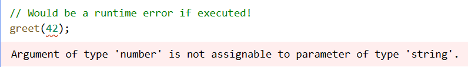
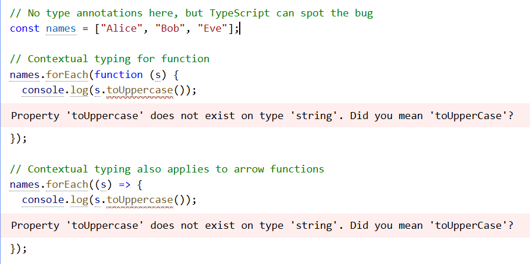
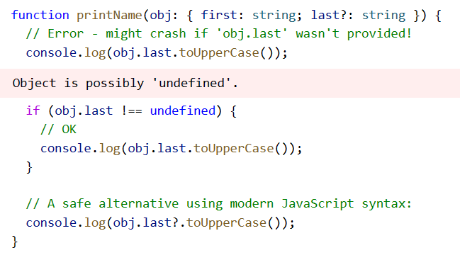
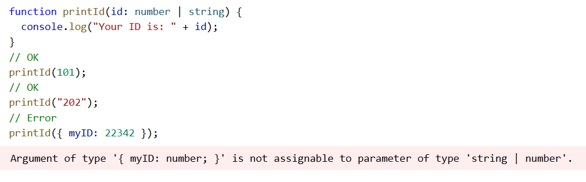
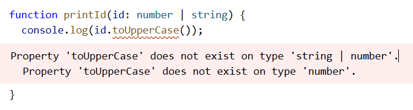
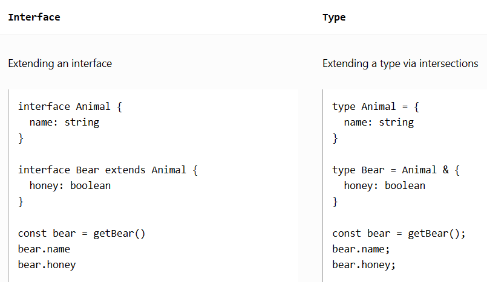
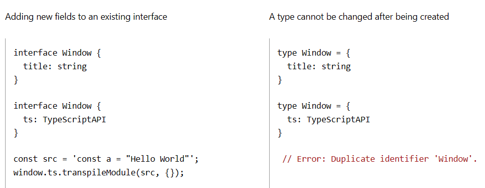

# Learn TypeScript

## Download TypeScript

### TypeScript in Your Project

via `npm`

TypeScript is available as a [package on the `npm` registry](https://www.npmjs.com/package/typescript) available as "typescript".

You will need a copy of Node.js as an environment to run the package. Then you use a dependency manager like `npm`, `yarn` or `pnpm` to download TypeScript into your project.

```
npm install typescript --save-dev
yarn add typescript --dev
```

All of these dependency managers `lockfiles`, ensuring that everyone on your team is using the same version of the language. You can then run the TypeScript compiler using one of the following commands:

```
npx tsc
yarn tsc
```

### Globally Installing TypeScript

It can be handy to have TypeScript available across all projects, often to test one-off ideas. Long-term, codebases should prefer a project-wide installation over a global install so that they can benefit from reproducible builds across different machines.

via `npm`

You can use `npm` to install TypeScript globally, this means that you can use the `tsc` command anywhere in your terminal.

To do this, run `npm install -g typescript`. This will install the latest version (currently 4.8).

An alternative is to use `npx` when you have to run `tsc` for one-off occasions.

## The Basics

`tsc`, the TypeScript compiler

```
npm install -g typescript
```

So TypeScript doesn’t get in your way. Of course, over time, you may want to be a bit more defensive against mistakes, and make TypeScript act a bit more strictly.

```
tsc --noEmitOnError hello.ts
```

## Everyday Types

### The primitives: **string**, **number**, and **`boolean`**

JavaScript has three very commonly used primitives: **string**, **number**, and **`boolean`**. Each has a corresponding type in TypeScript. As you might expect, these are the same names you’d see if you used the JavaScript **`typeof`** operator on a value of those types:

- **string** represents string values like **“Hello, world”**
- **number** is for numbers like **42**. JavaScript does not have a special runtime value for integers, so there’s no equivalent to **int** or **float** - everything is simply **number**
- **`boolean`** is for the two values **true** and **false**

### Array

To specify the type of an array like **[1, 2, 3]**, you can use the syntax **number[]**; this syntax works for any type (e.g. **string[]** is an array of strings, and so on). You may also see this written as **Array<number>**, which means the same thing. We’ll learn more about the syntax **T<U>** when we cover generics.

### any

TypeScript also has a special type, **any**, that you can use whenever you don’t want a particular value to cause `typechecking` errors.

When a value is of type **any**, you can access any properties of it (which will in turn be of type any), call it like a function, assign it to (or from) a value of any type, or pretty much anything else that’s syntactically legal:

```
let obj: any = {x: 0};
// None of the following lines of code will throw compiler errors.
// Using `any` disables all further type checking, and it is assumed 
// you know the environment better than TypeScript.
obj.foo();
obj();
obj = "hello";
const n: number = obj;
```

**`noImplicitAny`**

When you don’t specify a type, and TypeScript can’t infer it from context, the compiler will typically default to **any**.

You usually want to avoid this, though, because **any** isn’t type-checked. Use the compiler flag `noImpliciAny` to flag any implicit **any** as an error.

### Type Annotations on Variables 

When you declare a variable using **const**, **var**, or **let**, you can optionally add a type annotation to explicitly specify the type of the variable:

```
let myName: string = "Alice";
```

In most cases, though, this isn’t needed. Wherever possible, TypeScript tries to automatically infer the types in your code.

```
// No type annotation needed -- 'myName' inferred as type 'string'
let myName = "Alice";
```

### Functions

Functions are the primary means of passing data around in JavaScript. TypeScript allows you to specify the types of both the input and output values of functions.

Parameter Type Annotations

When you declare a function, you can add type annotations after each parameter to declare what types of parameters the function accepts. Parameter type annotations go after the parameter name:

```
// Parameter type annotation
function greet(name: string) {
	console.log("Hello, " + name.toUpperCase() + "!!");
}
```

When a parameter has a type annotation, arguments to that function will be checked:



Return Type Annotations

You can also add return type annotations. Return type annotations appear after the parameter list:

```
function getFavoriteNumber(): number {
	return 26;
}
```

Anonymous Functions

Anonymous functions are a little bit different from function declarations. When a function appears in a place where TypeScript can determine how it’s going to be called, the parameters of that function are automatically given types.



### Object Types

Apart from primitives, the most common sort of type you’ll encounter is an object type. This refers to any JavaScript value with properties, which is almost all of them! To define an object type, we simply list its properties and their types.

```
// The parameter's type annotation is an object type 
function printCoord(pt: {x: number; y: number}) {
	console.log("The coordinate's x value is " + pt.x);
	console.log("The coordinate's y value is " + pt.y);
}
printCoord({x: 3, y: 7});
```

Optional Properties

Object types can also specify that some or all of their properties are optional. To do this, add a ? after the property name:

```
function printName(obj: {first: string; last?: string}) {
	// ...
}
// Both OK
printName({first: "Bob"});
printName({first: "Alice", last: "Alisson"});
```

In JavaScript, if you access a property that doesn’t exist, you’ll get the value **undefined** rather than a runtime error. Because of this, when you read from an optional property, you’ll have to check for **undefined** before using it.



### Union Types

TypeScript’s type system allows you to build new types out of existing ones using a large variety of operators. Now that we know how to write a few types, it’s time to start combining them in interesting ways.

Defining a Union Type

The first way to combine types you might see is a union type. A union type is a type formed from two or more other types, representing values that may be any one of those types. We refer to each of these types as the union’s members.



Working with Union Types

It’s easy to provide a value matching a union type -simply provide a type matching any of the union’s members. If you have a value of a union type, how do you work with it?

TypeScript will only allow an operation if it is valid for every member of the union. For example, if you have the union **string | number**, you can’t use methods that are only available on **string**:



The solution is to narrow the union with code, the same as you would in JavaScript without type annotations. Narrowing occurs when TypeScript can deduce a more specific type for a value based on the structure of the code.

For example, TypeScript knows that only a **string** value will have a **`typeof`** value **“string”**:

```
function printId(id: number | string) {
	if (typeof id === "string") {
		// In this branch, id is of type 'string'
		console.log(id.toUpperCase());
	} else {
		// Here, id is of type 'number'
		console.log(id);
	}
}
```

 Another example is to use a function like **`Array.isArray`**:

```
function welcomePeople(x: string[] | string) {
	if (Array.isArray(x)) {
		// Here: 'x' is 'string[]'
		console.log("Hello, " + x.join(" and "));
	} else {
		// Here: 'x' is 'string'
		console.log("Welcome lone traveler " + x);
	}
}
```

Sometimes you’ll have a union where all the members have something in common. For example, both arrays and strings have a **slice** method. If every member in a union has a property in common, you can use that property without narrowing:

```
// Return type is inferred as number[] | string
function getFirstThree(x: number[] | string) {
	return x.slice(0, 3);
}
```

### Type Aliases

We’ve been using object types and union types by writing them directly in type annotations. This is convenient, but it’s common to want to use the same type more than once and refer to it by a single name.

```
type Point = {
	x: number;
	y: number;
};

// Exactly the same as the earlier example
function printCoord(pt: Point) {
	console.log("The coordiante's x value is " + pt.x);
	console.log("The coordiante's y value is " + pt.y);
}

printCoord({x: 100, y:100});
```

You can actually use a type alias to give a name to any type at all, not just an object type. For example, a type alias can name a union type:

```
type ID = number | string
```

Note that aliases are only aliases - you cannot use type aliases to create different/distinct “versions” of the same type. When you use the alias, it’s exactly as if you had written the aliased type. In other words, this code might look illegal, but is OK according to TypeScript because both types are aliases for the same type:

```
type UserInputSanitizedString = string;
function sanitizeInput(str: string): UserInputSanitizedString {
	return sanitize(str);
}

// Create a sanitized input
let userInput = sanitizeInput(getInput());

// Can still be re-assigned with a string though
userInput = "new input";
```

### Interfaces

An interface declaration is another way to name an object type:

```
interface Point {
	x: number;
	y: number;
}

function printCoord(pt: Point) {
	console.log("The coordinate's x value is " + pt.x);
	console.log("The coordinate's y value is " + pt.y);
}

printCoord({x: 100, y: 100});
```

### Differences Between Type Aliases and Interfaces

Type aliases and interfaces are very similar, and in many cases you can choose between them freely. Almost all features of an interface are available in type, the key distinction is that a type cannot be re-opened to add new properties vs an interface which is always extendable.





### Type Assertions

待续

### Literal Types

待续

### Function Type Expressions

The simplest way to describe a function is with a function type expression. These types are syntactically similar to arrow functions:

```
function greeter(fn: (a: string) => void) {
	fn("Hello, World");
}

function printToConsole(s: string) {
	console.log(s);
}

greeter(printToConsole);
```

Of course, we can use a type alias to name a function type:

```
type GreetFunction = (a: string) => void;
function greeter(fn: GreetFunction) {
	// ...
}
```

### Call Signatures

In JavaScript, functions can have properties in addition to being callable. However, the function type expression syntax doesn’t allow for declaring properties. If we want to describe something callable with properties, we can write a call signature in an object type:

```
type DescribableFunction = {
	description: string;
	(someArg: number): boolean;
};
function doSomething(fn: DescribableFunction) {
	console.log(fn.description + " returned " + fn(6));
}
```

### Construct Signatures

JavaScript functions can also be invoked with the **new** operator. TypeScript refers to these as constructors because they usually create a new object. You can write a construct signature by adding the **new** keyword in front of a call signature:

```
type SomeConstructor = {
	new (s: string): SomeObject;
};
function fn(ctor: SomeConstructor) {
	return new ctor("hello");
}
```

###  Generic Functions

It’s common to write a function where the types of the input relate to the type of the output, or where the types of two inputs are related in some way. Let’s consider for a moment a function that returns the first element of an array:

```
function firstElement(arr: any[]) {
	return arr[0];
}
```

By adding a type parameter Type to this function and using it in two places, we’ve created a link between the input of the function (the array) and the output (the return value). Now when we call it, a more specific type comes out:

```
// s is of type 'string'
const s = firstElement(["a", "b", "c"]);
// n is of type 'number'
const n = firstElement([1, 2, 3]);
// u is of type undefined
const u = firstElement([]);
```

### Inference

Note that we didn’t have to specify **Type** in this sample. The type was inferred - chosen automatically - by TypeScript. We can use multiple type parameters as well.

```
function map<Input, Output>(arr: Input[], func: (arg: Input) => Output): Output[] {
	return arr.map(func);
}

// Parameter 'n' is of type 'string'
// 'parsed' is of type 'number[]'
const parsed = map(["1", "2", "3"], (n) => parseInt(n));
```

 


