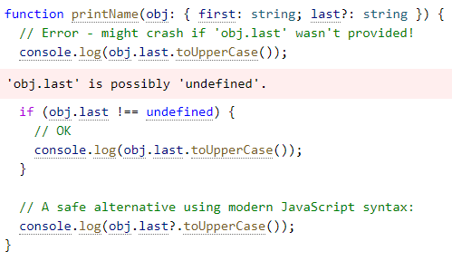
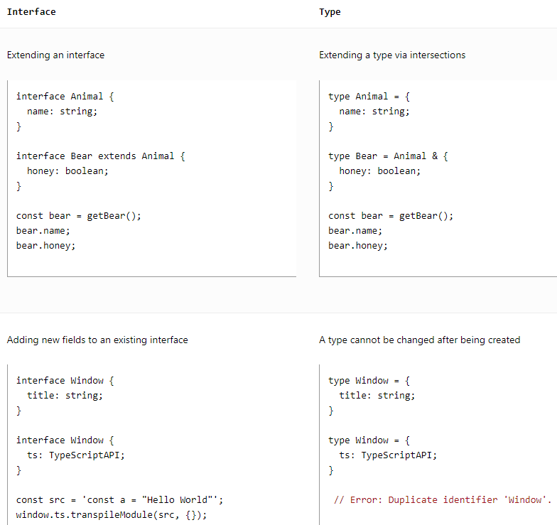
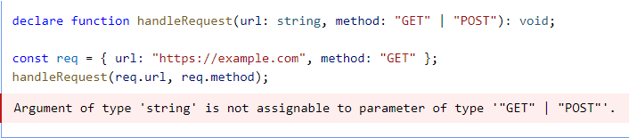
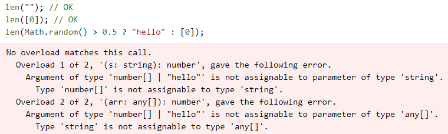

# TypeScript Handbook

1. #### Static type-checking

   we could have a tool that helps us find these bugs before our code runs. 

2. #### Non-exception Failures

   we've been discussing certain things like runtime errors - cases where the JavaScript runtime tells us that it thinks something is nonsensical.

   ```
   const user = {
     name: "Daniel",
     age: 26,
   };
   user.location; // returns undefined
   ```

3. #### Types for Tooling

   The type-checker has information to check things like whether we're accessing the right properties on variables and other properties.

4. #### `tsc`, the TypeScript compiler

   ```
   npm install -g typescript
   
   tsc hello.ts
   ```

5. #### Emitting with Errors

   ```
   tsc --noEmitOnError hello.ts
   ```

6. #### Explicit Types

   ```
   function greet(person: string, date: Date) {
   	console.log(`Hello ${person}, today is ${date.toDateString()}!`);
   }
   
   greet("Maddison", new Date());
   ```

7. #### Downleveling(改js版本, 默认es3)

   Running with `--target es2015` changes TypeScript to target ECMAScript 2015, meaning code should be able to run wherever ECMAScript 2015 is supported. command: `tsc --target es2015 hello.ts`

8. #### Strictness

   The strict flag in the CLI, or `"strict": true` in a `tsconfig.json` toggles them all on simultaneously, but we can opt out of them individually.

9. #### `noImplicitAny`

   Turning on the `noImplicitAny` flag will issue an error on any variables whose type is implicitly inferred as `any`.

10. #### `strictNullChecks`

    By default, values like `null` and `undefined` are assignable to any other type. The `strictNullChecks` flag makes handling `null` and `undefined` more explicit, and *spares* us from worring about whether we *forgot* to handle `null` and `undefined`.

11. #### The primitives: `string`, `number`, and `boolean`

    JavaScript has three very commonly used primitives: `string`, `number`, and `boolean` . Each has a corresponding type in TypeScript.

12. #### Arrays

    To specify the type of an array like `[1,2,3]`, you can use the syntax `number[]`; this syntax works for any type (e.g. `string[]` is an array of strings, and so on). You may also see this written as `Array<number>`, which means the same thing.

13. #### `any`

    TypeScript also has a special type, `any`, that you can use whenever you don't want a particular value to cause typechecking errors.

14. `noImplicitAny`

    When you don't specify a type, and TypeScript can't infer it from context, the compiler will typically default to `any`.

    You usually want to avoid this, though, because `any` isn't type-checked. Use the compiler flag `noImplicitAny` to flag any implicit `any` as an error.

15. #### Type Annotations on Variables

    When you declare a variable using `const`, `var`, or `let`, you can optionally add a type annotation to explicitly specify the type of the variable:

    ```
    let myName: string = "Alice";
    ```

    In most cases, TypeScript tries to automatically *infer* the types your code.

    ```
    // No type annotation needed -- 'myName' inferred as type 'string'
    let myName = "Alice";
    ```

16. #### Functions

    Parameter Type Annotations

    When you declare a function, you can add type annotations after each parameter to declare what types of parameters the function accepts. Parameter type annotations go after the parameter name:

    ```
    // Parameter type annotation
    function greet(name: string) {
      console.log("Hello, " + name.toUpperCase() + "!!");
    }
    ```

    Return Type Annotations

    Return type annotations appear after the parameter list:

    ```
    function getFavoriteNumber(): number {
      return 26;
    }
    ```

17. #### Functions Which Return Promises

    If you want to annotate the return type of a function which returns a promise, you should use the `Promise` type:

    ```
    async function getFavoriteNumber(): Promise<number> {
    	return 26;
    }
    ```

    Anonymous Functions

    When a function appears in a place where TypeScript can determine how it's going to be called, the parameters of that function are automatically given types.

    ```
    // Contextual typing also applies to arrow functions
    names.forEach((s) => {
      console.log(s.toUpperCase());
    });
    ```

    Even though the parameter `s` didn't have a type annotation, TypeScript used the types of the `forEach` function, along with the inferred type of the array, to determine the type `s` will have.

    This process is called *contextual* typing because the *context* that the function occurred within informs what type it should have.

18. #### Object Types

    To define an object type, we simply list its properties and their types.

    ```
    // The parameter's type annotation is an object type
    function printCoord(pt: { x: number; y: number }) {
      console.log("The coordinate's x value is " + pt.x);
      console.log("The coordinate's y value is " + pt.y);
    }
    printCoord({ x: 3, y: 7 });
    ```

    The type part of each property is also optional. If you don't specify a type, it will be assumed to be `any`.

    Optional Properties

    Object types can also specify that some or all of their properties are *optional*. To do  this , add a `?` after the property name:

    ```
    function printName:(obj: { first: string; last?: string }) {
    	// ...
    }
    // Both OK
    printName({ first: "Bob" });
    printName({ first: "Alice", last: "Alisson" });
    ```

    In JavaScript, if you access a property that doesn't exist, you'll get the value `undefined` rather than a runtime error. Because of this, when you read from an optional property, you'll have to check for `undefined` before using it.

    

19. #### Union Types

    TypeScript's type system allows you to build new types out of existing ones using a large variety of operators.

    A union type is a type formed from two or more other types, representing values that may be *any* one of those types.

    ```
    function printId(id: number | string) {
    	console.log("Your ID is: " + id);
    }
    ```

    Working with Union Types

    *Narrowing* occurs when TypeScript can deduce a more specific type for a value based on the structure of the code.

    ```
    function printId(id: number | string) {
      if (typeof id === "string") {
        // In this branch, id is of type 'string'
        console.log(id.toUpperCase());
      } else {
        // Here, id is of type 'number'
        console.log(id);
      }
    }
    ```

20. #### Type Aliases

    A *type alias* is exactly that - a *name* for any type.

    ```
    type Point = {
      x: number;
      y: number;
    };
     
    // Exactly the same as the earlier example
    function printCoord(pt: Point) {
      console.log("The coordinate's x value is " + pt.x);
      console.log("The coordinate's y value is " + pt.y);
    }
     
    printCoord({ x: 100, y: 100 });
    ```

    You can use a type alias to give a name to any type at all.

    ```
    type ID = number | string;
    ```

21. #### Interfaces

    An *interface declaration* is another way to name an object type:

    ```
    interface Point {
      x: number;
      y: number;
    }
     
    function printCoord(pt: Point) {
      console.log("The coordinate's x value is " + pt.x);
      console.log("The coordinate's y value is " + pt.y);
    }
     
    printCoord({ x: 100, y: 100 });
    ```

    Differences Between Type Aliases and Interfaces

    Almost all features of an `interface` are available in `type`, the key distinction is that a type cannot be re-opened to add new properties vs an interface which is always extendable.

    

22. #### Type Assertions

    你比 `TypeScript` 更加清楚某个值的类型。

    - 尖括号语法：`<类型>变量名`

      ```
      let value: any = "this is a string";
      let length: number = (<string>value).length;
      ```
      
    - as 语法：变量名 as 类型

      ```
      let value: any = "this is a string";
      let length: number = (value as string).length
      ```

    - 非空断言

      明确知道某个值不为 `undefined` or `null` , 可以再变量后加 `!` 

      ```
      function fun(value: string | undefined | null) {
        const str: string = value; // error value 可能为 undefined 和 null
        const str: string = value!; //ok
        const length: number = value.length; // error value 可能为 undefined 和 null
        const length: number = value!.length; //ok
      }
      ```

    - 确定赋值断言：再变量后加 `!`

      ```
      let name!: string;
      ```

23. #### Literal Types

    By *combining* literals into unions, you can express a much more useful concept - for example, functions that only accept a certain set of known values:

    ```
    function printText(s: string, alignment: "left" | "right" | "center") {
    	// ...
    }
    printText("Hello, world", "left");
    ```

    The same applies to strings:

    

    There are two ways to work around this.

    1. You can change the inference by adding a type assertion in either location:

       ```
       // Change 1:
       const req = { url: "https://example.com", method: "GET" as "GET" };
       // Change 2
       handleRequest(req.url, req.method as "GET");
       ```

    2. You can use `as const` to convert the entire object to be type literals:

       ```
       const req = { url: "https://example.com", method: "GET" } as const;
       handleRequest(req.url, req.method);
       ```

24. #### Non-null Assertion Operator (Postfix `!`)

    Writing `!` after any expression is effectively a type assertion that the value isn't `null` or `undefined` :

    ```
    function liveDangerously(x?: number | null) {
    	// No error
    	console.log(x!.toFixed());
    }
    ```

25. #### Narrowing

    we haven't explicitly checked if `padding` is a `number` first, nor are we handling the case where it's a `string`, so let's do exactly that.

    ```
    function padLeft(padding: number | string, input: string) {
    	if (typeof padding === "number") {
    		return " ". repeat(padding) + input;
    	}
    	return padding + input;
    }
    ```

26. #### Truthiness narrowing

    It's fairly popular to leverage this behavior, especially for guarding against values like `null` or `undefined` .

    ```
    function printAll(strs: string | string[] | null) {
    	if (strs && typeof strs === "object") {
    		for (const s of strs) {
    			console.log(s);
    		}
    	} else if (typeof strs === "string") {
    		console.log(strs);
    	}
    }
    ```

27. #### The `in` operator narrowing

    JavaScript has an operator for determining if an object or its prototype chain has a property with a name: the `in` operator.

    ```
    type Fish = { swim: () => void };
    type Bird = { fly: () => void };
    function move(animal: Fish | Bird) {
    	if ("swim" in animal) {
    		return animal.swim();
    	}
    	return animal.fly();
    }
    ```

28. #### `instanceof` narrowing

    JavaScript has an operator for checking whether or not a value is an "instance" of another value.

    ```
    function logValue(x: Date | string) {
    	if (x instanceof Date) {
    		console.log(x.toUTCString());
    	} else {
    		console.log(x.toUpperCase());
    	}
    }
    ```

29. #### Assignments

    As we mentioned earlier, when we assign to any variable, TypeScript looks at the right side of the assignment and narrows the left side appropriately.

    ```
    let x = Math.random() < 0.5 ? 10 : "hello world!";
    x = 1;
    console.log(x);
    x = "goodbye!";
    console.log(x);
    ```

30. #### Control flow analysis

    This analysis of code based on reachability is called *control flow analysis*, and TypeScript uses this flow analysis to narrow types as it encounters type guards and  assignments. When a variable is analyzed, control flow can split off and re-merge over and over again, and that variable can be observed to have a different type at each point.

    ```
    function example() {
    	let x: string | number | boolean;
    	x = Math.random() < 0.5;
    	console.log(x);
    	
    	if (Math.random() < 0.5) {
    		x = "hello";
    		console.log(x);
    	} else {
    		x = 100;
    		console.log(x);
    	}
    	return x;
    }
    ```

31. #### Function Type Expressions

    The simplest way to describe a function is with a *function type expression*.

    ```
    function greeter(fn: (a: string) => void) {
    	fn("Hello World");
    }
    function printToConsole(s: string) {
    	console.log(s);
    }
    greeter(printToConsole);
    ```

    The syntax `(a: string) => void` means "a function with one parameter, named `a`, of type `string`, that doesn't have a return value". Just like with function declarations, if a parameter type isn't specified, it's implicitly `any`.

    we can use a type alias to name a function type:

    ```
    type GreetFunction = (a: string) => void;
    function greeter(fn: GreetFunction) {
    	// ...
    }
    ```

32. #### Call Signatures

    The function type expression syntax doesn't allow for declaring properties. If we want to describe something callable with properties, we can write a *call signature* in an object type:

    ```
    type DescribableFunction = {
    	description: string;
    	(someArg: number): boolean;
    }
    function doSomething(fn: DescribableFunction) {
    	console.log(fn.description + " returned " + fn(6));
    }
    function myFunc(someArg: number) {
    	return someArg > 3;
    }
    myFunc.description = "default description";
    doSomething(myFunc);
    ```

33. #### Construct Signatures

    TypeScript refers to these as *constructors* because they usually create a new object. You can write a *construct signature* by adding the `new` keyword in front of a call signature:

    ```
    type SomeConstructor = {
    	new (s: string): SomeObject;
    };
    function fn(ctor: SomeConstructor) {
    	return new ctor("hello");
    }
    ```

    Some objects, like JavaScript's `Date` object, can be called with or without `new`.

    ```
    interface CallOrConstruct {
    	new (s: string): Date;
    	(n?: number): string;
    }
    ```

34. #### Generic Functions

    In TypeScript, *generics* are used when we want to describe a correspondence between two values.

    ```
    function firstElement<Type>(arr: Type[]): Type | undefined {
    	return arr[0];
    }
    ```

    Inference

    We can use multiple type parameters as well.

    ```
    function map<Input, Output>(arr: Input[], func: (arg: Input) => Output): Output[] {
    	return arr.map(func);
    }
    // Parameter 'n' is of type 'string'
    // 'parsed' is of type 'number[]'
    const parsed = map(["1", "2", "3"], (n) => parseInt(n));
    ```

35. #### Constraints

    We've written some generic functions that can work on *any* kind of value. Sometimes we want to relate two values, but can only operate on a certain subset of values.

    We *constrain* the type parameter to that type by writing an `extends` clause:

    ```
    function longest<Type extends { length: number }>(a: Type, b: Type) {
    	if (a.length >= b.length) {
    		return a;
    	} else {
    		return b;
    	}
    }
    // longerArray is of type 'number[]'
    const longerArray = longest([1, 2], [1, 2, 3]);
    // longerString is of type 'alice' | 'bob'
    const longerString = longest("alice", "bob");
    // Error! Numbers don't have a 'length' property
    const notOK = longest(10, 100);
    // Argument of type 'number' is not assignable to parameter of type '{ length: number; }'.
    ```

36. #### Working with Constrained Valules

    Here's a common error when working with generic constraints:

    ```
    function minimumLength<Type extends { length: number }>(
    	obj: Type,
    	minimum: number
    ): Type {
    	if (obj.length >= minimum) {
    		return obj;
    	} else {
    		return { length: minimum } as Type;
    	}
    }
    ```

37. #### Specifying Type Arguments

    TypeScript can usually infer the intended type arguments in a generic call, but not always.

    ```
    function combine<Type>(arr1: Type[], arr2: Type[]): Type[] {
    	return arr1.concat(arr2);
    }
    const arr = combine<string | number>([1,2,3], ["hello"]);
    ```

38. #### Guidelines for Writing Good Generic Functions

    Push Type Parameters Down

    Here are two ways of writing a function that appear similar:

    ```
    function firstElement1<Type>(arr: Type[]) {
    	return arr[0];
    }
    function firstElement2<Type extends any[]>(arr: Type) {
    	return arr[0];
    }
    // a: number (good)
    const a = firstElement1([1,2,3]);
    // b: any (bad)
    const b = firstElement2([1,2,3]);
    ```

    Use Fewer Type Parameters

    Here's another pair of similar functions:

    ```
    function filter1<Type>(arr: Type[], func: (arg: Type) => boolean): Type[] {
    	return arr.filter(func);
    }
    function filter2<Type, Func extends (arg: Type) => boolean>(
    	arr: Type[],
    	func: Func
    ): Type[] {
    	return arr.filter(func);
    }
    ```

    Type Parameters Should Appear Twice

    Sometimes we forget that a function might not need to be generic:

    ```
    function greet<Str extends string>(s: Str) {
    	console.log("Hello, " + s);
    }
    greet("world");
    ```

    We could just as easily have written a simpler version:

    ```
    function greet(s: string) {
    	console.log("Hello, " + s);
    }
    ```

    Remember, type parameters are for *relating the types of multiple values*. If a type parameter is only used once in the function signature, it's not relating anything. 

39. #### Optional Parameters

    Functions in JavaScript often take a variable number of arguments.

    We can model this in TypeScript by marking the parameter as *optional* with `?`:

    ```
    function f(n?: number) {
    	console.log(n.toFixed());
    	console.log(n.toFixed(3));
    }
    ```

40. #### Optional Parameters in Callbacks

    Once you've learned about optional parameters and function type expressions, it's very easy to make the following mistakes when writing functions that invoke callbacks:

    ```
    function myForEach(arr: any[], callback: (arg: any, index?: number) => void) {
    	for (let i = 0; i < arr.length; i++) {
    		callback(arr[i], i);
    	}
    }
    myForEach([1, 2, 3], (a) => console.log(a));
    myForEach([1, 2, 3], (a, i) => console.log(a, i));
    ```

    In JavaScript, if you call a function with more arguments than there are parameters, the extra arguments are simply ignored.

41. #### Function Overloads

    In TypeScript, we can specify a function that can be called in different ways by writing *overload signatures*.

    ```
    function makeDate(timestamp: number): Date;
    function makeDate(m: number, d: number, y: number): Date;
    function makeDate(mOrTimestamp: number, d?: number, y?: number): Date {
    	if (d !== undefined && y !== undefined) {
    		return new Date(y, mOrTimestamp, d);
    	} else {
    		return new Date(mOrTimestamp);
    	}
    }
    const d1 = makeDate(12345678);
    const d2 = makeDate(5,5,5);
    const d3 = makeDate(1,3);
    // No overload expects 2 arguments, but overloads do exist that expect either 1 or 3 arguments.
    ```

    We wrote a function implementation with a compatible signature. Functions have an *implementation* signature, but this signature can't be called directly. Even though we wrote a function with two optional parameters after the required one, it can't be called with two parameters!

42. #### Writing Good Overloads

    Let's consider a function that returns the length of a string or an array:

    ```
    function len(s: string): number;
    function len(arr: any[]): number;
    function len(x: any) {
    	return x.length;
    }
    ```

    This function is fine; we can invoke it with strings or arrays. However, we can't invoke it with a value that might be a string *or* an array, because TypeScript can only resolve a function call to a single overload:

    

    Because both overloads have the have the same argument count and same return type, we can instead write a non-overloaded version of the function:

    ```
    function len(x: any[] | string) {
    	return x.length;
    }
    ```

43. #### Declaring `this` in a Function

    TypeScript will infer what the `this` should be in a function via code flow analysis, for example in the following:

    ```
    const user = {
    	id: 123,
    	
    	admin: false,
    	becomeAdmin: function() {
    		this.admin = true;
    	},
    };
    ```

    The JavaScript specification states that you cannot have a parameter called `this` , and so TypeScript uses that syntax space to let you declare the type for `this` in the function body.

    ```
    interface DB {
    	filterUsers(filter: (this: User) => boolean): User[];
    }
    const db = getDB();
    const admins = db.filterUsers(function (this: User) {
    	return this.admin;
    });
    ```

44. #### Other Types to Know About

    `void`

    `void` represents the return value of functions which don't return a value. It's the inferred type any time a function doesn't have any `return` statements, or doesn't return any explicit value from those return statements:

    ```
    // The inferred return type type is void
    function noop() {
    	return;
    }
    ```

    In JavaScript, a function that doesn't return any value will implicitly return the value `undefined`. However, `void` and `undefined` are not the same thing in TypeScript.

    `object`

    The special type `object` refers to any value that isn't a primitive (`string`, `number`, `bigint`, `boolean`, `symbol`, `null`, or `undefined`). This is different from the *empty object type* `{ }`, and also different from the global type `Object`. 

    Note that in JavaScript, function values are objects: They have properties, have `Object.prototype` in their prototype chain, are `instanceof Object`, you can call `Object.keys` on them, and so on. For this reason, function types are considered to be `object` s in TypeScript.

    `unknown`

    The `unknown` type represents *any* value. This is similar to the `any` type, but is safer because it's not legal to do anything with an `unknown` value:

    ```
    function f1(a: any) {
    	a.b(); // OK
    }
    function f2(a: unknown) {
    	a.b();
    // 'a' is of type 'unknown'.
    }
    ```

    This is useful when describing function types because you can describe functions that accept any value without having `any` values in your function body.

    Conversely, you can describe a function that returns a value of unknown type:

    ```
    function safeParse(s: string): unknown {
    	return JSON.parse(s);
    }
    // Need to be careful with 'obj'!
    const obj = safeParse(someRandomString);
    ```

    `never`

    Some functions *never* return a value:

    ```typescript
    function fail(msg: string): never {
      throw new Error(msg);
    }
    ```

    The `never` type represents values which are *never* observed. In a return type, this means that the function throws an exception or terminates execution of the program.

    `never` also appears when TypeScript determines there's nothing left in a union.

    ```typescript
    function fn(x: string | number) {
    	if (typeof x === "string") {
    		// do something
    	} else if (typeof x === "number") {
    		// do something else
    	} else {
    		x; // has type 'never'!
    	}
    }
    ```

    `Function`

    The global type `Function` describes properties like `bind`, `call`, `apply`, and others present on all function values in JavaScript. It also has the special property that values of type `Function` can always be called; these calls return `any`:

    ```typescript
    function doSomething(f: Function) {
    	return f(1, 2, 3);
    }
    ```

    This is an *untyped function call* and is generally best avoided because of the unsafe `any` return type.

    If you need to accept an arbitrary function but don't intend to call it, the type `() => void` is generally safer.

45. #### Rest Parameters and Arguments

    Rest Parameters

    we can also define functions that take an *unbounded* number of arguments using *rest parameters*.

    a rest parameter appears after all other parameters, and uses the `...` syntax:

    ```typescript
    function multiply(n: number, ...m: number[]) {
    	return m.map((x) => n * x);
    }
    // 'a' gets value [10, 20, 30, 40]
    const a = multiply(10, 1, 2, 3, 4);
    ```

46. #### Rest Arguments

    Conversely, we can *provide* a variable number of arguments from an iterable object (for example, an array) using the spread syntax.

    ```typescript
    const arr1 = [1, 2, 3];
    const arr2 = [4, 5, 6];
    arr1.push(...arr2);
    ```

47. #### Parameter Destructuring

    The type annotation for the object goes after the destructuring syntax

    ```
    function sum({ a, b, c }: { a: number; b:number; c:number }) {
    	console.log(a + b + c);
    }
    ```

    This can look a bit verbose, but you can use a named type here as well:

    ```
    // Same as prior example
    type ABC = { a: number; b: number; c: number };
    function sum({ a, b, c }: ABC) {
    	console.log(a + b + c);
    }
    ```

48. Assignability of Functions

    Return type `void`

    Contextual typing with a return type of `void` does **not** force functions to **not** return something. Another way to say this is a contextual function type with a `void` return type (`type voidFunc = () => void`), when implemented, can return *any* other value, but it will be ignored.

    ```
    type voidFunc = () => void;
    const f1: voidFunc = () => {
    	return true;
    };
    
    const f2: voidFunc = () => true;
    const f3: voidFunc = function () {
    	return true;
    };
    ```

    This behavior exists so that following code is valid even though `Array.prototype.push` returns a number and the `Array.prototype.forEach` method expects a function with a return type of `void`.

    ```
    const src = [1, 2, 3];
    const dst = [0];
    src.forEach((el) => dst.push(el));
    ```

49. #### Object Types

    In JavaScript, the fundamental way that we group and pass around data is through objects.

    ```
    function greet(person: {name: string; age: number }) {
    	return "Hello " + person.name;
    }
    ```

    or they can be named by using either an interface:

    ```
    interface Person {
    	name: string;
    	age: number;
    }
    function greet(person: Person) {
    	return "Hello " + person.name;
    }
    ```

    or a type alias:

    ```
    type Person = {
    	name: string;
    	age: number;
    };
    function greet(person: Person) {
    	return "Hello " + person.name;
    }
    ```

50. #### Property Modifiers

    Each property in an object type can specify a couple of thing: the type, whether the property is optional, and whether the property can be written to.

    **Optional Properties**

    In those cases, we can mark those properties as *optional* by adding a question mark (`?`) to the end of their names.

    ```
    interface PaintOptions {
    	shape: Shape;
    	xPos?: number;
    	yPos?: number;
    }
    function paintShape(opts: PaintOptions) {
    	// ...
    }
    const shape = getShape();
    paintShape({ shape });
    paintShape({ shape, xPos: 100 });
    paintShape({ shape, yPos: 100 });
    paintShape({ shape, xPos: 100, yPos: 100 });
    ```

    We can just handle `undefined` specially by checking for it.

    ```
    function paintShape(opts: PaintOptions) {
    	let xPos = opts.xPos === undefined ? 0 : opts.xPos;
    	let yPos = opts.yPos === undefined ? 0 : opts.yPos;
    	// ...
    }
    ```

    Note that this pattern of setting defaults for unspecified values is so common that JavaScript has syntax to support it.

    ```
    function paintShape({ shape, xPos = 0, yPos = 0}: PaintOptions) {
    	console.log("x coordinate at", xPos);
    	console.log("y coordinate at", yPos);
    	// ...
    }
    ```

    Note that there is currently no way to place type annotations within destructuring patterns. This is because the following syntax already means something different in JavaScript.

    **`readonly` Properties**

    Properties can also be marked as `readonly` for TypeScript. While it won't change any behavior at runtime, a property marked as `readonly` can't be written to during type-checking.

    ```
    interface SomeType {
    	readonly prop: string;
    }
    function doSomething(obj: SomeType) {
    	// We can read from 'obj.prop'
    	console.log(`prop has the value '${obj.prop}'.`);
    	// But we can't re-assign it.
    	obj.prop = "hello";
    	// Cannot assign to 'prop' because it is a read-only property.
    }
    ```

    TypeScript doesn't factor in whether properties on two types are `readonly` when checking whether those types are compatible, so `readonly` properties can also change via aliasing.

    ```typescript
    interface Person {
    	name: string;
    	age: number;
    }
    interface ReadonlyPerson {
    	readonly name: string;
    	readonly age: number;
    }
    // works
    let readonlyPerson: ReadonlyPerson = writablePerson;
    console.log(readonlyPerson.age); // prints '42'
    writablePerson.age++;
    console.log(readonlyPerson.age); // prints '43'
    ```

51. #### Index Signatures

    Sometimes you don't know all the names of a type's properties ahead of time, but you do know the shape of the values.

    ```
    declare function getStringArray(): StringArray;
    interface StringArray {
    	[index: number]: string;
    }
    const myArray: StringArray = getStringArray();
    const secondItem = myArray[1];
    ```

    Only some types are allowed for index signature properties: `string`, `number`, `symbol`, template string patterns, and union types consisting only of these.

    While string index signatures are a powerful way to describe the "dictionary" pattern, they also enforce that all properties match their return type.

    ```typescript
    interface NumberDictionary {
    	[index: string]: number;
    	length: number; // ok
    	name: string;
    	// Property 'name' of type 'string' is not assignable to 'string' index type 'number'.
    }
    ```

    However, properties of different types are acceptable if the index signature is a union of the property types:

    ```
    interface NumberOrStringDictionary {
    	[index: string]: number | string;
    	length: number; // ok, length is a number
    	name: string; // ok, name is a string
    }
    ```

    Finally, you can make index signatures `readonly` in order to prevent assignment to their indices:

    ```
    declare function getReadOnlyStringArray {
    	readonly [index: number]: string;
    }
    interface ReadonlyStringArray {
    	readonly [index: number]: string;
    }
    let myArray: ReadonlyStringArray = getReadOnlyStringArray();
    myArray[2] = "Mallory";
    // Index signature in type 'ReadonlyStringArray' only permits reading.
    ```

52. #### Excess Property Checks

    One of the key examples of this is in excess property checking, which validates the object more thoroughly when it is created and assigned to an object type during creation.

    ```typescript
    interface SquareConfig {
    	color?: string;
    	width?: number;
    }
    function createSquare(config: SquareConfig): {color: string; area: number} {
    	return {
    		color: config.color || "red",
    		area: config.width ? config.width * config.width: 20,
    	};
    }
    let mySquare = createSquare({ colour: "red", width: 100 });
    // Argument of type '{ colour: string; width: number; }' is not assignable to parameter of type 'SquareConfig'.
    // Object literal may only specify known properties, but 'colour' does not exist in type 'SquareConfig'. Did you mean to write 'color'?
    ```

    Getting around these checks is actually really simple. The easiest method is to just use a type assertion:

    ```typescript
    interface SquareConfig {
    	color?: string;
    	width?: number;
    }
    function createSquare(config: SquareConfig): { color: string; area: number } {
      return {
        color: config.color || "red",
    		area: config.width ? config.width * config.width : 20,
      };
    }
    let mySquare = createSquare({ width: 100, opacity: 0.5 } as SquareConfig);
    ```

    If `SquareConfig` can have `color` and `width` properties with the above types, but could *also* have any number of other properties:

    ```
    interface SquareConfig {
    	color?: string;
    	width?: number;
    	[propName: string]: any;
    }
    ```

    One final way to get around these checks, which might be a bit surprising, is to assign the object to another variable: Since assigning `squareOptions` won't undergo excess property checks, the compiler won't give you an error:

    ```typescript
    let squareOptions = { colour: "red", width: 100 };
    let mySquare = createSquare(squareOptions);
    ```

    it will however, fail if the variable does not have any common object property.

    ```
    let squareOptions = { colour: "red" };
    let mySquare = createSquare(squareOptions);
    // Type '{ colour: string; }' has no properties in common with type 'SquareConfig'.
    ```

53. #### Extending Types

    We can extend the original `BasicAddress` type and just add the new fields that are unique to `AddressWithUnit`.

    ```
    interface BasicAddress {
    	name?: string;
    	street: string;
    	city: string;
    	country: string;
    	postalCode: string;
    }
    interface AddressWithUnit extends BasicAddress {
    	unit: string;
    }
    ```

    `interface`s can also extend from multiple types.

    ```typescript
    interface Colorful {
    	color: string;
    }
    interface Circle {
    	radius: number;
    }
    interface ColorfulCircle extends Colorful, Circle {}
    const cc: ColorfulCircle = {
    	color: "red",
    	radius: 42,
    };
    ```

54. #### Intersection Types

    `interface`s allowed us to build up new types from other types by extending them.

    ```typescript
    interface Colorful {
    	color: string;
    }
    interface Circle {
    	radius: number;
    }
    type ColorfulCircle = Colorful & Circle;
    ```

55. #### Generic Object Type

    Let's imagine a `Box` type that can contain any value - `string`s, `number`s, `Giraffe`s, whatever.

    ```
    interface Box {
    	contents: any;
    }
    ```

    We can make a *generic* `Box` type which declares a *type parameter*.

    ```
    interface Box<Type> {
    	contents: Type;
    }
    ```

    You might read this as "A `Box` of `Type` is something whose `contents` have type `Type`".

    ```
    let box: Box<string>;
    ```

    When TypeScript sees `Box<string>`, it will replace every instance of `Type` in `Box<Type>` with `string`, and end up working with something like `{ contents: string }`.

    ```
    interface Box<Type> {
    	contents: Type;
    }
    interface StringBox {
    	contents: string;
    }
    let boxA: Box<string> = { contents: "hello" };
    boxA.contents;
    // (property) Box<string>.contents: string
    let boxB: StringBox = { contents: "world" };
    // (property) StringBox.contents: string
    ```

    `Box` is reusable in that `Type` can be substituted with anything. That means that when we need a box for a new type, we don't need to declare a new `Box` type at all (though we certainly could if we wanted to).

    ```
    interface Box<Type> {
    	contents: Type,
    }
    interface Apple {
    	// ....
    }
    // Same as '{ contents: Apple }'
    type AppleBox = Box<Apple>;
    ```

    This also means that we can avoid overloads entirely by instead using generic functions.

    ```
    function setContents<Type>(box: Box<Type>, newContents: Type) {
    	box.contents = newContents;
    }
    ```

    It is worth nothing that type aliases can also be generic.

    ```
    interface Box<Type> {
    	contents: Type;
    }
    ```

    By using a type alias instead:

    ```
    type Box<Type> = {
    	contents: Type;
    };
    ```

56. #### The `Array` Type

    Whenever we write out types like `number[]` or `string[]`, that's really just a shorthand for `Array<number>` and `Array<string>`.

    ```
    function doSomething(value: Array<string>) {
    	// ...
    }
    let myArray: string[] = ["hello", "world"];
    // either or these work!
    doSomething(myArray);
    doSomething(new Array("hello", "world"));
    ```

    Modern JavaScript also provides other data structures which are generic, like `Map<K, V>`, `Set<T>`, and `Promise<T>`. All this really means is that because of how  `Map`, `Set`, and `Promise` behave, they can work with any sets of types.

57. #### The `ReadonlyArray` Type

    The `ReadonlyArray` is a special type that describes arrays that shouldn't be changed.

    ```
    function doStuff(values: ReadonlyArray<string>) {
    	// We can read from 'values'...
    	const copy = values.slice();
    	console.log(`The first value is ${values[0]}`);
    	// ...but we can't mutate 'values'.
    	values.push("hello!");
    	// Property 'push' does not exist on type 'readonly string[]'.
    }
    ```

    Unlike `Array`, there isn't a `ReadonlyArray` constructor that we can use.

    ```
    new ReadonlyArray("red", "green", "blue");
    // 'ReadonlyArray' only refers to a type, but is being used as a value here.
    ```

    Instead, we can assign regular `Array`s to `ReadonlyArray`s.

    ```
    const roArray: ReadonlyArray<string> = ["red", "green", "blue"];
    ```

    It also provides a shorthand syntax for `ReadonlyArray<Type>` with `readonly Type[]`.

    ```
    function doStuff(values: readonly string[]) {
    	// We can read from 'values'...
    	const copy = values.slice();
    	console.log(`The first value is ${values[0]}`);
    	// ...but we can't mutate 'values'.
      values.push("hello!");
    	// Property 'push' does not exist on type 'readonly string[]'.
    }
    ```

    One last thing to note is that unlike the `readonly` property modifier, assignability isn't bidirectional between regular `Array`s and `ReadonlyArray`s.

    ```
    let x: readonly string[] = [];
    let y: string[] = []
    x = y;
    y = x;
    // The type 'readonly string[]' is 'readonly' and cannot be assigned to the mutable type 'string[]'.
    ```

58. #### Tuple Types

    A *tuple type* is another sort of `Array` type that knows exactly how many elements it contains, and exactly which types it contains at specific positions.

    ```
    type StringNumberPair = [string, number];
    ```

    If we try to index past the number of elements, we'll get an error.

    ```
    function doSomething(pair: [string, number]) {
    	// ...
    	const c = pair[2];
    	// Tuple type '[string, number]' of length '2' has no element at index '2'.
    }
    ```

    We can also destructure tuples using JavaScript's array destructuring.

    ```
    function doSomething(stringHash: [string, number]) {
    	const [inputString, hash] = stringHash;
    	console.log(inputstring);
    	// const inputString: string
    	console.log(hash);
    	// const hash: number
    }
    ```

59. #### `readonly` Tuple Types

    As you might expect, writing to any property of a `readonly` tuple isn't allowed in TypeScript.

    ```
    function doSomething(pair: readonly [string, number]) {
    	pair[0] = "hello!";
    	// Cannot assign to '0' because it is a read-only property.
    }
    ```

    This is also important given that array literals with `const` assertions will be inferred with `readonly` tuple types.

    ```
    let point = [3, 4] as const;
    function distanceFromOrigin([x, y]: [number, number]) {
    	return Math.sqrt(x ** 2 + y ** 2);
    }
    distanceFromOrigin(point);
    // Argument of type 'readonly [3, 4]' is not assignable to parameter of type '[number, number]'.
    // The type 'readonly [3, 4]' is 'readonly' and cannot be assigned to the mutable type '[number, number]'.
    ```

60. #### Generics

    We will use a *type variable*, a special kind of variable that works on types rather than values.

    ```
    function identity<Type>(arg: Type): Type {
    	return arg;
    }
    ```

    The first way is to pass all of the arguments, including the type argument, to the function:

    ```
    let output = identity<string>("myString");
    ```

    The second way is also perhaps the most common. Here we use *type argument inference* -- that is, we want the compiler to set the value of `Type` for us automatically based on the type of the argument we pass in:

    ```
    let output = identity("myString");
    ```

61. #### Generic Types

    The type of generic functions is just like those of non-generic functions, with the type parameters listed first, similarly to function declarations:

    ```
    function identity<Type>(arg: Type): Type {
    	return arg;
    }
    let myIdentity: <Type>(arg: Type) => Type = identity;
    ```

    We could also have used a different name for the generic type parameter in the type, so long as the number of type variables and how the type variables are used line up.

    ```
    function identity<Input>(arg: Input): Input {
    	return arg;
    }
    let myIdentity: <Input>(arg: Input) => Input = identity;
    ```

    Which leads us to writing our first generic interface. Let's take the object literal from the previous example and move it to an interface:

    ```
    interface GenericIdentityFn {
    	<Type>(arg: Type): Type;
    }
    function identity<Type>(arg: Type): Type {
    	return arg;
    }
    let myIdentity: GenericIdentityFn = identity;
    ```

62. #### Generic Classes

    A generic class has a similar shape to a generic interface. Generic classes have a generic type parameter list in angle brackets (`<>`) following the name of the class.

    ```
    class GenericNumber<NumType> {
    	zeroValue: NumType;
    	add: (x: NumType, y: NumType) => NumType;
    }
    let myGenericNumber = new GenericNumber<number>();
    myGenericNumber.zeroValue = 0;
    myGenericNumber.add = function (x, y) {
    	return x + y;
    }
    ```

63. #### Generic Constraints

    In our `loggingIdentity` example, we wanted to be able to access the `.length` property of `arg`, but the compiler could not prove that every type had a `.length` property, so it warns us that we can't make this assumption.

    ```
    function loggingIdentity<Type>(arg: Type): Type {
    	console.log(arg.length);
    	// Property 'length' does not exist on type 'Type'.
    	return arg;
    }
    ```

    Here, we'll create an interface that has a single `.length` property and then we'll use this interface and the `extends` keyword to denote our constraint:

    ```
    interface Lengthwise {
    	length: number;
    }
    function loggingIdentity<Type extends Lengthwise>(arg: Type): Type {
    	console.log(arg.length); // Now we know it has a .length property, so no more error
    	return arg;
    }
    ```

64. #### Using Type Parameters in Generic Constraints

    We'd like to ensure that we're not accidentally grabbing a property that does not exist on the `obj`, so we'll place a constraint between the two types:

    ```
    function getProperty<Type, Key extends keyof Type>(obj: Type, key Key) {
    	return obj[key];
    }
    let x = { a: 1, b: 2, c: 3, d: 4 };
    getProperty(x, "a");
    getProperty(x, "m");
    // Argument of type '"m"' is not assignable to parameter of type '"a" | "b" | "c" | "d"'.
    ```

65. #### Keyof Type Operator

    The `keyof` operator takes an object type and produces a string or numeric literal union of its keys.

    ```
    type Point = { x: number; y: number };
    type P = keyof Point;
    // type p = keyof Point
    ```

    If the type has a `string` or `number` index signature, `keyof` will return those types instead:

    ```
    type Arrayish = { [n: number]: unknown };
    type A = keyof Arrayish;
    // type A = number
    type Mapish = { [k: string]: boolean };
    type M = keyof Mapish;
    // type M = string | number
    ```

    Note that in this example, `M` is `string | number` -- this is because JavaScript object keys are always coerced to a string, so `obj[0]` is always the same as `obj["0"]`.

66. #### Typeof Type Operator

    JavaScript already has a `typeof` operator you can use in an *expression* context:

    ```
    // Prints "string"
    console.log(typeof "Hello world")；
    ```

    TypeScript adds a `typeof` operator you can use in a *type* context to refer to the *type* of a variable or property:

    ```
    let s = "hello";
    let n: typeof s;
    // let n: string
    ```

    This isn't very useful for basic types, but combined with other type operators, you can use `typeof` to conveniently express many patterns. For an example, let's start by looking at the predefined type `ReturnType<T>`. It takes a *function type* and produces its return type:

    ```
    type Predicate = (x: unknown) => boolean;
    type K = ReturnType<Predicate>;
    // type K = boolean
    ```

    Remember that *values* and *types* aren't the same thing. To refer to the *type* that the *value* *f* has, we use `typeof`:

    ```
    function f() {
    	return { x: 10, y: 3 };
    }
    type P = ReturnType<typeof f>;
    // type P = {
    // 		x: number;
    // 		y: number;
    // }
    ```

67. #### Indexed Access Types

    We can use an *indexed access type* to look up a specific property on another type:

    ```
    type Person = { age: number; name: string; alive: boolean };
    type Age = Person["age"];
    // type Age = number
    ```

     The indexing type is itself a type, so we can use unions, `keyof`, or other types entirely:

    ```
    type I1 = Person["age" | "name"];
    // type I1 = string | number
    type I2 = Person[keyof Person];
    // type I2 = string | number | boolean
    type AliveOrName = "alive" | "name";
    type I3 = Person[AliveOrName];
    // type I3 = string | boolean
    ```

    Another example of indexing with an arbitrary type is using `number` to get the type of an array's elements. We can combine this with `typeof` to conveniently capture the element type of an array literal:

    ```
    const MyArray = [
    	{ name: "Alice", age: 15 },
    	{ name: "Bob", age: 23 },
    	{ name: "Eve", age: 38 },
    ];
    type Person = typeof MyArray[number];
    // type Person = {
    // 		name: string;
    // 		age: number;
    // }
    type Age = typeof MyArray[number]["age"];
    // type Age = number
    // Or
    type Age2 = Person["age"];
    // type Age2 = number
    ```

68. 

69. 

