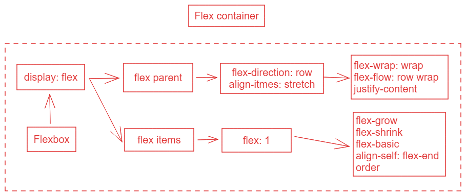

# CSS layout

## Introduction to CSS layout



### Flex box

Flexbox is the short name for the Flexible Box Layout CSS module, designed to make it easy for us to lay things out in one dimension -- either as a row or as a column. To use flexbox, you apply `display: flex` to the parent element for the elements you want to lay out; all its direct children then become *flex items* .

1. If we add `display: flex` to the parent, the three items now arrange themselves into columns. This is due to them becoming *flex items* and being affected by some initial values that flexbox sets on the flex container. They are displayed in a row because the property `flex-direction` or the parent element has an initial value of `row` . They all appear to stretch in height because the property `align-items` of their parent element has an initial value of `stretch` .
2. Setting the flex property. we can add the `flex` property to all of our child items, and give it a value of `1` . This will cause all of the items to grow and fill the container, rather than leaving space at the end.


### Grid Layout

While flexbox is designed for one-dimensional layout, Grid Layout is designed for two dimensions -- lining things up in rows and columns.

1. we enable Grid Layout with its specific display value -- `display: grid` .
2. we also define some row and column tracks for the parent using the `grid-template-rows` and `grid-template-columns` properties respectively.
3. placing items on the grid. We've set the start and end line of each item using the  `grid-column` and `grid-row` properties. This causes the items to span multiple tracks.

### Floats	

Floating an element changes the behavior of that element and the block level elements that follow it in normal flow. The floated element is moved to the left or right and removed from normal flow, and the surrounding content *floats* around it.

### Positioning techniques

Positioning allows you to move an element from where it would otherwise be placed in normal flow over to another location. Positioning isn't a method for creating the creating the main lalyouts of a page; it's more about managing and fine-tuning the position of specific items on a page.

There are five types of positioning you should know about:

- **Static positioning** is the default that every element gets. It just means "put the element into its normal position in the document layout flow -- nothing special to see here".
- **Relative positioning** allows you modify an element's positin on the page, moving it relative to its position in normal flow, as well as making it overlap other elements on the page.
- **Absolute positioning** moves an element completely out of the page's normal layout flow, like it's sitting on its own separate layer. 
- **Fixed positioning** is very similar to absolute positioning except that it fixes an element relative to the browser viewport, not another element.

Relative positioning allows you to offset an item from its default position in normal flow.

```
.positioned {
	position: relative;
	top: 30px;
	left: 30px;
}
```

Absolute positioning is used to completely remove an element from the normal flow and instead position it using offsets from the edges of a containing block.

```
.positioned {
  position: absolute;
  top: 30px;
  left: 30px;
}
```

Fixed positioning removes our element from document flow in the same way as absolute positioning. However, instead of the offsets being applied from the container, they are applied from the viewport.

```
.positioned {
  position: fixed;
  top: 30px;
  left: 30px;
}
```

Sticky positioning is the final positioning method that we have at our disposal.

## <span style="color: red; font-weight: bold;">Detailed introduction to CSS layout.</span>

### Flexbox

Flexbox is a one-dimensional layout method for arranging items in rows or columns. Items *flex* (expand) to fill additional space or shrink to fit into smaller spaces. (**only child element are flex items**)

#### The flex model

When elements are laid out as flex items, they are laid out along two axes:

![Three flex items in a left-to-right language are laid out side-by-side in a flex container. The main axis — the axis of the flex container in the direction in which the flex items are laid out — is horizontal. The ends of the axis are main-start and main-end and are on the left and right respectively. The cross axis is vertical; perpendicular to the main axis. The cross-start and cross-end are at the top and bottom respectively. The length of the flex item along the main axis, in this case, the width, is called the main size, and the length of the flex item along the cross axis, in this case, the height, is called the cross size.](./assets/flex_terms-1687942069377-1.png)

- The **main axis** is the axis running in the direction the flex items are laid out in (for example, as a row across the page, or a column down the page.) The start and end of this axis are called the **main start** and **main end**.
- The **cross axis** is the axis running perpendicular to the direction the flex items are laid out in. The start and end of this axis are called the **cross start** and **cross end**.
- The parent element that has `display: flex` set on it is called the **flex container**.
- The items laid out as flexible boxes inside the flex container are called **flex items**.

#### Columns or rows?

Flexbox provides a property called `flex-direction` that specifies which direction the main axis runs (which direction the flexbox children are laid out in).

#### Wrapping

```
flex-wrap: wrap;
```

Any overflow is moved down to the next line.


```
flex-direction: row-reverse;
```

it starts from the opposite corner of the browser window and flows in reverse.

#### flex-flow shorthand

```
flex-direction: row;
flex-wrap: wrap;
```

简写

```
flex-flow: row wrap;
```

#### Flexible sizing of flex items

```
article {
	flex: 1;
}
```

This is a unitless the proportion value that dictates how much available space along the main axis each flex item will take up compared to other flex items.

#### flex: shorthand versus longhand

`flex` is a shorthand property that can specify up to three different values:

- The unitless proportion value we discussed above. This can be specified separately using the `flex-grow` longhand property.
- A second unitless proportion value, `flex-shrink` , which comes into play when the flex items are overflowing their container.
- The minimum size value we discussed above. This can be specified separately using the `flex-basis` longhand value.

We'd advise against using the longhand flex properties unless you really have to (for example, to override something previously set). They lead to a lot of extra code being written, and they can be somewhat confusing.

#### Horizontal and vertical alignment

You can also use flexbox features to align flex items along the main or cross axis.


```
div {
	display: flex;
	align-items: center;
	justify-content: space-around;
}
```


You'll see that the buttons are now nicely centered horizontally and vertically.

`align-items` controls where the flex items sit on the cross axis.

- By default, the value is `stretch` , which stretches all flex items to fill the parent in the direction of the crorss axis. If the parent doesn't have a fixed height in the cross axis direction, then all flex items will become as tall as the tallest flex item.
- The `center` value that we used in our above code causes the items to maintain their intrinsic dimensions, but be centered along the cross axis.
- You can also have values like `flex-start` and `flex-end` , which will align all items at the start and end of the cross axis respectively.

You can override the `align-items` behavior for individual flex items by applying the `align-self` property to them.

```
button:first-child {
	align-self: flex-end;
}
```


`justify-content` controls where the flex items sit on the main axis.

- The default value is `flex-start` , which makes all the items sit at the start of the main axis.
- You can use `flex-end` to make them sit at the end.
- `center` is also a value for `justify-content` . It'll make the flex items sit in the center of the main axis.
- The value we've used above, `space-around` , is useful -- it distributes all the items evenly along the main axis with a bit of space left at either end.
- There is another value, `space-between` , which is very similar to `space-around` except that it doesn't leave any space at either end.

#### Ordering flex items

Flexbox also has a feature for changing the layout order of flex items without affecting the source order. This is another thing that is impossible to do with traditional layout methods.

```
button:first-child {
	order: 1;
}
```

- By default, all flex items have an `order` value of 0.
- Flex items with higher specified order values will appear later in the display order than items with lower order values.
- Flex items with the same order values will appear in their source order.
- The 3rd item appears after the 2nd because it has the same order value and is after it in the source order.

You can set negative order values to make items appear earlier than items whose value is 0.

```
button:last-child {
	order: -1;
}
```

### Grid

CSS Grid Layout is a two-dimensional layout system for the web.

A grid will typically have **columns** , **rows** , and then gaps between each row and column. The gaps are commonly referred to as **gutters** .


#### Defining a grid

To define a grid we use the `grid` value of the `display` property. As with Flexbox, this enables Grid Layout; all of the direct children of the container become grid items.

```
.container {
	display: grid;
}
```

#### Flexible grids with the fr unit

The `fr` unit distributes space proportionally. You can specify different positive values for your tracks like so:

```
.container {
	display: grid;
	grid-template-columns: 2fr 1fr 1fr;
}
```

You can mix `fr` units with fixed length units. In this case, the space needed for the fixed tracks is used up first before the remaining space is distributed to the other tracks.


#### Gaps between tracks

To create gaps between tracks, we use the properties;

- `column-gap` for gaps between columns
- `row-gap` for gaps between rows
- `gap` as a shorthand for both

```
.container {
	display: grid;
	grid-template-columns: 2fr 1fr 1fr;
	gap: 20px;
}
```

These gaps can be any length unit or percentage, but not an `fr` unit.


#### Repeating track listings

You can repeat all or merely a section of your track listing using the CSS `repeat()` function.

```
.container {
  display: grid;
  grid-template-columns: repeat(3, 1fr);
  gap: 20px;
}
```

#### The implicit and explicit grid

- Explicit grid: Created using `grid-template-columns` or `grid-template-rows` .
- Implicit grid: Extends the defined explicit grid when content is placed outside of that grid, such as into our rows by drawing additional grid lines.

By default, tracks created in the implicit grid are `auto` sized. If you wish to give implicit grid tracks a size, you can use the `grid-auto-rows` and `grid-auto-columns` properties. If you add `grid-auto-rows` with a value of `100px` to your CSS, you'll see that those created rows are now 100 pixels tall.

```
.container {
  display: grid;
  grid-template-columns: repeat(3, 1fr);
  grid-auto-rows: 100px;
  gap: 20px;
}
```


#### The minmax() function

The `minmax()` function lets us set a minimum and maximum size for a track.

```
.container {
  display: grid;
  grid-template-columns: repeat(3, 1fr);
  grid-auto-rows: minmax(100px, auto);
  gap: 20px;
}
```

#### Line-based placement

We can arrange things in accordance with these lines by specifying the start and end line.

- [`grid-column-start`](https://developer.mozilla.org/en-US/docs/Web/CSS/grid-column-start)
- [`grid-column-end`](https://developer.mozilla.org/en-US/docs/Web/CSS/grid-column-end)
- [`grid-row-start`](https://developer.mozilla.org/en-US/docs/Web/CSS/grid-row-start)
- [`grid-row-end`](https://developer.mozilla.org/en-US/docs/Web/CSS/grid-row-end)

These properties can all have a line number as their value.

- [`grid-column`](https://developer.mozilla.org/en-US/docs/Web/CSS/grid-column)
- [`grid-row`](https://developer.mozilla.org/en-US/docs/Web/CSS/grid-row)

#### Positioning with grid-template-areas

An alternative way to arrange items on your grid is to use the `grid-template-areas` property and give the various elements of your design a name.

```
.container {
  display: grid;
  grid-template-areas:
    "header header"
    "sidebar content"
    "footer footer";
  grid-template-columns: 1fr 3fr;
  gap: 20px;
}

header {
  grid-area: header;
}

article {
  grid-area: content;
}

aside {
  grid-area: sidebar;
}

footer {
  grid-area: footer;
}
```

The rules for `grid-template-areas` are as follows:

- You need to have every cell of the grid filled.
- To span across two cells, repeat the name.
- To leave a cell empty, use a `.` (period).
- Areas must be rectangular -- for example, you can't have an L-shaped area.
- Areas can't be repeated in different locations.

### Positioning

Positioning allows you to take elements out of normal document flow and make them behave differently, for example, by sitting on top of one another or by always remaining in the same place inside the browser viewport.

#### Static positioning

Static positioning is the default that every element gets. It just means "put the element into its normal position in the document flow -- nothing special to see here."

#### Relative positioning

You can then modify its final position, including making it overlap other elements on the page.

```
position: relative;
```

Introducing top, bottom, left, and right

`top`, `bottom`, `left` and `right` are used alongside `position` to specify exactly where to move the positioned element to.

```
top: 30px;
left: 30px;
```

#### Absolute positioning

```
position: absolute;
```

